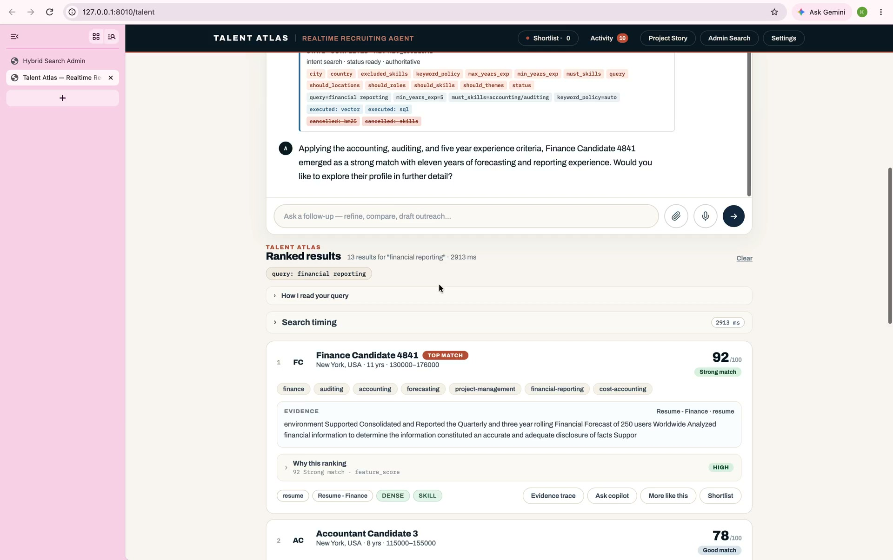
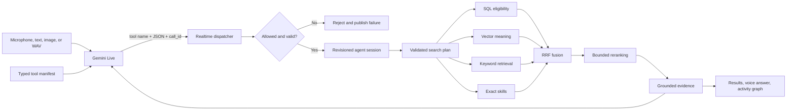
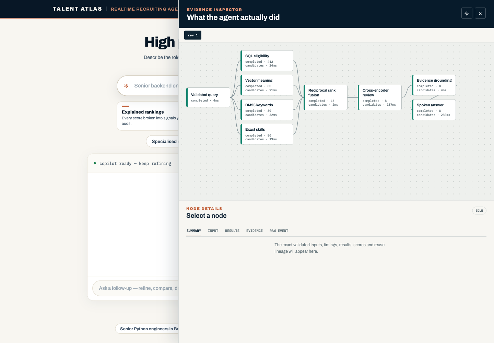

# Talent Atlas

> Samsung PRISM GenAI Hackathon Y2026 - Theme 05: Interruptible Real-Time Agents

## Project links

- **Demo:** [Watch the unlisted YouTube video (4:59)](https://youtu.be/0Df-gXn6DRM)
- **Presentation:** [Download the Samsung PRISM deck](docs/hackathon/submission/Talent_Atlas_PRISM_Y2026_Presentation.pptx)
- **Architecture:** [Read the technical overview](docs/hackathon/TECHNICAL_OVERVIEW.md)
- **Demo guide:** [Follow the presentation script](docs/hackathon/DEMO_SCRIPT.md)
- **AI disclosure:** [Review the project disclosure](AI_DISCLOSURE.md)

[](https://youtu.be/0Df-gXn6DRM)

**Demo video:** Click the preview to watch the unlisted YouTube upload. It is viewable only by people who have the link.

Talent Atlas is a conversational recruiting system that searches a transformed
public candidate corpus with hybrid RAG. A recruiter can speak naturally,
interrupt the assistant, revise one requirement without losing the rest of the
conversation, and inspect the evidence behind every result.

Gemini Live provides the full-duplex conversation layer. The application owns
the agent harness: typed tools, validation, immutable search revisions,
selective cancellation, hybrid retrieval, ranking, grounded answers, and the
auditable activity graph.

## Submission package

| Requirement | Repository artifact |
|---|---|
| Source code | `api/`, `pipeline/`, `db/`, `scripts/` |
| Presentation | `docs/hackathon/submission/Talent_Atlas_PRISM_Y2026_Presentation.pptx` |
| Demo video | [Unlisted YouTube video (4:59)](https://youtu.be/0Df-gXn6DRM) |
| AI disclosure | `AI_DISCLOSURE.md` |
| Detailed README | This file |
| Requirements | `requirements.txt`, `pyproject.toml` |
| Docker | `Dockerfile`, `docker-compose.yml` |
| APK / SDK | Not applicable: browser application and Python service |
| Judging tag | `PRISM_GENAI_HACKATHON_Y2026` |

## What makes it interruptible

A normal voice assistant often treats each turn as one indivisible job. Talent
Atlas treats a search as a revisioned plan whose branches declare what they
depend on.

- A bare barge-in stops generated speech without destroying valid retrieval.
- A correction creates a child revision in the same session.
- Changed fields invalidate only the branches that depended on them.
- Unchanged filters, skills, and conversation evidence remain available.
- Every tool request, cancellation, result, and state snapshot is correlated by
  revision and call ID.
- The assistant may acknowledge an instruction immediately, but it cannot claim
  a candidate outcome until retrieved evidence exists.



## How tool calling works

The model is the orchestrator, not the search engine. At session start it
receives an application-owned tool catalogue. Every tool has:

1. a stable name;
2. a description of when it should be used;
3. a JSON Schema generated from a Pydantic argument model;
4. blocking or non-blocking behavior;
5. read-only or state-modifying effect metadata.

The model can propose only a tool name and JSON arguments. It never receives a
database connection, SQL executor, or Python callback. The server resolves the
name against the session allow-list, rejects unknown fields, applies length and
range limits, verifies a trusted callback, and returns bounded JSON evidence.

The realtime catalogue contains:

| Tool | Purpose | Effect |
|---|---|---|
| `search_candidates` | Start a grounded hybrid search | Read-only, non-blocking |
| `interrupt_search` | Patch the active plan and invalidate stale branches | Read-only, non-blocking |
| `inspect_candidate` | Load bounded evidence for one result | Read-only, blocking |
| `compare_candidates` | Compare candidates from the active result set | Read-only, blocking |
| `format_current_answer` | Reformat already retrieved evidence | Read-only, blocking |
| `list_skills` | Resolve wording to canonical skills | Read-only, blocking |
| `request_clarification` | Ask only for genuinely missing criteria | Read-only, blocking |
| `use_role_image` | Ground visible role requirements from an image | Read-only, non-blocking |
| `cancel_current_action` | Cancel cancellable read-only work | Read-only, blocking |
| `add_to_shortlist` | Persist a shortlist choice | Idempotent write |

`add_to_shortlist` is the only realtime state-changing tool. It uses an
idempotency key, an effect scope, and an audit log. Duplicate calls replay the
stored outcome instead of applying twice, while a corrected in-flight write can
be superseded safely.

## Direct hybrid search contract

`POST /search` exposes the same deterministic engine without the conversation
layer. Pydantic compiles the JSON request into hard eligibility, soft
preferences, lexical terms, semantic meaning, and ranking configuration.

```json
{
  "query": "finance candidate",
  "mode": "no-llm",
  "skills": ["accounting", "auditing", "financial reporting"],
  "skills_match": "and",
  "min_years_exp": 5,
  "should": {
    "themes": ["forecasting", "financial controls"]
  },
  "keyword_policy": "auto",
  "enable_reranking": true,
  "top_k": 8,
  "include_rank_explanation": true,
  "config_overrides": {
    "use_dense": true,
    "use_bm25": true,
    "use_skill_exact": true,
    "use_cross_encoder": true,
    "use_feature_ranker": true,
    "use_mmr": true
  }
}
```

- `no-llm` uses the supplied structure directly.
- `fast` reduces retrieval windows and expensive review.
- `quality` broadens retrieval and enables deeper reranking.
- `agent-quality` assumes an agent already structured the request.
- `must` constraints can remove a candidate; `should` preferences can only
  influence rank.

The engine fans out into SQL, vector, keyword, and exact-skill branches.
Reciprocal Rank Fusion combines ranks without pretending their raw scores share
a scale. A bounded cross-encoder and feature ranker review the strongest pool,
then evidence is hydrated for the final candidates.



The Activity drawer exposes the execution trace, not private chain-of-thought.
It shows validated inputs, changed fields, branch decisions, durations,
candidates, evidence, cancellations, and raw events.

## Multimodal and session context

The realtime WebSocket accepts microphone audio, text, PNG/JPEG role images,
and WAV audio. Image text is treated as untrusted content and can only populate
validated search slots. Requirements that the candidate schema cannot enforce
are reported as unsupported instead of being presented as applied filters.

Voice transport can stop and resume inside the same Talent Atlas session. The
active revision, ranked candidate IDs, and bounded evidence remain in the
application-owned session, so a later request such as "explain the first result"
does not depend on provider-side memory alone.

## Demonstration data

The repository includes transformed public recruitment records for a realistic
local demonstration. It is not production hiring data. Candidate names and
contact fields are generated or transformed, and the application must not be
used to make real employment decisions.

The checked-in sample can be imported with:

```bash
python scripts/import_recruitment_dataset.py --limit 5000 --load-db
python scripts/verify_local_corpus.py --expected-candidates 5000
```

The project was also exercised locally against a 10,000-record transformed
corpus stored outside Git.

## Run locally

### Docker

```bash
cp .env.example .env
# Add GOOGLE_API_KEY for Gemini Live voice and vision.
docker compose up --build
```

Open:

- `http://127.0.0.1:8000/talent` - realtime conversational Talent Atlas;
- `http://127.0.0.1:8000/ui` - direct configurable `/search` workspace;
- `http://127.0.0.1:8000/docs` - OpenAPI and raw request/response contract;
- `http://127.0.0.1:8000/journey` - project story and architecture;
- `http://127.0.0.1:8000/health` - database and corpus health.

### Python

```bash
python3.11 -m venv .venv
source .venv/bin/activate
python -m pip install -r requirements.txt
uvicorn api.main:app --host 127.0.0.1 --port 8010
```

Primary configuration:

| Variable | Purpose |
|---|---|
| `DATABASE_URL` | PostgreSQL connection string |
| `REDIS_URL` | Optional shared cache |
| `GOOGLE_API_KEY` | Gemini Live and vision |
| `GEMINI_LIVE_MODEL` | Realtime model ID |
| `AGENT_MODEL` | Typed copilot model |
| `LANGFUSE_PUBLIC_KEY`, `LANGFUSE_SECRET_KEY` | Optional trace export |

Secrets are not stored in this repository.

## Verification

Before packaging, the complete development suite passed with **674 tests**.
The repository keeps the two judging-focused executable gates:

```bash
python scripts/benchmark_realtime_interruptions.py
python scripts/evaluate_realtime_agent.py
docker compose config
```

The benchmark covers speculative start, acknowledgement latency, bare
barge-ins, selective cancellation, slot retention, revision reuse, malformed
tools, dropped transport, duplicate writes, and grounded completion. Both
Python scripts exit non-zero when a required invariant fails.

The edited submission video was validated as H.264/AAC, 1920x1206, 30 fps,
**4:58.9**, with a decoded-stream integrity check before commit.

## Repository layout

```text
api/                    FastAPI routes and browser interfaces
pipeline/               retrieval, ranking, realtime session, tools, telemetry
db/                     PostgreSQL schema and seed helpers
data/                    transformed public demonstration sample
scripts/                 import, smoke, benchmark, and evaluation commands
docs/hackathon/          judging pack, deck, demo, and technical overview
Dockerfile               reproducible application image
docker-compose.yml       app, PostgreSQL/pgvector, and Redis
docker-compose.langfuse.yml  optional local observability stack
```
