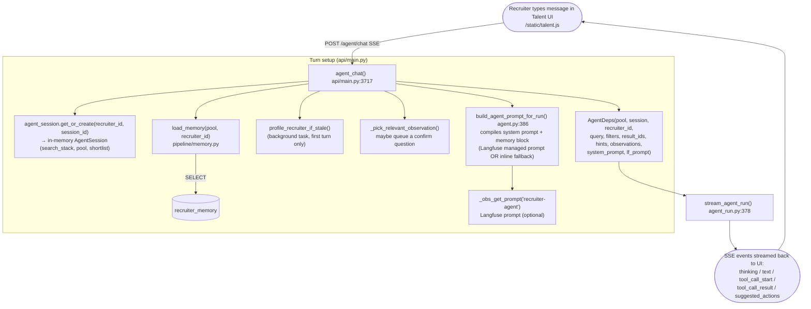
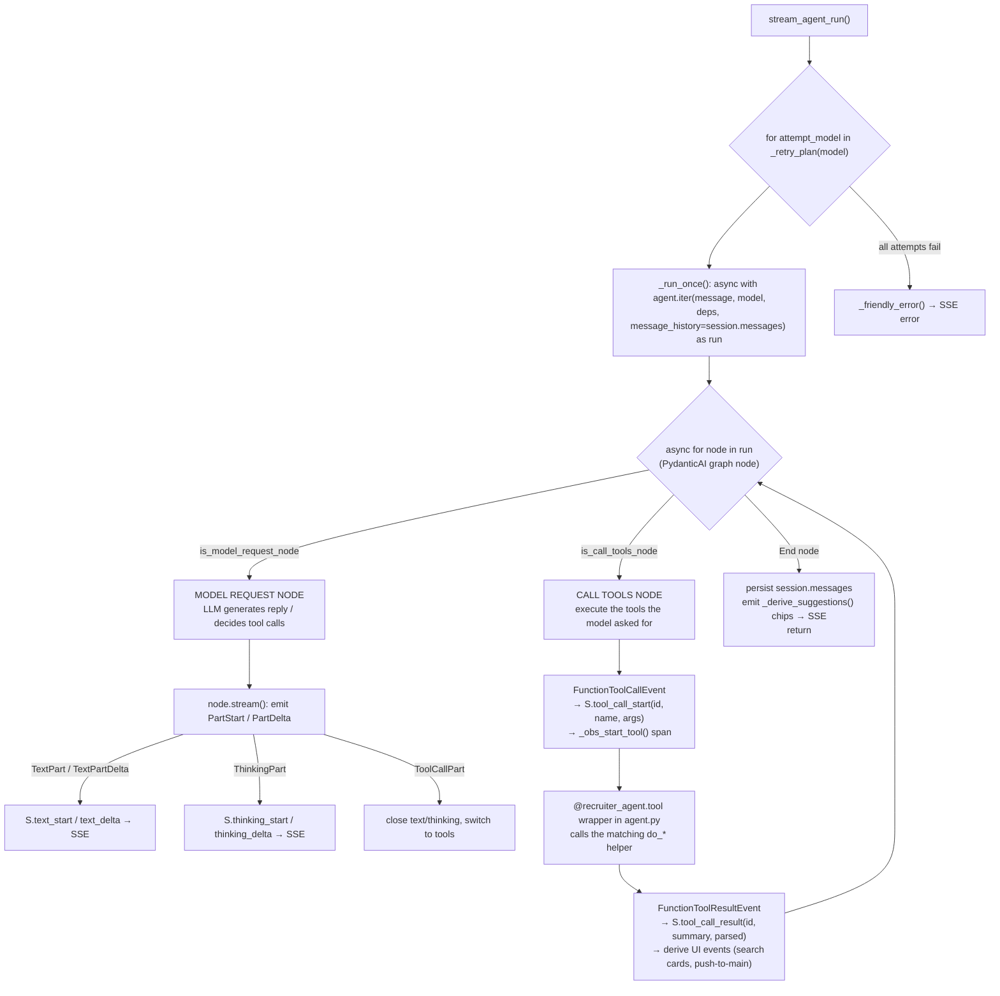
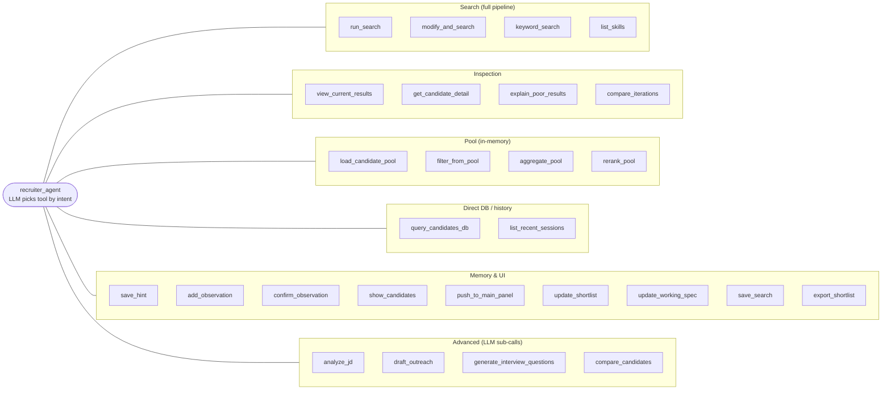
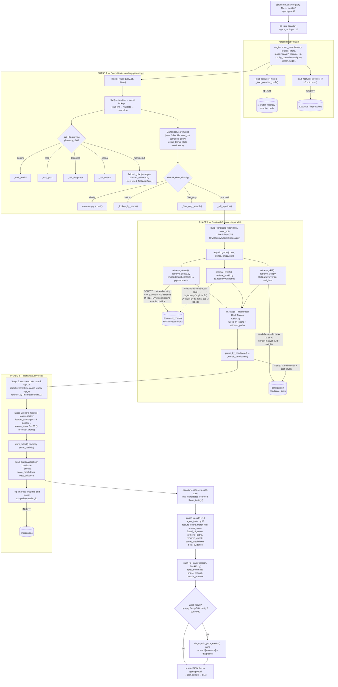
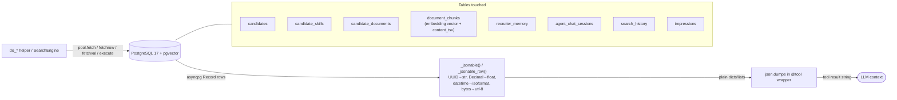

# Recruiter Copilot — Full Tool/Function Call Pipeline

End-to-end map of what happens from a recruiter message to the agent, every
function it calls, what those functions return, and exactly how each one talks
to PostgreSQL and how the DB answers back.

Source of truth:
- Agent + prompt + tool surface: `pipeline/agent.py`
- Tool bodies (the `do_*` helpers): `pipeline/agent_tools.py`
- Streaming run loop: `pipeline/agent_run.py`
- HTTP entry point: `api/main.py` (`POST /agent/chat`)
- Search pipeline: `pipeline/search.py` + `pipeline/retrieve_*.py` + `pipeline/planner.py`

---

## 1. Top-Level Request Flow



**Pre-agent short-circuits (handled in `agent_chat` before the LLM runs):**
- If `session.pending_observation` is set and the message is a yes/no →
  `do_confirm_observation()` directly, reply, **return** (no agent run).
- Otherwise the relevant observation (if any) is queued and the question is
  appended *after* the agent's answer.

---

## 2. The Agent Run Loop (`stream_agent_run` → `agent.iter`)

`stream_agent_run` wraps a retry/fallback plan (`_retry_plan(model)`): same
model, then a configured fallback model. The default model is `_agent_model`
(DeepSeek `deepseek-v4-flash` per project config; the `Agent(...)` literal
`groq:llama-3.3-70b-versatile` in `agent.py:472` is overridden at call time).



Key properties:
- Tools are **pure**: each `@recruiter_agent.tool` just `json.dumps(do_*(...))`.
  They never push UI events; `agent_run.py` derives UI events by *observing* the
  tool name + return value.
- Every tool call is wrapped in a Langfuse span (`_obs_start_tool`), nested under
  the `agent.turn` → `agent.respond` → `agent.generate_reply` span tree.

---

## 3. The Tool Surface — 27 tools, grouped by intent

Defined in `agent.py` (`@recruiter_agent.tool`), each delegating to a `do_*` in
`agent_tools.py`. The system prompt's **Intent Routing** section tells the LLM
which to pick.



---

## 4. `run_search` — the 3-Stage Hybrid Pipeline (the heart)

`run_search(query, filters?, weights?)` → `do_run_search()` →
`HybridSearchEngine.smart_search()`. This is the only tool that runs the full
ranking pipeline.



**What `run_search` returns to the LLM** (`do_run_search` dict):
`results[]` (10 enriched candidates), `total`, `total_scanned`, `iteration_id`,
`query`, `filters`, `spec_summary` (planner confidence / used_fallback /
dropped_items / must_skills…), `clarify_notice`, `phase_timings`, and — when
weak — a `recovery` block with the full diagnostic so the LLM never has to call
`explain_poor_results` separately.

`modify_and_search(changes)` → `do_modify_and_search()` merges
`add_filters`/`remove_filters`/`query` onto the top stack entry, then calls
`do_run_search` again (same pipeline).

---

## 5. Every Other Tool — function → DB query → return

| Tool (agent.py) | Helper (agent_tools.py) | DB interaction | Returns |
|---|---|---|---|
| `keyword_search(query)` | `do_keyword_search` :691 | `SELECT … MAX(ts_rank(dc.content_tsv, plainto_tsquery('english',$1))) … WHERE dc.content_tsv @@ plainto_tsquery(...)` over `document_chunks` ⨝ `candidates` (words AND-ed) | `{results[≤10], total, query}` |
| `list_skills(query)` | `do_list_skills` :738 | `SELECT skill, count(*) FROM candidate_skills [WHERE skill ILIKE $1] GROUP BY skill ORDER BY n DESC` | canonical skill names + counts |
| `view_current_results(reason)` | (inline) / `do_view_main_results` :559 | If agent stack: in-memory top entry. Else `SELECT` profile + best chunk for `result_ids` (`candidates` ⨝ LATERAL `document_chunks`⨝`candidate_documents`) | enriched results list |
| `get_candidate_detail(id)` | `do_get_candidate_detail` :409 | `SELECT … FROM candidates WHERE id=$1`; `SELECT skill FROM candidate_skills WHERE candidate_id=$1`; `SELECT content FROM document_chunks WHERE candidate_id=$1 LIMIT 1` | full profile + skills + best chunk |
| `explain_poor_results(concern)` | `do_explain_poor_results` :233 | none (in-memory over last stack entry) | tier dist, retrieval-path breakdown, required-check failures, spec issues, suggested actions |
| `compare_iterations(a,b)` | `do_compare_iterations` :353 | none (compares 2 stack entries) | score deltas, gained/lost, tier shifts, spec changes |
| `query_candidates_db(sql)` | `do_query_candidates_db` :915 | **read-only** guard (`_BLOCKED_KEYWORDS` rejects UPDATE/DELETE/INSERT/DROP/…), then `asyncio.wait_for(pool.fetch(sql), timeout=5s)` | rows (JSON-coerced) |
| `load_candidate_pool(criteria,limit)` | `do_load_candidate_pool` :772 | `SELECT … FROM candidates WHERE … LIMIT ≤100` into `session.pool_cache` | `{count}` |
| `filter_from_pool(criteria)` | `do_filter_from_pool` :823 | none (in-memory) | `{results[≤20], count}` |
| `aggregate_pool(dimension)` | `do_aggregate_pool` :837 | none (in-memory group-by) | counts by field |
| `rerank_pool(query)` | `do_rerank_pool` :964 | `SELECT content FROM document_chunks … LIMIT 1` per candidate; then `get_reranker().rerank()` (cross-encoder) | reranked pool |
| `list_recent_sessions(limit)` | `do_list_recent_sessions` :849 | `SELECT session_id, title, summary, updated_at FROM agent_chat_sessions WHERE recruiter_id=$1 ORDER BY updated_at DESC` | compact session summaries |
| `save_hint(text)` | `do_save_hint` :447 | `SELECT count(*) FROM recruiter_memory` (cap); `INSERT INTO recruiter_memory` | `{saved}` |
| `add_observation(content,category)` | `do_add_observation` :477 | `INSERT INTO recruiter_memory … ON CONFLICT DO UPDATE SET evidence_count+1, confidence=LEAST(0.95, +0.05)` | observation row |
| `confirm_observation(id,accept)` | `do_confirm_observation` :508 | `SELECT … FROM recruiter_memory`; then `UPDATE … status='dismissed'` (reject) or `status='promoted'` + `INSERT` promoted fact (accept) | `{status}` |
| `update_shortlist(id,status)` | `do_update_shortlist` :951 | none (session.shortlist) | `{shortlist state}` |
| `update_working_spec(updates)` | `do_update_working_spec` :960 | none (session.working_spec) | `{spec}` |
| `save_search()` | `do_save_search` :1038 | `INSERT INTO search_history (recruiter_id, query, filters_json, results_json)` | `{saved}` |
| `export_shortlist()` | `do_export_shortlist` :1074 | reads session shortlist (+ profile fetch) | export payload |
| `analyze_jd(jd_text)` | `do_analyze_jd` :989 | none — `_get_llm_agent()` sub-LLM call | role + 3–5 skills + location |
| `draft_outreach(id,ctx)` | `do_draft_outreach` :1007 | `SELECT` candidate profile, then sub-LLM | outreach message |
| `generate_interview_questions(id,ctx)` | `do_generate_interview_questions` :1022 | `SELECT` candidate profile, then sub-LLM | questions |
| `compare_candidates(a,b)` | `do_compare_candidates` :1050 | `SELECT` both profiles, then sub-LLM | comparison |
| `show_candidates(ids)` | `do_view_main_results` :559 | `SELECT` profiles for ids (renders cards) | results + count |
| `push_to_main_panel(note)` | (inline) | none (reads top stack entry) | `{pushed, query, filters, result_ids}` |

---

## 6. How the Database Communicates Back

All DB access goes through a single shared **`asyncpg.Pool`** held on
`app.state.pool` and passed into `AgentDeps.pool`. Communication pattern:



Notes:
- **Vector search** uses pgvector's `<=>` cosine operator on
  `document_chunks.embedding` against an HNSW index (`hnsw_ef_search=40` from
  `/health`); the embedding is computed by `pipeline/embedder.py`
  (`all-MiniLM-L6-v2`, 384-dim, cached).
- **Keyword search** uses Postgres FTS: `content_tsv @@ to_tsquery` /
  `plainto_tsquery` with `ts_rank_cd` / `ts_rank` ranking.
- **Skill search** matches the `candidates.skills` text[] array directly with
  per-skill weights via `unnest`.
- All three retrievers share the same **hard-filter CTE**
  (`build_candidate_filter`) so structured filters apply uniformly.
- `query_candidates_db` is the only tool that runs LLM-authored SQL — gated to
  SELECT-only and a 5-second timeout.
- Writes are minimal and intentional: `recruiter_memory` (hints/observations),
  `search_history` (save_search), `impressions` (fire-and-forget logging).

---

## 7. The System Prompt as the Routing Brain (`agent.py:93`)

The prompt (`build_system_prompt`) is what makes the LLM choose correctly. Its
sections map directly onto the machinery above:

- **What This Platform Is / How Ranking Works** → teaches the LLM to read the
  `_enrich_result` fields (`feature_score`, `rerank_score`, `fused_rrf_score`,
  `retrieval_paths`, `score_breakdown`, `best_evidence`) produced by §4 Phase 3.
- **Current Context** (dynamic) → injects active query/filters/result_count and
  the **Recruiter Memory block** (hints + observations from `recruiter_memory`).
- **How to Engage** → SPECIFIC vs BROAD: act immediately vs gather requirements
  before `run_search`.
- **Intent Routing** → the message→tool decision table (§3).
- **Handling Weak Results / the `recovery` block** → tells the LLM that
  `do_run_search` already attaches the diagnostic, so it reads
  `recovery.diagnostic` instead of re-calling `explain_poor_results`.
- **Tool Reference** → the contract for all 27 tools.
- **Operating Rules + Examples (15)** → diagnose-before-fix, smallest-change-
  first, always-confirm-before-`save_hint`, read-the-evidence.

At runtime `build_agent_prompt_for_run` can swap the inline prompt for a
**Langfuse managed prompt** (`recruiter-agent` + label), compiling in
`context_block`, `memory_block`, `current_date`, and `db_schema`; the inline
prompt remains the source-of-truth fallback.

---

## 8. One-Glance Summary

```
Recruiter → POST /agent/chat
  → load memory + build system prompt (+ pending-observation gate)
  → stream_agent_run → agent.iter (DeepSeek default, fallback on error)
      ├─ MODEL REQUEST node → stream thinking/text, decide tool calls
      └─ CALL TOOLS node → run do_* helper → asyncpg → Postgres → JSON → LLM
          └─ run_search ⇒ smart_search:
               Phase 1 planner (LLM→spec, regex fallback)
               Phase 2 retrieve_dense ∥ retrieve_bm25 ∥ retrieve_skill → RRF fuse
               Phase 3 cross-encoder rerank → 8-signal feature score → MMR → explain
               (+ auto-recovery diagnostic when weak)
  → SSE: thinking / text / tool_call_start / tool_call_result / suggested chips
  → (optional) surface observation-confirmation question
```
