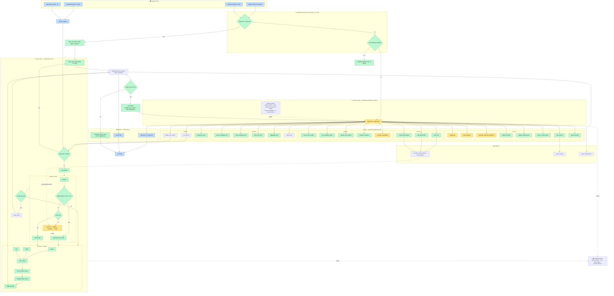

# New System Pipeline — Full Visual

Renders in VS Code (Mermaid preview) and GitHub. Colour legend:

- 🟨 **LLM** (reads/produces language — agent, planner LLM, sub-LLM tools)
- 🟩 **Deterministic** (one correct answer, no language — rules, SQL, ranking math)
- 🟦 **UI / transport**

---

## 1. Master diagram — every connection



---

## 2. The same flow at a glance (ASCII)

```
                    ┌──────────────── UI ENTRY ─────────────────┐
   agent bar ──┐    │  Specialised·Query   Specialised·JD       │
   chips ──────┤    └──────────┬──────────────────┬────────────┘
               ▼               ▼                  ▼
   ⚡ PRE-FLIGHT (rules)    /search ──────────────┐│
   empty+chips? ─yes─► filter_only ───────────────┼┼──► smart_search
   greeting?    ─yes─► templated reply (no agent) ││         │
        │ no                                       ││         │
        ▼                                          ││         │
   🤖 AGENT (DeepSeek)  ◄── system prompt          ││         │
        │  (memory + intent few-shot + examples)   ││         │
        │  picks ONE tool                          ││         │
        ▼                                          ││         │
   🧰 TOOLS  ── Search ─► run/modify ──────────────┘│         │
              ├ Inspect  (view, detail, explain, compare)     │
              ├ Analytics(db, pool, aggregate, keyword)        │
              ├ Actions  (jd, outreach, interview, shortlist…) │
              └ Memory   (save_hint, observations) ─► Postgres │
                                                                ▼
   🔎 smart_search:  empty+filters? ─yes─► SQL filter_only      │
        else ► route ► planner[sanitize→simple?→regex|cache|LLM→validate]
             ► confidence gate ► dense+bm25+skill →RRF→cross-enc→8-signal→MMR
                                                                │
        ▼                                                       ▼
   📤 SearchResponse ─► empty/low? ─yes─► auto-diagnose ─► back to AGENT
        │  no                                                   
        ▼                                                       
   result cards + refinement chips + agent closing line ─► UI
        │
   📊 every step traced to Langfuse   🗄️ memory feeds planner personalization
```

---

## 3. What each colour means for your original question

- 🟨 **LLM nodes** are where you *let the model decide*: the agent's tool choice
  (guided softly by the few-shot intent examples), the planner's semantic parse, and
  the generative tools (JD parse, outreach, interview Qs, compare).
- 🟩 **Deterministic nodes** are everything with a single correct answer — the
  pre-flight shortcuts, all the gates (`simple?`, `cache?`, `confidence`, `empty?`),
  retrieval/RRF/cross-encoder/scoring/MMR, SQL, and the recovery + chips.
- The agent is the **only** router; the few-shot examples bias it. Nothing hard-blocks
  a tool, so multi-intent messages still work.
