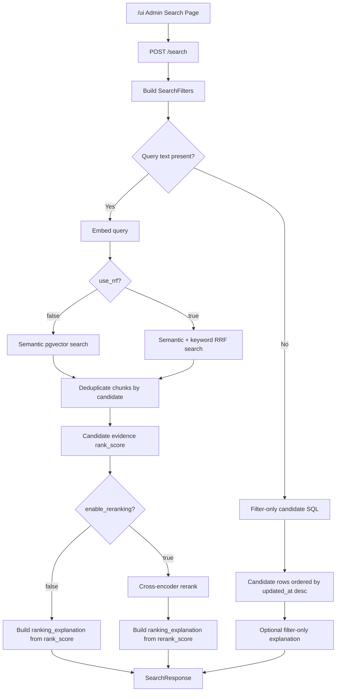
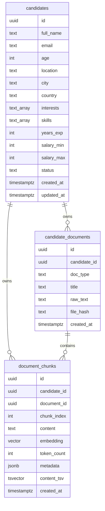
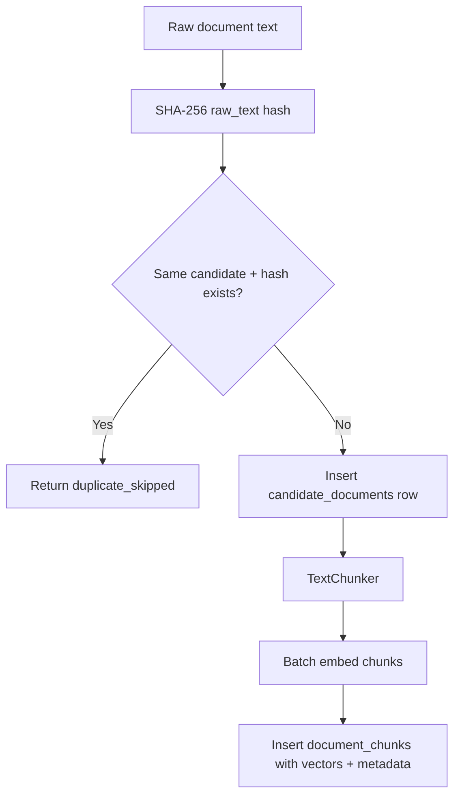

# Current Pipeline Status

Updated: 2026-05-16

This document describes the current state of the hiring search project: what is active, what is experimental, what is disabled, how data flows through the system, and every scoring formula currently used by the app or benchmark scripts.

## Executive Summary

The app is a local hiring search platform built around PostgreSQL, pgvector, and FastAPI.

The active product path is:

1. Store structured candidate metadata in PostgreSQL.
2. Store raw candidate documents.
3. Chunk documents.
4. Embed chunks into vectors.
5. Search candidates with structured filters plus semantic and keyword retrieval.
6. Deduplicate chunks into one result per candidate.
7. Rank candidates using a weighted candidate-evidence formula.
8. Optionally run a cross-encoder reranker.
9. Return a ranking explanation that reflects the same score used for display order.

The old Smart / LLM orchestrated endpoint has been removed. Complex searches now
run through the main `POST /search` pipeline.

## Active Architecture



## Project Components

| Area | File | Current Role |
|---|---|---|
| API server | `api/main.py` | FastAPI app, search endpoints, admin endpoints, settings endpoints |
| Main UI | `api/static/admin.html` | Local admin UI for searching, browsing, editing, ingesting |
| Settings UI | `api/static/settings.html` | Model/reranker/API key experiment page |
| Search engine | `pipeline/search.py` | Structured filters, semantic search, RRF, deduplication, rank scoring |
| Ranking explanation | `pipeline/ranking_explanation.py` | Turns pipeline scores into visible confidence breakdown |
| Ingestion | `pipeline/ingest.py` | Document deduplication, chunking, embedding, chunk insert |
| Chunking | `pipeline/chunker.py` | Token-aware sliding-window or paragraph chunking |
| Embeddings | `pipeline/embedder.py` | Provider abstraction for local/OpenAI/Gemini/Cohere/Voyage/Jina |
| Reranking | `pipeline/reranker.py` | Optional cross-encoder or Cohere rerank |
| Query planner | `pipeline/query_planner.py` | Optional LLM planner used by benchmarks, not active UI |
| Orchestrator | `pipeline/orchestrator.py` | Old Smart Search experiment, endpoint disabled |
| Dataset transform | `pipeline/recruitment_dataset.py` | Converts recruitment dataset rows into candidates/documents/eval cases |
| Full benchmark | `scripts/benchmark_search_strategies.py` | Compares semantic, RRF, rerank, LLM-planned strategies |
| Formula benchmark | `scripts/evaluate_rankers.py` | Offline formula comparison over a fixed retrieval pool |
| Database schema | `db/migrations/*.sql` | PostgreSQL tables, pgvector extension, indexes |

## Under-The-Hood Stack

The project is deliberately simple infrastructure-wise: one database, one Python API, static local admin pages, and local/remote model adapters.

| Layer | Technology | Where | Why It Is Used |
|---|---|---|---|
| Container runtime | Docker Compose | `docker-compose.yml` | Starts local database infrastructure consistently |
| Database image | `pgvector/pgvector:pg17` | `postgres` service | PostgreSQL 17 with pgvector preinstalled |
| Connection pooler | PgBouncer | `pgbouncer` service on port `6432` | Optional pooling layer for higher connection counts |
| Database port | PostgreSQL on `5432` | `postgres` service | Main app connects here by default |
| Database volume | Docker volume `pgdata` | `docker-compose.yml` | Persists local database data between container restarts |
| DB migrations | SQL mounted into `/docker-entrypoint-initdb.d` | `db/migrations` | Creates extensions, tables, and indexes on first DB init |
| Vector search | pgvector HNSW | `document_chunks.embedding` | Fast approximate nearest-neighbor search over embeddings |
| Keyword search | Configurable backend | Default: `content_tsv`, `ts_rank_cd`, GIN index. Optional: ParadeDB `pg_search` BM25 | Exact term recall for skills, acronyms, tools, and technologies |
| API framework | FastAPI | `api/main.py` | Typed async HTTP API and automatic docs |
| ASGI server | Uvicorn | run command | Serves FastAPI locally |
| Database driver | asyncpg | `pipeline/database.py`, `api/main.py` | Async PostgreSQL access |
| Config | pydantic-settings | `pipeline/__init__.py` | Loads `.env` and environment variables into typed settings |
| Validation models | Pydantic | `api/main.py` | Request/response schemas |
| Local embeddings | sentence-transformers | `pipeline/embedder.py` | Zero-cost local embedding models |
| Token counting | tiktoken | `pipeline/chunker.py` | Token-aware chunking |
| Optional reranking | sentence-transformers CrossEncoder | `pipeline/reranker.py` | Cross-encoder rerank after retrieval |
| Remote embedding adapters | OpenAI, Gemini, Cohere, Voyage, Jina clients | `pipeline/embedder.py` | Model experimentation |
| UI | Static HTML/CSS/vanilla JS | `api/static/admin.html`, `api/static/settings.html` | No frontend build step; easy local admin surface |
| Tests | pytest + pytest-asyncio | `tests/` | Contract, API helper, ranking, settings, benchmark tests |
| Reports | JSON + static HTML | `reports/` | Benchmark artifacts |

Docker services:

```text
postgres:
  image: pgvector/pgvector:pg17
  container: hybrid_search_db
  port: 5432

pgbouncer:
  image: edoburu/pgbouncer
  container: hybrid_search_pgbouncer
  port: 6432
  pool_mode: transaction
```

PostgreSQL extensions:

```sql
CREATE EXTENSION IF NOT EXISTS vector;
CREATE EXTENSION IF NOT EXISTS pg_trgm;
CREATE EXTENSION IF NOT EXISTS "uuid-ossp";
```

Why this stack works for the project: PostgreSQL holds both structured metadata and vector-search data, so search does not need a separate Elasticsearch/Pinecone service. That makes local development and explanation/debugging much easier.

## Database Model

The database has three core tables.



### Indexes

Structured filters use normal PostgreSQL indexes:

- `country`, `city`, `(country, city)`
- `age`
- `years_exp`
- `status`
- `(salary_min, salary_max)`
- `skills` and `interests` GIN indexes

Retrieval uses:

- HNSW pgvector index on `document_chunks.embedding`
- GIN full-text index on `document_chunks.content_tsv`
- join indexes on `document_chunks.candidate_id`, `document_chunks.document_id`, and `candidate_documents.candidate_id`

Why: structured filters shrink the search space before vector search, HNSW makes vector nearest-neighbor search fast, and full-text search provides exact term recall that embeddings may blur.

## Configuration Defaults

Current defaults come from `pipeline/__init__.py`.

| Setting | Default | Why |
|---|---:|---|
| `EMBEDDING_PROVIDER` | `local` | Zero API cost and works offline once cached |
| `EMBEDDING_MODEL` | `all-MiniLM-L6-v2` | Fast local model |
| `EMBEDDING_DIMENSIONS` | `384` | Matches database `VECTOR(384)` schema |
| `CHUNK_SIZE` | `512` tokens | Keeps chunks focused but large enough for context |
| `CHUNK_OVERLAP` | `64` tokens | Preserves continuity between chunk boundaries |
| `MAX_BATCH_SIZE` | `100` | Avoids huge embedding batches |
| `HNSW_EF_SEARCH` | `40` | Speed-first vector recall setting |
| `DEFAULT_TOP_K` | `20` | Reasonable default result count |
| `RERANKER_MODEL` | `local-fast` | Fast local reranker option |
| `LLM_PROVIDER` | `gemini` | Benchmark default only; Smart UI is disabled |
| `LLM_MODEL` | `gemini-3-flash-preview` | Benchmark/planner default only |

Embedding model changes are staged as pending settings because existing vectors cannot safely switch dimensions or embedding spaces without re-embedding documents.

## Ingestion Pipeline



### Document Deduplication

Formula:

```text
file_hash = sha256(raw_text)
duplicate if candidate_documents has same candidate_id and file_hash
```

Why: repeated imports or repeated uploads should not create duplicate chunks that distort search ranking.

### Chunking

Default strategy: sliding window.

Formula:

```text
chunk_tokens = tokens[start : start + chunk_size]
next_start = start + chunk_size - chunk_overlap
```

With defaults:

```text
chunk_size = 512
chunk_overlap = 64
next_start = start + 448
```

Why: fixed windows are predictable, model-friendly, and keep enough overlap to avoid cutting important context at boundaries.

Alternative strategy: paragraph.

Logic:

1. Split on blank lines.
2. Merge paragraphs until adding another paragraph would exceed `chunk_size`.
3. If one paragraph is too large, sub-chunk it with sliding windows.

Why: paragraph chunking keeps human-written sections together when document structure is meaningful.

### Embedding

Local embeddings use `SentenceTransformer.encode` with normalized embeddings:

```text
normalize_embeddings = true
batch_size = 64
```

Why: normalized embeddings make cosine distance more stable and compatible with pgvector cosine search.

Remote embedding providers share the same `EmbeddingProvider` interface:

- OpenAI
- Gemini
- Cohere
- Voyage
- Jina
- Local sentence-transformers

## Search Request Interface

`POST /search` accepts:

| Field | Type | Meaning |
|---|---|---|
| `query` | string | Free-text semantic query; optional for filter-only search |
| `location` | string | Broad text matched against `location`, `city`, or `country` |
| `country` | string | Exact case-insensitive country filter |
| `city` | string | Exact case-insensitive city filter |
| `skills` | list | Structured skill filter |
| `skills_match` | `or` / `and` | At least one skill vs all skills |
| `interests` | list | Structured interest filter |
| `interests_match` | `or` / `and` | At least one interest vs all interests |
| `min_years_exp` | int | Minimum experience |
| `max_years_exp` | int | Maximum experience |
| `min_salary` | int | Candidate salary range must overlap this minimum |
| `max_salary` | int | Candidate salary range must overlap this maximum |
| `top_k` | int | Max candidate results, currently capped at `1000` |
| `use_rrf` | bool | Toggle semantic-only vs hybrid semantic+keyword retrieval |
| `enable_reranking` | bool | Optional cross-encoder reranker |
| `reranker` | string | Optional reranker override |
| `include_rank_explanation` | bool | Include pipeline confidence breakdown |

`include_fit_analysis` still exists as a deprecated compatibility alias for `include_rank_explanation`; the UI no longer uses it.

## Structured Filter Logic

One filter is always active:

```sql
status = 'active'
```

Optional filters are added only when values are supplied.

### Country

```sql
LOWER(country) = LOWER($value)
```

Why: country is a precise structured field, so exact matching avoids noisy location matches.

### City

```sql
LOWER(city) = LOWER($value)
```

Why: same reason as country.

### Broad Location

```sql
LOWER(location) LIKE LOWER('%value%')
OR LOWER(city) LIKE LOWER('%value%')
OR LOWER(country) LIKE LOWER('%value%')
```

Why: the broad location field supports fuzzy user text like `Pune, India or remote`.

### Skills

OR mode:

```sql
skills && $skills::text[]
```

AND mode:

```sql
skills @> $skills::text[]
```

Why:

- `OR` is good for broad discovery.
- `AND` is good when a recruiter means hard requirements.
- Both use the GIN index on `skills`.

### Interests

Same logic as skills:

```sql
interests && $interests::text[]  -- OR
interests @> $interests::text[]  -- AND
```

### Experience

```sql
years_exp >= min_years_exp
years_exp <= max_years_exp
```

### Salary Overlap

Minimum desired salary:

```sql
salary_max >= min_salary
```

Maximum desired salary:

```sql
salary_min <= max_salary
```

Why: salary is stored as a candidate range. The query should match if the candidate's range overlaps the recruiter's desired range.

## Retrieval Modes

There are two active retrieval modes inside `/search`.

### 1. Semantic Only

Enabled with:

```json
{ "use_rrf": false }
```

SQL order:

```sql
ORDER BY dc.embedding <=> query_embedding::vector
```

Important formulas:

```text
distance = embedding <=> query_embedding
similarity_score = max(0, 1 - distance)
```

Why: semantic search is fast and catches meaning even when exact words differ. Its weakness is that exact terms like `Kafka`, `CISSP`, or `PostgreSQL` may not be strong enough by themselves.

### Why Embedding Similarity Alone Is Not Enough

Embedding similarity is useful, but it is not enough for recruiter search because hiring queries mix semantic intent with hard, structured requirements.

If the app used only:

```text
score = embedding_similarity = max(0, 1 - vector_distance)
```

then the ranking would be decided only by how close one retrieved chunk is to the query embedding. That causes several problems:

| Problem | Example | Why It Hurts Search Quality |
|---|---|---|
| Exact skills get blurred | Query asks for `Python, ML, Kafka`; a chunk about `analytics dashboards` may rank high | Embeddings capture broad meaning but may underweight exact named tools |
| One good chunk can dominate | Candidate has one AI-sounding interview answer but no ML skill | Candidate-level evidence gets ignored |
| Structured fields are ignored | Candidate is in the wrong city/country/salary range | Location, salary, and experience are database facts, not semantic similarity facts |
| Missing requirements are invisible | Candidate mentions Python but never machine learning | Similarity does not directly penalize absent explicit skills |
| Acronyms and product names are fragile | `GCP`, `CISSP`, `Kafka`, `React Native`, `pgvector` | Short exact terms often need keyword matching or structured skill matching |
| Multi-document evidence is lost | Resume has Python, transcript has leadership, certification has cloud | A single chunk score cannot represent evidence spread across docs |
| Generic buzzwords over-match | `AI`, `developer tools`, `automation` | Generic semantic closeness can rank candidates who sound related but miss concrete constraints |
| Recruiter constraints are partly boolean | must have all skills, min years, salary overlap | Embedding scores are soft; recruiter filters often need hard gating |

Concrete result: a candidate with a semantically nice transcript can outrank a candidate who actually has the requested structured skills, location, and years of experience. That is why the current system uses embedding similarity as the largest signal, but not the only signal.

The current philosophy is:

```text
Embedding similarity answers: "Does this chunk sound relevant?"
Keyword/RRF answers: "Do exact query terms also agree?"
Structured filters answer: "Is this candidate even eligible?"
Skill coverage answers: "Does the candidate explicitly have the requested skills?"
Profile/document coverage answers: "Is there broader evidence beyond one chunk?"
Experience prior answers: "Is seniority roughly aligned?"
Reranking answers: "After retrieval, does a cross-encoder prefer this candidate?"
```

### 2. RRF Hybrid

Enabled with:

```json
{ "use_rrf": true }
```

It builds two ranked lists:

1. Semantic list ordered by vector distance.
2. Keyword list ordered by the configured backend: PostgreSQL full-text rank
   (`BM25_BACKEND=fts`) or ParadeDB BM25 score (`BM25_BACKEND=paradedb`).

Default keyword rank expression:

```sql
ts_rank_cd(content_tsv, plainto_tsquery('english', query_text))
```

RRF formula:

```text
rrf_score = 1 / (k + semantic_rank) + 1 / (k + keyword_rank)
k = 60
```

If a chunk only appears in one list, the missing side contributes `0`.

Why: RRF rewards chunks that are strong in both semantic and exact keyword retrieval while still allowing one-sided matches to survive.

## Deduplication Logic

Raw retrieval returns chunks. The UI needs candidates.

Deduplication groups by `candidate_id` and creates one `SearchResult` per candidate.

Best chunk choice with query terms:

```text
chunk_rank_score =
    0.75 * embedding_similarity
  + 0.15 * scaled_rrf
  + 0.10 * chunk_term_coverage
```

Where:

```text
embedding_similarity = max(0, 1 - chunk_distance)
scaled_rrf = clamp(rrf_score / 0.0325, 0, 1)
chunk_term_coverage = matched_query_terms_in_chunk_fields / total_query_terms
```

Why:

- Best chunk should mostly be semantically close.
- RRF helps when keyword search agrees.
- Chunk term coverage prevents a semantically vague chunk from winning when it misses obvious query terms.

Supporting chunks:

1. Prefer chunks from different documents first.
2. Then fill remaining slots from the best document.

Why: the result should show cross-document evidence without letting one long document dominate all context slots.

## Query Terms And Coverage

Token extraction:

```text
tokens = regex("[a-z0-9][a-z0-9.+#-]*")
```

Ignored stopwords include common recruiting/query filler like:

```text
candidate, candidates, experience, experienced, for, with, years, the, and, or
```

Plural handling:

```text
if token ends with "s" and length > 4:
    also add singular token without trailing "s"
```

Coverage formula:

```text
coverage_score = count(query_terms present in values) / count(query_terms)
```

Why: coverage scores are bounded between `0` and `1`, making them safe to combine with weighted scoring.

## Current Candidate Ranking Formula

For normal text searches, final first-pass candidate ranking is:

```text
rank_score =
    0.50 * embedding_similarity
  + 0.12 * keyword_rrf_match
  + 0.18 * explicit_skill_coverage
  + 0.08 * profile_term_coverage
  + 0.08 * document_term_coverage
  + 0.04 * experience_prior
```

Then:

```text
results.sort(rank_score desc)
```

### Component Definitions

| Component | Formula | Weight | Why |
|---|---|---:|---|
| Embedding similarity | `max(0, 1 - best_chunk_distance)` | `0.50` | Main relevance signal; captures semantic meaning |
| Keyword/RRF match | `clamp(rrf_score / 0.0325, 0, 1)` | `0.12` | Gives exact keyword agreement a real but not dominant effect |
| Explicit skill coverage | `matched_explicit_query_skills / explicit_query_skills` | `0.18` | Recruiter skill terms should matter strongly |
| Profile term coverage | `query_terms in name/city/country/skills / query_terms` | `0.08` | Rewards structured profile evidence |
| Document term coverage | `query_terms in candidate chunks/doc titles/doc types / query_terms` | `0.08` | Rewards evidence across documents |
| Experience prior | `min(1, years_exp / 12)` | `0.04` | Small seniority prior; capped so it cannot dominate |

Why these weights: the formula keeps embeddings as the largest signal while fixing the problem where semantically similar but skill-mismatched candidates ranked above explicit matches. It is intentionally conservative: no single lexical field can overpower a poor semantic match, and experience is only a tie-breaker.

## Parameters Considered By The Current Pipeline

There are two categories: hard constraints and ranking signals.

### Hard Constraints

Hard constraints decide which candidates are allowed into the retrieval pool.

| Parameter | Source | How It Is Used |
|---|---|---|
| `status` | Candidate row | Always filters to active candidates by default |
| `country` | Candidate row | Exact case-insensitive match |
| `city` | Candidate row | Exact case-insensitive match |
| `location` | Candidate row | Broad `LIKE` match over location/city/country |
| `skills` | Candidate row | `OR` overlap or `AND` contains, depending on `skills_match` |
| `interests` | Candidate row | `OR` overlap or `AND` contains |
| `min_years_exp` | Candidate row | `years_exp >= min_years_exp` |
| `max_years_exp` | Candidate row | `years_exp <= max_years_exp` |
| `min_salary` | Candidate row | Candidate salary range must overlap |
| `max_salary` | Candidate row | Candidate salary range must overlap |
| `doc_types` | Internal filter only | Can restrict document types in backend code, not exposed in main UI |

These are not blended into the score. If a hard filter is supplied and a candidate fails it, that candidate should not reach ranking at all.

### Ranking Signals

Ranking signals decide the order after the candidate passes hard filters.

| Signal | Source | Score Range | Active Weight |
|---|---|---:|---:|
| Embedding similarity | Best retrieved chunk vector distance | `0..1` | `0.50` |
| Keyword/RRF match | Agreement between semantic rank and full-text rank | `0..1` | `0.12` |
| Explicit skill coverage | Query skills vs candidate `skills` array | `0..1` | `0.18` |
| Profile term coverage | Query terms found in name/city/country/skills | `0..1` | `0.08` |
| Document term coverage | Query terms found in chunks/titles/types | `0..1` | `0.08` |
| Experience prior | `min(1, years_exp / 12)` | `0..1` | `0.04` |
| Rerank score | Optional cross-encoder | model-dependent | final sort basis when enabled |

The active non-reranked score is therefore:

```text
rank_score =
    embedding contribution
  + keyword/RRF contribution
  + explicit skill contribution
  + profile term contribution
  + document term contribution
  + experience contribution
```

The result dropdown shows these same contributions as percentage points, so if embedding contributes `31%` and skill coverage contributes `18%`, those are not invented explanation numbers. They come from the same weighted scoring objects used to compute `rank_score`.

## Explicit Skill Coverage

The system extracts explicit skill requirements from the query by comparing query text against known candidate skills from the retrieved pool.

Normalization:

```text
normalize_skill(skill) = lowercase and remove non-alphanumeric separators
```

A skill is explicit if:

```text
skill appears in query_lower
OR normalized_skill appears in normalized_query
```

Coverage:

```text
explicit_skill_coverage =
    count(explicit_skills present in candidate.skills)
  / count(explicit_skills)
```

Why: a query like `python, ml, kafka` should not rely only on embedding similarity. It should give direct credit to candidates whose structured skills include the requested skills.

## Filter-Only Search

If `query` is empty, the system skips embedding/vector search and performs candidate SQL filtering only.

Returned fields:

```text
similarity_score = 0
rank_score = 0
rrf_score = null
rerank_score = null
sort_basis = updated_at desc
```

Why: without a query there is no semantic relevance score. The search is a filtered database browse.

## Optional Reranking

The main `/search` endpoint now supports optional reranking:

```json
{
  "enable_reranking": true,
  "reranker": "local-fast"
}
```

Available rerankers:

| Choice | Model | Notes |
|---|---|---|
| `local-fast` | `cross-encoder/ms-marco-MiniLM-L-6-v2` | Fast local default |
| `local-balanced` | `cross-encoder/ms-marco-MiniLM-L-12-v2` | Better quality, slower |
| `local-best` | `BAAI/bge-reranker-v2-m3` | Best local option, heavier |
| `cohere` | `rerank-english-v3.0` | Remote API |

Local reranker pair construction:

```text
pairs = [
  (query, best_chunk),
  (query, supporting_chunk_1),
  ...
]
```

Local rerank formula:

```text
if supporting chunks exist:
    rerank_score = 0.60 * best_chunk_cross_encoder_score
                 + 0.40 * max(supporting_chunk_cross_encoder_scores)
else:
    rerank_score = best_chunk_cross_encoder_score
```

Then:

```text
results.sort(rerank_score desc)
```

Why: the best chunk should dominate because it is the primary retrieved evidence, but strong supporting evidence from another document should help.

Important latency note:

- First rerank query can be slow because the cross-encoder model loads into memory.
- After warmup/cache, repeated rerank calls are much faster.
- The settings page can warm the active reranker.

## Ranking Explanation

The visible result explanation is not a separate fit algorithm. It reflects the active pipeline score.

Score precedence:

```text
if rerank_score exists:
    final_score = rerank_score
    sort_basis = "rerank_score desc"
elif rank_score exists:
    final_score = rank_score
    sort_basis = "rank_score desc"
else:
    final_score = similarity_score
    sort_basis = "similarity_score desc"
```

Pipeline confidence display:

```text
if 0 <= final_score <= 1:
    confidence = round(final_score * 100)
else:
    confidence = round(sigmoid(final_score) * 100)
```

Sigmoid:

```text
sigmoid(x) = 1 / (1 + e^-x)
```

Why: local cross-encoder rerankers can output raw logits above `1.0`. The raw score still controls ordering, but confidence needs a bounded display scale.

Confidence label:

```text
high   if confidence >= 75
medium if confidence >= 45
low    otherwise
```

Breakdown row formula:

```text
contribution = value * weight
contribution_percent = round(contribution * 100)
```

For reranking:

```text
if rerank_score is absent:
    Reranking contribution = 0
else:
    Reranking contribution = display confidence from rerank_score
```

Why: if reranking is active, it is the final ordering score. The UI still shows the pre-rerank retrieval signals underneath so it is clear what evidence fed the reranker.

## UI Behavior

The main UI at `/ui` exposes:

- Query
- Location, country, city
- Skills plus skill picker
- Min experience
- Min salary and max salary
- Top K
- Skill mode: OR / AND
- RRF toggle
- Rerank toggle
- Ranking explanation toggle

It does not expose:

- Smart Search
- Doc type filtering
- LLM planner controls
- Embedding model controls

Those are intentionally kept away from the main recruiter workflow.

Each result card shows:

- Candidate name
- Location/country/salary/experience
- Pipeline confidence or raw score
- Best matching chunk preview
- Collapsed `Why ranked here?` dropdown
- Skills/tags
- Open button

Why the explanation is collapsed: recruiters should see clean ranked results first and inspect score math only when they need to debug why a candidate appeared.

## Settings Page

The model settings page at `/settings` is for experiments, not normal search controls.

It supports:

- Active embedding provider/model/dimensions display
- Pending embedding provider/model/dimensions selection
- Reranker model selection
- API key entry with masked existing-key status
- Warmup action for local embedder and reranker

Embedding changes are pending because vectors in `document_chunks.embedding` were produced by the active model. Changing embedding model without rebuilding vectors would compare query vectors and document vectors from different vector spaces, invalidating search quality.

## Smart Search And LLM Planner Status

Public Smart Search is disabled.

Current behavior:

Reason: the previous Smart feature was not reliable enough for the main product
experience, so the dead endpoint and legacy orchestrator code were removed.

### Query Planner Design

`pipeline/query_planner.py` still implements an optional planner for benchmark experiments.

Planner output shape:

```json
{
  "query": "clean semantic search text",
  "filters": {
    "location": null,
    "country": null,
    "city": null,
    "skills": [],
    "skills_match": "or",
    "min_years_exp": null,
    "max_years_exp": null,
    "min_salary": null,
    "max_salary": null
  },
  "confidence": 0.0,
  "reasoning": "short explanation"
}
```

Planner fallback rules:

```text
fallback if no valid API key
fallback if invalid JSON
fallback if confidence < min_confidence
fallback if provider call errors
```

Explicit user filters override inferred filters.

Why: an LLM should never silently replace a user-supplied hard constraint.

### Planner Cost Estimate

Token estimate:

```text
estimated_tokens = max(1, round(character_count / 4))
```

Cost estimate:

```text
estimated_cost =
    input_tokens / 1_000_000 * input_cost_per_million
  + output_tokens / 1_000_000 * output_cost_per_million
```

Defaults:

```text
OpenAI input/output: 0.15 / 0.60 USD per 1M tokens
Gemini input/output: 0.50 / 3.00 USD per 1M tokens
```

Why: the benchmark needs approximate per-1,000-search cost even when testing multiple strategies.

## Imported Recruitment Dataset Logic

The Kaggle recruitment dataset is transformed into this project shape.

For each row:

1. Applicant becomes a candidate.
2. Resume becomes one `resume` document.
3. Job description becomes an eval query.
4. Best Match becomes the expected-label flag.

### Skill Extraction

The transformer looks for:

```text
"proficient in ... with"
```

Then splits skills by comma or `and`, normalizes whitespace/case, and keeps up to 12 skills.

### Experience Estimate

```text
senior-level -> 8 years
mid-level    -> 4 years
entry-level  -> 1 year
explicit "N years experience" -> min(40, N)
fallback -> 0
```

### Synthetic Location

Formula:

```text
rng = Random(row_number * 7919)
country = random country from fixed list
city = random city from that country
```

Why: the source data has no real location, so stable synthetic locations allow location filtering experiments without changing labels unpredictably.

### Synthetic Salary

Formula:

```text
rng = Random(row_number * 15485863)
salary_min = (45 + min(years_exp, 15) * 7 + rng.randint(0, 30)) * 1000
salary_min = clamp(salary_min, 45_000, 160_000)
salary_max = salary_min + rng.randint(20_000, 75_000)
salary_max = clamp(salary_max, salary_min + 10_000, 260_000)
```

Why: salary ranges need to be plausible and stable for filter testing, but should not affect document relevance labels.

## Benchmark Suite

### Full Search Strategy Benchmark

Script:

```text
scripts/benchmark_search_strategies.py
```

Strategies:

| Strategy | Meaning |
|---|---|
| `semantic` | Semantic only, `use_rrf=false` |
| `rrf` | RRF hybrid, `use_rrf=true` |
| `rrf_rerank` | RRF plus reranker |
| `llm_rrf` | LLM planner then RRF |
| `llm_rrf_rerank` | LLM planner then RRF plus reranker |

Quality metrics:

```text
Top-1 = 1 if expected candidate is rank 1 else 0
Hit@3 = 1 if expected candidate rank <= 3 else 0
Hit@10 = 1 if expected candidate rank <= 10 else 0
MRR@10 = 1 / rank if rank <= 10 else 0
nDCG@10 = 1 / log2(rank + 1) if rank <= 10 else 0
```

Latency metrics:

```text
p50 total latency
p95 total latency
p99 total latency
p95 planning latency
p95 embedding latency
p95 retrieval latency
p95 rerank latency
```

Cost metrics:

```text
LLM calls
input/output token estimates
estimated cost per 1,000 searches
```

Output:

```text
reports/search_strategy_benchmark.json
reports/search_strategy_benchmark.html
```

### Formula Benchmark

Script:

```text
scripts/evaluate_rankers.py
```

It keeps retrieval fixed and compares scoring formulas over the same candidate pool.

Important formulas:

```text
semantic_only = sim
rrf_only = scaled_rrf
balanced_lexical = 0.65*sim + 0.15*rrf + 0.10*skill + 0.10*doc
skill_first = 0.45*sim + 0.15*rrf + 0.30*skill + 0.07*profile + 0.03*exp
phrase_proximity = 0.55*sim + 0.15*rrf + 0.15*skill + 0.10*phrase + 0.05*proximity
candidate_evidence = 0.50*sim + 0.12*rrf + 0.18*skill + 0.08*profile + 0.08*doc + 0.04*exp
```

The active live formula is `candidate_evidence`.

Why the benchmark exists: search ranking is subjective and data-dependent. Keeping an offline comparison prevents changes from being based only on one manual query.

## API Surface Summary

| Endpoint | Status | Purpose |
|---|---|---|
| `GET /ui` | active | Local admin UI |
| `GET /settings` | active | Model settings UI |
| `POST /search` | active | Main search path |
| `POST /search/orchestrated` | removed | Legacy endpoint retired; use `POST /search` |
| `POST /ingest` | active | Ingest one document for an existing candidate |
| `POST /candidates` | active | Create candidate |
| `GET /candidates/{id}` | active | Candidate detail |
| `GET /models` | active | Available embedding models |
| `GET /health` | active | Health/config check |
| `GET /admin/stats` | active | Dashboard stats |
| `GET /admin/filter-options` | active | Distinct values for UI filters |
| `GET /admin/model-settings` | active | Current/pending model config and masked keys |
| `POST /admin/model-settings` | active | Persist settings/API keys to `.env` |
| `POST /admin/model-settings/warmup` | active | Warm local embedder/reranker |
| `GET /admin/candidates` | active | Paginated table data |
| `PATCH /admin/candidates/{id}` | active | Update candidate |
| `DELETE /admin/candidates/{id}` | active | Delete candidate and cascaded docs/chunks |
| `GET /admin/documents` | active | Paginated documents |
| `GET /admin/documents/{id}` | active | Full document |
| `DELETE /admin/documents/{id}` | active | Delete document/chunks |
| `GET /admin/chunks` | active | Paginated chunk previews |

## Latency Reality

The target for the non-reranked fast path is under 100 ms, but local development may exceed that because:

- local embedding model warmup can happen on the first request,
- Hugging Face metadata checks can happen during first model load,
- database and vector index cache may be cold,
- larger `top_k` and `max_chunks_per_candidate` fetch more chunks.

RRF itself is usually not the main cost. It adds an additional full-text retrieval path and SQL fusion work, but model loading and reranking dominate cold latency.

Reranking latency:

- First request can be seconds because the cross-encoder loads.
- Later requests are much faster because `_get_cached_reranker` stores reranker instances in app state.

## Current Product Decisions

1. **Main search stays fast and deterministic.** LLM planning is not on the default path.
2. **RRF is enabled by default.** It improves exact-term recall without losing semantic search.
3. **Rerank is optional.** It can improve precision but adds warmup and per-query cost.
4. **Ranking explanation is on by default.** It explains the current order without changing it.
5. **Fit/gap analysis is removed from the main UI.** It can return later as a separate post-results feature, but it should not pretend to explain ranking.
6. **Embedding model experiments are staged.** Pending embedding settings do not replace active search until vectors are rebuilt.
7. **Doc type filtering is not public in the recruiter UI.** Current product search is candidate-focused.

## Known Limitations

- No full embedding rebuild workflow exists yet.
- Smart Search is disabled until a better planner/ranking approach is designed.
- Ranking weights are hand-tuned and should continue to be benchmarked.
- Imported dataset locations and salaries are synthetic.
- Confidence is pipeline confidence, not a ground-truth hiring fit score.
- Local reranker raw logits are normalized for display only; sorting still uses raw `rerank_score`.

## Mental Model For Debugging Search Results

When a result looks surprising, inspect in this order:

1. Did structured filters remove the expected candidate?
2. Did the query mention explicit skills that are missing from `candidate.skills`?
3. Is the best chunk semantically close but missing exact terms?
4. Did RRF add or fail to add keyword support?
5. Is document/profile coverage low because terms appear only in unindexed metadata?
6. If rerank is on, did the cross-encoder reorder close candidates?
7. Is the displayed confidence using `rank_score` or `rerank_score`?

The dropdown on each result is meant to answer steps 2 through 7 without reading the database manually.
