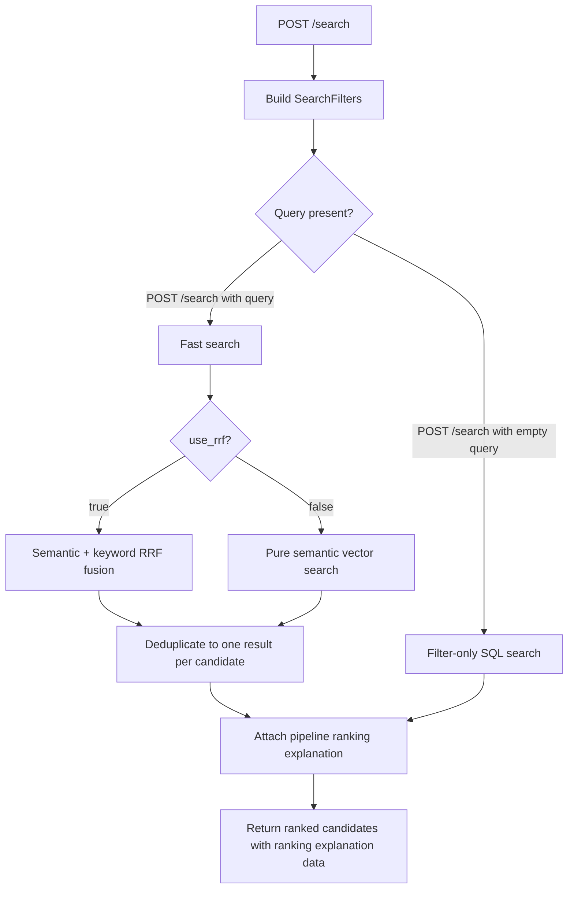

# Search Logic Deep Dive

This document de s how the app handles filters, unspecified fields such as `country`, AND vs OR matching, and the active search modes exposed by the API/UI.

## Executive Summary

The app searches candidates in two layers:

1. **Structured candidate filtering** narrows the candidate pool with SQL.
2. **Document search and ranking** looks through candidate document chunks when a text query is present.
3. **Ranking explanation** describes the actual pipeline score that produced the returned order.

The important rule is: **most filters are combined with SQL `AND` across filter categories**. For example, `country = India` and `city = Pune` and `skills overlap ["python"]` must all be true at the same time.

The `skills_match` and `interests_match` options only control how values inside those list filters are matched.

## Where The Logic Lives

- API request models and endpoint branching: `api/main.py`
- Core search engine and filter builder: `pipeline/search.py`
- Candidate ranking explanation: `pipeline/ranking_explanation.py`
- Dormant Smart-search experiment code: `pipeline/orchestrator.py`
- Optional cross-encoder reranking experiments: `pipeline/reranker.py`

## Main Flow



## How Unspecified Filters Work

Filters are represented by `SearchFilters` in `pipeline/search.py`. Most fields default to `None`.

If a field is unspecified, it is not added to the SQL `WHERE` clause.

For example, when `country` is omitted:

```python
SearchFilters(country=None, city="Pune")
```

the app adds a city condition, but it does **not** add any country condition. This means candidates from any country can match, as long as they satisfy the other active filters.

When `country` is provided:

```python
SearchFilters(country="India", city="Pune")
```

the filter builder adds both:

```sql
status = $1
AND LOWER(country) = LOWER($2)
AND LOWER(city) = LOWER($3)
```

So `country` is neither OR nor optional once provided. It becomes a required condition. The comparison is case-insensitive because both sides use `LOWER(...)`.

One filter is always applied: `status = 'active'`, unless another status is explicitly passed into `SearchFilters`.

## Ranking Explanation

Every search result can include a deterministic `ranking_explanation` object. This is a post-search explanation layer, not a new retrieval strategy and not a second sort.

It reflects the same pipeline score used to display the current order:

- `rerank_score`, if a reranker is active
- otherwise `rank_score`
- otherwise `similarity_score`

For regular text searches, the explanation shows the weighted signals that already make up `rank_score`: embedding similarity, keyword/RRF match, explicit skill coverage, profile term coverage, document term coverage, and experience prior. If reranking is enabled, `rerank_score` becomes the final sort basis and the UI shows that as the final confidence source while keeping the pre-rerank retrieval breakdown visible. The result card keeps this collapsed under **Why ranked here?** so the recruiter sees details only when they want them.

## AND vs OR In Filters

The app has two different meanings of AND/OR.

### AND Between Filter Categories

Every active filter category is joined with SQL `AND`.

Example request:

```json
{
  "country": "India",
  "city": "Pune",
  "skills": ["python", "go"],
  "skills_match": "or",
  "min_years_exp": 3
}
```

Conceptually becomes:

```sql
status = 'active'
AND country = 'India'
AND city = 'Pune'
AND skills overlaps ['python', 'go']
AND years_exp >= 3
```

The candidate must satisfy all active categories.

### OR/AND Inside Skills And Interests

`skills_match` controls how the `skills` array itself is matched.

`"or"` means candidate must have at least one requested skill:

```sql
skills && $N::text[]
```

Postgres `&&` means array overlap.

Example:

```json
{
  "skills": ["python", "go"],
  "skills_match": "or"
}
```

Matches:

- candidate with `["python"]`
- candidate with `["go"]`
- candidate with `["python", "go"]`

Does not match:

- candidate with `["java"]`

`"and"` means candidate must contain every requested skill:

```sql
skills @> $N::text[]
```

Postgres `@>` means the candidate's skill array contains the requested array.

Example:

```json
{
  "skills": ["python", "go"],
  "skills_match": "and"
}
```

Matches:

- candidate with `["python", "go"]`
- candidate with `["python", "go", "postgres"]`

Does not match:

- candidate with `["python"]`
- candidate with `["go"]`

`interests_match` works the same way, but against the `interests` array.

## Location And Salary Filters

`location` is the broadest location filter. It is matched against the candidate's `location`, `city`, and `country` fields using a case-insensitive partial match.

For example, `location = "pune"` can match:

- `location = "Pune, India"`
- `city = "Pune"`
- any country/city/location text containing `pune`

The narrower `country` and `city` filters still exist for exact country/city filtering. If you provide both broad `location` and exact `country`, both must match.

Salary filters work as range overlap checks:

- `min_salary` means the candidate's `salary_max` must be at least that value.
- `max_salary` means the candidate's `salary_min` must be no more than that value.

This lets a search for `min_salary = 90000` include candidates whose expected range is `80000-120000`.

## Doc Type Filtering

Doc type filtering is no longer exposed as a normal candidate search parameter because the product searches for candidates, not documents.

The lower-level search engine still has internal `doc_types` support for smart-search decomposition, where the orchestrator may choose to look at a specific evidence type such as resumes or transcripts. That internal targeting does not change the external result type: results are still deduplicated to candidates.

## Search Types And Ranking Options

The UI exposes a few related choices. They are easy to mix up because some are full search modes and some are ranking options inside a mode.

### 1. Filter-Only Search

Endpoint:

```text
POST /search
```

Trigger:

```json
{
  "query": "",
  "country": "India",
  "skills": ["python"]
}
```

When `query.strip()` is empty, the API does not embed a query and does not run semantic search. Instead, `api/main.py` calls `_filter_only_search(...)`.

This mode:

- builds the SQL candidate filter with `_build_where_clause(...)`
- returns candidates ordered by recent update/create time
- sets `similarity_score` and `rank_score` to `0`
- includes a recent document/chunk preview when available

Use this for browsing candidates by structured metadata.

### 2. Semantic Search

Endpoint:

```text
POST /search
```

Trigger:

```json
{
  "query": "backend engineer with kafka experience",
  "location": "India",
  "skills": ["python", "go"],
  "skills_match": "or",
  "min_salary": 90000,
  "use_rrf": false
}
```

When `query.strip()` has text, the API calls `HybridSearchEngine.search(...)`.

With `use_rrf = false`, this is pure semantic search:

1. embeds the text query
2. applies structured filters first
3. compares the query embedding against document chunk embeddings with pgvector
4. deduplicates multiple chunks down to one result per candidate
5. returns candidates sorted by relevance

Semantic search is good when the query and resume use different words for the same idea.

Example:

```text
"backend APIs at scale" can still match chunks about "distributed services" or "high-throughput FastAPI systems"
```

### 3. RRF Hybrid Search

Endpoint:

```text
POST /search
```

Trigger:

```json
{
  "query": "backend engineer with kafka experience",
  "location": "India",
  "skills": ["python", "go"],
  "skills_match": "or",
  "use_rrf": true
}
```

RRF means **Reciprocal Rank Fusion**.

With `use_rrf = true`, the engine runs two searches over the filtered candidate pool:

- semantic vector search with pgvector distance
- keyword full-text search with `plainto_tsquery`

Then it combines the two ranked lists with this formula:

```text
RRF score = 1 / (k + semantic_rank) + 1 / (k + keyword_rank)
```

In this app, `k` defaults to `60`.

What that means in plain English:

- a chunk that ranks well semantically gets points
- a chunk that ranks well by exact keywords gets points
- a chunk that appears in both lists gets more total points
- a chunk that appears in only one list can still appear, just lower

RRF is usually the best default for recruiter search because it balances meaning and exact terms. For example, exact mentions of `Kafka`, `React`, `CISSP`, or `PostgreSQL` still matter, while semantic matches can catch broader wording.

### 4. Smart Orchestrated Search Disabled

The legacy orchestrated search endpoint has been removed. Complex searches now
use `POST /search` and the current planner/ranking pipeline.

Smart search is disconnected from the product for now while a better planner/ranking strategy is redesigned. The main UI no longer exposes the Smart toggle, the settings page no longer exposes LLM planner model controls, and warmup no longer validates Gemini/OpenAI planner calls.

The old experiment code remains in `pipeline/orchestrator.py` and `pipeline/query_planner.py` for reference and benchmark work, but it is not part of the active app path.

### 5. Rerank Experiments

Rerank is not part of the active main search path right now. It is kept as an experiment setting and benchmark component.

The normal search first retrieves candidate results. Then the reranker looks again at the query and each candidate's best/supporting chunks using a cross-encoder model.

The reranker can reorder the final list when the first-pass scores are close.

Use reranking when:

- result quality matters more than latency
- the query is nuanced
- the top results need stronger precision
- the search has enough candidates that first-pass ranking may be noisy

Skip reranking when:

- you need the fastest response
- the query is simple
- filters already narrow the candidate pool heavily

## Ranking Details

The fast search fetches chunks first, then groups them by candidate.

For each candidate:

- `best_chunk` is the strongest matching chunk
- `supporting_chunks` are additional chunks, preferably from other documents
- `similarity_score` is `1 - vector_distance`
- `rrf_score` exists when hybrid RRF search was used
- `rank_score` blends semantic similarity, RRF, lexical query coverage, explicit skill coverage, document/profile coverage, and years of experience
- `ranking_explanation.pipeline_confidence` is derived from the same score used for ordering

The final ranking prefers candidates with both strong chunk similarity and broader candidate-level evidence.

## Practical Examples

### Country Unspecified

Request:

```json
{
  "query": "python backend engineer",
  "city": "Pune"
}
```

Meaning:

```text
active candidates in Pune, any country, ranked by document relevance
```

### Country Specified

Request:

```json
{
  "query": "python backend engineer",
  "country": "India",
  "city": "Pune"
}
```

Meaning:

```text
active candidates in Pune AND India, ranked by document relevance
```

### Skills OR

Request:

```json
{
  "skills": ["python", "go"],
  "skills_match": "or"
}
```

Meaning:

```text
candidate has python OR go
```

### Skills AND

Request:

```json
{
  "skills": ["python", "go"],
  "skills_match": "and"
}
```

Meaning:

```text
candidate has python AND go
```

### Country Plus Skills OR

Request:

```json
{
  "country": "India",
  "skills": ["python", "go"],
  "skills_match": "or"
}
```

Meaning:

```text
country is India AND candidate has at least one of python/go
```

It does **not** mean:

```text
country is India OR candidate has python/go
```

## Key Takeaway

Think of the app's filtering as:

```text
status
AND country if provided
AND city if provided
AND age range if provided
AND years/salary ranges if provided
AND skills condition if provided
AND interests condition if provided
```

Only the list-based filters, currently skills and interests, have a configurable inner `"and"` or `"or"` mode.
