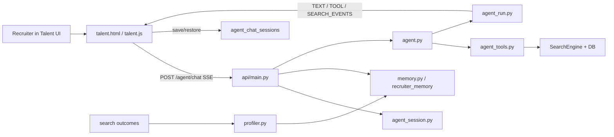

# Talent Chatbot Implementation Full Source Bundle

Generated on 2026-07-06 from the local repository.

This is a single-file source bundle for the Talent UI chatbot implementation. It embeds the actual code instead of linking out to the source files.

Security note: credential-bearing runtime files such as `.env`, local logs, caches, and virtual environments are intentionally excluded. The code below may contain environment variable names, but not live secret values.

## Included Source
- Talent UI Source
  - `api/static/talent.html`
  - `api/static/talent.js`
  - `api/static/talent.css`
  - `api/static/talent-settings.html`
  - `api/static/talent-settings.js`
  - `api/static/talent-tool-runner.html`
  - `api/static/talent-tool-runner.js`
  - `api/static/talent-tool-runner.css`
- Backend API Source
  - `api/main.py`
- Agent Pipeline Source
  - `pipeline/agent.py`
  - `pipeline/agent_run.py`
  - `pipeline/agent_stream.py`
  - `pipeline/agent_session.py`
  - `pipeline/agent_tools.py`
- Memory And Personalization Source
  - `pipeline/memory.py`
  - `pipeline/profiler.py`
  - `pipeline/personalization.py`
- Database Schema Source
  - `db/migrations/004_impressions.sql`
  - `db/migrations/011_recruiter_memory.sql`
  - `db/migrations/014_agent_chat_sessions.sql`
- Relevant Test Contracts
  - `tests/test_talent_completion_contracts.py`
  - `tests/test_talent_ui_contracts.py`
  - `tests/test_agent_endpoint.py`
  - `tests/test_agent_stream.py`
  - `tests/test_agent_tools.py`
  - `tests/test_agent_session.py`
  - `tests/test_agent_sessions_api.py`
  - `tests/test_agent_auto_recovery.py`
- Related Admin Chat Panel Source
  - `api/static/agent-panel.js`

## System Flow



## Talent UI Source

### `api/static/talent.html`

````````html
<!doctype html>
<html lang="en">
<head>
  <meta charset="utf-8">
  <meta name="viewport" content="width=device-width, initial-scale=1">
  <title>Straatix Talent Atlas</title>
  <link rel="preconnect" href="https://fonts.googleapis.com">
  <link rel="preconnect" href="https://fonts.gstatic.com" crossorigin>
  <link href="https://fonts.googleapis.com/css2?family=Archivo:wght@400;500;600;700;800&family=Newsreader:ital,opsz,wght@1,6..72,400;1,6..72,500&family=IBM+Plex+Mono:wght@400;500;600&display=swap" rel="stylesheet">
  <link rel="stylesheet" href="/static/talent.css">
</head>
<body>
  <div class="talent-shell" data-screen-label="Straatix Talent">
    <header class="topbar">
      <div class="topbar-inner">
        <a href="/talent" class="brand" aria-label="Straatix Talent home">
          <span class="brand-main">STRAATIX</span>
          <span class="brand-rule"></span>
          <span class="brand-sub">Talent Atlas</span>
        </a>
        <div class="top-actions">
          <span class="shortlist-pill"><span class="status-dot"></span>Shortlist · <span id="shortlistCount">0</span></span>
          <a class="top-link" href="/talent/settings">Settings</a>
        </div>
      </div>
    </header>

    <main>
      <section class="hero">
        <div class="hero-kicker">AI Talent Copilot</div>
        <h1>High performing talent. <em>Delivered.</em></h1>
        <p class="hero-copy">Describe the role in plain language — the copilot plans the search, scans the vetted talent pool and explains every ranking. Keep asking until you're satisfied.</p>

        <form class="ai-search" id="heroForm">
          <span class="ai-mark">✻</span>
          <input class="ai-input" id="heroInput" autocomplete="off" placeholder="Senior backend engineer, Python + ML, Bengaluru...">
          <button class="send-round" id="heroSubmit" type="submit" title="Start a copilot session">→</button>
        </form>

        <div class="feature-grid" id="featureGrid">
          <article class="feature-card">
            <div class="feature-bar"></div>
            <div class="feature-title">Explained rankings</div>
            <div class="feature-copy">Every score broken into signals you can audit.</div>
          </article>
          <article class="feature-card">
            <div class="feature-bar"></div>
            <div class="feature-title">Agentic copilot</div>
            <div class="feature-copy">Refine, compare and draft until you're satisfied.</div>
          </article>
          <article class="feature-card">
            <div class="feature-bar"></div>
            <div class="feature-title">GCC hub coverage</div>
            <div class="feature-copy">4,812 vetted candidates across 11 talent hubs.</div>
          </article>
        </div>

        <div class="toggle-row" id="toggleRow">
          <button class="toggle-pill" type="button" data-drawer="queryDrawer" aria-expanded="false">Specialised search · Query <span class="chev">▼</span></button>
          <button class="toggle-pill" type="button" data-drawer="jdDrawer" aria-expanded="false">Specialised search · JD <span class="chev">▼</span></button>
          <button class="toggle-pill" type="button" data-drawer="advancedDrawer" aria-expanded="false">Advanced options <span class="badge" id="filterBadge" hidden>0</span><span class="chev">▼</span></button>
        </div>

        <section class="drawer" id="queryDrawer" hidden>
          <div class="section-label">Specialised search — query</div>
          <p class="helper">Runs the retrieval pipeline directly — no agent, fastest path to ranked results.</p>
          <textarea class="textarea" id="queryText" placeholder="backend engineer with python and ml leadership"></textarea>
          <div class="drawer-actions">
            <div class="segmented" id="modeSegment">
              <button type="button" data-mode="no-llm">No-LLM</button>
              <button type="button" data-mode="fast">Fast</button>
              <button type="button" data-mode="quality" class="active">Quality</button>
            </div>
            <button class="primary-btn" id="runQueryBtn" type="button">Run search</button>
          </div>
        </section>

        <section class="drawer" id="jdDrawer" hidden>
          <div class="section-label">Specialised search — job description</div>
          <p class="helper">Paste a full JD — requirements, responsibilities and nice-to-haves are extracted into a search spec automatically.</p>
          <textarea class="textarea" id="jdText" style="min-height:150px" placeholder="Requirements: React, TypeScript, accessible responsive UI. Responsibilities: build reusable components and integrate APIs. Nice-to-have: performance tuning."></textarea>
          <div class="drawer-actions" style="justify-content:flex-end">
            <button class="primary-btn" id="runJdBtn" type="button">Search with JD</button>
          </div>
        </section>

        <section class="drawer" id="advancedDrawer" hidden>
          <div class="drawer-head">
            <div class="section-label">Advanced options</div>
            <button class="link-btn" id="clearFiltersBtn" type="button">Clear all</button>
          </div>
          <div class="filter-grid">
            <section class="filter-group">
              <div class="filter-title">Role and location</div>
              <div class="form-grid compact">
                <label class="form-label">Location<input class="field" id="fLocation" placeholder="Pune, India or remote"></label>
                <label class="form-label">Country<input class="field" id="fCountry" placeholder="India"></label>
                <label class="form-label">City<input class="field" id="fCity" placeholder="Bengaluru"></label>
              </div>
            </section>
            <section class="filter-group">
              <div class="filter-title">Experience and compensation</div>
              <div class="form-grid compact">
                <label class="form-label">Min exp<input class="field" id="fMinExp" inputmode="numeric" placeholder="0"></label>
                <label class="form-label">Max exp<input class="field" id="fMaxExp" inputmode="numeric" placeholder="-"></label>
                <label class="form-label">Min salary<input class="field" id="fMinSal" inputmode="numeric" placeholder="-"></label>
                <label class="form-label">Max salary<input class="field" id="fMaxSal" inputmode="numeric" placeholder="-"></label>
              </div>
            </section>
            <section class="filter-group">
              <div class="filter-title">Search behavior</div>
              <div class="search-knobs">
                <label class="form-label">Top K<input class="field" id="fTopK" inputmode="numeric" placeholder="8"></label>
                <label class="switch-row"><input id="talentRankExplanation" type="checkbox" checked> <span>Ranking explanations</span></label>
                <label class="switch-row"><input id="talentAiInsights" type="checkbox"> <span>AI insights</span></label>
                <label class="switch-row"><input id="talentRerank" type="checkbox"> <span>Reranking</span></label>
              </div>
            </section>
          </div>
          <div class="filter-group">
            <div class="filter-title">Status</div>
            <div class="status-row" id="statusRow">
              <button class="status-chip active" type="button" data-status="">All</button>
              <button class="status-chip" type="button" data-status="active">Active</button>
              <button class="status-chip" type="button" data-status="hired">Hired</button>
              <button class="status-chip" type="button" data-status="archived">Archived</button>
              <button class="status-chip" type="button" data-status="rejected">Rejected</button>
            </div>
          </div>
          <div class="filter-group">
            <div class="filter-title">Must-have skills</div>
            <div class="skill-row">
              <div class="skill-row" id="skillChips"></div>
              <input class="field" id="skillInput" style="flex:1;min-width:180px;height:38px" placeholder="Type a skill, press Enter">
            </div>
            <div class="helper" style="margin:0">Filters apply to your next search — copilot, query or JD.</div>
          </div>
        </section>
      </section>

      <section class="chat-wrap" id="chatSection">
        <div class="chat-panel">
          <div class="chat-top">
            <span class="spinner" id="chatSpinner" hidden>✻</span>
            <span class="run-dot" id="readyDot">⏺</span>
            <span class="copilot-status" id="chatStatus">copilot ready — keep refining</span>
            <span style="flex:1"></span>
            <div class="chat-toolbar">
              <select class="toolbar-select" id="agentModelSelect" title="Agent model">
                <option value="deepseek:deepseek-v4-flash">deepseek v4 flash</option>
                <option value="deepseek:deepseek-v4-pro">deepseek v4 pro</option>
                <option value="deepseek:deepseek-chat">deepseek chat</option>
                <option value="deepseek:deepseek-reasoner">deepseek reasoner</option>
                <option value="gemini:gemini-2.5-flash">gemini flash</option>
                <option value="groq:llama-3.3-70b-versatile">groq llama 70b</option>
              </select>
              <button class="mini-btn" id="sessionHistoryBtn" type="button">history</button>
              <button class="mini-btn" id="fileUploadBtn" type="button">upload</button>
              <button class="mini-btn" id="stopBtn" type="button" hidden>stop · esc</button>
              <button class="mini-btn" id="newSessionBtn" type="button">new session</button>
            </div>
          </div>
          <section class="live-spec-card" id="liveSpecCard" hidden aria-label="Live search spec"></section>
          <div class="threads-area" id="threadsArea">
            <div class="thread" id="thread"></div>
            <div class="reason-rail" id="reasonThread" aria-label="Copilot reasoning"></div>
          </div>
          <div class="context-stack" id="contextStack" hidden></div>
          <form class="chat-input-row" id="chatForm">
            <input class="chat-input" id="chatInput" autocomplete="off" placeholder="Ask a follow-up — refine, compare, draft outreach...">
            <button class="send-round" id="chatSubmit" type="submit" style="position:static;flex:0 0 auto">→</button>
          </form>
        </div>
      </section>

      <section class="pipeline-strip" id="pipelineStrip" hidden></section>

      <section class="results-section">
        <div id="resultsContent">
          <div class="starter" id="starterBlock">
            <div class="starter-title">Try asking</div>
            <div class="starter-row">
              <button class="chip" type="button" data-starter="Senior Python engineers in Bengaluru">Senior Python engineers in Bengaluru</button>
              <button class="chip" type="button" data-starter="Data engineers with 5+ years on Spark">Data engineers with 5+ years on Spark</button>
              <button class="chip" type="button" data-starter="Remote platform engineers, Kubernetes">Remote platform engineers, Kubernetes</button>
            </div>
          </div>
        </div>
      </section>
    </main>

    <aside class="profile-drawer" id="profileDrawer" aria-label="Candidate profile" hidden>
      <div class="drawer-panel-head">
        <div>
          <div class="results-eyebrow">Candidate profile</div>
          <h2 id="profileTitle">No candidate selected</h2>
        </div>
        <button class="mini-btn" id="profileCloseBtn" type="button">close</button>
      </div>
      <div class="profile-body" id="profileBody"></div>
    </aside>

    <aside class="session-drawer" id="sessionDrawer" aria-label="Session history" hidden>
      <div class="drawer-panel-head">
        <div>
          <div class="results-eyebrow">Session history</div>
          <h2>Recent copilot work</h2>
        </div>
        <button class="mini-btn" id="sessionCloseBtn" type="button">close</button>
      </div>
      <div class="session-list" id="sessionList"></div>
    </aside>

    <div class="upload-modal" id="uploadModal" hidden>
      <form class="upload-card" id="uploadForm">
        <div class="drawer-panel-head">
          <div>
            <div class="results-eyebrow">Attach document</div>
            <h2>Upload to candidate</h2>
          </div>
          <button class="mini-btn" id="uploadCloseBtn" type="button">close</button>
        </div>
        <label class="form-label">Candidate ID<input class="field" id="uploadCandidateId" required placeholder="Select a candidate first"></label>
        <label class="form-label">Document type
          <select class="select" id="uploadDocType">
            <option value="resume">resume</option>
            <option value="bio">bio</option>
            <option value="certification">certification</option>
            <option value="transcript">transcript</option>
            <option value="cover_letter">cover_letter</option>
            <option value="other">other</option>
          </select>
        </label>
        <label class="form-label">Title<input class="field" id="uploadTitle" placeholder="Optional title"></label>
        <label class="form-label">File<input class="field" id="uploadFileInput" type="file" accept=".txt,.md,.pdf,.docx"></label>
        <div class="upload-status" id="uploadStatus"></div>
        <button class="primary-btn" type="submit">Upload and ingest</button>
      </form>
    </div>

    <footer class="footer">
      <div class="footer-inner">
        <span class="footer-brand">STRAATIX</span>
        <span class="footer-rule"></span>
        <span>Talent Atlas — every ranking explained</span>
        <span class="footer-mono">pool live · copilot v0.3</span>
      </div>
    </footer>
  </div>
  <script src="/static/talent.js"></script>
</body>
</html>
````````

### `api/static/talent.js`

````````javascript
(function () {
  "use strict";

  var $ = function (id) { return document.getElementById(id); };
  var DEFAULT_RECRUITER = "7f23e9d8-d2e5-45a4-8973-54c31f21a4dd";
  var SECRET_RE = /password|token|secret|apikey|api_key|credential|auth/i;
  var saveTimer = null;

  var state = {
    recruiterId: localStorage.getItem("talent_recruiter_id") || DEFAULT_RECRUITER,
    sessionId: localStorage.getItem("talent_session_id") || makeSessionId(),
    agentModel: localStorage.getItem("talent_agent_model") || "deepseek:deepseek-v4-flash",
    settings: readSettings(),
    isBusy: false,
    aborter: null,
    activeTurn: null,
    messages: [],
    workspaceTurns: [],
    results: [],
    candidateIds: [],
    deferredCandidateIds: [],
    resultExpanded: false,
    shortlist: {},
    selectedCandidateId: "",
    contextCandidates: [],
    sessionSummary: "",
    filters: {
      status: localStorage.getItem("talent_default_status") || "",
      skills: [],
      mode: localStorage.getItem("talent_default_mode") || "quality"
    },
    spec: {},
    queryInterpretation: null,
    lastSearchMeta: null
  };
  localStorage.setItem("talent_session_id", state.sessionId);

  var TOOL_NAMES = {
    run_search: "run_search",
    modify_and_search: "modify_and_search",
    view_current_results: "view_current_results",
    get_candidate_detail: "get_candidate_detail",
    get_candidate_details: "get_candidate_details",
    save_hint: "save_hint",
    confirm_observation: "confirm_observation",
    add_observation: "add_observation",
    push_to_main_panel: "push_to_main_panel",
    keyword_search: "keyword_search",
    keyword_search_batch: "keyword_search_batch",
    list_skills: "list_skills",
    list_skills_batch: "list_skills_batch",
    update_shortlist: "update_shortlist",
    update_working_spec: "update_working_spec",
    analyze_jd: "analyze_jd",
    draft_outreach: "draft_outreach",
    generate_interview_questions: "generate_interview_questions",
    compare_candidates: "compare_candidates",
    explain_poor_results: "explain_poor_results",
    query_candidates_db: "query_candidates_db",
    list_recent_sessions: "list_recent_sessions",
    load_candidate_pool: "load_candidate_pool",
    filter_from_pool: "filter_from_pool",
    aggregate_pool: "aggregate_pool",
    rerank_pool: "rerank_pool",
    save_search: "save_search",
    export_shortlist: "export_shortlist"
  };

  function makeSessionId() {
    return "talent-" + Date.now().toString(36) + "-" + Math.random().toString(36).slice(2, 9);
  }

  function readSettings() {
    try {
      return Object.assign({
        toolTransparency: "compact",
        logsExpanded: false,
        resultsDefaultCount: 5,
        showStarters: true,
        showFeatureCards: true,
        showDirectSearch: true,
        showAdvancedFilters: true,
        showTraceLinks: false,
        showTimingBadges: true,
        includeRankExplanation: true,
        includeAiInsights: false,
        enableReranking: false,
        outcomeWhyPrompt: true,
        copilotLayout: "inline"
      }, JSON.parse(localStorage.getItem("talent_settings") || "{}"));
    } catch (_) {
      return {};
    }
  }

  function isSidePanel() {
    return state.settings.copilotLayout === "sidepanel";
  }

  function esc(v) {
    return String(v == null ? "" : v)
      .replace(/&/g, "&amp;")
      .replace(/</g, "&lt;")
      .replace(/>/g, "&gt;")
      .replace(/"/g, "&quot;")
      .replace(/'/g, "&#39;");
  }

  function sanitize(obj) {
    if (!obj || typeof obj !== "object") return obj;
    if (Array.isArray(obj)) return obj.map(sanitize);
    var out = {};
    Object.keys(obj).forEach(function (key) {
      out[key] = SECRET_RE.test(key) ? "***" : sanitize(obj[key]);
    });
    return out;
  }

  function compact(value, max) {
    var s;
    if (value == null || value === "") return "";
    if (Array.isArray(value)) s = value.join(", ");
    else if (typeof value === "object") s = JSON.stringify(sanitize(value));
    else s = String(value);
    max = max || 58;
    return s.length > max ? s.slice(0, max - 1) + "..." : s;
  }

  function parseSessionJson(value, fallback) {
    if (value == null) return fallback;
    if (typeof value === "string") {
      try { return JSON.parse(value); }
      catch (_) { return fallback; }
    }
    return value;
  }

  function normalizeSessionMessages(value) {
    var parsed = parseSessionJson(value, []);
    if (parsed && !Array.isArray(parsed) && typeof parsed === "object") {
      parsed = parsed.messages || parsed.items || [];
    }
    if (!Array.isArray(parsed)) return [];
    return parsed.filter(function (msg) {
      return msg && typeof msg === "object" && (msg.role || msg.content);
    }).map(function (msg) {
      return {
        role: msg.role || "assistant",
        content: msg.content == null ? "" : String(msg.content),
        ts: msg.ts || msg.timestamp || msg.created_at || ""
      };
    });
  }

  function normalizeSessionContext(value) {
    var parsed = parseSessionJson(value, {});
    return parsed && typeof parsed === "object" && !Array.isArray(parsed) ? parsed : {};
  }

  function normalizeSessionResults(value) {
    var parsed = parseSessionJson(value, []);
    if (!Array.isArray(parsed)) return [];
    return parsed.map(normalizeResult);
  }

  function normalizeWorkspaceTurns(value) {
    var parsed = parseSessionJson(value, []);
    if (!Array.isArray(parsed)) return [];
    return parsed.map(function (turn) {
      if (!turn || typeof turn !== "object") return null;
      var type = turn.type || (turn.role === "user" ? "user" : turn.role === "assistant" ? "assistant_turn" : "");
      if (type === "user" || type === "system") {
        return {
          type: type,
          content: turn.content == null ? "" : String(turn.content),
          ts: turn.ts || turn.timestamp || ""
        };
      }
      if (type !== "assistant_turn") return null;
      var tools = Array.isArray(turn.tools) ? turn.tools : [];
      var segments = Array.isArray(turn.segments) ? turn.segments : [];
      return {
        type: "assistant_turn",
        id: turn.id || makeSessionId(),
        input: turn.input || "",
        ts: turn.ts || "",
        status: turn.status || "done",
        elapsed_s: Number(turn.elapsed_s || 0),
        errored: !!turn.errored,
        has_tool_error: !!turn.has_tool_error,
        thinking: turn.thinking || "",
        text: turn.text || "",
        tools: tools.map(function (tool, index) {
          tool = tool || {};
          return {
            id: tool.id || ("tool-" + (index + 1)),
            name: tool.name || "tool",
            args: sanitize(tool.args || {}),
            result: sanitize(tool.result || null),
            summary: tool.summary || "",
            status: tool.status || "done",
            elapsed_ms: Number(tool.elapsed_ms || 0),
            error: !!tool.error
          };
        }),
        segments: segments.map(function (segment) {
          return { type: "answer", content: segment && segment.content ? String(segment.content) : "" };
        }),
        events: Array.isArray(turn.events) ? turn.events : [],
        suggestions: Array.isArray(turn.suggestions) ? turn.suggestions.map(String) : []
      };
    }).filter(Boolean);
  }

  function recordWorkspaceTurn(turn) {
    if (!turn || typeof turn !== "object") return turn;
    state.workspaceTurns.push(turn);
    if (state.workspaceTurns.length > 120) state.workspaceTurns = state.workspaceTurns.slice(-120);
    return turn;
  }

  function api(path, options) {
    return fetch(path, options).then(function (resp) {
      if (!resp.ok) {
        return resp.text().then(function (text) {
          var detail = text;
          try { detail = JSON.parse(text).detail || text; } catch (_) {}
          throw new Error(detail || "HTTP " + resp.status);
        });
      }
      if (resp.status === 204) return null;
      return resp.json();
    });
  }

  function formatScore(value) {
    var n = Number(value || 0);
    if (!isFinite(n)) return "0";
    if (n <= 1 && n >= 0) n *= 100;
    return n.toFixed(n >= 10 ? 0 : 1).replace(/\.0$/, "");
  }

  function formatPercent(value) {
    var n = Number(value || 0);
    if (n <= 1 && n >= 0) n *= 100;
    return formatScore(n) + "%";
  }

  function formatDecimal(value) {
    var n = Number(value);
    if (!isFinite(n)) return "-";
    return n.toFixed(n >= 10 ? 1 : 3).replace(/\.0+$/, "");
  }

  function hasNumericScore(value) {
    if (value === null || value === undefined || value === "") return false;
    return isFinite(Number(value));
  }

  function scoreLabel(result) {
    return result && result.score_available === false ? "—" : formatScore(result ? result.score : 0);
  }

  function formatSalaryRange(min, max) {
    if (!min && !max) return "Salary not listed";
    if (min && max) return min + "-" + max;
    return String(min || max);
  }

  function initials(name) {
    return String(name || "C").split(/\s+/).filter(Boolean).slice(0, 2).map(function (p) { return p[0]; }).join("").toUpperCase();
  }

  function tierClass(tier) {
    if (/strong|high/i.test(tier || "")) return "strong";
    if (/good|medium/i.test(tier || "")) return "good";
    return "partial";
  }

  function renderInlineMarkdown(text) {
    return esc(text || "")
      .replace(/`([^`]+)`/g, "<code>$1</code>")
      .replace(/\*\*([^*]+)\*\*/g, "<strong>$1</strong>")
      .replace(/\*([^*]+)\*/g, "<em>$1</em>")
      .replace(/\[([^\]]+)\]\((https?:\/\/[^)\s]+)\)/g, '<a href="$2" target="_blank" rel="noopener">$1</a>');
  }

  function renderMarkdown(text) {
    var lines = String(text || "").replace(/\r\n/g, "\n").split("\n");
    var html = [];
    var list = null;
    function closeList() { if (list) { html.push("</" + list + ">"); list = null; } }
    function isRow(s) { return /^\s*\|.*\|\s*$/.test(s); }
    function isSep(s) { return s.indexOf("|") !== -1 && /^\s*\|?[\s:]*-{2,}[\s:|-]*\|?\s*$/.test(s); }
    function cells(row) {
      return row.trim().replace(/^\|/, "").replace(/\|$/, "").split("|").map(function (c) { return c.trim(); });
    }
    var i = 0;
    while (i < lines.length) {
      var line = lines[i];
      // fenced code block
      if (/^```/.test(line)) {
        closeList();
        var code = [];
        i++;
        while (i < lines.length && !/^```/.test(lines[i])) { code.push(lines[i]); i++; }
        i++; // skip closing fence
        html.push("<pre><code>" + esc(code.join("\n")) + "</code></pre>");
        continue;
      }
      // GitHub-style table: header row immediately followed by a separator row
      if (isRow(line) && i + 1 < lines.length && isSep(lines[i + 1])) {
        closeList();
        var header = cells(line);
        i += 2; // consume header + separator
        var rows = [];
        while (i < lines.length && isRow(lines[i])) { rows.push(cells(lines[i])); i++; }
        var t = "<table><thead><tr>";
        header.forEach(function (h) { t += "<th>" + renderInlineMarkdown(h) + "</th>"; });
        t += "</tr></thead><tbody>";
        rows.forEach(function (r) {
          t += "<tr>";
          for (var c = 0; c < header.length; c++) t += "<td>" + renderInlineMarkdown(r[c] || "") + "</td>";
          t += "</tr>";
        });
        html.push(t + "</tbody></table>");
        continue;
      }
      if (!line.trim()) { closeList(); i++; continue; }
      var heading = line.match(/^(#{1,3})\s+(.+)$/);
      if (heading) {
        closeList();
        html.push("<h" + heading[1].length + ">" + renderInlineMarkdown(heading[2]) + "</h" + heading[1].length + ">");
        i++; continue;
      }
      var bullet = line.match(/^\s*[-*]\s+(.+)$/);
      if (bullet) {
        if (list !== "ul") { closeList(); list = "ul"; html.push("<ul>"); }
        html.push("<li>" + renderInlineMarkdown(bullet[1]) + "</li>");
        i++; continue;
      }
      var numbered = line.match(/^\s*\d+\.\s+(.+)$/);
      if (numbered) {
        if (list !== "ol") { closeList(); list = "ol"; html.push("<ol>"); }
        html.push("<li>" + renderInlineMarkdown(numbered[1]) + "</li>");
        i++; continue;
      }
      if (/^>\s+/.test(line)) {
        closeList();
        html.push("<blockquote>" + renderInlineMarkdown(line.replace(/^>\s+/, "")) + "</blockquote>");
        i++; continue;
      }
      closeList();
      html.push("<p>" + renderInlineMarkdown(line) + "</p>");
      i++;
    }
    closeList();
    return html.join("");
  }

  function summarizeArgs(args) {
    if (!args || typeof args !== "object") return "";
    var safe = sanitize(args);
    var priority = ["query", "changes", "reason", "candidate_id", "id", "sql", "jd_text", "status"];
    var keys = Object.keys(safe).filter(function (k) { return safe[k] !== null && safe[k] !== undefined && safe[k] !== ""; });
    keys = priority.filter(function (k) { return keys.indexOf(k) !== -1; }).concat(keys.filter(function (k) { return priority.indexOf(k) === -1; }));
    return keys.slice(0, 3).map(function (k) { return k + ": " + compact(safe[k], 52); }).join(" · ");
  }

  function summarizeToolResult(name, summary, result) {
    if (summary) return summary;
    if (result && typeof result === "object") {
      if (name === "run_search" || name === "modify_and_search") return (result.total || 0) + " results · " + (result.total_scanned || 0) + " scanned";
      if (result.count != null) return result.count + " items";
      if (result.saved) return "saved";
      if (result.error) return "error";
    }
    return "done";
  }

  function toolHadError(result) {
    return !!(result && typeof result === "object" && result.error);
  }

  function initialRunMapState(inputText) {
    return {
      understood: { status: "done", detail: compact(inputText || "Request received", 42) },
      tool: { status: "active", detail: "choosing path" },
      run: { status: "todo", detail: "pending" },
      quality: { status: "todo", detail: "pending" },
      next: { status: "todo", detail: "pending" }
    };
  }

  function renderAgentRunMap(turn) {
    return turn;
  }

  function updateRunMap(turn, key, status, detail) {
    if (!turn) return;
    turn.runMapState = turn.runMapState || initialRunMapState("");
    turn.runMapState[key] = {
      status: status || "done",
      detail: detail || turn.runMapState[key].detail || ""
    };
    renderAgentRunMap(turn);
  }

  function finalizeRunMap(turn, errored) {
    if (!turn) return;
    var failed = !!errored || !!turn.hasToolError;
    var map = turn.runMapState || {};
    Object.keys(map).forEach(function (key) {
      if (map[key] && map[key].status === "active") {
        map[key].status = failed ? "warn" : "done";
        if (!map[key].detail || map[key].detail === "pending") map[key].detail = failed ? "stopped" : "done";
      }
    });
    if (errored) updateRunMap(turn, "next", "warn", "stopped");
    else if (turn.hasToolError) updateRunMap(turn, "next", "warn", "search failed");
    else updateRunMap(turn, "next", "done", turn.text ? "answered" : "updated UI");
    renderAgentRunMap(turn);
  }

  function searchQualitySummary(results, specSummary) {
    var list = results || [];
    if (specSummary && specSummary.recovery) return { status: "warn", detail: "weak · recovery ready" };
    if (!list.length) return { status: "warn", detail: "zero results" };
    var top = Number(list[0].score || list[0].feature_score || list[0].final_score || 0);
    if (top >= 70) return { status: "done", detail: "strong · top " + Math.round(top) };
    if (top >= 50) return { status: "done", detail: "usable · top " + Math.round(top) };
    return { status: "warn", detail: "weak · top " + Math.round(top) };
  }

  function toolQualitySummary(name, result) {
    if (!result || typeof result !== "object") return { status: "active", detail: "checking output" };
    if (result.error) return { status: "warn", detail: "tool error" };
    if (name === "run_search" || name === "modify_and_search") {
      var list = (result.results || []).map(normalizeResult);
      return searchQualitySummary(list, result.spec_summary || result.specSummary || {});
    }
    if (name === "query_candidates_db") {
      return { status: "done", detail: (result.count != null ? result.count : ((result.rows || []).length)) + " row(s)" };
    }
    if (name === "keyword_search" || name === "show_candidates") {
      return { status: "done", detail: (result.count != null ? result.count : ((result.results || result.candidates || []).length)) + " item(s)" };
    }
    return { status: "done", detail: "output ready" };
  }

  function currentFilters() {
    var filters = {};
    [
      ["fLocation", "location"], ["fCountry", "country"], ["fCity", "city"],
      ["fMinExp", "min_years_exp"], ["fMaxExp", "max_years_exp"],
      ["fMinSal", "min_salary"], ["fMaxSal", "max_salary"]
    ].forEach(function (pair) {
      var el = $(pair[0]);
      var val = el ? el.value.trim() : "";
      if (!val) return;
      filters[pair[1]] = /years|salary/.test(pair[1]) ? Number(val) : val;
    });
    if (state.filters.status) filters.status = [state.filters.status];
    if (state.filters.skills.length) filters.skills = state.filters.skills.slice();
    return filters;
  }

  function candidateContextPayload() {
    return state.contextCandidates.map(function (c) {
      return {
        id: c.id,
        name: c.name,
        city: c.city,
        country: c.country,
        years_exp: c.years_exp,
        skills: c.skills || [],
        summary_line: c.summary_line || ""
      };
    });
  }

  function agentContext(options) {
    options = options || {};
    var candidateIds = state.contextCandidates.map(function (c) { return c.id; }).filter(Boolean);
    var sessionMessages = state.messages.slice(-16);
    if (options.excludeCurrentUser && sessionMessages.length) {
      var last = sessionMessages[sessionMessages.length - 1];
      if (last && last.role === "user" && String(last.content || "") === String(options.currentText || "")) {
        sessionMessages = sessionMessages.slice(0, -1);
      }
    }
    return {
      query: state.spec.query || $("heroInput").value.trim() || $("queryText").value.trim() || "",
      filters: currentFilters(),
      result_ids: state.results.map(function (r) { return r.id; }).filter(Boolean),
      candidate_ids: candidateIds,
      candidate_summaries: candidateContextPayload(),
      session_messages: sessionMessages,
      session_summary: state.sessionSummary || ""
    };
  }

  function ensureChatVisible() {
    var shell = document.querySelector(".talent-shell");
    if (shell) shell.classList.add("chat-active");
    $("chatSection").hidden = false;
    if (!state.settings.showFeatureCards) $("featureGrid").hidden = true;
    var panel = document.querySelector(".chat-panel");
    if (panel) panel.classList.toggle("layout-sidepanel", isSidePanel());
  }

  function stopAgentResponse() {
    if (state.aborter) state.aborter.abort();
  }

  function setComposerStopState(busy) {
    ["heroSubmit", "chatSubmit"].forEach(function (id) {
      var button = $(id);
      if (!button) return;
      button.classList.toggle("is-stop", busy);
      button.setAttribute("aria-label", busy ? "Stop response" : "Send message");
      button.setAttribute("title", busy ? "Stop response" : (id === "heroSubmit" ? "Start a copilot session" : "Send message"));
      button.innerHTML = busy ? '<span class="send-stop-square" aria-hidden="true"></span>' : "→";
      button.disabled = false;
    });
  }

  function setBusy(busy) {
    state.isBusy = busy;
    $("chatSpinner").hidden = !busy;
    $("readyDot").hidden = busy;
    $("stopBtn").hidden = true;
    $("chatStatus").textContent = busy ? "copilot working..." : "copilot ready — keep refining";
    $("chatStatus").classList.toggle("status-shimmer", busy);
    setComposerStopState(busy);
  }

  function onComposerButtonClick(e) {
    if (!state.isBusy) return;
    e.preventDefault();
    e.stopPropagation();
    stopAgentResponse();
  }

  function snapshotActiveTurn(turn) {
    turn = turn || state.activeTurn;
    if (!turn || !turn.snapshot) return null;
    turn.snapshot.text = turn.text || turn.snapshot.text || "";
    turn.snapshot.thinking = turn.thinking || turn.snapshot.thinking || "";
    turn.snapshot.elapsed_s = turn.startedAt ? Number(((performance.now() - turn.startedAt) / 1000).toFixed(1)) : (turn.snapshot.elapsed_s || 0);
    turn.snapshot.has_tool_error = !!turn.hasToolError;
    turn.snapshot.tool_count = turn.toolCount || (turn.snapshot.tools || []).length;
    return turn.snapshot;
  }

  function addUserMessage(text) {
    var el = document.createElement("div");
    el.className = "msg-user";
    el.textContent = text;
    $("thread").appendChild(el);
    var ts = new Date().toISOString();
    state.messages.push({ role: "user", content: text, ts: ts });
    recordWorkspaceTurn({ type: "user", content: text, ts: ts });
    scrollThread();
    debounceSaveSession();
  }

  function appendSystemMessage(text, options) {
    options = options || {};
    ensureChatVisible();
    var el = document.createElement("div");
    el.className = "msg-system";
    el.textContent = text;
    $("thread").appendChild(el);
    if (options.persist !== false) {
      recordWorkspaceTurn({ type: "system", content: text, ts: new Date().toISOString() });
      debounceSaveSession();
    }
    scrollThread();
  }

  function startTurn(inputText) {
    var turn = { id: "turn-" + Date.now().toString(36), startedAt: performance.now(), tools: {}, toolCount: 0, text: "", thinking: "", hasToolError: false };
    turn.snapshot = recordWorkspaceTurn({
      type: "assistant_turn",
      id: turn.id,
      input: inputText || "",
      ts: new Date().toISOString(),
      status: "running",
      elapsed_s: 0,
      errored: false,
      has_tool_error: false,
      thinking: "",
      text: "",
      tools: [],
      segments: [],
      events: [],
      suggestions: []
    });
    var root = document.createElement("div");
    root.className = "turn";
    var card = document.createElement("div");
    card.className = "run-card";
    // Default to expanded so the tool sequence is visible inline. Users can still
    // collapse a turn by clicking its header.
    var header = document.createElement("div");
    header.className = "run-header";
    header.innerHTML = '<button class="run-working-icon" type="button" aria-label="Stop response" title="Stop response"></button><span class="run-label status-shimmer">Thinking...</span><span class="run-elapsed">0.0s</span><span class="chev">▼</span>';
    var steps = document.createElement("div");
    steps.className = "run-steps";
    header.addEventListener("click", function () { card.classList.toggle("collapsed"); });
    var stopIcon = header.querySelector(".run-working-icon");
    if (stopIcon) {
      stopIcon.addEventListener("click", function (e) {
        e.stopPropagation();
        stopAgentResponse();
      });
    }
    card.appendChild(header);
    card.appendChild(steps);
    root.appendChild(card);
    if (isSidePanel()) {
      var pill = document.createElement("div");
      pill.className = "reasoning-pill";
      pill.innerHTML = '<span class="reasoning-pill-icon">✻</span> reasoning — see panel →';
      $("thread").appendChild(pill);
      turn.reasonPill = pill;
      $("reasonThread").appendChild(root);
    } else {
      $("thread").appendChild(root);
    }
    turn.root = root;
    turn.card = card;
    turn.header = header;
    turn.label = header.querySelector(".run-label");
    turn.elapsed = header.querySelector(".run-elapsed");
    turn.runMapState = initialRunMapState(inputText || "");
    turn.steps = steps;
    turn.interval = setInterval(function () {
      turn.elapsed.textContent = ((performance.now() - turn.startedAt) / 1000).toFixed(1) + "s";
    }, 150);
    state.activeTurn = turn;
    scrollThread();
    return turn;
  }

  function finishTurn(turn, errored) {
    if (!turn) return;
    clearInterval(turn.interval);
    turn.elapsed.textContent = ((performance.now() - turn.startedAt) / 1000).toFixed(1) + "s";
    var failed = !!errored || !!turn.hasToolError;
    turn.card.classList.toggle("has-error", failed);
    turn.card.classList.add("finished");
    turn.label.classList.remove("status-shimmer");
    var spinner = turn.header.querySelector(".run-working-icon, .spinner");
    if (spinner) {
      var doneDot = document.createElement("span");
      doneDot.className = "run-dot";
      doneDot.textContent = "●";
      doneDot.style.color = failed ? "var(--warn)" : "var(--green)";
      spinner.replaceWith(doneDot);
    }
    turn.label.textContent = errored ? "Interrupted" : (turn.hasToolError ? "Used " + turn.toolCount + " tool" + (turn.toolCount === 1 ? "" : "s") + " · needs attention" : (turn.toolCount ? "Used " + turn.toolCount + " tool" + (turn.toolCount === 1 ? "" : "s") : "Done"));
    finalizeRunMap(turn, errored);
    if (turn.snapshot) {
      turn.snapshot.status = errored ? "interrupted" : (turn.hasToolError ? "needs_attention" : "done");
      turn.snapshot.errored = !!errored;
      turn.snapshot.has_tool_error = !!turn.hasToolError;
      snapshotActiveTurn(turn);
    }
    if (turn.text) {
      state.messages.push({ role: "assistant", content: turn.text, ts: new Date().toISOString() });
      debounceSaveSession();
    }
    if (state.activeTurn === turn) state.activeTurn = null;
  }

  function setTurnStatus(turn, text) {
    if (turn && turn.label) turn.label.textContent = text;
  }

  function addTool(turn, id, name, args) {
    turn.toolCount += 1;
    var toolId = id || ("tool-" + turn.toolCount);
    var step = document.createElement("div");
    step.className = "tool-step running clickable";
    step.innerHTML =
      '<div class="tool-line">' +
      '<span class="tool-dot">⏺</span>' +
      '<span class="tool-seq">' + turn.toolCount + '</span>' +
      '<span class="tool-name">' + esc(TOOL_NAMES[name] || name) + '</span>' +
      '<span class="tool-args">' + esc(summarizeArgs(args)) + '</span>' +
      '<span class="tool-view">view ▸</span>' +
      '</div>';
    turn.steps.appendChild(step);
    var toolSnapshot = {
      id: toolId,
      name: name,
      args: sanitize(args),
      result: null,
      summary: "",
      status: "running",
      elapsed_ms: 0,
      error: false
    };
    if (turn.snapshot) {
      turn.snapshot.tools.push(toolSnapshot);
      turn.snapshot.events.push({ type: "tool", index: turn.snapshot.tools.length - 1 });
    }
    var rec = { el: step, name: name, args: sanitize(args), result: null, summary: "", startedAt: performance.now(), snapshot: toolSnapshot };
    turn.tools[toolId] = rec;
    step.addEventListener("click", function () { openToolModal(rec); });
    updateRunMap(turn, "tool", "done", TOOL_NAMES[name] || name);
    updateRunMap(turn, "run", "active", summarizeArgs(args) || "running");
    updateRunMap(turn, "quality", "todo", "waiting");
    updateRunMap(turn, "next", "todo", "pending");
    setTurnStatus(turn, "Running " + (TOOL_NAMES[name] || name) + "...");
    scrollThread();
  }

  // Scrollable modal showing a tool call's full arguments and result. The full
  // payload is already on the client (streamed via TOOL_CALL_END), so no extra
  // fetch is needed — clicking any step opens its exact inputs/outputs.
  function openToolModal(rec) {
    var prev = document.getElementById("toolModal");
    if (prev) prev.remove();
    var replay = getToolReplayConfig(rec);
    var argsStr = rec.args == null ? "{}" : safeStringify(rec.args);
    var resStr = rec.result == null ? "(still running…)" : safeStringify(rec.result);
    var overlay = document.createElement("div");
    overlay.id = "toolModal";
    overlay.className = "tool-modal-overlay";
    overlay.innerHTML =
      '<div class="tool-modal" role="dialog" aria-modal="true">' +
        '<div class="tool-modal-head">' +
          '<div><div class="tool-modal-title">' + esc(TOOL_NAMES[rec.name] || rec.name) + '</div>' +
          (rec.summary ? '<div class="tool-modal-sub">' + esc(rec.summary) + '</div>' : '') + '</div>' +
          (replay ? '<button class="tool-run-tab" type="button">' + esc(replay.label) + '</button>' : '') +
          '<button class="tool-modal-close" type="button" aria-label="Close">✕</button>' +
        '</div>' +
        '<div class="tool-modal-body">' +
          '<div class="tool-modal-section"><h4>Arguments</h4><pre>' + esc(argsStr) + '</pre></div>' +
          '<div class="tool-modal-section"><h4>Result</h4><pre>' + esc(resStr) + '</pre></div>' +
        '</div>' +
      '</div>';
    document.body.appendChild(overlay);
    function close() { overlay.remove(); document.removeEventListener("keydown", onKey, true); }
    function onKey(e) { if (e.key === "Escape") { e.stopPropagation(); close(); } }
    overlay.addEventListener("click", function (e) { if (e.target === overlay) close(); });
    overlay.querySelector(".tool-modal-close").addEventListener("click", close);
    var replayBtn = overlay.querySelector(".tool-run-tab");
    if (replayBtn) replayBtn.addEventListener("click", function () { openToolRunTab(rec); });
    document.addEventListener("keydown", onKey, true);
  }

  function safeStringify(v) {
    try { return JSON.stringify(v, null, 2); } catch (e) { return String(v); }
  }

  function getToolReplayConfig(rec) {
    var args = rec && rec.args && typeof rec.args === "object" ? rec.args : {};
    if (rec && rec.name === "query_candidates_db" && args.sql) {
      return {
        label: "Run in new tab",
        title: "query_candidates_db",
        url: "/talent/api/tools/query-db",
        payload: { sql: String(args.sql) },
        sourceLabel: "SQL",
        source: String(args.sql)
      };
    }
    if (rec && (rec.name === "run_search" || rec.name === "modify_and_search") && args.query) {
      return {
        label: "Run in new tab",
        title: rec.name,
        url: "/search",
        payload: buildToolReplaySearchPayload(args),
        sourceLabel: "Query",
        source: String(args.query)
      };
    }
    return null;
  }

  function buildToolReplaySearchPayload(args) {
    var payload = {
      query: String(args.query || ""),
      mode: state.filters.mode || "quality",
      top_k: Number(args.top_k || state.settings.resultsDefaultCount || 10),
      include_rank_explanation: state.settings.includeRankExplanation !== false,
      include_ai_insights: !!state.settings.includeAiInsights,
      enable_reranking: !!state.settings.enableReranking,
      recruiter_id: state.recruiterId,
      session_id: makeSessionId()
    };
    var filters = args.filters && typeof args.filters === "object" ? args.filters : {};
    [
      "location", "country", "city", "min_age", "max_age", "skills",
      "skill_weights", "interests", "min_years_exp", "max_years_exp",
      "min_salary", "max_salary", "skills_match", "interests_match", "status"
    ].forEach(function (key) {
      if (filters[key] !== undefined && filters[key] !== null && filters[key] !== "") payload[key] = filters[key];
    });
    return payload;
  }

  function openToolRunTab(rec) {
    var replay = getToolReplayConfig(rec);
    if (!replay) return;
    var runId = "run-" + Date.now().toString(36) + "-" + Math.random().toString(36).slice(2, 8);
    cleanupToolRunStorage();
    localStorage.setItem("talent_tool_run_" + runId, JSON.stringify({
      created_at: Date.now(),
      replay: replay
    }));
    var win = window.open("/talent/tool-runner?run_id=" + encodeURIComponent(runId), "_blank");
    if (!win) {
      alert("Your browser blocked the new tab. Allow popups for this site and try again.");
      return;
    }
  }

  function cleanupToolRunStorage() {
    var cutoff = Date.now() - 24 * 60 * 60 * 1000;
    Object.keys(localStorage).forEach(function (key) {
      if (key.indexOf("talent_tool_run_") !== 0) return;
      try {
        var parsed = JSON.parse(localStorage.getItem(key) || "{}");
        if (!parsed.created_at || parsed.created_at < cutoff) localStorage.removeItem(key);
      } catch (_) {
        localStorage.removeItem(key);
      }
    });
  }

  function writeToolRunShell(win, replay) {
    win.document.open();
    win.document.write(
      '<!doctype html><html><head><meta charset="utf-8">' +
      '<meta name="viewport" content="width=device-width, initial-scale=1">' +
      '<title>' + esc(replay.title) + ' · STRAATIX</title>' +
      '<style>' +
      ':root{--navy:#0d2742;--rust:#b8613d;--paper:#faf8f2;--line:#e8dfd3;--muted:#687788;--text:#102033;--mono:ui-monospace,SFMono-Regular,Menlo,Consolas,monospace}' +
      '*{box-sizing:border-box}body{margin:0;background:var(--paper);color:var(--text);font:15px/1.55 Inter,ui-sans-serif,system-ui,-apple-system,BlinkMacSystemFont,"Segoe UI",sans-serif}' +
      'header{background:#071524;color:#fff;border-bottom:2px solid var(--rust);padding:18px 24px}main{width:min(1180px,calc(100vw - 36px));margin:28px auto 56px;display:grid;gap:18px}' +
      '.brand{font-weight:800;letter-spacing:.18em}.sub{color:#cfa084;margin-left:10px;text-transform:uppercase;font-size:12px;letter-spacing:.14em}.card{background:#fff;border:1px solid var(--line);border-radius:16px;box-shadow:0 16px 40px rgba(13,39,66,.08);overflow:hidden}.head{display:flex;align-items:flex-start;justify-content:space-between;gap:16px;padding:18px 20px;border-bottom:1px solid var(--line)}h1{margin:0;font-size:22px}.status{font-family:var(--mono);color:var(--muted);font-size:12px}.body{padding:18px 20px;display:grid;gap:16px}.eyebrow{font-family:var(--mono);font-size:11px;text-transform:uppercase;letter-spacing:.12em;color:var(--rust);font-weight:800}.source,.json{white-space:pre-wrap;word-break:break-word;background:#f7f4ec;border:1px solid var(--line);border-radius:12px;padding:12px;font-family:var(--mono);font-size:12px;color:#34485d}.table-wrap{overflow:auto;border:1px solid var(--line);border-radius:12px}table{width:100%;border-collapse:collapse;background:#fff}th,td{padding:10px 12px;border-bottom:1px solid #f0ebe3;text-align:left;vertical-align:top}th{font-size:11px;text-transform:uppercase;letter-spacing:.08em;color:var(--muted);background:#fbfaf6}tr:last-child td{border-bottom:0}.error{border-color:#efb49e;background:#fff6f1;color:#8a3a1c}.badge{display:inline-flex;align-items:center;border:1px solid var(--line);border-radius:999px;padding:5px 9px;color:var(--muted);font-family:var(--mono);font-size:12px}' +
      '</style></head><body>' +
      '<header><span class="brand">STRAATIX</span><span class="sub">tool replay</span></header>' +
      '<main><section class="card"><div class="head"><div><h1>' + esc(replay.title) + '</h1><div class="status" id="runStatus">Running...</div></div><span class="badge">' + esc(replay.url) + '</span></div>' +
      '<div class="body"><div><div class="eyebrow">' + esc(replay.sourceLabel) + '</div><pre class="source">' + esc(replay.source) + '</pre></div>' +
      '<div><div class="eyebrow">Request payload</div><pre class="json">' + esc(safeStringify(replay.payload)) + '</pre></div>' +
      '<div id="runResult"><div class="eyebrow">Result</div><pre class="json">Waiting for response...</pre></div></div></section></main></body></html>'
    );
    win.document.close();
  }

  function renderToolRunResult(win, replay, data, elapsedMs) {
    if (!win || win.closed) return;
    var doc = win.document;
    var status = doc.getElementById("runStatus");
    var result = doc.getElementById("runResult");
    if (status) status.textContent = "Done · " + Math.round(elapsedMs) + " ms";
    if (!result) return;
    var rows = Array.isArray(data && data.results) ? data.results : (Array.isArray(data && data.rows) ? data.rows : null);
    if (rows) {
      result.innerHTML = '<div class="eyebrow">Result · ' + esc(rows.length) + ' row' + (rows.length === 1 ? "" : "s") + '</div>' + renderToolRunRows(rows);
    } else {
      result.innerHTML = '<div class="eyebrow">Result</div><pre class="json">' + esc(safeStringify(data)) + '</pre>';
    }
  }

  function renderToolRunError(win, err) {
    if (!win || win.closed) return;
    var doc = win.document;
    var status = doc.getElementById("runStatus");
    var result = doc.getElementById("runResult");
    if (status) status.textContent = "Failed";
    if (result) result.innerHTML = '<div class="eyebrow">Error</div><pre class="json error">' + esc(err && err.message ? err.message : err) + '</pre>';
  }

  function renderToolRunRows(rows) {
    if (!rows.length) return '<pre class="json">No rows returned.</pre>';
    var columns = [];
    rows.slice(0, 25).forEach(function (row) {
      Object.keys(row || {}).forEach(function (key) {
        if (columns.indexOf(key) === -1) columns.push(key);
      });
    });
    columns = columns.slice(0, 12);
    return '<div class="table-wrap"><table><thead><tr>' +
      columns.map(function (col) { return '<th>' + esc(col) + '</th>'; }).join("") +
      '</tr></thead><tbody>' +
      rows.slice(0, 50).map(function (row) {
        return '<tr>' + columns.map(function (col) {
          return '<td>' + esc(compact(row ? row[col] : "", 140)) + '</td>';
        }).join("") + '</tr>';
      }).join("") +
      '</tbody></table></div>' +
      (rows.length > 50 ? '<pre class="json">' + esc((rows.length - 50) + " more rows omitted in this preview.") + '</pre>' : '');
  }

  function finishTool(turn, id, summary, result) {
    var rec = turn.tools[id] || Object.keys(turn.tools).map(function (k) { return turn.tools[k]; }).reverse().find(function (x) { return x.el.classList.contains("running"); });
    if (!rec) return;
    var step = rec.el;
    step.classList.remove("running");
    var failed = toolHadError(result);
    if (failed) {
      step.classList.add("error");
      turn.hasToolError = true;
    } else {
      step.classList.add("done");
    }
    var ms = Math.round(performance.now() - rec.startedAt);
    rec.result = sanitize(result);
    rec.summary = summarizeToolResult(rec.name, summary, result);
    if (rec.snapshot) {
      rec.snapshot.status = failed ? "error" : "done";
      rec.snapshot.error = failed;
      rec.snapshot.result = rec.result;
      rec.snapshot.summary = rec.summary;
      rec.snapshot.elapsed_ms = ms;
    }
    var quality = toolQualitySummary(rec.name, result);
    if (failed) updateRunMap(turn, "run", "warn", rec.summary);
    else updateRunMap(turn, "run", "done", rec.summary);
    updateRunMap(turn, "quality", quality.status, quality.detail);
    if (failed) updateRunMap(turn, "next", "warn", "search failed");
    else updateRunMap(turn, "next", "active", "writing answer");
    var detail = document.createElement("div");
    detail.className = "tool-result";
    detail.innerHTML = '<span style="color:' + (failed ? "var(--warn)" : "#C9C2B4") + '">⎿</span><span>' + esc(rec.summary) + (state.settings.showTimingBadges ? " · " + ms + " ms" : "") + "</span>";
    step.appendChild(detail);
    setTurnStatus(turn, failed ? "Tool failed" : "Working...");
  }

  function appendThinking(turn, delta) {
    turn.thinking += delta || "";
    if (turn.snapshot) turn.snapshot.thinking = turn.thinking;
    if (!turn.thinkingWrap) {
      // Manual collapsible (not <details>, which can auto-open on scroll/focus).
      // Collapsed by default so the tool sequence stays the prominent thing.
      turn.thinkingWrap = document.createElement("div");
      turn.thinkingWrap.className = "thinking-wrap collapsed";
      var sum = document.createElement("button");
      sum.type = "button";
      sum.className = "thinking-toggle";
      sum.textContent = "Reasoning";
      sum.addEventListener("click", function () { turn.thinkingWrap.classList.toggle("collapsed"); });
      turn.thinkingEl = document.createElement("div");
      turn.thinkingEl.className = "thinking";
      turn.thinkingWrap.appendChild(sum);
      turn.thinkingWrap.appendChild(turn.thinkingEl);
      turn.steps.insertBefore(turn.thinkingWrap, turn.steps.firstChild);
    }
    turn.thinkingEl.textContent = turn.thinking;
  }

  // Each model text part becomes its own segment appended to the chronological
  // body (turn.steps), so the narration interleaves with the tool steps in the
  // exact order the model produced them — "let me search" → [run_search] →
  // "no results" → [query_db] → … — instead of collapsing into one block.
  function startTextSegment(turn) {
    turn.curText = "";
    turn.curSegmentSnapshot = null;
    if (turn.snapshot) {
      turn.curSegmentSnapshot = { type: "answer", content: "" };
      turn.snapshot.segments.push(turn.curSegmentSnapshot);
      turn.snapshot.events.push({ type: "answer", index: turn.snapshot.segments.length - 1 });
    }
    turn.curTextEl = document.createElement("div");
    turn.curTextEl.className = "answer answer-seg";
    if (isSidePanel()) {
      if (turn.reasonPill) { turn.reasonPill.remove(); turn.reasonPill = null; }
      $("thread").appendChild(turn.curTextEl);
    } else {
      turn.steps.appendChild(turn.curTextEl);
    }
    setTurnStatus(turn, "Writing...");
    scrollThread();
  }

  function appendAnswer(turn, delta) {
    if (!turn.curTextEl) startTextSegment(turn);
    turn.curText += delta || "";
    turn.text += delta || "";
    if (turn.curSegmentSnapshot) turn.curSegmentSnapshot.content = turn.curText;
    if (turn.snapshot) turn.snapshot.text = turn.text;
    turn.curTextEl.innerHTML = renderMarkdown(turn.curText) + '<span class="cursor"></span>';
    scrollThread();
  }

  function closeAnswer(turn) {
    if (!turn || !turn.curTextEl) return;
    turn.curTextEl.innerHTML = renderMarkdown(turn.curText);
    turn.curTextEl = null;
  }

  function appendSuggestions(turn, suggestions) {
    if (!suggestions || !suggestions.length) return;
    var strip = document.createElement("div");
    strip.className = "suggestions";
    suggestions.slice(0, 4).forEach(function (label) {
      var btn = document.createElement("button");
      btn.type = "button";
      btn.className = "chip";
      btn.textContent = label;
      btn.addEventListener("click", function () { sendAgent(label); });
      strip.appendChild(btn);
    });
    if (isSidePanel()) {
      $("thread").appendChild(strip);
    } else {
      turn.root.appendChild(strip);
    }
    if (turn.snapshot) turn.snapshot.suggestions = suggestions.slice(0, 4).map(String);
  }

  function parseSSE(raw) {
    var event = "";
    var data = "";
    raw.split("\n").forEach(function (line) {
      if (line.indexOf("event: ") === 0) event = line.slice(7).trim();
      else if (line.indexOf("data: ") === 0) data += line.slice(6);
    });
    if (!event) return null;
    try { return { event: event, data: data ? JSON.parse(data) : {} }; }
    catch (_) { return { event: "ERROR", data: { message: "Malformed SSE payload" } }; }
  }

  async function sendAgent(text, hidden) {
    text = (text || "").trim();
    if (!text || state.isBusy) return;
    ensureChatVisible();
    if (!hidden) addUserMessage(text);
    setBusy(true);
    var turn = startTurn(text);
    state.aborter = new AbortController();
    try {
      var resp = await fetch("/agent/chat", {
        method: "POST",
        headers: { "Content-Type": "application/json" },
        body: JSON.stringify({
          recruiter_id: state.recruiterId,
          session_id: state.sessionId,
          message: text,
          context: agentContext({ excludeCurrentUser: !hidden, currentText: text }),
          model: state.agentModel
        }),
        signal: state.aborter.signal
      });
      if (!resp.ok) throw new Error("HTTP " + resp.status);
      var reader = resp.body.getReader();
      var decoder = new TextDecoder();
      var buf = "";
      while (true) {
        var chunk = await reader.read();
        if (chunk.done) break;
        buf += decoder.decode(chunk.value, { stream: true });
        var blocks = buf.split("\n\n");
        buf = blocks.pop();
        blocks.forEach(function (block) {
          if (block.trim()) handleEvent(turn, parseSSE(block));
        });
      }
      closeAnswer(turn);
      finishTurn(turn, false);
    } catch (err) {
      if (err.name !== "AbortError") handleEvent(turn, { event: "ERROR", data: { message: err.message } });
      finishTurn(turn, true);
    } finally {
      setBusy(false);
      state.aborter = null;
    }
  }

  function handleEvent(turn, parsed) {
    if (!parsed) return;
    var event = parsed.event;
    var data = parsed.data || {};
    if (event === "THINKING_CONTENT") appendThinking(turn, data.delta || "");
    else if (event === "TOOL_CALL_START") addTool(turn, data.toolCallId, data.toolCallName || "tool", data.args);
    else if (event === "TOOL_CALL_END") finishTool(turn, data.toolCallId, data.resultSummary || "", data.result);
    else if (event === "TEXT_MESSAGE_START") startTextSegment(turn);
    else if (event === "TEXT_MESSAGE_CONTENT") appendAnswer(turn, data.delta || "");
    else if (event === "TEXT_MESSAGE_END") closeAnswer(turn);
    else if (event === "SEARCH_RESULTS") {
      turn.hasToolError = false;
      applySearchResults(
        data.results || [],
        data.query || "",
        data.filters || {},
        data.iterationId || "",
        data.specSummary || {},
        {
          latency_ms: data.latency_ms,
          timings_ms: data.timings_ms || {},
          phase_timings: data.phase_timings || {},
          candidate_ids: data.candidate_ids || [],
          deferred_candidate_ids: data.deferred_candidate_ids || [],
          source: data.source || "agent_search",
          result_kind: data.resultKind || "ranked",
          panel_title: data.panelTitle || ""
        }
      );
      var quality = searchQualitySummary(state.results, data.specSummary || {});
      updateRunMap(turn, "quality", quality.status, quality.detail);
      updateRunMap(turn, "next", "active", "summarizing");
    }
    else if (event === "SUGGESTED_ACTIONS") {
      appendSuggestions(turn, data.suggestions || []);
      if ((data.suggestions || []).length) updateRunMap(turn, "next", "done", "refinement chips ready");
    }
    else if (event === "SPEC_UPDATED") { state.spec = data.spec || {}; renderSpecChips(); renderLiveSpecCard(); }
    else if (event === "SHORTLIST_UPDATED") updateShortlistCount(data.shortlist || {});
    else if (event === "ERROR") {
      setTurnStatus(turn, "Error");
      var err = document.createElement("div");
      err.className = "tool-result";
      err.innerHTML = '<span style="color:var(--warn)">⎿</span><span>' + esc(data.message || "Unknown error") + "</span>";
      turn.steps.appendChild(err);
      updateRunMap(turn, "quality", "warn", "error");
      updateRunMap(turn, "next", "warn", "needs retry");
    }
  }

  function applySearchResults(results, query, filters, iterationId, specSummary, meta) {
    meta = meta || {};
    state.results = (results || []).map(normalizeResult);
    state.candidateIds = (meta.candidate_ids || state.results.map(function (r) { return r.id; })).filter(Boolean);
    state.deferredCandidateIds = (meta.deferred_candidate_ids || []).filter(Boolean);
    state.resultExpanded = false;
    var incomingQuery = query || (meta.result_kind === "selected" ? "Selected candidates" : state.spec.query || "");
    state.spec.query = incomingQuery;
    state.spec.filters = filters || {};
    state.spec.iterationId = iterationId || "";
    state.queryInterpretation = specSummary || null;
    state.lastSearchMeta = Object.assign({
      query: incomingQuery,
      total_results: state.results.length,
      latency_ms: null,
      timings_ms: {},
      phase_timings: {},
      source: "agent_search",
      result_kind: "ranked",
      panel_title: "",
      mode: state.filters.mode || "quality"
    }, meta);
    renderLiveSpecCard();
    renderResults();
    if (state.results.length) requestAnimationFrame(function () { scrollResultsIntoView(state.results[0].id); });
    debounceSaveSession();
  }

  async function runDirect(kind) {
    var text = kind === "jd" ? $("jdText").value.trim() : $("queryText").value.trim();
    if (!text || state.isBusy) return;
    ensureChatVisible();
    showPipeline("running...");
    var body = Object.assign({
      query: kind === "jd" ? "" : text,
      jd: kind === "jd" ? text : null,
      mode: state.filters.mode,
      top_k: Number($("fTopK").value || state.settings.resultsDefaultCount || 8),
      include_rank_explanation: $("talentRankExplanation") ? $("talentRankExplanation").checked : !!state.settings.includeRankExplanation,
      include_ai_insights: $("talentAiInsights") ? $("talentAiInsights").checked : !!state.settings.includeAiInsights,
      enable_reranking: $("talentRerank") ? $("talentRerank").checked : !!state.settings.enableReranking,
      recruiter_id: state.recruiterId,
      session_id: state.sessionId
    }, currentFilters());
    if (body.status && !Array.isArray(body.status)) body.status = [body.status];
    try {
      var resp = await fetch("/search", {
        method: "POST",
        headers: { "Content-Type": "application/json" },
        body: JSON.stringify(body)
      });
      if (!resp.ok) throw new Error(await resp.text() || "HTTP " + resp.status);
      var data = await resp.json();
      state.results = (data.results || []).map(normalizeResult);
      state.candidateIds = (data.candidate_ids || state.results.map(function (r) { return r.id; })).filter(Boolean);
      state.deferredCandidateIds = (data.deferred_candidate_ids || []).filter(Boolean);
      state.resultExpanded = false;
      state.spec = { query: data.query || text, filters: data.filters_applied || {}, planner_spec: data.planner_spec || null };
      state.queryInterpretation = null;  // agent flow populates this; direct /search shows its own pipeline strip
      state.lastSearchMeta = {
        query: data.query || text,
        total_results: data.total_results || state.results.length,
        candidate_ids: state.candidateIds,
        deferred_candidate_ids: state.deferredCandidateIds,
        latency_ms: data.latency_ms,
        timings_ms: data.timings_ms || {},
        phase_timings: data.phase_timings || {},
        source: kind === "jd" ? "jd" : "direct",
        mode: state.filters.mode || "quality"
      };
      showPipeline((data.latency_ms || 0).toFixed(0) + " ms · " + (kind === "jd" ? "jd spec" : state.filters.mode + " mode"), true);
      renderLiveSpecCard();
      renderResults(data.total_results);
      if (state.results.length) requestAnimationFrame(function () { scrollResultsIntoView(state.results[0].id); });
      var ts = new Date().toISOString();
      var directMessage = kind === "jd" ? "JD search: " + text.slice(0, 300) : text;
      state.messages.push({ role: "user", content: directMessage, ts: ts });
      recordWorkspaceTurn({ type: "user", content: directMessage, ts: ts });
      debounceSaveSession();
    } catch (err) {
      showPipeline("error: " + err.message, true);
    }
  }

  function showPipeline(meta, done) {
    var labels = ["plan", "retrieve (dense · bm25 · skill)", "fuse (rrf)", "rerank"];
    $("pipelineStrip").hidden = false;
    $("pipelineStrip").innerHTML = labels.map(function (label, idx) {
      var cls = done ? "done" : (idx === 0 ? "active" : "todo");
      return '<span class="pipe-seg ' + cls + '">' + esc(label) + '</span>' + (idx < labels.length - 1 ? '<span class="pipe-arrow">→</span>' : "");
    }).join("") + '<span class="pipe-meta">' + esc(meta || "") + "</span>";
  }

  function normalizeResult(r, index) {
    var exp = r.ranking_explanation || {};
    var scoreSources = [r.feature_score, r.rank_score, r.match_score, r.score, exp.match_score];
    var rawScore = scoreSources.find(hasNumericScore);
    var scoreAvailable = r.score_available === false ? false : hasNumericScore(rawScore);
    var score = scoreAvailable ? Number(rawScore) : null;
    if (scoreAvailable && score <= 1 && score >= 0) score *= 100;
    return {
      raw: r,
      id: r.id || r.candidate_id,
      candidate_id: r.candidate_id || r.id,
      impression_id: r.impression_id,
      rank: r.rank || exp.rank_position || (index || 0) + 1,
      name: r.name || r.full_name || "Candidate",
      email: r.email || "",
      city: r.city || "",
      country: r.country || "",
      years_exp: r.years_exp || 0,
      salary_min: r.salary_min,
      salary_max: r.salary_max,
      salary_range: r.salary_range || formatSalaryRange(r.salary_min, r.salary_max),
      skills: (r.skills || []).slice(0, 12),
      score: scoreAvailable ? score : null,
      score_available: scoreAvailable,
      tier: r.match_tier || exp.match_tier || exp.confidence_label || (scoreAvailable ? (score >= 78 ? "Strong match" : score >= 62 ? "Good" : "Partial") : "Selected by agent"),
      summary_line: r.summary_line || exp.summary_line || "",
      snippet: r.best_evidence || r.best_chunk || (r.supporting_chunks && r.supporting_chunks[0] && r.supporting_chunks[0].content) || "",
      best_evidence: r.best_evidence || exp.best_evidence || "",
      retrieval_paths: r.retrieval_paths || exp.retrieval_paths || [],
      doc_type: r.doc_type || "",
      document_title: r.document_title || "",
      ranking_explanation: exp,
      supporting_chunks: r.supporting_chunks || exp.supporting_chunks || [],
      supporting_evidence: r.supporting_evidence || exp.supporting_evidence || []
    };
  }

  function resultSessionSnapshot(r) {
    if (!r) return {};
    return {
      id: r.id,
      candidate_id: r.candidate_id || r.id,
      impression_id: r.impression_id,
      rank: r.rank,
      name: r.name,
      email: r.email,
      city: r.city,
      country: r.country,
      years_exp: r.years_exp,
      salary_min: r.salary_min,
      salary_max: r.salary_max,
      salary_range: r.salary_range,
      skills: r.skills || [],
      score: r.score,
      score_available: r.score_available,
      match_tier: r.tier,
      summary_line: r.summary_line,
      best_evidence: r.best_evidence,
      best_chunk: r.snippet,
      retrieval_paths: r.retrieval_paths || [],
      doc_type: r.doc_type,
      document_title: r.document_title,
      ranking_explanation: r.ranking_explanation || {},
      supporting_chunks: r.supporting_chunks || [],
      supporting_evidence: r.supporting_evidence || []
    };
  }

  function workspaceSnapshot() {
    snapshotActiveTurn();
    return {
      version: 1,
      turns: normalizeWorkspaceTurns(state.workspaceTurns),
      results: (state.results || []).slice(0, 50).map(resultSessionSnapshot),
      candidate_ids: (state.candidateIds || []).slice(0, 100),
      deferred_candidate_ids: (state.deferredCandidateIds || []).slice(0, 100),
      result_expanded: !!state.resultExpanded,
      shortlist: Object.assign({}, state.shortlist || {}),
      spec: state.spec || {},
      query_interpretation: state.queryInterpretation || null,
      last_search_meta: state.lastSearchMeta || null,
      selected_candidate_id: state.selectedCandidateId || "",
      filters: {
        status: state.filters.status || "",
        skills: (state.filters.skills || []).slice(),
        mode: state.filters.mode || "quality",
        applied: currentFilters()
      },
      context_candidates: candidateContextPayload()
    };
  }

  function renderResultsMeta(total) {
    var meta = state.lastSearchMeta || {};
    var query = meta.query || state.spec.query || "";
    var kind = meta.result_kind || "ranked";
    var label;
    if (kind === "selected") {
      label = total + " selected candidate" + (total === 1 ? "" : "s");
      if (query && query !== "Selected candidates") label += " · " + query;
    } else if (kind === "discovery") {
      label = query ? total + ' keyword matches for "' + query + '"' : total + " keyword matches";
    } else {
      label = query ? total + ' results for "' + query + '"' : total + " candidates";
    }
    var extras = [];
    if (meta.source === "direct" || meta.source === "jd") extras.push((meta.mode || "quality") + " mode");
    if (meta.source === "similar") extras.push("similar candidates");
    if (meta.source === "agent" || meta.source === "agent_search") extras.push("copilot");
    if (meta.source === "query_candidates_db") extras.push("database lookup");
    if (meta.source === "show_candidates" || meta.source === "get_candidate_details") extras.push("agent selected");
    if (meta.source === "keyword_search") extras.push("keyword search");
    if (meta.latency_ms != null) extras.push(Math.round(Number(meta.latency_ms)) + " ms");
    return label + (extras.length ? " · " + extras.join(" · ") : "");
  }

  function renderResultsTitle() {
    var meta = state.lastSearchMeta || {};
    if (meta.panel_title) return meta.panel_title;
    if (meta.result_kind === "selected") return "Agent-selected candidates";
    if (meta.result_kind === "discovery") return "Keyword matches";
    if (meta.source === "similar") return "Similar candidates";
    return "Ranked results";
  }

  function renderEvidencePreview(result) {
    var sourceBits = [result.document_title || "", result.doc_type || ""].filter(Boolean);
    var text = result.best_evidence || result.snippet || "No evidence snippet available yet.";
    return '<div class="evidence-preview">' +
      (sourceBits.length ? '<div class="evidence-preview-head"><span class="evidence-kicker">Evidence</span><span class="evidence-source">' + esc(sourceBits.join(" · ")) + '</span></div>' : '<div class="evidence-preview-head"><span class="evidence-kicker">Evidence</span></div>') +
      '<div class="evidence-preview-body">' + esc(text) + '</div>' +
      '</div>';
  }

  function renderResultProvenance(result) {
    var items = [];
    if (result.doc_type) items.push('<span class="provenance-pill">' + esc(result.doc_type) + "</span>");
    if (result.document_title) items.push('<span class="provenance-pill">' + esc(result.document_title) + "</span>");
    if (result.retrieval_paths && result.retrieval_paths.length) {
      items = items.concat(result.retrieval_paths.map(function (path) { return '<span class="provenance-pill provenance-pill-soft">' + esc(path) + "</span>"; }));
    }
    return items.length ? '<div class="provenance-row">' + items.join("") + "</div>" : "";
  }

  function scrollResultsIntoView(focusId) {
    var section = $("resultsSection") || $("resultsContent");
    if (!section || !state.results.length) return;
    section.hidden = false;
    section.scrollIntoView({ behavior: "smooth", block: "start" });
    if (focusId) focusResultCard(focusId);
  }

  function focusResultCard(id) {
    if (!id) return;
    var host = $("resultsContent");
    if (!host) return;
    var cards = Array.prototype.slice.call(host.querySelectorAll("[data-candidate-card]"));
    var target = null;
    cards.forEach(function (card) {
      card.classList.remove("focused-result");
      if (String(card.dataset.candidateCard) === String(id)) target = card;
    });
    if (!target) return;
    target.classList.add("focused-result");
    target.scrollIntoView({ behavior: "smooth", block: "center" });
    window.setTimeout(function () { target.classList.remove("focused-result"); }, 2400);
  }

  function renderTimingDetails() {
    var meta = state.lastSearchMeta || {};
    var timings = meta.timings_ms || {};
    var phases = meta.phase_timings || {};
    var hasPhases = Object.keys(phases).length > 0;
    var hasTimings = Object.keys(timings).length > 0 || meta.latency_ms != null;
    if (!hasPhases && !hasTimings) return "";

    var phaseRows = [
      { label: "Query understanding", key: "query_understanding_ms", note: "Planner, normalization, validation" },
      { label: "Retrieval", key: "retrieval_ms", note: "Dense, BM25, skill, fusion" },
      { label: "Ranking", key: "ranking_ms", note: "Rerank, features, explanation" }
    ];
    var phaseTotal = phaseRows.reduce(function (sum, row) { return sum + Number(phases[row.key] || 0); }, 0) || 1;
    var phaseHtml = phaseRows.map(function (row) {
      var ms = phases[row.key];
      if (ms == null) return "";
      var pct = Math.max(4, Math.round((Number(ms) / phaseTotal) * 100));
      return '<div class="phase-row"><div class="phase-label">' + esc(row.label) + '<small>' + esc(row.note) + '</small></div><div class="phase-bar-wrap"><div class="phase-bar" style="width:' + pct + '%"></div></div><div class="phase-value">' + esc(formatDecimal(ms)) + ' ms</div></div>';
    }).join("");

    var pipelineMs = timings.search_pipeline ?? timings.filter_sql;
    var rows = [
      { label: "Total API", value: meta.latency_ms != null ? formatDecimal(meta.latency_ms) + " ms" : "-", note: "End-to-end response time" },
      { label: "Pipeline", value: pipelineMs != null ? formatDecimal(pipelineMs) + " ms" : "-", note: timings.filter_sql !== undefined ? "Structured filter path" : "Hybrid retrieval pipeline" },
      { label: "Formatting", value: timings.result_formatting != null ? formatDecimal(timings.result_formatting) + " ms" : "-", note: "Result shaping and explanations" }
    ];

    return '<details class="timing-panel"><summary>Search timing' + (meta.latency_ms != null ? ' <span class="timing-summary-pill">' + esc(Math.round(Number(meta.latency_ms))) + ' ms</span>' : "") + '</summary>' +
      '<div class="timing-body">' +
      (phaseHtml ? '<div class="phase-section">' + phaseHtml + '</div>' : "") +
      rows.map(function (row) {
        return '<div class="timing-item"><strong>' + esc(row.label) + '</strong><div class="timing-value">' + esc(row.value) + '</div><small>' + esc(row.note) + '</small></div>';
      }).join("") +
      '</div></details>';
  }

  function renderSpecChips() {
    var host = $("specChips");
    if (!host) return;
    var chips = [];
    var spec = state.spec || {};
    if (spec.query) chips.push("query: " + spec.query);
    if (spec.filters) Object.keys(spec.filters).slice(0, 4).forEach(function (k) { chips.push(k + ": " + compact(spec.filters[k], 28)); });
    host.innerHTML = chips.map(function (c) { return '<span class="spec-chip">' + esc(c) + "</span>"; }).join("");
    host.hidden = !chips.length;
    renderLiveSpecCard();
  }

  function asList(value) {
    if (value == null || value === "") return [];
    if (Array.isArray(value)) return value.filter(function (v) { return v != null && v !== ""; }).map(String);
    return [String(value)];
  }

  function plannerSpec() {
    var spec = state.spec || {};
    return state.queryInterpretation || spec.planner_spec || spec.spec_summary || spec.plannerSpec || {};
  }

  function joinLocation(filters, planner) {
    var loc = planner.must_location || planner.location || {};
    return [
      filters.location,
      filters.city || loc.city,
      filters.country || loc.country
    ].filter(Boolean).join(", ");
  }

  function experienceText(filters, planner) {
    var exp = planner.experience_range || {};
    var min = filters.min_years_exp != null ? filters.min_years_exp : exp.min_years;
    var max = filters.max_years_exp != null ? filters.max_years_exp : exp.max_years;
    if (min == null && max == null) return "";
    if (min != null && max != null) return min + "-" + max + " yrs";
    if (min != null) return min + "+ yrs";
    return "up to " + max + " yrs";
  }

  function salaryText(filters) {
    var min = filters.min_salary;
    var max = filters.max_salary;
    if (min == null && max == null) return "";
    if (min != null && max != null) return String(min) + "-" + String(max);
    if (min != null) return String(min) + "+";
    return "up to " + String(max);
  }

  function liveSpecPill(value, status) {
    return '<span class="live-spec-pill ' + esc(status || "confirmed") + '">' + esc(value) + '<small>' + esc(status || "confirmed") + '</small></span>';
  }

  function liveSpecRow(label, values, emptyText) {
    values = values || [];
    return '<div class="live-spec-row"><span class="live-spec-key">' + esc(label) + '</span><span class="live-spec-values">' +
      (values.length ? values.join("") : '<span class="live-spec-empty">' + esc(emptyText || "not set") + '</span>') +
      '</span></div>';
  }

  function renderLiveSpecCard() {
    var host = $("liveSpecCard");
    if (!host) return;
    host.classList.add("live-spec-card");
    var spec = state.spec || {};
    var planner = plannerSpec();
    var filters = Object.assign({}, spec.filters || {}, currentFilters());
    var role = spec.role || spec.role_title || planner.role || planner.role_title || spec.query || planner.semantic_query || "";
    var required = asList(planner.must_skills || spec.must_skills || filters.skills);
    var preferred = asList(planner.should_skills || spec.should_skills);
    var location = joinLocation(filters, planner);
    var exp = experienceText(filters, planner);
    var salary = salaryText(filters);
    var status = asList(filters.status);
    var dropped = asList(planner.dropped_items || spec.dropped_items);
    var relaxed = asList(spec.relaxed_items || planner.relaxed_items || (planner.recovery && planner.recovery.relaxed_items));
    var assumptions = asList(spec.assumptions || planner.assumptions || planner.clarify);

    var hasContent = role || required.length || preferred.length || location || exp || salary || status.length || dropped.length || relaxed.length || assumptions.length;
    host.hidden = !hasContent;
    if (!hasContent) {
      host.innerHTML = "";
      return;
    }

    host.innerHTML =
      '<div class="live-spec-head"><div><div class="live-spec-kicker">Live search spec</div><h3>What the copilot is searching for</h3></div>' +
      (state.lastSearchMeta && state.lastSearchMeta.mode ? '<span class="live-spec-mode">' + esc(state.lastSearchMeta.mode) + '</span>' : "") + '</div>' +
      '<div class="live-spec-grid">' +
      liveSpecRow("Role", role ? [liveSpecPill(role, spec.query ? "confirmed" : "assumed")] : [], "not inferred yet") +
      liveSpecRow("Required skills", required.map(function (v) { return liveSpecPill(v, "confirmed"); }), "none") +
      liveSpecRow("Preferred skills", preferred.map(function (v) { return liveSpecPill(v, "assumed"); }), "none") +
      liveSpecRow("Location", location ? [liveSpecPill(location, filters.location || filters.city || filters.country ? "confirmed" : "assumed")] : [], "any") +
      liveSpecRow("Seniority", exp ? [liveSpecPill(exp, "confirmed")] : [], "any") +
      liveSpecRow("Salary", salary ? [liveSpecPill(salary, "confirmed")] : [], "not constrained") +
      liveSpecRow("Status", status.length ? status.map(function (v) { return liveSpecPill(v, "confirmed"); }) : [liveSpecPill("all", "assumed")], "") +
      (assumptions.length ? liveSpecRow("Assumptions", assumptions.map(function (v) { return liveSpecPill(v, "assumed"); })) : "") +
      (dropped.length ? liveSpecRow("Dropped", dropped.map(function (v) { return liveSpecPill(v, "dropped"); })) : "") +
      (relaxed.length ? liveSpecRow("Relaxed", relaxed.map(function (v) { return liveSpecPill(v, "relaxed"); })) : "") +
      '</div>';
  }

  // "How I read your query" — shows the planner's interpretation (what was
  // understood, what was dropped, confidence) so the recruiter can audit the
  // search. Returns "" when there's nothing meaningful to show.
  function renderQueryInterpretation(spec) {
    if (!spec || typeof spec !== "object") return "";
    var must = spec.must_skills || [];
    var should = spec.should_skills || [];
    var loc = spec.must_location || {};
    var locStr = [loc.city, loc.country].filter(Boolean).join(", ");
    var exp = spec.experience_range || {};
    var dropped = spec.dropped_items || [];
    var conf = (typeof spec.confidence === "number") ? spec.confidence : null;

    if (!spec.semantic_query && !must.length && !should.length && !locStr &&
        exp.min_years == null && exp.max_years == null && !dropped.length && !spec.clarify) {
      return "";
    }

    function tags(list) {
      return list.map(function (s) { return '<span class="qi-tag">' + esc(String(s)) + '</span>'; }).join("");
    }
    var rows = [];
    if (spec.semantic_query) rows.push('<div class="qi-row"><span class="qi-key">Searched for</span><span class="qi-val">' + esc(spec.semantic_query) + '</span></div>');
    if (must.length) rows.push('<div class="qi-row"><span class="qi-key">Required skills</span><span class="qi-val">' + tags(must) + '</span></div>');
    if (should.length) rows.push('<div class="qi-row"><span class="qi-key">Nice to have</span><span class="qi-val">' + tags(should) + '</span></div>');
    if (locStr) rows.push('<div class="qi-row"><span class="qi-key">Location</span><span class="qi-val">' + esc(locStr) + '</span></div>');
    if (exp.min_years != null || exp.max_years != null) {
      var e = (exp.min_years != null ? exp.min_years + "+" : "") + (exp.max_years != null ? " up to " + exp.max_years : "") + " yrs";
      rows.push('<div class="qi-row"><span class="qi-key">Experience</span><span class="qi-val">' + esc(e.trim()) + '</span></div>');
    }
    if (dropped.length) rows.push('<div class="qi-row qi-warn"><span class="qi-key">Ignored (not recognised)</span><span class="qi-val">' + tags(dropped) + '</span></div>');
    if (spec.clarify) rows.push('<div class="qi-row qi-warn"><span class="qi-key">Open question</span><span class="qi-val">' + esc(spec.clarify) + '</span></div>');

    var badge = "";
    if (conf != null) {
      var pct = Math.round(conf * 100);
      var low = conf < 0.6;
      badge = '<span class="qi-conf' + (low ? ' qi-conf-low' : '') + '">' + pct + '% confidence' + (low ? ' · may be ambiguous' : '') + '</span>';
    }
    return '<details class="query-interpretation"><summary>How I read your query ' + badge +
      '</summary><div class="qi-body">' + rows.join("") + '</div></details>';
  }

  function renderResults(totalOverride) {
    var host = $("resultsContent");
    if (!state.results.length) {
      host.innerHTML = '<div class="empty-state">No candidates passed the hard filters. Loosen the advanced options — or tell the copilot what to relax.</div>';
      return;
    }
    var max = Number(state.settings.resultsDefaultCount || 5);
    var visible = state.resultExpanded ? state.results : state.results.slice(0, max);
    var total = totalOverride || state.results.length;
    var hasMoreResults = state.results.length > max || (state.deferredCandidateIds || []).length > 0;
    host.innerHTML =
      '<div class="results-head">' +
      '<div><div class="results-eyebrow">Talent Atlas</div><h2 class="results-title">' + esc(renderResultsTitle()) + '</h2></div>' +
      '<span class="results-meta">' + esc(renderResultsMeta(total)) + '</span>' +
      '<span style="flex:1"></span><button class="link-btn" id="clearResultsBtn" type="button">Clear</button>' +
      '</div><div class="spec-chips" id="specChips"></div>' +
      renderQueryInterpretation(state.queryInterpretation) +
      renderTimingDetails() +
      '<div class="result-list">' + visible.map(resultCard).join("") + '</div>' +
      (hasMoreResults ? '<div style="margin-top:12px;text-align:center"><button class="ghost-btn" id="showAllBtn" type="button">' + (state.resultExpanded ? "Show top " + max : "Show all " + total) + '</button></div>' : "");
    renderSpecChips();
    bindResultActions(total);
  }

  async function loadDeferredResults() {
    var loaded = new Set((state.results || []).map(function (r) { return String(r.id); }));
    var ids = (state.deferredCandidateIds || []).filter(function (id) { return id && !loaded.has(String(id)); });
    if (!ids.length) return;
    var resp = await fetch("/talent/api/candidates/batch", {
      method: "POST",
      headers: { "Content-Type": "application/json" },
      body: JSON.stringify({ candidate_ids: ids.slice(0, 50), limit: 50 })
    });
    if (!resp.ok) throw new Error(await resp.text() || "HTTP " + resp.status);
    var data = await resp.json();
    var rankById = {};
    (state.candidateIds || []).forEach(function (id, idx) { rankById[String(id)] = idx + 1; });
    var incoming = (data.candidates || []).map(function (item) {
      var normalized = normalizeResult(Object.assign({ score_available: false }, item));
      normalized.rank = rankById[String(normalized.id)] || (state.results.length + 1);
      return normalized;
    });
    state.results = state.results.concat(incoming);
    var nowLoaded = new Set(state.results.map(function (r) { return String(r.id); }));
    state.deferredCandidateIds = (state.deferredCandidateIds || []).filter(function (id) { return !nowLoaded.has(String(id)); });
  }

  function resultCard(r, index) {
    var saved = !!state.shortlist[r.id];
    return '<article class="result-card" tabindex="-1" data-candidate-card="' + esc(r.id) + '" data-open-candidate="' + esc(r.id) + '">' +
      '<div class="result-top">' +
      '<div class="rank-no">' + esc(r.rank || index + 1) + '</div>' +
      '<button class="avatar avatar-btn" type="button" data-open-candidate="' + esc(r.id) + '" style="' + (saved ? "background:#0F2B46;color:#F8F6F1" : "") + '">' + esc(initials(r.name)) + '</button>' +
      '<div class="result-main"><div class="name-row"><button class="candidate-name candidate-link" type="button" data-open-candidate="' + esc(r.id) + '" aria-label="Open result and profile for ' + esc(r.name) + '">' + esc(r.name) + '</button>' + (index === 0 ? '<span class="top-match">Top match</span>' : '') + '</div>' +
      '<div class="candidate-meta">' + esc([r.city && r.country ? r.city + ", " + r.country : (r.city || r.country), r.years_exp ? r.years_exp + " yrs" : "", r.salary_range].filter(Boolean).join(" · ")) + '</div></div>' +
      '<div class="scorebox"><div class="score">' + esc(scoreLabel(r)) + (r.score_available === false ? '' : '<span> /100</span>') + '</div><span class="tier ' + tierClass(r.tier) + '">' + esc(r.tier) + '</span></div>' +
      '</div>' +
      '<div class="skills">' + (r.skills || []).slice(0, 8).map(function (s) { return "<span>" + esc(s) + "</span>"; }).join("") + '</div>' +
      renderEvidencePreview(r) +
      renderRankingExplanation(r.ranking_explanation, r) +
      '<div class="paths">' + renderResultProvenance(r) +
      '<span style="flex:1"></span><button class="ghost-btn" type="button" data-ask="' + esc(r.id) + '">Ask copilot</button><button class="ghost-btn" type="button" data-morelike="' + esc(r.id) + '">More like this</button><button class="ghost-btn" type="button" data-shortlist="' + esc(r.id) + '">' + (saved ? "Saved" : "Shortlist") + '</button></div>' +
      '</article>';
  }

  function renderRankingExplanation(explanation, result) {
    explanation = explanation || {};
    var scoreSource = [explanation.match_score, explanation.pipeline_confidence, result.score].find(hasNumericScore);
    var hasScore = result.score_available !== false && hasNumericScore(scoreSource);
    var score = hasScore ? Number(scoreSource) : null;
    var score100 = hasScore && score <= 1 && score >= 0 ? score * 100 : score;
    var confidence = explanation.confidence_label || (hasScore ? (score100 >= 80 ? "high" : score100 >= 55 ? "medium" : "low") : "selected");
    var tier = explanation.match_tier || result.tier || confidence;
    var scoreBasis = explanation.score_basis || "feature_score";
    var summary = explanation.summary_line || explanation.summary || result.summary_line || (hasScore ? "No detailed ranking summary returned." : "No ranking score computed for this selected candidate.");
    var breakdown = (explanation.score_breakdown || explanation.signals || result.raw.score_breakdown || []).map(renderRankingBreakdown).join("");
    var checks = explanation.checks || {};
    var evidence = renderEvidenceBlock(explanation, result);
    return '<details class="rank-explanation">' +
      '<summary class="rank-toggle"><div class="rank-toggle-left"><span class="rank-chevron">›</span><div class="rank-title-text"><strong>' + (hasScore ? 'Why this ranking' : 'Why this candidate is shown') + '</strong><span>' + esc(hasScore ? formatScore(score100) + ' ' + tier + ' · ' + scoreBasis : 'Selected by agent · ' + scoreBasis) + '</span></div></div><span class="rank-confidence ' + tierClass(confidence) + '">' + esc(confidence) + '</span></summary>' +
      '<div class="rank-body">' +
      '<div class="rank-columns"><div class="rank-mini-panel"><strong>Rank</strong><div>#' + esc(explanation.rank_position || result.rank || "-") + ' · ' + esc(explanation.sort_basis || (hasScore ? "feature_score desc" : "agent selected order")) + '</div></div><div class="rank-mini-panel"><strong>Score used</strong><div>' + esc(hasScore ? formatScore(score100) + ' from ' + scoreBasis : 'No ranking score computed') + '</div></div></div>' +
      renderRetrievalPaths(explanation.retrieval_paths || result.retrieval_paths || []) +
      '<div class="rank-summary-note">' + esc(summary) + '</div>' +
      '<div class="rank-columns">' + renderCheckList(checks.required, "Required", "No required checks returned.") + renderCheckList(checks.preferred, "Preferred", "No preferred checks returned.") + '</div>' +
      '<strong class="subtle">Confidence breakdown</strong><div class="rank-breakdown">' + (breakdown || '<div class="empty-state compact-empty">' + esc(hasScore ? 'No weighted scoring signals were available for this result.' : 'This card was selected from a DB/profile lookup, so weighted ranking signals were not computed.') + '</div>') + '</div>' +
      evidence +
      '</div></details>';
  }

  function normalizeCheckItem(item) {
    if (typeof item === "string") return { label: item, matched: true };
    if (!item || typeof item !== "object") return { label: String(item || "Check"), matched: false };
    return {
      label: item.label || item.name || item.requirement || item.value || "Check",
      matched: item.matched !== undefined ? Boolean(item.matched) : item.met !== false
    };
  }

  function renderRankingBreakdown(signal) {
    var rawScore = signal.score !== undefined ? Number(signal.score) : Number(signal.value || 0) * 100;
    var contributionPercent = signal.contribution_percent !== undefined ? Number(signal.contribution_percent) : signal.contribution !== undefined ? Number(signal.contribution) * 100 : rawScore;
    var safeWidth = Math.max(0, Math.min(100, contributionPercent));
    var weightPercent = Number(signal.weight_pct ?? signal.weight_percent ?? (Number(signal.weight || 0) * 100));
    var applied = signal.applied === false ? " · not applied" : "";
    var formula = signal.formula || "score " + formatScore(rawScore) + " · weight " + formatPercent(weightPercent);
    return '<div class="rank-contribution"><div class="rank-contribution-head"><strong>' + esc(signal.name || signal.signal || signal.label || "Signal") + '</strong><span class="rank-contribution-points">' + esc(formatScore(contributionPercent)) + '</span></div><div class="rank-contribution-summary">' + esc(formula) + applied + '<br>' + esc(signal.explanation || "") + '</div><div class="rank-bar" aria-hidden="true"><span style="--rank-bar-width:' + safeWidth + '%"></span></div></div>';
  }

  function renderCheckList(items, title, fallback) {
    var values = Array.isArray(items) ? items : [];
    var body = values.length
      ? '<div class="check-list">' + values.map(function (item) {
          var check = normalizeCheckItem(item);
          return '<div class="check-row"><span class="check-dot ' + (check.matched ? "ok" : "") + '">' + (check.matched ? "✓" : "!") + '</span><span>' + esc(check.label) + '</span></div>';
        }).join("") + '</div>'
      : '<div class="subtle">' + esc(fallback) + '</div>';
    return '<div class="rank-mini-panel"><strong>' + esc(title) + '</strong>' + body + '</div>';
  }

  function renderRetrievalPaths(paths) {
    if (!paths || !paths.length) return "";
    return '<div class="rank-mini-panel"><strong>Retrieval paths</strong><div class="retrieval-paths">' + paths.map(function (p) { return '<span class="path">' + esc(p) + '</span>'; }).join("") + '</div></div>';
  }

  function renderEvidenceBlock(explanation, result) {
    var supporting = Array.isArray(explanation.supporting_evidence)
      ? explanation.supporting_evidence.filter(Boolean).slice(0, 2)
      : (Array.isArray(result.supporting_evidence) ? result.supporting_evidence.filter(Boolean).slice(0, 2) : []);
    var best = explanation.best_evidence || result.best_evidence || result.snippet || "";

    if (!best && !supporting.length) {
      var fallback = Array.isArray(result.supporting_chunks) ? result.supporting_chunks.filter(Boolean).slice(0, 2) : [];
      supporting = fallback.map(function (item) { return item.content || item.text || item.preview || ""; }).filter(Boolean);
    }
    if (!best && !supporting.length) return "";

    var blocks = [];
    if (best) blocks.push('<blockquote>' + esc(best) + '</blockquote>');
    supporting.forEach(function (item) {
      var text = typeof item === "string" ? item : (item.content || item.text || item.preview || "");
      if (text && text !== best) blocks.push('<blockquote>' + esc(text) + '</blockquote>');
    });
    var sourceBits = [result.document_title || "", result.doc_type || ""].filter(Boolean);
    return '<div class="rank-evidence"><strong class="subtle">Evidence</strong>' +
      (sourceBits.length ? '<div class="subtle">' + esc(sourceBits.join(" · ")) + '</div>' : "") +
      blocks.join("") + '</div>';
  }

  function bindResultActions(total) {
    $("clearResultsBtn").addEventListener("click", function () { state.results = []; renderStarter(); debounceSaveSession(); });
    var showAll = $("showAllBtn");
    if (showAll) showAll.addEventListener("click", async function () {
      try {
        if (!state.resultExpanded) await loadDeferredResults();
        state.resultExpanded = !state.resultExpanded;
        renderResults(total);
        debounceSaveSession();
      } catch (err) {
        appendSystemMessage("Could not load more candidates: " + err.message);
      }
    });
    $("resultsContent").querySelectorAll("[data-ask]").forEach(function (btn) {
      btn.addEventListener("click", function (e) { e.stopPropagation(); addCandidateContext(btn.dataset.ask); });
    });
    $("resultsContent").querySelectorAll("[data-morelike]").forEach(function (btn) {
      btn.addEventListener("click", function (e) { e.stopPropagation(); moreLikeThis(btn.dataset.morelike); });
    });
    $("resultsContent").querySelectorAll("[data-shortlist]").forEach(function (btn) {
      btn.addEventListener("click", function (e) { e.stopPropagation(); shortlistCandidate(btn.dataset.shortlist, btn); });
    });
    $("resultsContent").querySelectorAll("[data-open-candidate]").forEach(function (el) {
      el.addEventListener("click", function (e) {
        if (e.target.closest("button") && !e.target.closest(".candidate-link") && !e.target.closest(".avatar-btn")) return;
        if (e.target.closest(".rank-explanation")) return;
        e.stopPropagation();
        openCandidateFromResult(el.dataset.openCandidate);
      });
    });
  }

  function openCandidateFromResult(id) {
    focusResultCard(id);
    openCandidateProfile(id);
  }

  function findResult(id) {
    return state.results.find(function (r) { return String(r.id) === String(id) || String(r.candidate_id) === String(id); });
  }

  function addCandidateContext(id) {
    var r = findResult(id);
    if (!r) return;
    if (!state.contextCandidates.some(function (c) { return String(c.id) === String(r.id); })) {
      state.contextCandidates.push(r);
    }
    renderContextStack();
    appendSystemMessage("Context added: " + r.name + ". Tell me more about " + r.name + " when you're ready.");
    debounceSaveSession();
  }

  function renderContextStack() {
    var host = $("contextStack");
    host.hidden = !state.contextCandidates.length;
    host.innerHTML = state.contextCandidates.map(function (c) {
      return '<span class="context-chip"><strong>' + esc(c.name) + '</strong><small>' + esc([c.city, c.country].filter(Boolean).join(", ")) + '</small><button type="button" data-remove-context="' + esc(c.id) + '">×</button></span>';
    }).join("");
    host.querySelectorAll("[data-remove-context]").forEach(function (btn) {
      btn.addEventListener("click", function () {
        state.contextCandidates = state.contextCandidates.filter(function (c) { return String(c.id) !== String(btn.dataset.removeContext); });
        renderContextStack();
        debounceSaveSession();
      });
    });
  }

  async function moreLikeThis(id) {
    var r = findResult(id);
    if (!r) return;
    showPipeline("finding similar candidates...");
    try {
      var resp = await fetch("/search/similar", {
        method: "POST",
        headers: { "Content-Type": "application/json" },
        body: JSON.stringify({ candidate_id: r.id, top_k: Number($("fTopK").value || 10), include_rank_explanation: true })
      });
      if (!resp.ok) throw new Error(await resp.text() || "HTTP " + resp.status);
      var data = await resp.json();
      state.results = (data.results || []).map(normalizeResult);
      state.resultExpanded = false;
      state.spec = { query: "More like " + r.name, filters: data.filters_applied || {} };
      state.lastSearchMeta = {
        query: "More like " + r.name,
        total_results: data.total_results || state.results.length,
        latency_ms: data.latency_ms,
        timings_ms: data.timings_ms || {},
        phase_timings: data.phase_timings || {},
        source: "similar",
        mode: state.filters.mode || "quality"
      };
      showPipeline((data.latency_ms || 0).toFixed(0) + " ms · similar candidates", true);
      renderResults(data.total_results);
      if (state.results.length) requestAnimationFrame(function () { scrollResultsIntoView(state.results[0].id); });
      appendSystemMessage("Find more candidates like " + r.name + ": showing similar matches now.");
    } catch (err) {
      showPipeline("error: " + err.message, true);
    }
  }

  async function shortlistCandidate(id, btn) {
    var r = findResult(id);
    if (!r) return;
    state.shortlist[id] = true;
    updateShortlistCount();
    btn.textContent = "Saved";
    if (!state.settings.outcomeWhyPrompt) {
      await postOutcome(r, "shortlisted", "");
      return;
    }
    if (btn.closest(".result-card").querySelector(".reason-box")) return;
    var box = document.createElement("div");
    box.className = "reason-box";
    box.innerHTML = '<textarea class="textarea" style="min-height:74px" placeholder="Why did you shortlist this candidate?"></textarea><div style="display:flex;gap:8px;justify-content:flex-end"><button class="ghost-btn" type="button" data-skip>Skip</button><button class="primary-btn" type="button" data-save>Save reason</button></div>';
    btn.closest(".result-card").appendChild(box);
    box.querySelector("[data-save]").addEventListener("click", async function () {
      var reason = box.querySelector("textarea").value.trim();
      box.remove();
      await postOutcome(r, "shortlisted", reason);
      if (reason) sendAgent("I shortlisted " + r.name + " because: " + reason, true);
    });
    box.querySelector("[data-skip]").addEventListener("click", async function () {
      box.remove();
      await postOutcome(r, "shortlisted", "");
    });
  }

  async function postOutcome(r, action, reason) {
    try {
      if (r.impression_id) {
        await fetch("/outcomes", {
          method: "POST",
          headers: { "Content-Type": "application/json" },
          body: JSON.stringify({ impression_id: r.impression_id, action: action, reason: reason || null })
        });
      } else if (reason) {
        await fetch("/api/recruiter/" + encodeURIComponent(state.recruiterId) + "/outcome-reason", {
          method: "POST",
          headers: { "Content-Type": "application/json" },
          body: JSON.stringify({ candidate_id: r.id, action: action, reason: reason })
        });
      }
    } catch (_) {}
  }

  function updateShortlistCount(payload) {
    if (payload && payload.accepted) {
      $("shortlistCount").textContent = payload.accepted.length;
      return;
    }
    $("shortlistCount").textContent = Object.keys(state.shortlist).filter(function (k) { return state.shortlist[k]; }).length;
  }

  async function openCandidateProfile(id) {
    if (!id) return;
    state.selectedCandidateId = id;
    focusResultCard(id);
    $("profileDrawer").hidden = false;
    $("uploadCandidateId").value = id;
    $("profileTitle").textContent = "Loading...";
    $("profileBody").innerHTML = '<div class="empty-state">Loading candidate profile...</div>';
    try {
      var candidate = await api("/talent/api/candidates/" + encodeURIComponent(id));
      $("profileTitle").textContent = candidate.full_name || "Candidate";
      $("profileBody").innerHTML = renderProfile(candidate) + '<section class="profile-docs-wrap"><div class="section-label">Documents</div><div id="profileDocs" class="profile-docs"><div class="empty-state">Loading documents...</div></div></section>';
      await loadCandidateDocuments(id);
    } catch (err) {
      $("profileTitle").textContent = "Profile unavailable";
      $("profileBody").innerHTML = '<div class="empty-state">' + esc(err.message) + '</div>';
    }
  }

  function renderProfile(c) {
    var skills = (c.skills || []).map(function (s) { return '<span>' + esc(s) + '</span>'; }).join("");
    var interests = (c.interests || []).map(function (s) { return '<span>' + esc(s) + '</span>'; }).join("");
    return '<div class="profile-grid">' +
      '<div><strong>Email</strong><span>' + esc(c.email || "Not listed") + '</span></div>' +
      '<div><strong>Status</strong><span>' + esc(c.status || "active") + '</span></div>' +
      '<div><strong>Location</strong><span>' + esc([c.city, c.country].filter(Boolean).join(", ") || c.location || "Not listed") + '</span></div>' +
      '<div><strong>Experience</strong><span>' + esc(c.years_exp || 0) + ' yrs</span></div>' +
      '<div><strong>Salary</strong><span>' + esc(formatSalaryRange(c.salary_min, c.salary_max)) + '</span></div>' +
      '<div><strong>Docs/chunks</strong><span>' + esc(c.document_count || 0) + ' docs · ' + esc(c.chunk_count || 0) + ' chunks</span></div>' +
      '</div><div class="skills profile-tags">' + skills + '</div>' +
      (interests ? '<div class="skills profile-tags">' + interests + '</div>' : '');
  }

  async function loadCandidateDocuments(candidateId) {
    var host = $("profileDocs");
    if (!host) return;
    try {
      var data = await api("/talent/api/candidates/" + encodeURIComponent(candidateId) + "/documents");
      if (!data.items.length) {
        host.innerHTML = '<div class="empty-state">No documents attached yet.</div>';
        return;
      }
      host.innerHTML = data.items.map(function (item) {
        return '<article class="profile-doc-row"><div><strong>' + esc(item.title || "Untitled document") + '</strong><div class="subtle">' + esc(item.doc_type) + ' · ' + esc(item.char_count) + ' chars · ' + esc(item.chunk_count) + ' chunks</div></div><p class="doc-preview">' + esc(item.preview || "No preview available.") + '</p><button class="ghost-btn" type="button" data-open-doc="' + esc(item.id) + '">View document</button></article>';
      }).join("");
      host.querySelectorAll("[data-open-doc]").forEach(function (btn) {
        btn.addEventListener("click", function () { openDocument(btn.dataset.openDoc); });
      });
    } catch (err) {
      host.innerHTML = '<div class="empty-state">' + esc(err.message) + '</div>';
    }
  }

  async function openDocument(documentId) {
    var host = $("profileDocs");
    if (!host) return;
    try {
      var doc = await api("/talent/api/documents/" + encodeURIComponent(documentId));
      host.innerHTML = '<article class="profile-doc-row full-doc"><button class="link-btn" type="button" id="backToDocsBtn">Back to documents</button><strong>' + esc(doc.title || "Untitled document") + '</strong><div class="subtle">' + esc(doc.doc_type) + ' · ' + esc(doc.char_count) + ' chars · ' + esc(doc.chunk_count) + ' chunks</div><pre>' + esc(doc.raw_text || "") + '</pre></article>';
      $("backToDocsBtn").addEventListener("click", function () { loadCandidateDocuments(state.selectedCandidateId); });
    } catch (err) {
      host.innerHTML = '<div class="empty-state">' + esc(err.message) + '</div>';
    }
  }

  async function uploadCandidateDocument(e) {
    e.preventDefault();
    var candidateId = $("uploadCandidateId").value.trim();
    var file = $("uploadFileInput").files[0];
    if (!candidateId || !file) {
      $("uploadStatus").textContent = "Select a candidate and a file.";
      return;
    }
    var form = new FormData();
    form.append("file", file);
    form.append("doc_type", $("uploadDocType").value);
    form.append("title", $("uploadTitle").value.trim() || file.name);
    $("uploadStatus").textContent = "Uploading...";
    try {
      await api("/talent/api/candidates/" + encodeURIComponent(candidateId) + "/documents/upload", { method: "POST", body: form });
      $("uploadStatus").textContent = "Uploaded and ingested.";
      if (state.selectedCandidateId === candidateId) await loadCandidateDocuments(candidateId);
    } catch (err) {
      $("uploadStatus").textContent = err.message;
    }
  }

  function sessionPayload(extra) {
    state.messages = normalizeSessionMessages(state.messages);
    var contextResults = Array.isArray(state.results) ? state.results : [];
    return Object.assign({
      recruiter_id: state.recruiterId,
      title: sessionTitle(),
      summary: state.sessionSummary || "",
      messages: state.messages,
      context: {
        query: state.spec.query || "",
        filters: state.spec.filters || currentFilters(),
        results: contextResults.slice(0, 20).map(resultSessionSnapshot),
        candidate_summaries: candidateContextPayload(),
        session_summary: state.sessionSummary || "",
        workspace: workspaceSnapshot()
      }
    }, extra || {});
  }

  function sessionTitle() {
    var messages = normalizeSessionMessages(state.messages);
    var first = messages.find(function (m) { return m.role === "user" && m.content; });
    return first ? compact(first.content, 54) : "Talent search session";
  }

  function debounceSaveSession() {
    clearTimeout(saveTimer);
    saveTimer = setTimeout(saveSessionSnapshot, 650);
  }

  async function saveSessionSnapshot(extra) {
    state.messages = normalizeSessionMessages(state.messages);
    if (!state.messages.length && !state.results.length && !state.contextCandidates.length) return;
    try {
      await api("/agent/sessions/" + encodeURIComponent(state.sessionId) + "/save", {
        method: "POST",
        headers: { "Content-Type": "application/json" },
        body: JSON.stringify(sessionPayload(extra))
      });
    } catch (_) {}
  }

  async function summarizeSession() {
    state.messages = normalizeSessionMessages(state.messages);
    if (!state.messages.length && !state.results.length) return null;
    var previousStatus = $("chatStatus").textContent;
    if (!state.isBusy) $("chatStatus").textContent = "Summarizing session...";
    try {
      var data = await api("/agent/sessions/" + encodeURIComponent(state.sessionId) + "/summarize", {
        method: "POST",
        headers: { "Content-Type": "application/json" },
        body: JSON.stringify({ recruiter_id: state.recruiterId, messages: state.messages, context: sessionPayload().context, model: state.agentModel })
      });
      state.sessionSummary = data.summary || state.sessionSummary;
      return data;
    } catch (_) {
      return null;
    } finally {
      if (!state.isBusy) $("chatStatus").textContent = previousStatus || "copilot ready — keep refining";
    }
  }

  async function finalizeCurrentSession(options) {
    options = options || {};
    clearTimeout(saveTimer);
    state.messages = normalizeSessionMessages(state.messages);
    if (!state.messages.length && !state.results.length && !state.contextCandidates.length) return null;
    var summaryData = null;
    if (options.summarize !== false) summaryData = await summarizeSession();
    var extra = { ended: !!options.ended };
    if (summaryData && summaryData.summary) extra.summary = summaryData.summary;
    await saveSessionSnapshot(extra);
    return summaryData;
  }

  async function loadSessionHistory() {
    $("sessionDrawer").hidden = false;
    $("sessionList").innerHTML = '<div class="empty-state">Loading sessions...</div>';
    try {
      var data = await api("/agent/sessions?recruiter_id=" + encodeURIComponent(state.recruiterId));
      var items = Array.isArray(data.items) ? data.items : [];
      if (!items.length) {
        $("sessionList").innerHTML = '<div class="empty-state">No saved sessions yet.</div>';
        return;
      }
      $("sessionList").innerHTML = items.map(function (item) {
        return '<button class="session-item" type="button" data-load-session="' + esc(item.session_id) + '"><strong>' + esc(item.title || "Untitled session") + '</strong><span class="session-summary">' + esc(compact(item.summary || "No summary yet.", 180)) + '</span><small class="session-meta">' + esc(item.updated_at || "") + '</small></button>';
      }).join("");
      $("sessionList").querySelectorAll("[data-load-session]").forEach(function (btn) {
        btn.addEventListener("click", function () { restoreSession(btn.dataset.loadSession); });
      });
    } catch (err) {
      $("sessionList").innerHTML = '<div class="empty-state">' + esc(err.message) + '</div>';
    }
  }

  function applyRestoredFilters(filters) {
    filters = filters || {};
    var applied = filters.applied || filters;
    [
      ["fLocation", "location"], ["fCountry", "country"], ["fCity", "city"],
      ["fMinExp", "min_years_exp"], ["fMaxExp", "max_years_exp"],
      ["fMinSal", "min_salary"], ["fMaxSal", "max_salary"]
    ].forEach(function (pair) {
      var el = $(pair[0]);
      if (el && applied[pair[1]] != null) el.value = Array.isArray(applied[pair[1]]) ? applied[pair[1]][0] : applied[pair[1]];
    });
    if ($("fTopK") && applied.top_k != null) $("fTopK").value = applied.top_k;
    state.filters.status = Array.isArray(applied.status) ? (applied.status[0] || "") : (filters.status || applied.status || "");
    state.filters.skills = Array.isArray(filters.skills) ? filters.skills.slice() : (Array.isArray(applied.skills) ? applied.skills.slice() : []);
    state.filters.mode = filters.mode || state.filters.mode || "quality";
    if ($("modeSegment")) {
      $("modeSegment").querySelectorAll("button").forEach(function (btn) { btn.classList.toggle("active", btn.dataset.mode === state.filters.mode); });
    }
    if ($("statusRow")) {
      $("statusRow").querySelectorAll("button").forEach(function (btn) { btn.classList.toggle("active", btn.dataset.status === state.filters.status); });
    }
    renderSkillChips();
    updateFilterBadge();
  }

  function renderRestoredWorkspace(turns) {
    $("thread").innerHTML = "";
    turns.forEach(function (turn) {
      if (turn.type === "user") addRestoredUser(turn.content);
      else if (turn.type === "system") addRestoredSystem(turn.content);
      else if (turn.type === "assistant_turn") renderRestoredAssistantTurn(turn);
    });
  }

  function renderRestoredAssistantTurn(turn) {
    var root = document.createElement("div");
    root.className = "turn restored-turn";
    var card = document.createElement("div");
    card.className = "run-card finished" + ((turn.errored || turn.has_tool_error) ? " has-error" : "");
    var toolCount = (turn.tools || []).length;
    var label = turn.errored ? "Interrupted" : (turn.has_tool_error ? "Used " + toolCount + " tool" + (toolCount === 1 ? "" : "s") + " · needs attention" : (toolCount ? "Used " + toolCount + " tool" + (toolCount === 1 ? "" : "s") : "Done"));
    card.innerHTML =
      '<div class="run-header"><span class="run-dot" style="color:' + (turn.errored || turn.has_tool_error ? "var(--warn)" : "var(--green)") + '">●</span><span class="run-label">' + esc(label) + '</span><span class="run-elapsed">' + esc(turn.elapsed_s ? Number(turn.elapsed_s).toFixed(1) + "s" : "") + '</span><span class="chev">▼</span></div>' +
      '<div class="run-steps"></div>';
    var header = card.querySelector(".run-header");
    var steps = card.querySelector(".run-steps");
    header.addEventListener("click", function () { card.classList.toggle("collapsed"); });
    if (turn.thinking) {
      var thinking = document.createElement("div");
      thinking.className = "thinking-wrap collapsed";
      thinking.innerHTML = '<button type="button" class="thinking-toggle">Reasoning</button><div class="thinking">' + esc(turn.thinking) + '</div>';
      thinking.querySelector(".thinking-toggle").addEventListener("click", function () { thinking.classList.toggle("collapsed"); });
      steps.appendChild(thinking);
    }
    var events = Array.isArray(turn.events) && turn.events.length ? turn.events : [];
    if (!events.length) {
      (turn.tools || []).forEach(function (_, index) { events.push({ type: "tool", index: index }); });
      (turn.segments || []).forEach(function (_, index) { events.push({ type: "answer", index: index }); });
      if (!turn.segments.length && turn.text) events.push({ type: "text_fallback" });
    }
    events.forEach(function (event) {
      if (event.type === "tool") {
        var tool = turn.tools[event.index];
        if (tool) steps.appendChild(renderRestoredToolStep(tool, Number(event.index || 0) + 1));
      } else if (event.type === "answer") {
        var segment = turn.segments[event.index];
        if (segment && segment.content) {
          var answer = document.createElement("div");
          answer.className = "answer answer-seg";
          answer.innerHTML = renderMarkdown(segment.content);
          steps.appendChild(answer);
        }
      } else if (event.type === "text_fallback" && turn.text) {
        var fallback = document.createElement("div");
        fallback.className = "answer answer-seg";
        fallback.innerHTML = renderMarkdown(turn.text);
        steps.appendChild(fallback);
      }
    });
    root.appendChild(card);
    if (turn.suggestions && turn.suggestions.length) {
      var strip = document.createElement("div");
      strip.className = "suggestions";
      turn.suggestions.slice(0, 4).forEach(function (label) {
        var btn = document.createElement("button");
        btn.type = "button";
        btn.className = "chip";
        btn.textContent = label;
        btn.addEventListener("click", function () { sendAgent(label); });
        strip.appendChild(btn);
      });
      root.appendChild(strip);
    }
    $("thread").appendChild(root);
  }

  function renderRestoredToolStep(tool, index) {
    var step = document.createElement("div");
    step.className = "tool-step clickable " + (tool.error || tool.status === "error" ? "error" : "done");
    step.innerHTML =
      '<div class="tool-line">' +
      '<span class="tool-dot">⏺</span>' +
      '<span class="tool-seq">' + esc(index) + '</span>' +
      '<span class="tool-name">' + esc(TOOL_NAMES[tool.name] || tool.name) + '</span>' +
      '<span class="tool-args">' + esc(summarizeArgs(tool.args)) + '</span>' +
      '<span class="tool-view">view ▸</span>' +
      '</div>' +
      '<div class="tool-result"><span style="color:' + (tool.error || tool.status === "error" ? "var(--warn)" : "#C9C2B4") + '">⎿</span><span>' + esc(tool.summary || "done") + (state.settings.showTimingBadges && tool.elapsed_ms ? " · " + Math.round(tool.elapsed_ms) + " ms" : "") + '</span></div>';
    step.addEventListener("click", function () {
      openToolModal({
        name: tool.name,
        args: sanitize(tool.args || {}),
        result: sanitize(tool.result || null),
        summary: tool.summary || ""
      });
    });
    return step;
  }

  async function restoreSession(sessionId) {
    try {
      $("sessionList").innerHTML = '<div class="empty-state">Restoring session...</div>';
      await finalizeCurrentSession({ summarize: false, ended: false });
      var data = await api("/agent/sessions/" + encodeURIComponent(sessionId) + "?recruiter_id=" + encodeURIComponent(state.recruiterId));
      var context = normalizeSessionContext(data.context);
      var workspace = normalizeSessionContext(context.workspace);
      state.sessionId = data.session_id;
      localStorage.setItem("talent_session_id", state.sessionId);
      state.activeTurn = null;
      state.messages = normalizeSessionMessages(data.messages);
      state.sessionSummary = data.summary || "";
      state.workspaceTurns = normalizeWorkspaceTurns(workspace.turns);
      state.contextCandidates = (Array.isArray(workspace.context_candidates) ? workspace.context_candidates : (Array.isArray(context.candidate_summaries) ? context.candidate_summaries : [])).map(function (c) {
        return normalizeResult(Object.assign({ candidate_id: c.id, full_name: c.name, ranking_explanation: {} }, c));
      });
      state.results = normalizeSessionResults((data.context || {}).results);
      if (workspace.results && workspace.results.length) state.results = normalizeSessionResults(workspace.results);
      state.candidateIds = Array.isArray(workspace.candidate_ids) ? workspace.candidate_ids : state.results.map(function (r) { return r.id; });
      state.deferredCandidateIds = Array.isArray(workspace.deferred_candidate_ids) ? workspace.deferred_candidate_ids : [];
      state.resultExpanded = !!workspace.result_expanded;
      state.shortlist = workspace.shortlist && typeof workspace.shortlist === "object" ? workspace.shortlist : {};
      state.selectedCandidateId = workspace.selected_candidate_id || "";
      state.spec = workspace.spec || { query: context.query || "", filters: context.filters || {} };
      if (!state.spec.filters) state.spec.filters = context.filters || {};
      state.queryInterpretation = workspace.query_interpretation || null;
      state.lastSearchMeta = workspace.last_search_meta || {
        query: context.query || "",
        total_results: state.results.length,
        source: "session",
        mode: state.filters.mode || "quality"
      };
      applyRestoredFilters(workspace.filters || context.filters || {});
      if (state.workspaceTurns.length) renderRestoredWorkspace(state.workspaceTurns);
      else {
        $("thread").innerHTML = "";
        state.messages.forEach(function (msg) {
          if (msg.role === "user") addRestoredUser(msg.content);
          else if (msg.role === "assistant") addRestoredAssistant(msg.content);
        });
      }
      renderContextStack();
      renderLiveSpecCard();
      if (state.results.length) renderResults();
      else renderStarter();
      ensureChatVisible();
      $("sessionDrawer").hidden = true;
      updateShortlistCount();
      appendSystemMessage("Restored session: " + (data.title || sessionId), { persist: false });
      scrollThread();
    } catch (err) {
      $("sessionList").innerHTML = '<div class="empty-state">' + esc(err.message) + '</div>';
    }
  }

  function addRestoredUser(text) {
    var el = document.createElement("div");
    el.className = "msg-user";
    el.textContent = text;
    $("thread").appendChild(el);
  }

  function addRestoredAssistant(text) {
    var el = document.createElement("div");
    el.className = "answer";
    el.innerHTML = renderMarkdown(text);
    $("thread").appendChild(el);
  }

  function addRestoredSystem(text) {
    var el = document.createElement("div");
    el.className = "msg-system";
    el.textContent = text;
    $("thread").appendChild(el);
  }

  function scrollThread() {
    var el = $("thread");
    el.scrollTop = el.scrollHeight;
    var rt = $("reasonThread");
    if (rt) rt.scrollTop = rt.scrollHeight;
  }

  function updateFilterBadge() {
    var n = 0;
    ["fLocation", "fCountry", "fCity", "fMinExp", "fMaxExp", "fMinSal", "fMaxSal", "fTopK"].forEach(function (id) {
      if ($(id).value.trim()) n += 1;
    });
    n += state.filters.status ? 1 : 0;
    n += state.filters.skills.length;
    $("filterBadge").hidden = n === 0;
    $("filterBadge").textContent = n;
  }

  function renderSkillChips() {
    $("skillChips").innerHTML = state.filters.skills.map(function (skill) {
      return '<span class="skill-chip">' + esc(skill) + '<button type="button" data-remove-skill="' + esc(skill) + '">×</button></span>';
    }).join("");
    $("skillChips").querySelectorAll("[data-remove-skill]").forEach(function (btn) {
      btn.addEventListener("click", function () {
        state.filters.skills = state.filters.skills.filter(function (s) { return s !== btn.dataset.removeSkill; });
        renderSkillChips();
        updateFilterBadge();
      });
    });
  }

  function starterMarkup() {
    return '<div class="starter-block" id="starterBlock"><p>Try a search that needs judgement.</p><div class="starter-grid"><button type="button" data-starter="Senior Python engineers in Bengaluru with fintech experience">Senior Python engineers in Bengaluru</button><button type="button" data-starter="Find backend candidates who know search, ranking, and vector databases">Search/ranking backend candidates</button><button type="button" data-starter="Build a shortlist for an ML platform engineer role in Europe">ML platform shortlist in Europe</button></div></div>';
  }

  function bindStarterButtons() {
    document.querySelectorAll("[data-starter]").forEach(function (btn) {
      btn.addEventListener("click", function () { sendAgent(btn.dataset.starter); });
    });
  }

  function renderStarter() {
    $("resultsContent").innerHTML = starterMarkup();
    $("starterBlock").hidden = !state.settings.showStarters;
    bindStarterButtons();
  }

  async function newSession() {
    stopAgentResponse();
    await finalizeCurrentSession({ ended: true });
    state.sessionId = makeSessionId();
    localStorage.setItem("talent_session_id", state.sessionId);
    state.activeTurn = null;
    state.messages = [];
    state.workspaceTurns = [];
    state.results = [];
    state.shortlist = {};
    state.spec = {};
    state.contextCandidates = [];
    state.sessionSummary = "";
    state.queryInterpretation = null;
    state.lastSearchMeta = null;
    $("thread").innerHTML = "";
    renderContextStack();
    renderLiveSpecCard();
    renderStarter();
    updateShortlistCount();
    appendSystemMessage("New session started", { persist: false });
  }

  function initControls() {
    if (!state.settings.showFeatureCards) $("featureGrid").hidden = true;
    if (!state.settings.showDirectSearch) {
      document.querySelector('[data-drawer="queryDrawer"]').hidden = true;
      document.querySelector('[data-drawer="jdDrawer"]').hidden = true;
    }
    if (!state.settings.showAdvancedFilters) document.querySelector('[data-drawer="advancedDrawer"]').hidden = true;
    $("fTopK").value = localStorage.getItem("talent_default_top_k") || "";
    $("agentModelSelect").value = state.agentModel;
    if ($("talentRankExplanation")) $("talentRankExplanation").checked = !!state.settings.includeRankExplanation;
    if ($("talentAiInsights")) $("talentAiInsights").checked = !!state.settings.includeAiInsights;
    if ($("talentRerank")) $("talentRerank").checked = !!state.settings.enableReranking;

    $("heroForm").addEventListener("submit", function (e) {
      e.preventDefault();
      if (state.isBusy) return;
      var text = $("heroInput").value.trim();
      $("heroInput").value = "";
      sendAgent(text);
    });
    $("chatForm").addEventListener("submit", function (e) {
      e.preventDefault();
      if (state.isBusy) return;
      var text = $("chatInput").value.trim();
      $("chatInput").value = "";
      sendAgent(text);
    });
    $("heroSubmit").addEventListener("click", onComposerButtonClick);
    $("chatSubmit").addEventListener("click", onComposerButtonClick);
    $("agentModelSelect").addEventListener("change", async function () {
      state.agentModel = $("agentModelSelect").value;
      localStorage.setItem("talent_agent_model", state.agentModel);
      try {
        var resp = await fetch("/agent/model", { method: "POST", headers: { "Content-Type": "application/json" }, body: JSON.stringify({ model: state.agentModel }) });
        if (!resp.ok) throw new Error(await resp.text() || "HTTP " + resp.status);
      } catch (err) {
        appendSystemMessage("Model switch failed: " + err.message);
      }
    });
    fetch("/agent/model").then(function (resp) {
      if (!resp.ok) return {};
      return resp.json();
    }).then(function (data) {
      if (data.model) {
        state.agentModel = data.model;
        $("agentModelSelect").value = data.model;
      }
    }).catch(function () {});
    $("stopBtn").addEventListener("click", function () { stopAgentResponse(); });
    $("newSessionBtn").addEventListener("click", newSession);
    $("sessionHistoryBtn").addEventListener("click", loadSessionHistory);
    $("fileUploadBtn").addEventListener("click", function () {
      $("uploadCandidateId").value = state.selectedCandidateId || (state.contextCandidates[0] && state.contextCandidates[0].id) || "";
      $("uploadModal").hidden = false;
    });
    $("profileCloseBtn").addEventListener("click", function () { $("profileDrawer").hidden = true; });
    $("sessionCloseBtn").addEventListener("click", function () { $("sessionDrawer").hidden = true; });
    $("uploadCloseBtn").addEventListener("click", function () { $("uploadModal").hidden = true; });
    $("uploadForm").addEventListener("submit", uploadCandidateDocument);

    document.querySelectorAll("[data-drawer]").forEach(function (btn) {
      btn.addEventListener("click", function () {
        var id = btn.dataset.drawer;
        var open = $(id).hidden;
        document.querySelectorAll(".drawer").forEach(function (d) { d.hidden = true; });
        document.querySelectorAll("[data-drawer]").forEach(function (b) { b.setAttribute("aria-expanded", "false"); });
        $(id).hidden = !open;
        btn.setAttribute("aria-expanded", open ? "true" : "false");
      });
    });
    $("modeSegment").querySelectorAll("button").forEach(function (btn) {
      btn.classList.toggle("active", btn.dataset.mode === state.filters.mode);
      btn.addEventListener("click", function () {
        state.filters.mode = btn.dataset.mode;
        localStorage.setItem("talent_default_mode", state.filters.mode);
        $("modeSegment").querySelectorAll("button").forEach(function (b) { b.classList.toggle("active", b === btn); });
      });
    });
    $("runQueryBtn").addEventListener("click", function () { runDirect("query"); });
    $("runJdBtn").addEventListener("click", function () { runDirect("jd"); });
    $("statusRow").querySelectorAll("button").forEach(function (btn) {
      btn.classList.toggle("active", btn.dataset.status === state.filters.status);
      btn.addEventListener("click", function () {
        state.filters.status = btn.dataset.status;
        $("statusRow").querySelectorAll("button").forEach(function (b) { b.classList.toggle("active", b === btn); });
        updateFilterBadge();
      });
    });
    ["fLocation", "fCountry", "fCity", "fTopK", "fMinExp", "fMaxExp", "fMinSal", "fMaxSal"].forEach(function (id) { $(id).addEventListener("input", updateFilterBadge); });
    $("skillInput").addEventListener("keydown", function (e) {
      if (e.key !== "Enter") return;
      e.preventDefault();
      var v = $("skillInput").value.trim().toLowerCase();
      $("skillInput").value = "";
      if (v && state.filters.skills.indexOf(v) === -1) state.filters.skills.push(v);
      renderSkillChips();
      updateFilterBadge();
    });
    $("clearFiltersBtn").addEventListener("click", function () {
      ["fLocation", "fCountry", "fCity", "fTopK", "fMinExp", "fMaxExp", "fMinSal", "fMaxSal"].forEach(function (id) { $(id).value = ""; });
      state.filters.status = "";
      state.filters.skills = [];
      $("statusRow").querySelectorAll("button").forEach(function (btn) { btn.classList.toggle("active", btn.dataset.status === ""); });
      renderSkillChips();
      updateFilterBadge();
    });
    bindStarterButtons();
    document.addEventListener("keydown", function (e) {
      if (e.key === "Escape") {
        stopAgentResponse();
        $("profileDrawer").hidden = true;
        $("sessionDrawer").hidden = true;
        $("uploadModal").hidden = true;
      }
    });
  }

  document.addEventListener("DOMContentLoaded", function () {
    initControls();
    updateFilterBadge();
    updateShortlistCount();
    if (!state.settings.showStarters && $("starterBlock")) $("starterBlock").hidden = true;
  });
})();
````````

### `api/static/talent.css`

````````css
:root {
  --bg: #f8f6f1;
  --paper: #ffffff;
  --paper-soft: #fbfaf6;
  --navy-950: #081726;
  --navy-900: #0f2b46;
  --navy-800: #16293a;
  --navy-700: #1b4263;
  --rust: #c25f38;
  --rust-soft: #fdf7f3;
  --text: #16293a;
  --muted: #5c6b78;
  --faint: #9aa7b2;
  --line: #e6e1d6;
  --line-strong: #d8d1c2;
  --sand: #f3efe7;
  --green: #1b7f4d;
  --green-soft: #e7f3ec;
  --warn: #b45309;
  --shadow-soft: 0 8px 32px rgba(15, 43, 70, 0.06);
  --shadow-card: 0 14px 38px rgba(8, 23, 38, 0.12);
  --radius: 16px;
  --mono: "IBM Plex Mono", ui-monospace, SFMono-Regular, Menlo, monospace;
  --sans: "Archivo", system-ui, -apple-system, BlinkMacSystemFont, "Segoe UI", sans-serif;
  --serif: "Newsreader", Georgia, serif;
}

* { box-sizing: border-box; }
html, body { margin: 0; min-height: 100%; background: var(--bg); color: var(--text); font-family: var(--sans); }
body { min-width: 320px; }
button, input, textarea, select { font: inherit; }
button { cursor: pointer; }
button:disabled { cursor: not-allowed; opacity: 0.62; }
input:focus, textarea:focus, select:focus, button:focus { outline: none; }
::placeholder { color: var(--faint); opacity: 1; }

@keyframes spin { to { transform: rotate(360deg); } }
@keyframes fadeUp { from { opacity: 0; transform: translateY(10px); } to { opacity: 1; transform: translateY(0); } }
@keyframes pulseDot { 0%, 100% { opacity: .32; } 50% { opacity: 1; } }
@keyframes shimmer { 0% { background-position: 150% 0; } 100% { background-position: -150% 0; } }
@keyframes blink { 0%, 100% { opacity: 1; } 50% { opacity: 0; } }

.talent-shell { min-height: 100vh; background: var(--bg); display: flex; flex-direction: column; }
.talent-shell > main { flex: 1; }
.topbar { position: sticky; top: 0; z-index: 50; background: var(--navy-950); border-bottom: 2px solid var(--rust); }
.topbar-inner { max-width: 1180px; margin: 0 auto; padding: 10px 24px; display: flex; align-items: center; justify-content: space-between; gap: 18px; }
.brand { display: flex; align-items: baseline; gap: 12px; color: #f8f6f1; text-decoration: none; }
.brand-main { font-size: 15px; font-weight: 800; letter-spacing: .16em; }
.brand-rule { width: 1px; height: 14px; background: rgba(255,255,255,.25); align-self: center; }
.brand-sub { font-size: 12.5px; font-weight: 600; letter-spacing: .08em; color: #c9876a; text-transform: uppercase; }
.top-actions { display: flex; align-items: center; gap: 8px; flex-wrap: wrap; justify-content: flex-end; }
.shortlist-pill, .top-link { display: inline-flex; align-items: center; gap: 8px; border: 1px solid rgba(255,255,255,.2); border-radius: 999px; padding: 7px 15px; font-size: 12.5px; font-weight: 600; color: #e8e2d6; background: transparent; text-decoration: none; }
.top-link:hover { border-color: rgba(255,255,255,.42); color: #fff8f2; }
.status-dot { width: 6px; height: 6px; border-radius: 999px; background: var(--rust); }

.hero { max-width: 1040px; margin: 0 auto; padding: 28px 24px 0; }
.hero-kicker { text-align: center; font-size: 11px; font-weight: 800; letter-spacing: .18em; text-transform: uppercase; color: var(--rust); }
.hero h1 { margin: 8px 0 0; font-size: clamp(30px, 3.7vw, 40px); font-weight: 800; letter-spacing: -.025em; line-height: 1.04; text-align: center; color: var(--navy-950); }
.hero h1 em { font-family: var(--serif); font-style: italic; font-weight: 500; color: var(--rust); }
.hero-copy { margin: 10px auto 0; max-width: 640px; text-align: center; font-size: 14px; line-height: 1.45; color: #4a5c6d; }
.ai-search { position: relative; max-width: 760px; margin: 22px auto 0; }
.ai-mark { position: absolute; left: 22px; top: 50%; transform: translateY(-50%); color: var(--rust); font-size: 17px; line-height: 1; }
.ai-input { width: 100%; height: 60px; border-radius: 999px; border: 1.5px solid #cfc7b6; background: #fff; padding: 0 72px 0 50px; font-size: 15.5px; font-weight: 500; color: var(--text); box-shadow: 0 10px 32px rgba(8,23,38,.10); transition: border-color .15s ease, box-shadow .15s ease; }
.ai-input:focus { border-color: var(--navy-900); box-shadow: 0 6px 24px rgba(15,43,70,.1), 0 0 0 4px rgba(15,43,70,.06); }
.send-round { position: absolute; right: 9px; top: 9px; width: 42px; height: 42px; border-radius: 999px; border: none; background: var(--navy-900); color: var(--bg); font-size: 17px; display: grid; place-items: center; transition: transform .12s ease, background .12s ease; }
.send-round:hover { background: var(--navy-700); transform: scale(1.05); }
.send-round.is-stop { background: #111820; color: #fff; cursor: pointer; opacity: 1; }
.send-round.is-stop:hover { background: #1a2530; transform: scale(1.04); }
.send-stop-square { width: 12px; height: 12px; border-radius: 3px; background: currentColor; display: block; }

.feature-grid { display: grid; grid-template-columns: repeat(3, minmax(0,1fr)); gap: 10px; max-width: 760px; margin: 16px auto 0; }
.feature-card { background: #fff; border: 1px solid #ddd6c7; border-radius: 14px; padding: 11px 14px; transition: border-color .15s ease, box-shadow .15s ease; }
.feature-card:hover { border-color: var(--rust); box-shadow: 0 8px 24px rgba(8,23,38,.08); }
.feature-bar { width: 22px; height: 3px; background: var(--rust); border-radius: 2px; }
.feature-title { margin-top: 8px; font-size: 13px; font-weight: 800; color: var(--navy-950); letter-spacing: -.01em; }
.feature-copy { margin-top: 3px; font-size: 11.5px; line-height: 1.4; color: #4a5c6d; }

.toggle-row { display: flex; justify-content: center; gap: 8px; margin-top: 14px; flex-wrap: wrap; }
.talent-shell.chat-active .hero { padding-top: 14px; }
.talent-shell.chat-active .hero-kicker,
.talent-shell.chat-active .hero h1,
.talent-shell.chat-active .hero-copy,
.talent-shell.chat-active .ai-search,
.talent-shell.chat-active .feature-grid { display: none; }
.talent-shell.chat-active .toggle-row { margin-top: 0; }
.talent-shell.chat-active .chat-wrap { max-width: 1180px; padding-top: 12px; }
.talent-shell.chat-active .chat-panel { min-height: calc(100vh - 190px); display: flex; flex-direction: column; }
.talent-shell.chat-active .threads-area { flex: 1; min-height: 0; }
.talent-shell.chat-active .thread { flex: 1; min-height: 430px; max-height: none; align-content: start; }
.talent-shell.chat-active .chat-panel.layout-sidepanel .thread { min-height: 430px; }
.talent-shell.chat-active .chat-panel.layout-sidepanel .reason-rail { max-height: none; flex: 1; min-height: 430px; }
.talent-shell.chat-active .results-section { max-width: 1180px; padding-top: 10px; padding-bottom: 24px; }
.talent-shell.chat-active #starterBlock { display: none !important; }
.talent-shell.chat-active .footer { display: none; }
.toggle-pill, .chip, .ghost-btn, .primary-btn, .mini-btn { border-radius: 999px; transition: all .12s ease; }
.toggle-pill { display: inline-flex; align-items: center; gap: 8px; padding: 9px 16px; border: 1px solid var(--line-strong); background: #fff; color: #2f4154; font-size: 13.5px; font-weight: 600; }
.toggle-pill[aria-expanded="true"] { background: var(--navy-900); color: var(--bg); border-color: var(--navy-900); }
.badge { min-width: 18px; height: 18px; border-radius: 999px; background: var(--rust); color: white; display: inline-grid; place-items: center; font-size: 11px; font-weight: 700; padding: 0 5px; }
.chev { font-size: 10px; display: inline-block; transition: transform .18s ease; }
.toggle-pill[aria-expanded="true"] .chev { transform: rotate(180deg); }

.drawer { max-width: 680px; margin: 14px auto 0; border: 1px solid var(--line); border-radius: 18px; padding: 20px; animation: fadeUp .22s ease both; background: #fff; box-shadow: 0 4px 18px rgba(15,43,70,.04); }
.drawer[hidden] { display: none; }
.section-label { font-size: 11.5px; font-weight: 700; text-transform: uppercase; letter-spacing: .08em; color: var(--rust); }
.helper { margin: 6px 0 12px; font-size: 13px; color: var(--muted); line-height: 1.45; }
.field, .input, .textarea, .select { width: 100%; border: 1.5px solid var(--line); border-radius: 12px; background: var(--paper-soft); color: var(--text); transition: border-color .15s ease, background .15s ease; }
.field, .input, .select { height: 42px; padding: 0 12px; }
.textarea { min-height: 76px; resize: vertical; padding: 12px 14px; line-height: 1.45; }
.field:focus, .input:focus, .textarea:focus, .select:focus { background: #fff; border-color: var(--navy-900); }
.form-grid { display: grid; grid-template-columns: repeat(4, minmax(0,1fr)); gap: 10px; }
.form-label { display: grid; gap: 6px; font-size: 11px; font-weight: 700; text-transform: uppercase; letter-spacing: .06em; color: #8b97a1; }
.drawer-actions { display: flex; align-items: center; justify-content: space-between; gap: 12px; margin-top: 12px; flex-wrap: wrap; }
.segmented { display: flex; gap: 4px; background: var(--sand); border-radius: 999px; padding: 4px; }
.segmented button { border: 0; border-radius: 999px; padding: 7px 14px; background: transparent; color: #8b97a1; font-size: 12.5px; font-weight: 700; }
.segmented button.active { background: #fff; color: var(--navy-900); box-shadow: 0 1px 4px rgba(15,43,70,.12); }
.primary-btn { border: 0; background: var(--navy-900); color: var(--bg); padding: 11px 22px; font-size: 13.5px; font-weight: 700; }
.primary-btn:hover { background: var(--navy-700); }
.ghost-btn { border: 1px solid #e0dacb; background: #fff; color: #44566a; padding: 8px 15px; font-size: 12.5px; font-weight: 600; }
.ghost-btn:hover { border-color: var(--rust); color: var(--rust); background: var(--rust-soft); }
.link-btn { border: 0; background: none; color: #7c8b99; font-size: 12.5px; font-weight: 600; text-decoration: underline; padding: 0; }
.skill-row, .status-row { display: flex; gap: 6px; flex-wrap: wrap; align-items: center; }
.skill-chip, .status-chip { border-radius: 999px; font-size: 12.5px; font-weight: 600; }
.skill-chip { display: inline-flex; align-items: center; gap: 7px; background: var(--navy-900); color: var(--bg); padding: 6px 7px 6px 13px; }
.skill-chip button { border: 0; background: rgba(255,255,255,.18); color: var(--bg); width: 17px; height: 17px; border-radius: 999px; font-size: 11px; line-height: 1; display: grid; place-items: center; padding: 0; }
.status-chip { border: 1px solid var(--line); background: #fff; color: #44566a; padding: 7px 14px; }
.status-chip.active { background: var(--navy-900); color: var(--bg); border-color: var(--navy-900); }

.chat-wrap { max-width: 980px; margin: 0 auto; padding: 18px 24px 0; }
.chat-panel { border: 1px solid var(--line); border-radius: 18px; background: #fff; overflow: hidden; animation: fadeUp .25s ease both; box-shadow: var(--shadow-soft); }

/* Side-panel layout: answers left (65%), reasoning right (35%) */
.threads-area { display: flex; min-width: 0; }
.threads-area .thread { flex: 1 1 0; min-width: 0; }
.reason-rail { display: none; }
.chat-panel.layout-sidepanel { max-width: 1180px; }
.chat-panel.layout-sidepanel .threads-area { border-top: none; }
.chat-panel.layout-sidepanel .threads-area .thread { flex: 0 0 65%; border-right: 1px solid var(--line); }
.chat-panel.layout-sidepanel .reason-rail { display: flex; flex-direction: column; flex: 0 0 35%; min-width: 220px; background: #0b1b2b; overflow-y: auto; max-height: 56vh; min-height: 300px; padding: 14px 16px; gap: 12px; scroll-behavior: smooth; }
.chat-panel.layout-sidepanel .reason-rail .turn { animation: none; }
.chat-panel.layout-sidepanel .reason-rail .run-card { border-color: #11314b; background: #0f2540; }
.chat-panel.layout-sidepanel .reason-rail .run-header { color: #8da3b6; }
.chat-panel.layout-sidepanel .reason-rail .run-label { color: #8da3b6; }
.chat-panel.layout-sidepanel .reason-rail .run-elapsed { color: #4a6a82; }
.chat-panel.layout-sidepanel .reason-rail .run-dot { color: #5fb98a; }
.chat-panel.layout-sidepanel .reason-rail .tool-dot { color: #5fb98a; }
.chat-panel.layout-sidepanel .reason-rail .tool-step.running .tool-dot { color: #c9876a; }
.chat-panel.layout-sidepanel .reason-rail .tool-name { color: #c4d5e4; }
.chat-panel.layout-sidepanel .reason-rail .tool-args { color: #4a6a82; }
.chat-panel.layout-sidepanel .reason-rail .tool-result { color: #5c7a8e; }
.chat-panel.layout-sidepanel .reason-rail .run-steps { border-top-color: #102a40; }
.chat-panel.layout-sidepanel .reason-rail .tool-step.clickable:hover { background: rgba(255,255,255,.04); }
.reasoning-pill { display: inline-flex; align-items: center; gap: 7px; justify-self: start; border: 1px dashed #c9c0b0; border-radius: 999px; padding: 5px 13px; font-family: var(--mono); font-size: 11px; color: var(--muted); background: var(--paper-soft); animation: fadeUp .2s ease both; }
.reasoning-pill-icon { color: var(--rust); animation: spin 2.2s linear infinite; display: inline-block; line-height: 1; }
.chat-top { display: flex; align-items: center; gap: 10px; padding: 12px 18px; background: var(--paper-soft); border-bottom: 1px solid #eeeae0; }
.copilot-status { font-family: var(--mono); font-size: 12px; font-weight: 500; color: var(--muted); }
.status-shimmer { background: linear-gradient(90deg, #8f9aa5 25%, var(--text) 50%, #8f9aa5 75%); background-size: 200% 100%; -webkit-background-clip: text; background-clip: text; color: transparent; animation: shimmer 1.8s linear infinite; }
.spinner { color: var(--rust); font-size: 14px; display: inline-block; animation: spin 2.2s linear infinite; }
.run-working-icon { width: 10px; height: 10px; border: 0; padding: 0; border-radius: 3px; background: var(--rust); display: inline-block; flex: 0 0 auto; box-shadow: 0 0 0 3px rgba(194,95,56,.12); animation: pulseDot 1.1s ease infinite; cursor: pointer; }
.run-working-icon:hover { background: var(--warn); box-shadow: 0 0 0 4px rgba(168,70,34,.15); }
.run-working-icon:focus-visible { outline: 2px solid var(--rust); outline-offset: 3px; }
.mini-btn { border: 1px solid #e0dacb; background: #fff; color: var(--muted); padding: 5px 11px; font-family: var(--mono); font-size: 11px; }
.live-spec-card { border-bottom: 1px solid #eeeae0; background: #fffdf8; padding: 12px 18px 14px; display: grid; gap: 10px; }
.live-spec-card[hidden] { display: none; }
.live-spec-head { display: flex; align-items: flex-start; justify-content: space-between; gap: 12px; }
.live-spec-kicker { color: var(--rust); font-family: var(--mono); font-size: 10.5px; font-weight: 700; letter-spacing: .12em; text-transform: uppercase; }
.live-spec-head h3 { margin: 2px 0 0; font-size: 14px; line-height: 1.2; color: var(--navy-950); }
.live-spec-mode { border: 1px solid var(--line); border-radius: 999px; padding: 4px 9px; background: #fff; color: var(--muted); font-family: var(--mono); font-size: 10.5px; white-space: nowrap; }
.live-spec-grid { display: grid; grid-template-columns: repeat(2, minmax(0, 1fr)); gap: 8px 12px; }
.live-spec-row { min-width: 0; display: grid; grid-template-columns: 108px minmax(0, 1fr); align-items: start; gap: 8px; }
.live-spec-key { color: var(--muted); font-size: 11.5px; font-weight: 700; }
.live-spec-values { min-width: 0; display: flex; flex-wrap: wrap; gap: 5px; }
.live-spec-empty { color: var(--faint); font-size: 11.5px; }
.live-spec-pill { display: inline-flex; align-items: center; gap: 5px; max-width: 100%; border: 1px solid #ddd6c9; border-radius: 999px; background: #fff; color: #2f4154; padding: 3px 8px; font-size: 11.5px; font-weight: 650; line-height: 1.3; }
.live-spec-pill small { color: var(--faint); font-family: var(--mono); font-size: 9px; font-weight: 500; text-transform: uppercase; }
.live-spec-pill.assumed { background: #f7f4ec; }
.live-spec-pill.confirmed { border-color: rgba(25,134,106,.35); background: #eef8f3; }
.live-spec-pill.dropped { border-color: rgba(168,70,34,.35); background: #fff3ec; color: var(--warn); }
.live-spec-pill.relaxed { border-color: rgba(194,95,56,.4); background: var(--rust-soft); color: #84401e; }
.thread { max-height: 56vh; min-height: 300px; overflow-y: auto; padding: 18px 24px; display: grid; gap: 14px; scroll-behavior: smooth; }
.msg-user { justify-self: end; max-width: 78%; min-width: 54px; background: var(--navy-900); color: var(--bg); border-radius: 14px 14px 5px 14px; padding: 10px 16px; font-size: 14px; line-height: 1.35; text-align: center; animation: fadeUp .2s ease both; }
.turn { display: grid; gap: 8px; animation: fadeUp .2s ease both; }
.run-card { border: 1px solid #eeeae0; border-radius: 12px; background: var(--paper-soft); overflow: hidden; }
.run-card.has-error { border-color: #f2c7b8; }
.run-card.finished .status-shimmer { animation: none; background: none; -webkit-background-clip: initial; background-clip: initial; color: var(--muted); }
.run-header { display: flex; align-items: center; gap: 9px; padding: 9px 13px; cursor: pointer; user-select: none; }
.run-dot { color: var(--green); font-size: 11px; line-height: 1; }
.run-label { font-family: var(--mono); font-size: 12px; color: var(--muted); }
.run-elapsed { font-family: var(--mono); font-size: 11px; color: var(--faint); margin-left: auto; }
.run-steps { padding: 2px 14px 12px; display: grid; gap: 9px; }
.run-card.collapsed .run-steps { display: none; }
/* ▼ when expanded (open), ▸ when collapsed (closed) */
.run-card.collapsed .chev { transform: rotate(-90deg); }
.tool-step { display: grid; gap: 3px; }
.tool-line { display: flex; align-items: baseline; gap: 8px; font-family: var(--mono); font-size: 12.5px; }
.tool-dot { color: var(--faint); line-height: 1; }
.tool-step.running .tool-dot { animation: pulseDot 1.1s ease infinite; }
.tool-step.done .tool-dot { color: var(--green); }
.tool-step.error .tool-dot { color: var(--warn); }
.tool-name { font-weight: 600; color: var(--text); }
.tool-args { color: var(--faint); overflow: hidden; text-overflow: ellipsis; white-space: nowrap; }
.tool-result { display: flex; gap: 8px; padding-left: 14px; font-family: var(--mono); font-size: 12px; color: var(--muted); line-height: 1.5; }
.tool-detail { margin: 6px 0 0 14px; padding: 10px; border: 1px solid #eeeae0; border-radius: 8px; background: #fff; color: #34485d; white-space: pre-wrap; overflow: auto; max-height: 180px; font-family: var(--mono); font-size: 11px; }
.detail-btn { width: fit-content; margin-left: 14px; border: 0; background: transparent; color: var(--faint); font-family: var(--mono); font-size: 11px; padding: 2px 0; }
.thinking { font-family: var(--mono); font-size: 12px; font-style: italic; color: #8b97a1; line-height: 1.6; white-space: pre-wrap; border-left: 2px solid var(--line); padding-left: 12px; }

/* Reasoning: manual collapsible (default closed) so the tool sequence stays prominent */
.thinking-wrap { display: block; }
.thinking-toggle { border: 0; background: transparent; cursor: pointer; font-family: var(--mono); font-size: 11.5px; color: var(--faint); padding: 1px 0; }
.thinking-toggle::before { content: "▾ "; }
.thinking-wrap.collapsed .thinking-toggle::before { content: "▸ "; }
.thinking-wrap.collapsed .thinking { display: none; }
.thinking-wrap:not(.collapsed) .thinking { margin-top: 6px; }

/* Clickable tool steps — each opens its full args/result in a modal */
.tool-step.clickable { cursor: pointer; border-radius: 8px; margin: 0 -6px; padding: 3px 6px; transition: background .12s ease; }
.tool-step.clickable:hover { background: #f3efe6; }
.tool-seq { font-family: var(--mono); font-size: 11px; font-weight: 600; color: var(--faint); min-width: 14px; text-align: right; }
.tool-view { margin-left: auto; font-family: var(--mono); font-size: 11px; color: var(--green); opacity: 0; transition: opacity .12s ease; white-space: nowrap; }
.tool-step.clickable:hover .tool-view { opacity: 1; }

/* Tool inspector modal */
.tool-modal-overlay { position: fixed; inset: 0; z-index: 200; background: rgba(8,23,38,.45); display: flex; align-items: center; justify-content: center; padding: 24px; animation: fadeUp .12s ease both; }
.tool-modal { width: min(760px, 96vw); max-height: 86vh; display: flex; flex-direction: column; background: #fff; border-radius: 14px; box-shadow: var(--shadow-card); overflow: hidden; }
.tool-modal-head { display: flex; align-items: flex-start; gap: 12px; padding: 14px 16px; border-bottom: 1px solid #eeeae0; background: var(--paper-soft); }
.tool-modal-title { font-weight: 700; color: var(--text); font-size: 14px; }
.tool-modal-sub { font-family: var(--mono); font-size: 11.5px; color: var(--muted); margin-top: 2px; }
.tool-run-tab { margin-left: auto; align-self: center; border: 1px solid var(--line); background: #fff; color: var(--navy); border-radius: 999px; padding: 8px 12px; font-size: 12px; font-weight: 800; cursor: pointer; white-space: nowrap; box-shadow: 0 8px 18px rgba(13,39,66,.07); }
.tool-run-tab:hover { border-color: rgba(184,97,61,.45); color: var(--rust); }
.tool-modal-close { margin-left: auto; border: 0; background: transparent; font-size: 16px; color: var(--muted); cursor: pointer; line-height: 1; }
.tool-run-tab + .tool-modal-close { margin-left: 0; }
.tool-modal-body { padding: 14px 16px; overflow: auto; display: grid; gap: 14px; }
.tool-modal-section h4 { margin: 0 0 6px; font-size: 11px; text-transform: uppercase; letter-spacing: .06em; color: var(--faint); }
.tool-modal-section pre { margin: 0; padding: 12px; border: 1px solid #eeeae0; border-radius: 10px; background: var(--paper-soft); color: #34485d; font-family: var(--mono); font-size: 11.5px; line-height: 1.5; white-space: pre-wrap; word-break: break-word; overflow: auto; max-height: 46vh; }
.answer { max-width: 92%; font-size: 14.5px; line-height: 1.65; color: #1d3247; padding: 2px 4px; }
.answer p { margin: 10px 0 0; }
.answer p:first-child { margin-top: 0; }
.answer strong { color: var(--navy-900); font-weight: 700; }
/* Interleaved text segments sit in the chronological run body, between tool steps */
.answer-seg { max-width: 100%; }
.answer-seg:first-child p:first-child { margin-top: 0; }
.answer table { border-collapse: collapse; width: 100%; margin: 10px 0 2px; font-size: 13px; }
.answer th, .answer td { border: 1px solid var(--line); padding: 6px 10px; text-align: left; vertical-align: top; }
.answer th { background: var(--paper-soft); font-weight: 700; color: var(--navy-900); white-space: nowrap; }
.answer tbody tr:nth-child(even) { background: #faf8f3; }
.cursor { display: inline-block; width: 8px; height: 16px; background: var(--rust); vertical-align: -2px; margin-left: 2px; animation: blink 1s steps(1) infinite; }
.suggestions { display: flex; align-items: center; gap: 7px; flex-wrap: wrap; padding: 2px 4px; }
.chip { border: 1px solid #e0dacb; background: #fff; color: #44566a; padding: 7px 14px; font-size: 12.5px; font-weight: 600; }
.chip:hover { border-color: var(--rust); color: var(--rust); background: var(--rust-soft); }
.chat-input-row { display: flex; gap: 10px; align-items: center; padding: 12px 14px; border-top: 1px solid #eeeae0; background: #fff; }
.chat-input { flex: 1; height: 46px; border-radius: 999px; border: 1.5px solid var(--line); background: var(--paper-soft); padding: 0 18px; font-size: 14px; font-weight: 500; color: var(--text); }
.chat-input:focus { background: #fff; border-color: var(--navy-900); }

.pipeline-strip { max-width: 980px; margin: 16px auto 0; border: 1px solid var(--line); border-radius: 14px; background: #fff; padding: 12px 16px; display: flex; align-items: center; gap: 8px; flex-wrap: wrap; animation: fadeUp .25s ease both; font-family: var(--mono); font-size: 12px; box-shadow: 0 4px 18px rgba(15,43,70,.04); }
.pipeline-strip[hidden] { display: none; }
.pipe-seg.done { color: var(--green); }
.pipe-seg.active { color: var(--navy-900); font-weight: 600; animation: pulseDot .9s ease infinite; }
.pipe-seg.todo { color: #c9c2b4; }
.pipe-arrow { color: #d8d2c4; }
.pipe-meta { margin-left: auto; color: var(--faint); }

.results-section { max-width: 980px; margin: 0 auto; padding: 18px 24px 70px; }
.results-head { display: flex; align-items: flex-end; gap: 12px; }
.results-eyebrow { font-size: 11px; font-weight: 800; text-transform: uppercase; letter-spacing: .16em; color: var(--rust); }
.results-title { margin: 0; font-size: 20px; font-weight: 800; letter-spacing: -.02em; color: var(--navy-950); }
.results-meta { font-size: 13px; color: #6b7c8a; padding-bottom: 2px; }
.spec-chips { display: flex; align-items: center; gap: 6px; flex-wrap: wrap; margin-top: 10px; }
.timing-panel { margin-top: 12px; border: 1px solid #eeeae0; border-radius: 12px; background: var(--paper-soft); overflow: hidden; }
.timing-panel > summary { cursor: pointer; list-style: none; padding: 10px 14px; font-weight: 700; color: #2f4154; display: flex; align-items: center; gap: 10px; }
.timing-panel > summary::-webkit-details-marker { display: none; }
.timing-panel > summary::before { content: "›"; transition: transform .15s ease; color: var(--muted); }
.timing-panel[open] > summary::before { transform: rotate(90deg); }
.timing-summary-pill { margin-left: auto; border: 1px solid #d9d1c1; border-radius: 999px; background: #fff; color: #556678; padding: 2px 8px; font-family: var(--mono); font-size: 11px; font-weight: 500; }
.timing-body { padding: 4px 14px 14px; display: grid; gap: 10px; }
.phase-section { display: grid; gap: 8px; }
.phase-row { display: grid; grid-template-columns: minmax(170px, 1.2fr) minmax(160px, 2fr) auto; gap: 12px; align-items: center; }
.phase-label { color: #34485d; font-size: 12.5px; font-weight: 600; display: grid; gap: 2px; }
.phase-label small { color: #7a8894; font-size: 11px; font-weight: 500; line-height: 1.35; }
.phase-bar-wrap { height: 8px; border-radius: 999px; background: #ece8dd; overflow: hidden; }
.phase-bar { height: 100%; border-radius: inherit; background: var(--navy-900); min-width: 10px; }
.phase-value { color: #586877; font-family: var(--mono); font-size: 11.5px; white-space: nowrap; }
.timing-item { border: 1px solid #eeeae0; border-radius: 10px; background: #fff; padding: 10px 12px; display: grid; gap: 3px; }
.timing-item strong { color: #34485d; font-size: 12px; text-transform: uppercase; letter-spacing: .08em; }
.timing-value { color: var(--navy-950); font-size: 18px; font-weight: 800; }
.timing-item small { color: #7a8894; font-size: 11.5px; line-height: 1.4; }

@media (max-width: 760px) {
  .live-spec-grid { grid-template-columns: 1fr; }
  .live-spec-row { grid-template-columns: 92px minmax(0, 1fr); }
}

/* "How I read your query" — planner interpretation panel */
.query-interpretation { margin-top: 12px; border: 1px solid #eeeae0; border-radius: 12px; background: var(--paper-soft); overflow: hidden; font-size: 13px; }
.query-interpretation > summary { cursor: pointer; list-style: none; padding: 10px 14px; font-weight: 600; color: #2f4154; display: flex; align-items: center; gap: 10px; }
.query-interpretation > summary::-webkit-details-marker { display: none; }
.query-interpretation > summary::before { content: "›"; transition: transform .15s ease; color: var(--muted); }
.query-interpretation[open] > summary::before { transform: rotate(90deg); }
.qi-body { padding: 4px 14px 12px; display: grid; gap: 8px; }
.qi-row { display: grid; grid-template-columns: 130px 1fr; gap: 10px; align-items: start; }
.qi-key { color: var(--muted); font-size: 12px; }
.qi-val { color: var(--text); display: flex; flex-wrap: wrap; gap: 5px; align-items: center; }
.qi-tag { display: inline-flex; padding: 2px 9px; border-radius: 999px; background: #fff; border: 1px solid var(--line-strong); font-size: 12px; color: #2f4154; }
.qi-row.qi-warn .qi-key, .qi-row.qi-warn .qi-val { color: var(--warn); }
.qi-row.qi-warn .qi-tag { border-color: var(--warn); color: var(--warn); }
.qi-conf { margin-left: auto; font-family: var(--mono); font-size: 11px; font-weight: 500; color: var(--muted); }
.qi-conf-low { color: var(--warn); }
.spec-chip { border: 1px solid #dcd4c3; background: var(--sand); color: var(--text); border-radius: 999px; padding: 4px 11px; font-family: var(--mono); font-size: 11.5px; font-weight: 500; }
.result-list { margin-top: 14px; display: grid; gap: 10px; }
.result-card { border: 1px solid #e6e1d6; border-radius: 16px; background: #fff; padding: 18px 20px; display: grid; gap: 12px; animation: fadeUp .35s ease both; transition: box-shadow .18s ease, border-color .18s ease; }
.result-card:hover { box-shadow: var(--shadow-card); border-color: #c9bfa9; }
.result-card.focused-result { border-color: var(--rust); box-shadow: 0 0 0 3px rgba(194,95,56,.14), var(--shadow-card); }
.result-top { display: flex; align-items: flex-start; gap: 12px; }
.rank-no { font-family: var(--mono); font-size: 12px; font-weight: 600; color: #b3ac9d; padding-top: 14px; flex: 0 0 auto; }
.avatar { width: 44px; height: 44px; border-radius: 999px; background: var(--sand); color: var(--navy-950); display: grid; place-items: center; font-size: 14px; font-weight: 800; flex: 0 0 auto; }
.result-main { min-width: 0; flex: 1; }
.name-row { display: flex; align-items: center; gap: 8px; flex-wrap: wrap; }
.candidate-name { font-size: 16.5px; font-weight: 800; letter-spacing: -.01em; color: var(--navy-950); }
.top-match { background: var(--rust); color: #fff8f2; border-radius: 999px; padding: 3px 10px; font-size: 10px; font-weight: 800; text-transform: uppercase; letter-spacing: .08em; }
.candidate-meta { margin-top: 2px; font-size: 13px; color: #4a5c6d; }
.scorebox { text-align: right; flex: 0 0 auto; }
.score { font-size: 26px; font-weight: 800; letter-spacing: -.02em; line-height: 1; color: var(--navy-950); font-variant-numeric: tabular-nums; }
.score span { font-size: 12px; font-weight: 600; color: var(--faint); }
.tier { display: inline-block; margin-top: 6px; border-radius: 999px; padding: 3px 10px; font-size: 11px; font-weight: 700; }
.tier.strong { background: #dcefe3; color: #0c4f2e; }
.tier.good { background: #dce7f0; color: #1a3a55; }
.tier.partial { background: #f6e0d1; color: #8a3e18; }
.skills { display: flex; gap: 6px; flex-wrap: wrap; }
.skills span { border: 1px solid #ebe6da; background: #f6f3ec; color: #44566a; border-radius: 999px; padding: 4px 11px; font-size: 12px; font-weight: 600; }
.evidence-preview { border: 1px solid #eeeae0; border-radius: 12px; background: #fbfcfd; padding: 12px 13px; display: grid; gap: 8px; }
.evidence-preview-head { display: flex; align-items: center; justify-content: space-between; gap: 10px; flex-wrap: wrap; }
.evidence-kicker { color: #7f8b96; font-size: 11px; font-weight: 800; text-transform: uppercase; letter-spacing: .08em; }
.evidence-source { color: #506274; font-size: 12px; font-weight: 600; }
.evidence-preview-body { color: #37485a; font-size: 13.5px; line-height: 1.55; white-space: pre-line; display: -webkit-box; -webkit-line-clamp: 6; -webkit-box-orient: vertical; overflow: hidden; }
.rank-details { border: 1px solid #eeeae0; border-radius: 12px; background: var(--paper-soft); overflow: hidden; }
.rank-details summary { display: flex; align-items: center; gap: 8px; padding: 10px 14px; cursor: pointer; font-size: 12.5px; font-weight: 700; color: #44566a; user-select: none; list-style: none; }
.rank-details summary::-webkit-details-marker { display: none; }
.signal-list { border-top: 1px solid #eeeae0; padding: 12px 14px; display: grid; gap: 9px; }
.signal { display: grid; grid-template-columns: 130px 1fr 44px; align-items: center; gap: 10px; }
.signal-label { font-size: 12px; font-weight: 600; color: #44566a; }
.signal-bar { height: 6px; border-radius: 999px; background: #ece8dd; overflow: hidden; }
.signal-fill { height: 100%; border-radius: 999px; background: var(--navy-900); }
.signal-val { font-family: var(--mono); font-size: 11.5px; color: var(--muted); text-align: right; }
.paths { display: flex; align-items: center; gap: 6px; flex-wrap: wrap; }
.path { font-family: var(--mono); font-size: 10.5px; font-weight: 600; text-transform: uppercase; letter-spacing: .05em; color: var(--green); background: var(--green-soft); border-radius: 6px; padding: 3px 8px; }
.empty-state { border: 1px dashed #d5cdbc; border-radius: 16px; padding: 36px 24px; text-align: center; color: #7c8b99; font-size: 14px; background: #fff; }
.starter, .starter-block { padding: 22px 0 16px; text-align: center; }
.starter-title { font-size: 12px; font-weight: 700; text-transform: uppercase; letter-spacing: .14em; color: #b3ac9d; }
.starter-row, .starter-grid { display: flex; justify-content: center; gap: 8px; flex-wrap: wrap; margin-top: 14px; }
.starter-block p { margin: 0; font-size: 12px; font-weight: 700; text-transform: uppercase; letter-spacing: .14em; color: #b3ac9d; }
.starter-grid button { border: 1px solid #e0dacb; background: #fff; color: #44566a; border-radius: 999px; padding: 7px 14px; font-size: 12.5px; font-weight: 600; }
.starter-grid button:hover { border-color: var(--rust); color: var(--rust); background: var(--rust-soft); }
.reason-box { border: 1px solid #eeeae0; border-radius: 12px; background: var(--paper-soft); padding: 10px; display: grid; gap: 8px; }

.chat-toolbar { margin-left: auto; display: flex; align-items: center; gap: 7px; flex-wrap: wrap; justify-content: flex-end; }
.toolbar-select { height: 31px; max-width: 210px; border: 1px solid #e0dacb; border-radius: 999px; background: #fff; color: #44566a; padding: 0 28px 0 11px; font-family: var(--mono); font-size: 11px; }
.context-stack { border-top: 1px solid #eeeae0; background: #fffaf4; padding: 9px 14px; display: flex; align-items: center; gap: 7px; flex-wrap: wrap; }
.context-chip { display: inline-flex; align-items: center; gap: 7px; max-width: 100%; border: 1px solid #decab8; border-radius: 999px; background: #fff; color: #304256; padding: 5px 6px 5px 11px; font-size: 12px; box-shadow: 0 2px 8px rgba(15,43,70,.05); }
.context-chip strong { max-width: 180px; overflow: hidden; text-overflow: ellipsis; white-space: nowrap; }
.context-chip small { max-width: 120px; overflow: hidden; text-overflow: ellipsis; white-space: nowrap; color: #83909c; }
.context-chip button { width: 20px; height: 20px; border: 0; border-radius: 999px; background: var(--sand); color: #8a3e18; display: grid; place-items: center; padding: 0; line-height: 1; }
.msg-system { justify-self: start; border: 1px solid #eeeae0; border-radius: 999px; background: var(--paper-soft); color: #667584; padding: 6px 12px; font-family: var(--mono); font-size: 11.5px; }
.answer h1, .answer h2, .answer h3 { margin: 14px 0 6px; color: var(--navy-950); line-height: 1.2; letter-spacing: 0; }
.answer h1 { font-size: 20px; }
.answer h2 { font-size: 17px; }
.answer h3 { font-size: 15px; }
.answer ul, .answer ol { margin: 8px 0 8px 20px; padding: 0; }
.answer li { margin: 4px 0; }
.answer code { border: 1px solid #e8e2d6; border-radius: 6px; background: var(--paper-soft); padding: 1px 5px; font-family: var(--mono); font-size: .9em; }
.answer pre { overflow: auto; border: 1px solid #e8e2d6; border-radius: 10px; background: var(--paper-soft); padding: 11px; }
.answer pre code { border: 0; background: transparent; padding: 0; }
.answer blockquote { margin: 10px 0; border-left: 3px solid var(--rust); padding: 4px 0 4px 12px; color: #506274; }
.answer a { color: var(--navy-700); font-weight: 700; text-decoration: underline; text-underline-offset: 2px; }
.subtle { color: #7a8894; font-size: 12px; line-height: 1.45; }
.compact-empty { padding: 14px; font-size: 12px; }
.candidate-link, .avatar-btn { border: 0; padding: 0; background: transparent; color: inherit; text-align: left; cursor: pointer; }
.candidate-link:hover { color: var(--rust); text-decoration: underline; text-underline-offset: 3px; }
.avatar-btn { cursor: pointer; }
.result-card { cursor: pointer; }
.result-card button:not(.candidate-link):not(.avatar-btn), .rank-explanation { cursor: auto; }
.rank-explanation { border: 1px solid #eeeae0; border-radius: 12px; background: var(--paper-soft); overflow: hidden; }
.rank-toggle { display: flex; align-items: center; justify-content: space-between; gap: 12px; padding: 10px 14px; cursor: pointer; list-style: none; user-select: none; }
.rank-toggle::-webkit-details-marker { display: none; }
.rank-toggle-left { display: flex; align-items: center; gap: 10px; min-width: 0; }
.rank-chevron { color: #b1a999; font-size: 17px; transition: transform .16s ease; }
.rank-explanation[open] .rank-chevron { transform: rotate(90deg); }
.rank-title-text { display: grid; gap: 2px; min-width: 0; }
.rank-title-text strong { color: #3a4d61; font-size: 13px; }
.rank-title-text span { color: #8a96a2; font-family: var(--mono); font-size: 11px; overflow: hidden; text-overflow: ellipsis; white-space: nowrap; }
.rank-confidence { flex: 0 0 auto; border-radius: 999px; padding: 3px 9px; font-size: 10.5px; font-weight: 800; text-transform: uppercase; letter-spacing: .05em; }
.rank-confidence.strong { background: #dcefe3; color: #0c4f2e; }
.rank-confidence.good { background: #dce7f0; color: #1a3a55; }
.rank-confidence.partial { background: #f6e0d1; color: #8a3e18; }
.rank-body { border-top: 1px solid #eeeae0; padding: 13px 14px; display: grid; gap: 12px; }
.rank-columns { display: grid; grid-template-columns: repeat(2, minmax(0,1fr)); gap: 10px; }
.rank-mini-panel { border: 1px solid #eeeae0; border-radius: 10px; background: #fff; padding: 10px 12px; display: grid; gap: 7px; min-width: 0; }
.rank-mini-panel > strong, .rank-body > .subtle { color: #7f8b96; font-size: 11px; text-transform: uppercase; letter-spacing: .08em; }
.rank-summary-note { border-left: 3px solid var(--rust); padding: 4px 0 4px 10px; color: #34485d; font-size: 13px; line-height: 1.5; }
.rank-breakdown { display: grid; gap: 9px; }
.rank-contribution { border: 1px solid #eeeae0; border-radius: 10px; background: #fff; padding: 10px 12px; display: grid; gap: 7px; }
.rank-contribution-head { display: flex; align-items: baseline; justify-content: space-between; gap: 10px; }
.rank-contribution-head strong { color: #34485d; font-size: 12.5px; }
.rank-contribution-points { font-family: var(--mono); color: #6f7f8d; font-size: 11.5px; }
.rank-contribution-summary { color: #6b7c8a; font-size: 12px; line-height: 1.45; }
.rank-bar { height: 7px; border-radius: 999px; background: #eeeae0; overflow: hidden; }
.rank-bar span { display: block; height: 100%; width: var(--rank-bar-width); border-radius: inherit; background: var(--navy-900); }
.check-list { display: grid; gap: 5px; }
.check-row { display: flex; align-items: flex-start; gap: 7px; color: #405163; font-size: 12.5px; line-height: 1.35; }
.check-dot { flex: 0 0 auto; width: 16px; height: 16px; border-radius: 999px; display: grid; place-items: center; margin-top: 1px; color: #fff; background: var(--warn); font-size: 10px; font-weight: 900; }
.check-dot.ok { background: var(--green); }
.retrieval-paths { display: flex; align-items: center; gap: 6px; flex-wrap: wrap; }
.rank-evidence { display: grid; gap: 7px; }
.rank-evidence blockquote { margin: 0; border-left: 3px solid #d7c5b5; padding: 6px 8px; background: #f8fafc; color: #304152; font-size: 12.5px; line-height: 1.45; white-space: pre-line; }
.provenance-row { display: flex; align-items: center; gap: 6px; flex-wrap: wrap; }
.provenance-pill { border: 1px solid #d9d1c1; border-radius: 999px; background: #fff; color: #44566a; padding: 4px 10px; font-size: 11.5px; font-weight: 600; max-width: 260px; overflow: hidden; text-overflow: ellipsis; white-space: nowrap; }
.provenance-pill-soft { background: var(--green-soft); border-color: #c5ddd0; color: #2c5a45; text-transform: uppercase; letter-spacing: .04em; }
.filter-grid { display: grid; grid-template-columns: repeat(2, minmax(0,1fr)); gap: 14px; }
.filter-group { border: 1px solid #eeeae0; border-radius: 14px; background: var(--paper-soft); padding: 13px; display: grid; gap: 11px; }
.filter-title { color: var(--rust); font-size: 11px; font-weight: 800; letter-spacing: .12em; text-transform: uppercase; }
.form-grid.compact { grid-template-columns: repeat(2, minmax(0,1fr)); gap: 9px; }
.search-knobs { display: grid; gap: 8px; }
.profile-drawer, .session-drawer { position: fixed; top: 0; right: 0; bottom: 0; z-index: 120; width: min(520px, 94vw); background: #fff; border-left: 1px solid var(--line); box-shadow: -18px 0 42px rgba(8,23,38,.18); display: flex; flex-direction: column; animation: fadeUp .18s ease both; }
.session-drawer { width: min(430px, 92vw); }
.drawer-panel-head { display: flex; align-items: center; justify-content: space-between; gap: 12px; padding: 16px 18px; border-bottom: 1px solid #eeeae0; background: var(--paper-soft); }
.drawer-panel-head h2 { margin: 0; font-size: 18px; color: var(--navy-950); }
.profile-body, .session-list { flex: 1; overflow: auto; padding: 16px 18px 28px; display: grid; align-content: start; gap: 14px; }
.profile-grid { display: grid; grid-template-columns: repeat(2, minmax(0,1fr)); gap: 10px; }
.profile-grid > div { border: 1px solid #eeeae0; border-radius: 10px; background: var(--paper-soft); padding: 10px; display: grid; gap: 4px; }
.profile-grid strong { color: #87939e; font-size: 10.5px; letter-spacing: .08em; text-transform: uppercase; }
.profile-grid span { color: #24384d; font-size: 13px; overflow-wrap: anywhere; }
.profile-tags { margin-top: 2px; }
.profile-docs-wrap, .profile-docs { display: grid; gap: 10px; }
.profile-doc-row, .session-item { border: 1px solid #eeeae0; border-radius: 12px; background: #fff; padding: 12px; display: grid; gap: 8px; }
.profile-doc-row strong, .session-item strong { color: var(--navy-950); }
.doc-preview { margin: 0; color: #4f6070; font-size: 12.5px; line-height: 1.45; display: -webkit-box; -webkit-line-clamp: 3; -webkit-box-orient: vertical; overflow: hidden; }
.full-doc pre { white-space: pre-wrap; max-height: 58vh; overflow: auto; margin: 0; border: 1px solid #eeeae0; border-radius: 10px; padding: 12px; background: var(--paper-soft); color: #26394b; font-family: var(--mono); font-size: 12px; line-height: 1.5; }
.session-item { cursor: pointer; text-align: left; font: inherit; color: inherit; }
.session-item:hover { border-color: var(--rust); box-shadow: 0 8px 24px rgba(8,23,38,.08); }
.session-item strong { font-size: 14px; line-height: 1.25; letter-spacing: 0; }
.session-summary { color: #4f6070; font-size: 12.5px; line-height: 1.45; display: -webkit-box; -webkit-line-clamp: 4; -webkit-box-orient: vertical; overflow: hidden; }
.session-meta { color: #82909c; font-family: var(--mono); font-size: 11px; }
.upload-modal { position: fixed; inset: 0; z-index: 140; display: grid; place-items: center; padding: 20px; background: rgba(8,23,38,.42); }
.upload-card { width: min(500px, 94vw); border: 1px solid var(--line); border-radius: 18px; background: #fff; box-shadow: var(--shadow-card); padding: 18px; display: grid; gap: 12px; }
.upload-head { display: flex; align-items: center; justify-content: space-between; gap: 12px; }
.upload-head h2 { margin: 0; color: var(--navy-950); font-size: 18px; }
.upload-status { min-height: 20px; color: #697987; font-size: 12.5px; }

.footer { border-top: 1px solid #e0d9ca; background: var(--sand); }
.footer-inner { max-width: 1080px; margin: 0 auto; padding: 16px 24px; display: flex; align-items: center; gap: 12px; font-size: 12px; color: #6b7c8a; flex-wrap: wrap; }
.footer-brand { font-weight: 800; letter-spacing: .16em; color: var(--text); }
.footer-rule { width: 1px; height: 12px; background: #d5cdbc; }
.footer-mono { margin-left: auto; font-family: var(--mono); color: var(--faint); }

.settings-main, .settings-layout { max-width: 980px; margin: 0 auto; padding: 42px 24px 80px; }
.settings-hero { display: grid; gap: 10px; margin-bottom: 24px; max-width: 680px; }
.settings-hero h1 { margin: 0; font-size: clamp(32px, 5vw, 46px); line-height: 1.04; color: var(--navy-950); letter-spacing: -.025em; font-weight: 800; }
.settings-hero p:not(.hero-kicker) { margin: 0; color: #4a5c6d; line-height: 1.55; max-width: 600px; }
.settings-status { width: fit-content; border: 1px solid var(--line); border-radius: 999px; background: #fff; color: var(--muted); padding: 7px 13px; font-family: var(--mono); font-size: 11.5px; }
.settings-status[data-tone="success"] { border-color: #b9ddc6; color: var(--green); background: var(--green-soft); }
.settings-status[data-tone="warn"] { border-color: #efc3a8; color: var(--warn); background: #fff7ed; }
.settings-grid { display: grid; grid-template-columns: repeat(2, minmax(0, 1fr)); gap: 14px; }
.settings-card { border: 1px solid var(--line); border-radius: 18px; background: #fff; box-shadow: 0 4px 18px rgba(15,43,70,.04); padding: 18px; display: grid; gap: 14px; align-content: start; }
.settings-card-wide { grid-column: 1 / -1; }
.settings-card-head { display: flex; align-items: flex-start; gap: 12px; border-bottom: 1px solid #eeeae0; padding-bottom: 14px; }
.settings-no { width: 30px; height: 30px; border-radius: 999px; display: grid; place-items: center; background: var(--navy-900); color: var(--bg); font-family: var(--mono); font-size: 11px; font-weight: 600; flex: 0 0 auto; }
.settings-card h2 { margin: 0; font-size: 16px; color: var(--navy-950); }
.settings-card p { margin: 4px 0 0; font-size: 12.5px; color: var(--muted); line-height: 1.45; }
.setting-row { display: grid; gap: 6px; }
.setting-row.inline { display: flex; align-items: center; justify-content: space-between; gap: 14px; }
.setting-copy { font-size: 12.5px; color: var(--muted); line-height: 1.45; }
.field-label { display: grid; gap: 6px; font-size: 11px; font-weight: 800; text-transform: uppercase; letter-spacing: .08em; color: #8b97a1; }
.switch, .switch-row { display: inline-flex; align-items: center; gap: 9px; font-size: 13px; color: var(--text); line-height: 1.4; }
.switch-row input { accent-color: var(--navy-900); width: 16px; height: 16px; flex: 0 0 auto; }
.two-col { display: grid; grid-template-columns: minmax(240px, .8fr) minmax(0, 1.2fr); gap: 16px; align-items: start; }
.memory-panel { display: grid; gap: 8px; }
.memory-panel h3 { margin: 0; font-size: 13px; font-weight: 800; color: var(--navy-950); }
.memory-list { display: grid; gap: 8px; }
.memory-item { border: 1px solid #eeeae0; background: var(--paper-soft); border-radius: 10px; padding: 12px 14px; font-size: 13px; color: #34485d; display: grid; gap: 10px; overflow-wrap: anywhere; }
.observation-item { display: grid; gap: 8px; }
.memory-topline { display: flex; align-items: center; gap: 7px; flex-wrap: wrap; }
.memory-badge { display: inline-flex; align-items: center; border: 1px solid #decab8; border-radius: 999px; background: #fff; color: var(--rust); padding: 3px 9px; font-size: 11px; font-weight: 800; text-transform: uppercase; letter-spacing: .06em; }
.memory-meta-pill { display: inline-flex; align-items: center; border: 1px solid #ddd6c7; border-radius: 999px; background: #fff; color: #627283; padding: 3px 9px; font-size: 11px; font-weight: 600; }
.memory-content { color: #34485d; font-size: 13px; line-height: 1.45; white-space: pre-line; }
.memory-bottomline { display: flex; align-items: center; justify-content: space-between; gap: 12px; flex-wrap: wrap; }
.memory-footnote { color: #7a8894; font-family: var(--mono); font-size: 11px; }
.memory-actions { display: flex; gap: 6px; flex-wrap: wrap; align-items: center; }
.settings-note { border: 1px solid #eeeae0; border-radius: 12px; background: var(--paper-soft); padding: 12px; }

[hidden] { display: none !important; }

@media (max-width: 760px) {
  .topbar-inner, .footer-inner { padding-left: 16px; padding-right: 16px; }
  .hero, .chat-wrap, .results-section, .settings-layout, .settings-main { padding-left: 16px; padding-right: 16px; }
  .feature-grid, .form-grid, .settings-grid, .filter-grid, .rank-columns, .profile-grid { grid-template-columns: 1fr; }
  .settings-card-wide { grid-column: auto; }
  .two-col { grid-template-columns: 1fr; }
  .hero { padding-top: 36px; }
  .msg-user { max-width: 92%; }
  .result-top { align-items: flex-start; }
  .scorebox { min-width: 74px; }
  .signal { grid-template-columns: 92px 1fr 38px; }
  .brand-sub, .brand-rule { display: none; }
  .thread { max-height: 62vh; }
  .chat-top { align-items: flex-start; flex-direction: column; }
  .chat-toolbar { margin-left: 0; width: 100%; justify-content: flex-start; }
  .toolbar-select { max-width: none; flex: 1 1 180px; }
  .talent-shell.chat-active .chat-panel { min-height: calc(100vh - 178px); }
  .talent-shell.chat-active .thread { min-height: 360px; }
  .result-card { padding: 15px; }
  .paths { align-items: stretch; }
  .paths .ghost-btn { flex: 1 1 140px; }
  .context-chip strong { max-width: 130px; }
  .context-chip small { display: none; }
  .phase-row { grid-template-columns: 1fr; }
  .evidence-preview-head { align-items: flex-start; }
  .provenance-pill { max-width: 100%; }
}
````````

### `api/static/talent-settings.html`

````````html
<!doctype html>
<html lang="en">
<head>
  <meta charset="utf-8">
  <meta name="viewport" content="width=device-width, initial-scale=1">
  <title>STRAATIX Talent Settings</title>
  <link rel="preconnect" href="https://fonts.googleapis.com">
  <link rel="preconnect" href="https://fonts.gstatic.com" crossorigin>
  <link href="https://fonts.googleapis.com/css2?family=Archivo:wght@400;500;600;700;800&family=IBM+Plex+Mono:wght@400;500;600&family=Newsreader:opsz,wght@6..72,500;6..72,600&display=swap" rel="stylesheet">
  <link rel="stylesheet" href="/static/talent.css">
</head>
<body>
  <div class="talent-shell settings-shell">
    <header class="topbar">
      <div class="topbar-inner">
        <a href="/talent" class="brand" aria-label="Straatix Talent home">
          <span class="brand-main">STRAATIX</span>
          <span class="brand-rule"></span>
          <span class="brand-sub">Talent Atlas</span>
        </a>
        <nav class="top-actions">
          <a class="top-link" href="/talent">Back to search</a>
          <button class="primary-btn" id="saveSettingsBtn" type="button">Save settings</button>
        </nav>
      </div>
    </header>

    <main class="settings-main">
      <section class="settings-hero">
        <p class="hero-kicker">User settings</p>
        <h1>Make the copilot behave like your search desk.</h1>
        <p>Model, tool transparency, personalization, result defaults, and observability controls for the user-facing talent surface.</p>
        <div class="settings-status" id="settingsStatus" role="status">Ready</div>
      </section>

      <section class="settings-grid">
        <article class="settings-card">
          <div class="settings-card-head">
            <span class="settings-no">01</span>
            <div><h2>Agent</h2><p>Reasoning model and tool disclosure.</p></div>
          </div>
          <label class="field-label" for="agentModel">Agent model</label>
          <select id="agentModel" class="select">
            <option value="deepseek:deepseek-v4-flash">deepseek:deepseek-v4-flash</option>
            <option value="deepseek:deepseek-v4-pro">deepseek:deepseek-v4-pro</option>
            <option value="deepseek:deepseek-chat">deepseek:deepseek-chat</option>
            <option value="deepseek:deepseek-reasoner">deepseek:deepseek-reasoner</option>
            <option value="gemini:gemini-2.5-flash">gemini:gemini-2.5-flash</option>
            <option value="gemini:gemini-2.5-pro">gemini:gemini-2.5-pro</option>
            <option value="groq:llama-3.3-70b-versatile">groq:llama-3.3-70b-versatile</option>
          </select>
          <label class="field-label" for="toolTransparency">Tool transparency</label>
          <select id="toolTransparency" class="select">
            <option value="compact">Compact</option>
            <option value="detailed">Detailed</option>
            <option value="developer">Developer</option>
          </select>
          <label class="switch-row"><input id="logsExpanded" type="checkbox"> <span>Completed tool logs expanded by default</span></label>
        </article>

        <article class="settings-card">
          <div class="settings-card-head">
            <span class="settings-no">02</span>
            <div><h2>Search</h2><p>Defaults for direct Query/JD search.</p></div>
          </div>
          <label class="field-label" for="defaultMode">Default direct search mode</label>
          <select id="defaultMode" class="select">
            <option value="no-llm">no-llm</option>
            <option value="fast">fast</option>
            <option value="quality">quality</option>
          </select>
          <label class="field-label" for="defaultTopK">Default top K</label>
          <input id="defaultTopK" class="input" type="number" min="1" max="100" step="1">
          <label class="field-label" for="defaultStatus">Default status filter</label>
          <select id="defaultStatus" class="select">
            <option value="">Any status</option>
            <option value="open">Open</option>
            <option value="active">Active</option>
            <option value="available">Available</option>
            <option value="passive">Passive</option>
            <option value="archived">Archived</option>
          </select>
          <label class="switch-row"><input id="includeRankExplanation" type="checkbox"> <span>Include ranking explanations</span></label>
          <label class="switch-row"><input id="includeAiInsights" type="checkbox"> <span>Include AI insights</span></label>
          <label class="switch-row"><input id="enableReranking" type="checkbox"> <span>Enable reranking</span></label>
        </article>

        <article class="settings-card settings-card-wide">
          <div class="settings-card-head">
            <span class="settings-no">03</span>
            <div><h2>Personalization</h2><p>Active personalization only. Every new preference must be confirmed.</p></div>
          </div>
          <div class="two-col">
            <div>
              <label class="field-label" for="personalizationRecruiterId">Recruiter ID</label>
              <input id="personalizationRecruiterId" class="input" type="text">
              <label class="switch-row"><input id="personalizationEnabled" type="checkbox"> <span>Enable personalization</span></label>
              <label class="switch-row"><input id="outcomeWhyPrompt" type="checkbox"> <span>Ask why after shortlist/reject</span></label>
              <button class="ghost-btn" id="memoryRefreshBtn" type="button">Refresh memory</button>
            </div>
            <div class="memory-panel">
              <h3>Confirmed memory</h3>
              <div id="memoryFacts" class="memory-list">No confirmed memory loaded.</div>
              <h3>Unconfirmed observations</h3>
              <div id="memoryObservations" class="memory-list">No observations loaded.</div>
            </div>
          </div>
        </article>

        <article class="settings-card">
          <div class="settings-card-head">
            <span class="settings-no">04</span>
            <div><h2>UI</h2><p>Default layout and session controls.</p></div>
          </div>
          <label class="field-label" for="copilotLayout">Copilot view</label>
          <select id="copilotLayout" class="select">
            <option value="inline">Inline — reasoning and answers in one column</option>
            <option value="sidepanel">Side panel — answers left, reasoning right</option>
          </select>
          <label class="field-label" for="resultsDefaultCount">Results before expansion</label>
          <input id="resultsDefaultCount" class="input" type="number" min="1" max="25" step="1">
          <label class="switch-row"><input id="showStarters" type="checkbox"> <span>Show starter prompts</span></label>
          <label class="switch-row"><input id="showFeatureCards" type="checkbox"> <span>Show feature cards under hero</span></label>
          <label class="switch-row"><input id="showDirectSearch" type="checkbox"> <span>Show Query/JD dropdowns</span></label>
          <label class="switch-row"><input id="showAdvancedFilters" type="checkbox"> <span>Show advanced filters</span></label>
          <label class="field-label" for="recruiterId">Default recruiter ID</label>
          <input id="recruiterId" class="input" type="text">
          <button class="ghost-btn" id="resetSessionBtn" type="button">Reset session</button>
        </article>

        <article class="settings-card">
          <div class="settings-card-head">
            <span class="settings-no">05</span>
            <div><h2>Observability</h2><p>Trace display for user and developer modes.</p></div>
          </div>
          <label class="switch-row"><input id="showTraceLinks" type="checkbox"> <span>Show Langfuse trace links in tool cards</span></label>
          <label class="switch-row"><input id="showTimingBadges" type="checkbox"> <span>Show timing badges on tool rows</span></label>
          <p class="settings-note">Developer tool transparency automatically keeps raw payload detail available inside each tool row.</p>
        </article>
      </section>
    </main>
  </div>
  <script src="/static/talent-settings.js"></script>
</body>
</html>
````````

### `api/static/talent-settings.js`

````````javascript
(function () {
  "use strict";

  var $ = function (id) { return document.getElementById(id); };
  var DEFAULT_RECRUITER = "7f23e9d8-d2e5-45a4-8973-54c31f21a4dd";
  var defaults = {
    toolTransparency: "compact",
    logsExpanded: false,
    resultsDefaultCount: 5,
    showStarters: true,
    showFeatureCards: true,
    showDirectSearch: true,
    showAdvancedFilters: true,
    showTraceLinks: false,
    showTimingBadges: true,
    includeRankExplanation: true,
    includeAiInsights: false,
    enableReranking: false,
    outcomeWhyPrompt: true,
    copilotLayout: "inline"
  };

  function readSettings() {
    try {
      return Object.assign({}, defaults, JSON.parse(localStorage.getItem("talent_settings") || "{}"));
    } catch (_) {
      return Object.assign({}, defaults);
    }
  }

  function esc(v) {
    return String(v == null ? "" : v)
      .replace(/&/g, "&amp;")
      .replace(/</g, "&lt;")
      .replace(/>/g, "&gt;")
      .replace(/"/g, "&quot;")
      .replace(/'/g, "&#39;");
  }

  function status(text, tone) {
    $("settingsStatus").textContent = text;
    $("settingsStatus").dataset.tone = tone || "neutral";
  }

  function setChecked(id, value) {
    $(id).checked = !!value;
  }

  function getChecked(id) {
    return !!$(id).checked;
  }

  function loadForm() {
    var settings = readSettings();
    $("agentModel").value = localStorage.getItem("talent_agent_model") || "deepseek:deepseek-v4-flash";
    $("toolTransparency").value = settings.toolTransparency;
    setChecked("logsExpanded", settings.logsExpanded);
    $("defaultMode").value = localStorage.getItem("talent_default_mode") || "quality";
    $("defaultTopK").value = localStorage.getItem("talent_default_top_k") || 10;
    $("defaultStatus").value = localStorage.getItem("talent_default_status") || "";
    setChecked("includeRankExplanation", settings.includeRankExplanation);
    setChecked("includeAiInsights", settings.includeAiInsights);
    setChecked("enableReranking", settings.enableReranking);
    $("resultsDefaultCount").value = settings.resultsDefaultCount;
    setChecked("showStarters", settings.showStarters);
    setChecked("showFeatureCards", settings.showFeatureCards);
    setChecked("showDirectSearch", settings.showDirectSearch);
    setChecked("showAdvancedFilters", settings.showAdvancedFilters);
    setChecked("showTraceLinks", settings.showTraceLinks);
    setChecked("showTimingBadges", settings.showTimingBadges);
    setChecked("outcomeWhyPrompt", settings.outcomeWhyPrompt);
    $("copilotLayout").value = settings.copilotLayout || "inline";
    $("recruiterId").value = localStorage.getItem("talent_recruiter_id") || DEFAULT_RECRUITER;
    $("personalizationRecruiterId").value = $("recruiterId").value;
  }

  function collectSettings() {
    return {
      toolTransparency: $("toolTransparency").value,
      logsExpanded: getChecked("logsExpanded"),
      resultsDefaultCount: Number($("resultsDefaultCount").value || 5),
      showStarters: getChecked("showStarters"),
      showFeatureCards: getChecked("showFeatureCards"),
      showDirectSearch: getChecked("showDirectSearch"),
      showAdvancedFilters: getChecked("showAdvancedFilters"),
      showTraceLinks: getChecked("showTraceLinks") || $("toolTransparency").value === "developer",
      showTimingBadges: getChecked("showTimingBadges"),
      includeRankExplanation: getChecked("includeRankExplanation"),
      includeAiInsights: getChecked("includeAiInsights"),
      enableReranking: getChecked("enableReranking"),
      outcomeWhyPrompt: getChecked("outcomeWhyPrompt"),
      copilotLayout: $("copilotLayout").value || "inline"
    };
  }

  async function loadBackendModel() {
    try {
      var resp = await fetch("/agent/model");
      if (!resp.ok) return;
      var data = await resp.json();
      if (data.model) {
        localStorage.setItem("talent_agent_model", data.model);
        ensureOption("agentModel", data.model);
        $("agentModel").value = data.model;
      }
    } catch (_) {}
  }

  function ensureOption(selectId, value) {
    var select = $(selectId);
    if (!value || Array.prototype.some.call(select.options, function (o) { return o.value === value; })) return;
    var opt = document.createElement("option");
    opt.value = value;
    opt.textContent = value;
    select.appendChild(opt);
  }

  async function saveSettings() {
    var settings = collectSettings();
    var recruiterId = $("recruiterId").value.trim() || DEFAULT_RECRUITER;
    var model = $("agentModel").value;
    localStorage.setItem("talent_settings", JSON.stringify(settings));
    localStorage.setItem("talent_agent_model", model);
    localStorage.setItem("talent_default_mode", $("defaultMode").value);
    localStorage.setItem("talent_default_top_k", $("defaultTopK").value || "10");
    localStorage.setItem("talent_default_status", $("defaultStatus").value);
    localStorage.setItem("talent_recruiter_id", recruiterId);
    $("personalizationRecruiterId").value = recruiterId;
    status("Saving...");
    try {
      await fetch("/agent/model", {
        method: "POST",
        headers: { "Content-Type": "application/json" },
        body: JSON.stringify({ model: model })
      });
      await savePersonalization();
      status("Saved. New searches will use these defaults.", "success");
    } catch (err) {
      status("Saved locally. Backend update failed: " + err.message, "warn");
    }
  }

  function personalizationRecruiter() {
    var id = $("personalizationRecruiterId").value.trim() || $("recruiterId").value.trim() || DEFAULT_RECRUITER;
    $("personalizationRecruiterId").value = id;
    $("recruiterId").value = id;
    localStorage.setItem("talent_recruiter_id", id);
    return id;
  }

  async function loadPersonalization() {
    var id = personalizationRecruiter();
    try {
      var resp = await fetch("/api/recruiter/" + encodeURIComponent(id) + "/personalization");
      if (resp.ok) {
        var data = await resp.json();
        $("personalizationEnabled").checked = !!data.enabled;
      }
    } catch (_) {}
  }

  async function savePersonalization() {
    var id = personalizationRecruiter();
    var resp = await fetch("/api/recruiter/" + encodeURIComponent(id) + "/personalization", {
      method: "PATCH",
      headers: { "Content-Type": "application/json" },
      body: JSON.stringify({ enabled: getChecked("personalizationEnabled") })
    });
    if (!resp.ok) throw new Error("personalization HTTP " + resp.status);
  }

  async function loadMemory() {
    var id = personalizationRecruiter();
    $("memoryFacts").textContent = "Loading...";
    $("memoryObservations").textContent = "Loading...";
    try {
      var resp = await fetch("/api/recruiter/" + encodeURIComponent(id) + "/memory");
      if (!resp.ok) throw new Error("HTTP " + resp.status);
      var data = await resp.json();
      renderFacts(data.facts || data.confirmed_preferences || data.preferences || data.confirmed || []);
      renderObservations(data.unconfirmed_observations || data.observations || data.unconfirmed || []);
      status("Memory refreshed.", "success");
    } catch (err) {
      $("memoryFacts").innerHTML = '<div class="empty-state">Could not load memory: ' + esc(err.message) + '</div>';
      $("memoryObservations").innerHTML = '<div class="empty-state">Could not load observations.</div>';
    }
  }

  function renderFacts(facts) {
    if (!facts || !facts.length) {
      $("memoryFacts").innerHTML = '<div class="empty-state">No confirmed preferences yet.</div>';
      return;
    }
    $("memoryFacts").innerHTML = facts.map(function (item) {
      return renderMemoryCard(normalizeMemoryItem(item), false);
    }).join("");
  }

  function renderObservations(items) {
    if (!items || !items.length) {
      $("memoryObservations").innerHTML = '<div class="empty-state">Nothing waiting for confirmation.</div>';
      return;
    }
    $("memoryObservations").innerHTML = items.map(function (item) {
      return renderMemoryCard(normalizeMemoryItem(item), true);
    }).join("");
    $("memoryObservations").querySelectorAll("[data-confirm]").forEach(function (btn) {
      btn.addEventListener("click", function () { updateObservation(btn.dataset.confirm, true); });
    });
    $("memoryObservations").querySelectorAll("[data-dismiss]").forEach(function (btn) {
      btn.addEventListener("click", function () { updateObservation(btn.dataset.dismiss, false); });
    });
  }

  function maybeParseMemoryItem(item) {
    if (!item || typeof item !== "string") return item;
    var raw = item.trim();
    if (!raw || raw[0] !== "{") return item;
    try { return JSON.parse(raw); } catch (_) { return item; }
  }

  function normalizeMemoryItem(item) {
    item = maybeParseMemoryItem(item);
    if (typeof item === "string") {
      return {
        id: "",
        category: "Preference",
        content: item,
        source: "",
        confidence: null,
        evidence_count: null,
        created_at: ""
      };
    }
    item = item || {};
    return {
      id: item.id || item.observation_id || item.key || "",
      category: item.category || "Preference",
      content: item.content || item.text || item.preference || item.observation || "",
      source: item.source || "",
      confidence: item.confidence,
      evidence_count: item.evidence_count,
      created_at: item.created_at || ""
    };
  }

  function formatConfidence(value) {
    var n = Number(value);
    if (!isFinite(n)) return "";
    if (n <= 1 && n >= 0) n *= 100;
    return Math.round(n) + "% confidence";
  }

  function formatMemoryDate(value) {
    if (!value) return "";
    var d = new Date(value);
    if (isNaN(d.getTime())) return "";
    return d.toLocaleDateString(undefined, { year: "numeric", month: "short", day: "numeric" });
  }

  function renderMemoryCard(memory, actionable) {
    var meta = [];
    if (memory.category) meta.push('<span class="memory-badge">' + esc(memory.category) + '</span>');
    if (memory.source) meta.push('<span class="memory-meta-pill">' + esc(memory.source) + '</span>');
    if (memory.evidence_count != null) meta.push('<span class="memory-meta-pill">' + esc(String(memory.evidence_count)) + ' signals</span>');
    var footer = [];
    var confidence = formatConfidence(memory.confidence);
    var created = formatMemoryDate(memory.created_at);
    if (confidence) footer.push(confidence);
    if (created) footer.push(created);

    return '<div class="memory-item' + (actionable ? ' observation-item' : '') + '" data-observation="' + esc(memory.id) + '">' +
      (meta.length ? '<div class="memory-topline">' + meta.join("") + '</div>' : '') +
      '<div class="memory-content">' + esc(memory.content || "No memory text available.") + '</div>' +
      ((footer.length || actionable) ? '<div class="memory-bottomline">' +
        (footer.length ? '<div class="memory-footnote">' + esc(footer.join(" · ")) + '</div>' : '<span></span>') +
        (actionable ? '<div class="memory-actions"><button class="ghost-btn" type="button" data-confirm="' + esc(memory.id) + '">Confirm</button><button class="link-btn" type="button" data-dismiss="' + esc(memory.id) + '">Dismiss</button></div>' : '') +
      '</div>' : '') +
      '</div>';
  }

  async function updateObservation(id, confirmed) {
    if (!id || id === "undefined") return;
    var recruiter = personalizationRecruiter();
    status((confirmed ? "Confirming" : "Dismissing") + " observation...");
    try {
      var resp = await fetch("/api/recruiter/" + encodeURIComponent(recruiter) + "/observations/" + encodeURIComponent(id) + "/confirm", {
        method: "POST",
        headers: { "Content-Type": "application/json" },
        body: JSON.stringify({ accept: confirmed })
      });
      if (!resp.ok) throw new Error("HTTP " + resp.status);
      await loadMemory();
    } catch (err) {
      status("Observation update failed: " + err.message, "warn");
    }
  }

  function bind() {
    $("saveSettingsBtn").addEventListener("click", saveSettings);
    $("memoryRefreshBtn").addEventListener("click", loadMemory);
    $("personalizationEnabled").addEventListener("change", async function () {
      try {
        await savePersonalization();
        status("Personalization " + ($("personalizationEnabled").checked ? "enabled" : "disabled") + ".", "success");
      } catch (err) {
        status("Personalization update failed: " + err.message, "warn");
      }
    });
    $("personalizationRecruiterId").addEventListener("change", async function () {
      personalizationRecruiter();
      await loadPersonalization();
      await loadMemory();
    });
    $("resetSessionBtn").addEventListener("click", function () {
      localStorage.setItem("talent_session_id", "talent-" + Date.now().toString(36) + "-" + Math.random().toString(36).slice(2, 9));
      status("Session reset. The next chat starts fresh.", "success");
    });
    $("toolTransparency").addEventListener("change", function () {
      if ($("toolTransparency").value === "developer") $("showTraceLinks").checked = true;
    });
  }

  document.addEventListener("DOMContentLoaded", async function () {
    loadForm();
    bind();
    await loadBackendModel();
    await loadPersonalization();
    await loadMemory();
  });
})();
````````

### `api/static/talent-tool-runner.html`

````````html
<!doctype html>
<html lang="en">
<head>
  <meta charset="utf-8">
  <meta name="viewport" content="width=device-width, initial-scale=1">
  <title>Straatix Tool Replay</title>
  <link rel="stylesheet" href="/static/talent-tool-runner.css">
</head>
<body>
  <header class="topbar">
    <a class="brand" href="/talent" aria-label="Back to Talent">
      <span>STRAATIX</span>
      <span>Tool Replay</span>
    </a>
  </header>

  <main class="runner">
    <section class="runner-card">
      <div class="runner-head">
        <div>
          <div class="eyebrow" id="sourceLabel">Tool</div>
          <h1 id="toolTitle">Loading tool run...</h1>
          <div class="status" id="runStatus">Preparing request</div>
        </div>
        <a class="ghost-link" href="/talent">Back to Talent</a>
      </div>

      <div class="runner-body">
        <section>
          <div class="eyebrow" id="sourceHeading">Input</div>
          <pre class="code-block" id="toolSource">Loading...</pre>
        </section>

        <section>
          <div class="eyebrow">Request payload</div>
          <pre class="code-block" id="toolPayload">Loading...</pre>
        </section>

        <section>
          <div class="eyebrow" id="resultHeading">Result</div>
          <div id="toolResult">
            <pre class="code-block">Waiting for response...</pre>
          </div>
        </section>
      </div>
    </section>
  </main>

  <script src="/static/talent-tool-runner.js"></script>
</body>
</html>
````````

### `api/static/talent-tool-runner.js`

````````javascript
(function () {
  "use strict";

  var SECRET_RE = /password|token|secret|apikey|api_key|credential|auth/i;

  function $(id) { return document.getElementById(id); }

  function esc(value) {
    return String(value == null ? "" : value)
      .replace(/&/g, "&amp;")
      .replace(/</g, "&lt;")
      .replace(/>/g, "&gt;")
      .replace(/"/g, "&quot;")
      .replace(/'/g, "&#39;");
  }

  function sanitize(value) {
    if (!value || typeof value !== "object") return value;
    if (Array.isArray(value)) return value.map(sanitize);
    var out = {};
    Object.keys(value).forEach(function (key) {
      out[key] = SECRET_RE.test(key) ? "***" : sanitize(value[key]);
    });
    return out;
  }

  function safeStringify(value) {
    try { return JSON.stringify(sanitize(value), null, 2); } catch (_) { return String(value); }
  }

  function compact(value, max) {
    var text;
    if (value == null || value === "") return "";
    if (Array.isArray(value)) text = value.join(", ");
    else if (typeof value === "object") text = JSON.stringify(sanitize(value));
    else text = String(value);
    max = max || 140;
    return text.length > max ? text.slice(0, max - 1) + "..." : text;
  }

  function fail(message) {
    $("runStatus").textContent = "Failed";
    $("toolResult").innerHTML = '<pre class="code-block error">' + esc(message) + '</pre>';
  }

  function loadReplay() {
    var params = new URLSearchParams(window.location.search);
    var runId = params.get("run_id") || "";
    if (!runId) throw new Error("Missing tool run id.");
    var raw = localStorage.getItem("talent_tool_run_" + runId);
    if (!raw) throw new Error("This tool run is no longer available. Reopen it from the Talent chat.");
    var parsed = JSON.parse(raw);
    if (!parsed || !parsed.replay) throw new Error("Saved tool run is malformed.");
    return parsed.replay;
  }

  function renderReplay(replay) {
    $("sourceLabel").textContent = replay.sourceLabel || "Tool";
    $("sourceHeading").textContent = replay.sourceLabel || "Input";
    $("toolTitle").textContent = replay.title || "Tool run";
    $("runStatus").textContent = "Running " + (replay.url || "");
    $("toolSource").textContent = replay.source || "";
    $("toolPayload").textContent = safeStringify(replay.payload || {});
  }

  function renderRows(rows) {
    if (!rows.length) return '<pre class="code-block">No rows returned.</pre>';
    var columns = [];
    rows.slice(0, 25).forEach(function (row) {
      Object.keys(row || {}).forEach(function (key) {
        if (columns.indexOf(key) === -1) columns.push(key);
      });
    });
    columns = columns.slice(0, 12);
    return '<div class="table-wrap"><table><thead><tr>' +
      columns.map(function (col) { return '<th>' + esc(col) + '</th>'; }).join("") +
      '</tr></thead><tbody>' +
      rows.slice(0, 50).map(function (row) {
        return '<tr>' + columns.map(function (col) {
          return '<td>' + esc(compact(row ? row[col] : "", 140)) + '</td>';
        }).join("") + '</tr>';
      }).join("") +
      '</tbody></table></div>' +
      (rows.length > 50 ? '<div class="meta-row"><span class="badge">' + esc((rows.length - 50) + " more rows omitted in preview") + '</span></div>' : "");
  }

  function renderResult(data, elapsedMs) {
    $("runStatus").textContent = "Done · " + Math.round(elapsedMs) + " ms";
    var rows = Array.isArray(data && data.results) ? data.results : (Array.isArray(data && data.rows) ? data.rows : null);
    if (rows) {
      $("resultHeading").textContent = "Result · " + rows.length + " row" + (rows.length === 1 ? "" : "s");
      $("toolResult").innerHTML = renderRows(rows);
      return;
    }
    $("resultHeading").textContent = "Result";
    $("toolResult").innerHTML = '<pre class="code-block">' + esc(safeStringify(data)) + '</pre>';
  }

  function run(replay) {
    var started = performance.now();
    fetch(replay.url, {
      method: "POST",
      headers: { "Content-Type": "application/json" },
      body: JSON.stringify(replay.payload || {})
    }).then(function (resp) {
      return resp.text().then(function (text) {
        var data = null;
        try { data = text ? JSON.parse(text) : {}; } catch (_) { data = { raw: text }; }
        if (!resp.ok) {
          throw new Error((data && data.detail) || text || ("HTTP " + resp.status));
        }
        return data;
      });
    }).then(function (data) {
      renderResult(data, performance.now() - started);
    }).catch(function (err) {
      fail(err && err.message ? err.message : err);
    });
  }

  try {
    var replay = loadReplay();
    renderReplay(replay);
    run(replay);
  } catch (err) {
    fail(err && err.message ? err.message : err);
  }
})();
````````

### `api/static/talent-tool-runner.css`

````````css
:root {
  --navy: #0d2742;
  --rust: #b8613d;
  --paper: #faf8f2;
  --paper-soft: #f7f4ec;
  --line: #e8dfd3;
  --muted: #687788;
  --faint: #9aa6b2;
  --text: #102033;
  --green: #19866a;
  --warn: #a84622;
  --mono: ui-monospace, SFMono-Regular, Menlo, Monaco, Consolas, "Liberation Mono", monospace;
  --sans: Inter, ui-sans-serif, system-ui, -apple-system, BlinkMacSystemFont, "Segoe UI", sans-serif;
}

* { box-sizing: border-box; }

body {
  margin: 0;
  min-height: 100vh;
  background: var(--paper);
  color: var(--text);
  font-family: var(--sans);
  font-size: 15px;
  line-height: 1.55;
}

.topbar {
  background: #071524;
  border-bottom: 2px solid var(--rust);
  color: #fff;
  padding: 18px 24px;
}

.brand {
  display: inline-flex;
  align-items: center;
  gap: 14px;
  color: inherit;
  text-decoration: none;
  text-transform: uppercase;
  letter-spacing: .18em;
  font-weight: 800;
}

.brand span + span {
  color: #cfa084;
  border-left: 1px solid rgba(255,255,255,.25);
  padding-left: 14px;
  font-size: 12px;
}

.runner {
  width: min(1180px, calc(100vw - 36px));
  margin: 28px auto 56px;
}

.runner-card {
  overflow: hidden;
  background: #fff;
  border: 1px solid var(--line);
  border-radius: 16px;
  box-shadow: 0 16px 40px rgba(13,39,66,.08);
}

.runner-head {
  display: flex;
  align-items: flex-start;
  justify-content: space-between;
  gap: 16px;
  padding: 18px 20px;
  border-bottom: 1px solid var(--line);
}

h1 {
  margin: 2px 0 4px;
  font-size: clamp(20px, 2.5vw, 28px);
  line-height: 1.15;
}

.eyebrow {
  font-family: var(--mono);
  font-size: 11px;
  text-transform: uppercase;
  letter-spacing: .12em;
  color: var(--rust);
  font-weight: 800;
}

.status {
  color: var(--muted);
  font-family: var(--mono);
  font-size: 12px;
}

.ghost-link {
  flex: 0 0 auto;
  display: inline-flex;
  align-items: center;
  border: 1px solid var(--line);
  border-radius: 999px;
  padding: 9px 13px;
  color: var(--navy);
  text-decoration: none;
  font-weight: 800;
}

.runner-body {
  display: grid;
  gap: 18px;
  padding: 18px 20px 22px;
}

.code-block {
  margin: 7px 0 0;
  padding: 12px;
  white-space: pre-wrap;
  word-break: break-word;
  overflow: auto;
  max-height: 52vh;
  background: var(--paper-soft);
  border: 1px solid var(--line);
  border-radius: 12px;
  color: #34485d;
  font-family: var(--mono);
  font-size: 12px;
  line-height: 1.5;
}

.code-block.error {
  border-color: #efb49e;
  background: #fff6f1;
  color: var(--warn);
}

.table-wrap {
  margin-top: 7px;
  overflow: auto;
  border: 1px solid var(--line);
  border-radius: 12px;
}

table {
  width: 100%;
  border-collapse: collapse;
  background: #fff;
}

th,
td {
  padding: 10px 12px;
  border-bottom: 1px solid #f0ebe3;
  text-align: left;
  vertical-align: top;
}

th {
  background: #fbfaf6;
  color: var(--muted);
  font-size: 11px;
  text-transform: uppercase;
  letter-spacing: .08em;
}

tr:last-child td { border-bottom: 0; }

.meta-row {
  display: flex;
  flex-wrap: wrap;
  gap: 8px;
  margin-top: 8px;
}

.badge {
  display: inline-flex;
  align-items: center;
  border: 1px solid var(--line);
  border-radius: 999px;
  padding: 5px 9px;
  color: var(--muted);
  font-family: var(--mono);
  font-size: 12px;
}

@media (max-width: 720px) {
  .runner-head { flex-direction: column; }
  .ghost-link { width: 100%; justify-content: center; }
}
````````

## Backend API Source

### `api/main.py`

````````python
"""
FastAPI application for Hybrid Search.

Endpoints:
  POST /search              — Standard two-stage search (fast, <100ms)
  POST /ingest              — Ingest a document for a candidate
  POST /candidates          — Create a new candidate
  GET  /candidates/{id}     — Get candidate details
  GET  /models              — List available embedding models
  GET  /health              — Health check
"""

from __future__ import annotations

import asyncio
import json
import re as _re
import uuid as _uuid

# Load .env into os.environ so third-party SDKs (PydanticAI, Groq, Google) find API keys
try:
    from dotenv import load_dotenv as _load_dotenv
    _load_dotenv(override=False)
except ImportError:
    pass
# PydanticAI's google-gla provider reads GEMINI_API_KEY; our .env uses
# GOOGLE_API_KEY (same key value). Alias it so the Gemini agent model — and the
# Gemini fallback in agent_run — can authenticate.
import os as _os
if not _os.environ.get("GEMINI_API_KEY") and _os.environ.get("GOOGLE_API_KEY"):
    _os.environ["GEMINI_API_KEY"] = _os.environ["GOOGLE_API_KEY"]
import logging
import time
from contextlib import asynccontextmanager
from pathlib import Path
from types import SimpleNamespace
from typing import Any, Dict, Optional, List, Literal, Mapping

from fastapi import BackgroundTasks, FastAPI, File, Form, HTTPException, Query, UploadFile
from fastapi.staticfiles import StaticFiles
from fastapi.middleware.cors import CORSMiddleware
from fastapi.responses import FileResponse, RedirectResponse, StreamingResponse
from pydantic import BaseModel, Field

from pipeline import cache as _cache
from pipeline import settings
from pipeline.aliases import clean_skill_list
from pipeline.database import get_pool, get_search_pool, close_pool
from pipeline.search import HybridSearchEngine, SearchFilters
from pipeline.search_result import SearchResult
from pipeline.observability import (
    is_enabled as _obs_enabled,
    _get_client as _obs_client,
    start_span as _obs_start_span,
    trace_attributes as _obs_trace_attributes,
    update_current_span as _obs_update_current_span,
    get_current_trace_id as _obs_trace_id,
    get_trace_url as _obs_trace_url,
)

class _NullContext:
    def __enter__(self): return self
    def __exit__(self, *a): return False
    def update(self, **kw): pass
from pipeline.ingest import IngestionPipeline
from pipeline.embedder import get_embedder, list_available_models
from pipeline.ai_insights import (
    AIInsightResult as PipelineAIInsightResult,
    AIInsightService,
    CandidateInsightInput,
    candidate_insight_input_from_result,
)
from pipeline.ranking_explanation import (
    build_filter_only_ranking_explanation,
    build_ranking_explanation,
)
from pipeline.reranker import RERANKER_CATALOG, get_reranker
from pipeline.metrics import metrics_snapshot
from pipeline.llm_models import list_llm_models
from pipeline.llm_models import gemini_model_supports_thinking
from pipeline.observability import init_langfuse, shutdown_langfuse, init_otel

logging.basicConfig(level=logging.INFO, format="%(asctime)s | %(name)s | %(message)s")
logger = logging.getLogger(__name__)

_agent_model: str = "deepseek:deepseek-v4-flash"


_SEARCH_HISTORY_BATCH_SIZE = 25
_SEARCH_HISTORY_QUEUE_MAX = int(_os.environ.get("SEARCH_HISTORY_QUEUE_MAX", "1000"))


def _search_history_item(
    recruiter_id: str | None,
    query: str,
    filters: dict,
    results: list,
    latency_ms: int,
) -> dict[str, Any] | None:
    if not recruiter_id:
        return None
    top10 = [
        {
            "id": str(r.candidate_id),
            "score": round(float(r.rank_score or r.rrf_score or r.similarity_score or 0.0), 4),
        }
        for r in (results or [])[:10]
    ]
    return {
        "recruiter_id": recruiter_id,
        "query": query or "",
        "filters_json": json.dumps(filters or {}),
        "results_json": json.dumps(top10),
        "latency_ms": int(latency_ms or 0),
    }


def _looks_like_uuid(value: Any) -> bool:
    try:
        _uuid.UUID(str(value))
        return True
    except (TypeError, ValueError, AttributeError):
        return False


async def _write_search_history_batch(pool, items: list[dict[str, Any]]) -> None:
    if not items:
        return
    try:
        await pool.executemany(
            """INSERT INTO search_history (recruiter_id, query, filters_json, results_json, latency_ms)
               VALUES ($1, $2, $3::jsonb, $4::jsonb, $5)""",
            [
                (
                    item["recruiter_id"],
                    item["query"],
                    item["filters_json"],
                    item["results_json"],
                    item["latency_ms"],
                )
                for item in items
            ],
        )
    except Exception as exc:
        logger.debug("search_history logging skipped: %s", exc)


async def _log_search_history(
    recruiter_id: str | None,
    query: str,
    filters: dict,
    results: list,
    latency_ms: int,
) -> None:
    """Compatibility path for places that still want a direct async write."""
    item = _search_history_item(recruiter_id, query, filters, results, latency_ms)
    if item is None:
        return
    await _write_search_history_batch(await get_pool(), [item])


def _enqueue_search_history(
    app_obj: FastAPI,
    *,
    recruiter_id: str | None,
    query: str,
    filters: dict,
    results: list,
    latency_ms: int,
) -> None:
    item = _search_history_item(recruiter_id, query, filters, results, latency_ms)
    if item is None:
        return
    queue = getattr(app_obj.state, "search_history_queue", None)
    if queue is None:
        return
    try:
        queue.put_nowait(item)
    except asyncio.QueueFull:
        logger.warning("search_history queue full; dropping non-critical history write")


async def _search_history_worker(app_obj: FastAPI) -> None:
    queue: asyncio.Queue = app_obj.state.search_history_queue
    pool = app_obj.state.pool
    batch: list[dict[str, Any]] = []
    try:
        while True:
            item = await queue.get()
            if item is None:
                queue.task_done()
                break

            batch.append(item)
            queue.task_done()

            while len(batch) < _SEARCH_HISTORY_BATCH_SIZE:
                try:
                    item = queue.get_nowait()
                except asyncio.QueueEmpty:
                    break
                if item is None:
                    queue.task_done()
                    await _write_search_history_batch(pool, batch)
                    batch.clear()
                    return
                batch.append(item)
                queue.task_done()

            await _write_search_history_batch(pool, batch)
            batch.clear()
    except asyncio.CancelledError:
        raise
    except Exception as exc:
        logger.debug("search_history worker stopped: %s", exc)
    finally:
        if batch:
            await _write_search_history_batch(pool, batch)


async def _stop_search_history_worker(app_obj: FastAPI) -> None:
    queue = getattr(app_obj.state, "search_history_queue", None)
    worker = getattr(app_obj.state, "search_history_worker", None)
    if queue is None or worker is None:
        return
    try:
        queue.put_nowait(None)
    except asyncio.QueueFull:
        worker.cancel()
    try:
        await asyncio.wait_for(worker, timeout=2.0)
    except (asyncio.CancelledError, asyncio.TimeoutError):
        worker.cancel()


ADMIN_UI_FILE = Path(__file__).resolve().parent / "static" / "admin.html"
SETTINGS_UI_FILE = Path(__file__).resolve().parent / "static" / "settings.html"
TALENT_UI_FILE = Path(__file__).resolve().parent / "static" / "talent.html"
TALENT_SETTINGS_UI_FILE = Path(__file__).resolve().parent / "static" / "talent-settings.html"
TALENT_TOOL_RUNNER_UI_FILE = Path(__file__).resolve().parent / "static" / "talent-tool-runner.html"
MODEL_ENV_FILE = Path(".env")
API_KEY_ENV_FIELDS = {
    "openai_api_key": "OPENAI_API_KEY",
    "google_api_key": "GOOGLE_API_KEY",
    "groq_api_key":   "GROQ_API_KEY",
    "cohere_api_key": "COHERE_API_KEY",
    "voyage_api_key": "VOYAGE_API_KEY",
    "jina_api_key":   "JINA_API_KEY",
}
# ══════════════════════════════════════════
# LIFESPAN
# ══════════════════════════════════════════

@asynccontextmanager
async def lifespan(app: FastAPI):
    pool = await get_pool()
    search_pool = await get_search_pool() if settings.search_database_url else pool
    embedder = get_embedder()
    app.state.pool = pool
    app.state.search_pool = search_pool
    init_langfuse()
    init_otel(app)
    await _cache.start()
    app.state.reranker_cache = {}
    app.state.model_warmups = {}
    app.state.search_history_queue = asyncio.Queue(maxsize=_SEARCH_HISTORY_QUEUE_MAX)
    app.state.search_history_worker = asyncio.create_task(_search_history_worker(app))
    app.state.search_engine = HybridSearchEngine(
        pool,
        embedder=embedder,
        reranker_cache=app.state.reranker_cache,
        search_pool=search_pool,
    )
    app.state.ingestion = IngestionPipeline(pool, embedder=embedder)
    try:
        await _warmup_db_pool(app, pool, label="primary")
        if search_pool is not pool:
            await _warmup_db_pool(app, search_pool, label="search")
    except Exception:
        logger.exception("DB pool warmup failed; first parallel search may pay connection setup cost")
    try:
        await _warmup_active_embedder(app)
    except Exception:
        logger.exception("Embedder warmup at startup failed; first request will pay cold-load cost")
    try:
        await _warmup_reranker(app, settings.reranker_model or "local-fast")
    except Exception:
        logger.exception("Reranker warmup at startup failed; first request will pay cold-load cost")
    logger.info("Hybrid Search API started")
    try:
        yield
    finally:
        await _stop_search_history_worker(app)
        shutdown_langfuse()
        await _cache.close()
        await close_pool()
        logger.info("Hybrid Search API stopped")


app = FastAPI(
    title="Hybrid Search API",
    description="Two-stage search: structured SQL filtering → semantic vector similarity",
    version="0.2.0",
    lifespan=lifespan,
)

app.add_middleware(
    CORSMiddleware,
    allow_origins=["*"],
    allow_methods=["*"],
    allow_headers=["*"],
)

_static_dir = Path(__file__).resolve().parent / "static"


class _NoCacheStaticFiles(StaticFiles):
    """Serve static assets with no-store so browsers never run stale JS/CSS.

    The recruiter UI (talent.js/css, agent-panel.js) is edited frequently; default
    StaticFiles caching made browsers keep running old code after deploys/edits.
    """

    async def get_response(self, path, scope):
        response = await super().get_response(path, scope)
        response.headers["Cache-Control"] = "no-store, no-cache, must-revalidate, max-age=0"
        return response


app.mount("/static", _NoCacheStaticFiles(directory=_static_dir), name="static")


# ══════════════════════════════════════════
# REQUEST / RESPONSE MODELS
# ══════════════════════════════════════════

class SearchRequest(BaseModel):
    """Search request — accepts a free-text query, a job description, or both."""
    query: str = Field(default="", description="Free-text semantic search query")
    jd: Optional[str] = Field(default=None, description="Job description paste — activates HyDE mode")
    mode: Literal["no-llm", "fast", "quality", "agent-quality"] = Field(
        default="quality",
        description="Search mode: no-llm, fast, quality, or agent-quality (structured agent plan + stronger ranking). Use the include_rank_explanation toggle for explanations."
    )
    # ─── Structured filters (override LLM-extracted values) ──────────────────
    location: Optional[str] = Field(
        default=None,
        description="Broad location text matched against location, city, or country",
    )
    country: Optional[str] = None
    city: Optional[str] = None
    min_age: Optional[int] = None
    max_age: Optional[int] = None
    skills: Optional[List[str]] = None
    should: dict[str, Any] = Field(
        default_factory=dict,
        description="Soft preferences: skills, themes, roles, locations. These influence retrieval/ranking but are not hard filters.",
    )
    skill_weights: Optional[Dict[str, float]] = Field(
        default=None,
        description="Per-skill importance weights (0-100 or 0-1). Multiplies that skill's "
                    "contribution to the exact-skill retrieval score.",
    )
    interests: Optional[List[str]] = None
    min_years_exp: Optional[int] = None
    max_years_exp: Optional[int] = None
    min_salary: Optional[int] = None
    max_salary: Optional[int] = None
    # ─── AND / OR mode ────────────────────
    skills_match: Literal["and", "or"] = Field(
        default="or",
        description="'and' = must have ALL skills (strict), 'or' = at least ONE (loose)"
    )
    interests_match: Literal["and", "or"] = Field(default="or")
    # ─── Search options ───────────────────
    session_id: Optional[str] = Field(default=None, description="Client-generated session ID for observability tracing")
    recruiter_id: Optional[str] = Field(
        default=None,
        description="If provided, loads recruiter_preferences row and applies weight overrides",
    )
    status: Optional[List[str]] = Field(
        default=None,
        description="Filter by candidate status: active, archived, hired, rejected",
    )
    config_overrides: dict[str, Any] = Field(
        default_factory=dict,
        description="Per-request pipeline toggle / knob overrides (see docs/toggle.md)",
    )
    keyword_policy: Literal["auto", "skip", "force"] = Field(
        default="auto",
        description="Keyword/FTS branch policy. auto lets the backend skip broad expensive keyword searches; force still has a timeout.",
    )
    keyword_timeout_ms: Optional[int] = Field(
        default=None,
        ge=100,
        le=5000,
        description="Optional per-request timeout for the keyword/FTS branch.",
    )
    top_k: int = Field(default=10, ge=1, le=1000)
    use_rrf: bool = Field(
        default=True,
        description="Combine keyword + semantic search via Reciprocal Rank Fusion"
    )
    enable_reranking: bool = Field(
        default=False,
        description="Optionally re-rank standard search results with the configured cross-encoder"
    )
    reranker: Optional[str] = Field(
        default=None,
        description="Optional reranker override: local-fast, local-balanced, local-best, cohere"
    )
    include_rank_explanation: bool = Field(
        default=True,
        description="Attach ranking confidence and explanation from the current search pipeline"
    )
    include_fit_analysis: Optional[bool] = Field(
        default=None,
        description="Deprecated alias for include_rank_explanation"
    )
    include_ai_insights: bool = Field(
        default=False,
        description="UI toggle for requesting a separate AI insight pass over the top results"
    )
    max_chunks_per_candidate: int = Field(
        default=3,
        description="Max supporting chunks per candidate (for cross-document context)"
    )
    llm_provider: Optional[str] = Field(
        default=None,
        description="LLM provider override for the planner: openai, gemini, groq"
    )
    llm_model: Optional[str] = Field(
        default=None,
        description="LLM model override for the planner"
    )

class ModelSettingsUpdate(BaseModel):
    """Admin model settings update. Embedding changes are staged as pending."""
    pending_embedding_provider: Optional[str] = None
    pending_embedding_model: Optional[str] = None
    pending_embedding_dimensions: Optional[int] = Field(default=None, ge=1)
    reranker_model: Optional[str] = None
    llm_provider: Optional[str] = None
    llm_model: Optional[str] = None
    fast_llm_provider: Optional[str] = None
    fast_llm_model: Optional[str] = None
    quality_llm_provider: Optional[str] = None
    quality_llm_model: Optional[str] = None
    insights_llm_provider: Optional[str] = None
    insights_llm_model: Optional[str] = None
    fast_thinking_level: Optional[str] = None
    quality_thinking_level: Optional[str] = None
    insights_thinking_level: Optional[str] = None
    api_keys: dict[str, str] = Field(default_factory=dict)
    use_personalization: Optional[bool] = None


class LLMValidationRequest(BaseModel):
    """Validate a specific LLM provider/model pair from the settings UI."""
    provider: Optional[str] = None
    model: Optional[str] = None
    thinking_level: Optional[str] = None


class CandidateResult(BaseModel):
    """A single candidate in search results."""
    candidate_id: str
    impression_id: Optional[str] = None
    full_name: str
    email: Optional[str] = None
    city: Optional[str] = None
    country: Optional[str] = None
    salary_min: Optional[int] = None
    salary_max: Optional[int] = None
    years_exp: Optional[int] = None
    skills: List[str] = []
    best_chunk: str
    similarity_score: float
    doc_type: str
    document_title: Optional[str] = None
    supporting_chunks: List[dict] = []
    rerank_score: Optional[float] = None
    rrf_score: Optional[float] = None
    rank_score: Optional[float] = None
    ranking_explanation: Optional[dict[str, Any]] = None


class SearchResponse(BaseModel):
    """Search response with results and performance metadata."""
    query: str
    mode: Literal["no-llm", "fast", "quality", "agent-quality"] = "quality"
    filters_applied: dict
    results: List[CandidateResult]
    total_results: int
    candidate_ids: List[str] = Field(
        default_factory=list,
        description="Ordered candidate IDs known from retrieval; may be longer than enriched results.",
    )
    deferred_candidate_ids: List[str] = Field(
        default_factory=list,
        description="Candidate IDs not fully enriched in the initial response.",
    )
    latency_ms: float
    timings_ms: dict[str, float] = Field(default_factory=dict)
    phase_timings: dict[str, float] = Field(
        default_factory=dict,
        description="Per-phase latency: query_understanding_ms, retrieval_ms, ranking_ms",
    )
    retrieval_policy: dict[str, Any] = Field(
        default_factory=dict,
        description="Backend retrieval decisions, including keyword/FTS run/skip reason and timeout.",
    )
    planner_spec: Optional[dict] = Field(
        default=None,
        description="Serialised CanonicalSearchSpec produced by the LLM planner",
    )
    clarify: Optional[str] = Field(
        default=None,
        description="Clarifying question when query is ambiguous — no results returned",
    )
    relaxations_applied: List[dict] = Field(
        default_factory=list,
        description="Constraints that were relaxed to find results",
    )
    dropped_items: List[dict] = Field(
        default_factory=list,
        description="Things the validator pulled out of the LLM output "
                    "(hallucinated skills, forbidden fields). Useful for the "
                    "UI to tell the user what was filtered.",
    )
    personalization_applied: bool = Field(
        default=False,
        description="True when recruiter outcome history influenced ranking",
    )
    personalization_offer: Optional[dict] = Field(
        default=None,
        description="LLM's 'want me to remember this for future searches?' "
                    "offer. Shape: {hint, question}. Null when nothing to offer.",
    )
    langfuse_trace_id: Optional[str] = None
    langfuse_trace_url: Optional[str] = None
    ai_insights: Optional[AIInsightResponse] = Field(
        default=None,
        description="Inline AI evidence matrix, present when include_ai_insights=True",
    )

class AIInsightMatrixRow(BaseModel):
    """One candidate row in the AI evidence matrix."""
    candidate_id: str
    full_name: str
    fit_score: int = Field(ge=0, le=100)
    recommendation: str = ""
    strengths: List[str] = Field(default_factory=list)
    evidence: List[str] = Field(default_factory=list)
    gaps: List[str] = Field(default_factory=list)
    interview_probe: str = ""
    grounding_notes: str = ""


class AIInsightResponse(BaseModel):
    """Separate AI insight generated from the current top search results."""
    status: Literal["ok", "unavailable", "error"]
    provider: str
    model: str
    best_candidate_id: Optional[str] = None
    summary: str = ""
    comparative_reasoning: str = ""
    matrix: List[AIInsightMatrixRow] = Field(default_factory=list)
    timings_ms: dict[str, float] = Field(default_factory=dict)
    error: Optional[str] = None


class IngestRequest(BaseModel):
    candidate_id: str
    doc_type: str = Field(..., description="transcript, certification, resume, bio, cover_letter, other")
    title: str
    raw_text: str
    chunk_strategy: str = Field(default="sliding_window", description="sliding_window or paragraph")


class CandidateCreate(BaseModel):
    full_name: str
    email: Optional[str] = None
    age: Optional[int] = Field(default=None, ge=16, le=100)
    location: Optional[str] = None
    city: Optional[str] = None
    country: Optional[str] = None
    interests: List[str] = Field(default_factory=list)
    skills: List[str] = Field(default_factory=list)
    years_exp: int = Field(default=0, ge=0)
    salary_min: Optional[int] = None
    salary_max: Optional[int] = None


class CandidateUpdate(BaseModel):
    full_name: Optional[str] = None
    email: Optional[str] = None
    age: Optional[int] = Field(default=None, ge=16, le=100)
    location: Optional[str] = None
    city: Optional[str] = None
    country: Optional[str] = None
    interests: Optional[List[str]] = None
    skills: Optional[List[str]] = None
    years_exp: Optional[int] = Field(default=None, ge=0)
    salary_min: Optional[int] = None
    salary_max: Optional[int] = None
    status: Optional[Literal["active", "archived", "hired", "rejected"]] = None


# ══════════════════════════════════════════
# ENDPOINTS
# ══════════════════════════════════════════

@app.get("/", include_in_schema=False)
async def root_ui_redirect():
    """Open the local admin UI from the browser root."""
    return RedirectResponse(url="/ui")


@app.get("/ui", include_in_schema=False)
async def admin_ui():
    """Serve the lightweight local admin UI."""
    if not ADMIN_UI_FILE.exists():
        raise HTTPException(status_code=404, detail="Admin UI file not found")
    return FileResponse(ADMIN_UI_FILE, media_type="text/html")


@app.get("/settings", include_in_schema=False)
async def settings_ui():
    """Serve the model settings UI."""
    if not SETTINGS_UI_FILE.exists():
        raise HTTPException(status_code=404, detail="Settings UI file not found")
    return FileResponse(SETTINGS_UI_FILE, media_type="text/html")


@app.get("/talent", include_in_schema=False)
async def talent_ui():
    """Serve the recruiter-facing agent-first talent search UI."""
    if not TALENT_UI_FILE.exists():
        raise HTTPException(status_code=404, detail="Talent UI file not found")
    return FileResponse(TALENT_UI_FILE, media_type="text/html")


@app.get("/talent/settings", include_in_schema=False)
async def talent_settings_ui():
    """Serve the recruiter-facing talent UI settings page."""
    if not TALENT_SETTINGS_UI_FILE.exists():
        raise HTTPException(status_code=404, detail="Talent settings UI file not found")
    return FileResponse(TALENT_SETTINGS_UI_FILE, media_type="text/html")


@app.get("/talent/tool-runner", include_in_schema=False)
async def talent_tool_runner_ui():
    """Serve a focused page for replaying a visible agent tool call."""
    if not TALENT_TOOL_RUNNER_UI_FILE.exists():
        raise HTTPException(status_code=404, detail="Talent tool runner UI file not found")
    return FileResponse(TALENT_TOOL_RUNNER_UI_FILE, media_type="text/html")

@app.post("/search", response_model=SearchResponse)
async def search(req: SearchRequest, background_tasks: BackgroundTasks = None):
    """
    Smart hybrid search.

    Accepts a free-text query, a job description paste (jd), or both.
    Runs the full LLM-planner → SQL → dense/BM25/skill → RRF → rerank pipeline.
    Every stage is toggleable via the `mode` field (no-llm / fast / quality).
    """
    background_tasks = background_tasks or BackgroundTasks()
    # Pre-flight sampling: skip tracing entirely for happy-path requests when
    # sample_rate < 1.0. Errors and slow requests are always sampled post-hoc
    # via the metadata/scores gate below, but we can't know latency up front —
    # so we use the raw rate here and let the post-hoc gate catch stragglers.
    from pipeline.observability import should_sample as _should_sample
    from pipeline import settings as _settings
    _pre_sample = (not _obs_enabled()) or _should_sample(
        latency_ms=0, status_code=200, route="/search"
    )
    with (_obs_start_span(
        "search.request",
        input={"query": req.query, "mode": req.mode, "top_k": req.top_k},
    ) if _pre_sample else _NullContext()):
        if _obs_enabled() and _obs_client() is not None:
            import hashlib
            from pipeline import settings as _settings
            config_hash = str(hash(str(req.config_overrides)))
            overrides = dict(req.config_overrides or {})
            cache_backend = "redis" if getattr(_cache, "_redis_enabled", False) else "memory"
            retrieval_cache_enabled = bool(
                overrides.get("use_retrieval_cache", settings.search_use_retrieval_cache)
            )
            attr_ctx = _obs_trace_attributes(
                user_id=req.recruiter_id, session_id=req.session_id,
                tags=[
                    req.mode,
                    "search",
                    f"config:{config_hash}",
                    f"cache:{cache_backend}",
                    f"retrieval-cache:{'on' if retrieval_cache_enabled else 'off'}",
                    f"keyword:{req.keyword_policy}",
                    f"bm25:{settings.bm25_backend}",
                ],
            )
            user_id_hash = hashlib.sha256(req.recruiter_id.encode()).hexdigest()[:12] if req.recruiter_id else None
            _obs_update_current_span(metadata={
                "environment": _settings.langfuse_environment,
                "release": _settings.langfuse_release,
                "route": "/search",
                "search_mode": req.mode,
                "ranking_version": "1.0",
                "user_id_hash": user_id_hash,
            })
        else:
            attr_ctx = _NullContext()

        with attr_ctx:
            start = time.perf_counter()
            timings_ms: dict[str, float] = {}
            cache_before = _cache.cache_snapshot()

            engine: HybridSearchEngine = app.state.search_engine

            # Build explicit_filters dict from structured request fields
            explicit_filters: dict[str, Any] = {}
            if req.country:           explicit_filters["country"]        = req.country
            if req.city:              explicit_filters["city"]           = req.city
            if req.min_years_exp is not None: explicit_filters["min_years_exp"] = req.min_years_exp
            if req.max_years_exp is not None: explicit_filters["max_years_exp"] = req.max_years_exp
            if req.min_salary is not None:    explicit_filters["min_salary"]    = req.min_salary
            if req.max_salary is not None:    explicit_filters["max_salary"]    = req.max_salary
            if req.skills is not None: explicit_filters["skills"]         = req.skills
            if req.skills is not None: explicit_filters["skills_match"]   = req.skills_match
            if req.should:
                explicit_filters["should"] = req.should
                explicit_filters.setdefault("skills", [])
            if req.skill_weights:     explicit_filters["skill_weights"]  = req.skill_weights
            if req.status:            explicit_filters["status"]         = req.status

            _obs_update_current_span(input={
                "query": req.query,
                "jd_present": bool(req.jd),
                "mode": req.mode,
                "top_k": req.top_k,
                "filters": explicit_filters,
                "keyword": {
                    "policy_override": req.keyword_policy,
                    "timeout_ms": req.keyword_timeout_ms,
                    "backend": settings.bm25_backend,
                },
                "llm": {
                    "provider_override": req.llm_provider,
                    "model_override": req.llm_model,
                },
                "search_database": "separate" if settings.search_database_url else "primary",
                "payload_version": "search-request/v1",
            })

            stage_start = time.perf_counter()
            if hasattr(engine, "smart_search"):
                try:
                    # Merge per-request LLM overrides into config so the
                    # planner actually uses them instead of the global setting.
                    config = dict(req.config_overrides or {})
                    if req.llm_provider:
                        config["llm_provider"] = req.llm_provider
                    if req.llm_model:
                        config["llm_model"] = req.llm_model
                    if req.keyword_policy != "auto":
                        config["keyword_policy"] = req.keyword_policy
                    if req.keyword_timeout_ms is not None:
                        config["keyword_timeout_ms"] = req.keyword_timeout_ms
                    search_resp = await engine.smart_search(
                        query=req.query.strip(),
                        jd=req.jd,
                        explicit_filters=explicit_filters or None,
                        mode=req.mode,
                        top_k=req.top_k,
                        recruiter_id=req.recruiter_id,
                        config_overrides=config,
                    )
                except RuntimeError as exc:
                    if "LLM planner" in str(exc):
                        raise HTTPException(status_code=502, detail=f"LLM error: {exc}") from exc
                    raise
                timings_ms["search_pipeline"] = round((time.perf_counter() - stage_start) * 1000, 2)
            else:
                raw_results = await engine.search(
                    query=req.query.strip(),
                    filters=_build_filters(req),
                    top_k=req.top_k,
                    use_rrf=req.use_rrf,
                    max_chunks_per_candidate=req.max_chunks_per_candidate,
                )
                timings_ms["search_pipeline"] = round((time.perf_counter() - stage_start) * 1000, 2)
                if req.enable_reranking:
                    stage_start = time.perf_counter()
                    raw_results = await _apply_optional_reranker(req, req.query.strip(), raw_results)
                    timings_ms["rerank"] = round((time.perf_counter() - stage_start) * 1000, 2)
                search_resp = SimpleNamespace(
                    results=raw_results,
                    clarify=None,
                    relaxations_applied=[],
                )

            # Clarify-only response: planner asked for clarification and pulled
            # nothing useful from the input. When clarify is paired with real
            # results (partial-extraction fallback in smart_search) we fall through
            # and surface clarify as a soft notice alongside the results.
            if search_resp.clarify and not search_resp.results:
                elapsed_ms = (time.perf_counter() - start) * 1000
                return SearchResponse(
                    query=req.query,
                    filters_applied=explicit_filters,
                    results=[],
                    total_results=0,
                    latency_ms=round(elapsed_ms, 2),
                    timings_ms={"total": round(elapsed_ms, 2)},
                    retrieval_policy=getattr(search_resp, "retrieval_policy", {}),
                    clarify=search_resp.clarify,
                    relaxations_applied=[],
                    dropped_items=list(getattr(getattr(search_resp, "spec", None), "dropped_items", []) or []),
                    personalization_offer=getattr(getattr(search_resp, "spec", None), "personalization_offer", None),
                    langfuse_trace_id=_obs_trace_id(),
                    langfuse_trace_url=_obs_trace_url(),
                )

            include_explanation = _should_include_ranking_explanation(req)
            stage_start = time.perf_counter()
            spec = getattr(search_resp, "spec", None)
            results = [
                _to_candidate_result(r, rank_position=i + 1 if include_explanation else None, spec=spec)
                for i, r in enumerate(search_resp.results)
            ]
            timings_ms["result_formatting"] = round((time.perf_counter() - stage_start) * 1000, 2)

            search_elapsed_ms = (time.perf_counter() - start) * 1000
            timings_ms["search_total"] = round(search_elapsed_ms, 2)
            if search_elapsed_ms > 400:
                logger.warning("Search latency %.1fms above 400ms target (mode=%s)", search_elapsed_ms, req.mode)

            trace_id = _obs_trace_id()
            trace_url = _obs_trace_url(trace_id)

            # Cache with stable key so /search/insights never reruns the search
            insight_inputs = [
                candidate_insight_input_from_result(r)
                for r in search_resp.results
            ]
            await _cache.set(
                _insights_cache_key(req),
                _insight_inputs_to_cache_payload(insight_inputs),
            )

            # Inline AI insights when requested — runs as a child of this span
            inline_insights: Optional[AIInsightResponse] = None
            if req.include_ai_insights and results:
                compare_limit = min(len(results), 5)
                candidates = [candidate_insight_input_from_result(r) for r in results[:compare_limit]]
                service = AIInsightService(
                    provider=settings.insights_llm_provider or None,
                    model=settings.insights_llm_model or None,
                    thinking_level=settings.insights_thinking_level or None,
                )
                insight = await service.generate(
                    query=req.query.strip(),
                    filters_applied=_filters_dict(req),
                    candidates=candidates,
                )
                insight_timings = dict(insight.timings_ms or {})
                for key, value in insight_timings.items():
                    timings_ms[f"insights_{key}"] = value
                inline_insights = _to_ai_insight_response(insight, insight_timings)
                if getattr(service, "verify_grounding", False):
                    background_tasks.add_task(
                        service.run_grounding_check, insight, candidates, _obs_trace_id()
                    )

            total_elapsed_ms = (time.perf_counter() - start) * 1000
            timings_ms["total"] = round(total_elapsed_ms, 2)
            cache_after = _cache.cache_snapshot()
            cache_request_delta = _cache.cache_delta(cache_before, cache_after)

            # Emit metadata + scores only for sampled requests. Use the same
            # timing keys as the response so the root trace, scores, and API
            # JSON tell the same story.
            from pipeline.observability import should_sample
            sampled = should_sample(latency_ms=total_elapsed_ms, status_code=200, route="/search")

            if _obs_enabled() and sampled:
                retrieval_policy = getattr(search_resp, "retrieval_policy", {}) or {}
                retrieval_timing_summary = retrieval_policy.get("timing_summary", {}) or {}
                retrieval_metadata = {
                    "candidate_count": len(results),
                    "query_original": req.query,
                    "query_rewritten": getattr(getattr(search_resp, "spec", None), "semantic_query", None),
                    "filters_applied": explicit_filters,
                    "top_result_ids": [r.candidate_id for r in results[:5]],
                    "top_scores": [round(r.rank_score or r.rrf_score or 0.0, 2) for r in results[:5]],
                    "score_breakdown": [getattr(r, "ranking_signals", []) for r in search_resp.results[:3]],
                    "retrieval_policy": retrieval_policy,
                    "retrieval_timing_summary": retrieval_timing_summary,
                    "latency_breakdown_ms": dict(timings_ms),
                    "cache": cache_after,
                    "cache_request_delta": cache_request_delta,
                    "cache_backend": cache_after.get("backend"),
                    "cache_namespace": cache_after.get("namespace"),
                    "use_cache": bool((req.config_overrides or {}).get("use_cache", True)),
                    "use_retrieval_cache": bool(
                        (req.config_overrides or {}).get(
                            "use_retrieval_cache",
                            settings.search_use_retrieval_cache,
                        )
                    ),
                    "redis_enabled": bool(getattr(_cache, "_redis_enabled", False)),
                    "has_inline_insights": inline_insights is not None,
                }
                if inline_insights is not None:
                    retrieval_metadata["insights"] = {
                        "status": inline_insights.status,
                        "provider": inline_insights.provider,
                        "model": inline_insights.model,
                        "best_candidate_id": inline_insights.best_candidate_id,
                    }
                if _obs_client() is not None:
                    try:
                        _obs_client().update_current_span(
                            output={
                                "total_results": len(results),
                                "top_candidates": [r.candidate_id for r in results[:5]],
                                "has_inline_insights": inline_insights is not None,
                                "latency_breakdown_ms": dict(timings_ms),
                                "retrieval_timing_summary": retrieval_timing_summary,
                                "cache_summary": cache_after.get("summary", {}),
                                "cache_namespaces": cache_after.get("namespaces", {}),
                                "cache_request_delta": cache_request_delta.get("summary", {}),
                                "cache_namespaces_delta": cache_request_delta.get("namespaces", {}),
                            },
                            metadata=retrieval_metadata,
                        )
                    except Exception as exc:
                        logger.debug("Langfuse update_current_span failed: %s", exc)

                from pipeline.observability import record_score, ScoreName
                trace_id = _obs_client().get_current_trace_id() if _obs_client() is not None else None
                if trace_id:
                    record_score(trace_id=trace_id, name=ScoreName.REQUEST_LATENCY_MS, value=total_elapsed_ms)
                    record_score(trace_id=trace_id, name=ScoreName.SEARCH_LATENCY_MS, value=search_elapsed_ms)
                    cache_delta_summary = cache_request_delta.get("summary", {}) or {}
                    record_score(
                        trace_id=trace_id,
                        name=ScoreName.CACHE_HIT_RATE_REQUEST,
                        value=float(cache_delta_summary.get("hit_rate", 0.0) or 0.0),
                    )
                    record_score(
                        trace_id=trace_id,
                        name=ScoreName.CACHE_L1_HITS_REQUEST,
                        value=float(cache_delta_summary.get("l1_hits", 0) or 0),
                    )
                    record_score(
                        trace_id=trace_id,
                        name=ScoreName.CACHE_L2_HITS_REQUEST,
                        value=float(cache_delta_summary.get("l2_hits", 0) or 0),
                    )
                    record_score(
                        trace_id=trace_id,
                        name=ScoreName.CACHE_MISSES_REQUEST,
                        value=float(cache_delta_summary.get("misses", 0) or 0),
                    )
                    phase_timings = getattr(search_resp, "phase_timings", {}) or {}
                    if "query_understanding_ms" in phase_timings:
                        record_score(
                            trace_id=trace_id,
                            name=ScoreName.SEARCH_QUERY_UNDERSTANDING_LATENCY_MS,
                            value=phase_timings["query_understanding_ms"],
                        )
                    if "retrieval_ms" in phase_timings:
                        record_score(
                            trace_id=trace_id,
                            name=ScoreName.SEARCH_RETRIEVAL_LATENCY_MS,
                            value=phase_timings["retrieval_ms"],
                        )
                    if "ranking_ms" in phase_timings:
                        record_score(
                            trace_id=trace_id,
                            name=ScoreName.SEARCH_RANKING_LATENCY_MS,
                            value=phase_timings["ranking_ms"],
                        )
                    branch_timings = (
                        retrieval_policy
                    ).get("timings_ms", {}) or {}
                    branch_scores = {
                        "count_ms": ScoreName.SEARCH_COUNT_LATENCY_MS,
                        "dense_ms": ScoreName.SEARCH_DENSE_LATENCY_MS,
                        "keyword_ms": ScoreName.SEARCH_KEYWORD_LATENCY_MS,
                        "skill_ms": ScoreName.SEARCH_SKILL_LATENCY_MS,
                        "enrichment_ms": ScoreName.SEARCH_ENRICHMENT_LATENCY_MS,
                    }
                    for key, score_name in branch_scores.items():
                        if key in branch_timings:
                            record_score(trace_id=trace_id, name=score_name, value=branch_timings[key])
                    if retrieval_timing_summary:
                        if "largest_pool_wait_ms" in retrieval_timing_summary:
                            record_score(
                                trace_id=trace_id,
                                name=ScoreName.SEARCH_DB_POOL_WAIT_MAX_MS,
                                value=retrieval_timing_summary["largest_pool_wait_ms"],
                                comment=str(retrieval_timing_summary.get("largest_pool_wait_branch") or ""),
                            )
                        if "largest_db_roundtrip_ms" in retrieval_timing_summary:
                            record_score(
                                trace_id=trace_id,
                                name=ScoreName.SEARCH_DB_ROUNDTRIP_MAX_MS,
                                value=retrieval_timing_summary["largest_db_roundtrip_ms"],
                                comment=str(retrieval_timing_summary.get("largest_db_roundtrip_branch") or ""),
                            )
                        if "total_db_roundtrip_ms" in retrieval_timing_summary:
                            record_score(
                                trace_id=trace_id,
                                name=ScoreName.SEARCH_DB_ROUNDTRIP_TOTAL_MS,
                                value=retrieval_timing_summary["total_db_roundtrip_ms"],
                            )
                        if "total_app_overhead_ms" in retrieval_timing_summary:
                            record_score(
                                trace_id=trace_id,
                                name=ScoreName.SEARCH_DB_APP_OVERHEAD_TOTAL_MS,
                                value=retrieval_timing_summary["total_app_overhead_ms"],
                            )
                    record_score(trace_id=trace_id, name=ScoreName.SEARCH_RESULT_COUNT, value=len(results))
                    record_score(trace_id=trace_id, name=ScoreName.SEARCH_ZERO_RESULTS, value=1 if not results else 0)
                    if inline_insights is not None and "total" in inline_insights.timings_ms:
                        record_score(
                            trace_id=trace_id,
                            name=ScoreName.INSIGHTS_LATENCY_MS,
                            value=inline_insights.timings_ms["total"],
                        )
                    if inline_insights is not None and "llm" in inline_insights.timings_ms:
                        record_score(
                            trace_id=trace_id,
                            name=ScoreName.LLM_LATENCY_MS,
                            value=inline_insights.timings_ms["llm"],
                            comment="inline search insights",
                        )
                    if results:
                        top_score = results[0].rank_score or results[0].rrf_score or results[0].similarity_score or 0.0
                        record_score(trace_id=trace_id, name=ScoreName.SEARCH_TOP_SCORE, value=top_score)

            _enqueue_search_history(
                app,
                recruiter_id=req.recruiter_id,
                query=req.query or "",
                filters=explicit_filters,
                results=search_resp.results,
                latency_ms=int(round(total_elapsed_ms)),
            )

            return SearchResponse(
                query=req.query,
                mode=req.mode,
                filters_applied=explicit_filters,
                results=results,
                total_results=max(
                    len(results),
                    len(getattr(search_resp, "candidate_ids", []) or []),
                ),
                candidate_ids=list(getattr(search_resp, "candidate_ids", []) or [r.candidate_id for r in search_resp.results]),
                deferred_candidate_ids=list(getattr(search_resp, "deferred_candidate_ids", []) or []),
                latency_ms=round(total_elapsed_ms, 2),
                timings_ms=timings_ms,
                phase_timings=getattr(search_resp, "phase_timings", {}),
                retrieval_policy=getattr(search_resp, "retrieval_policy", {}),
                planner_spec=getattr(search_resp, "spec_dict", None),
                clarify=getattr(search_resp, "clarify", None),
                relaxations_applied=search_resp.relaxations_applied,
                dropped_items=list(getattr(getattr(search_resp, "spec", None), "dropped_items", []) or []),
                personalization_applied=getattr(search_resp, "personalization_applied", False),
                personalization_offer=getattr(getattr(search_resp, "spec", None), "personalization_offer", None),
                langfuse_trace_id=trace_id,
                langfuse_trace_url=trace_url,
                ai_insights=inline_insights,
            )

class SimilarRequest(BaseModel):
    """'More like this' — find candidates similar to a chosen one."""
    candidate_id: str
    top_k: int = Field(default=10, ge=1, le=100)
    include_rank_explanation: bool = True


class CandidateBatchRequest(BaseModel):
    candidate_ids: List[str] = Field(default_factory=list)
    limit: int = Field(default=50, ge=1, le=50)


@app.post("/search/similar", response_model=SearchResponse)
async def search_similar(req: SimilarRequest):
    """Find candidates similar to a chosen one via vector kNN over their chunk embeddings."""
    start = time.perf_counter()
    pool = app.state.pool

    # Average the source candidate's chunk embeddings into a single centroid vector.
    # Restricted to active candidates and excludes the source candidate itself.
    sql = """
        WITH src AS (
            SELECT AVG(embedding)::vector AS centroid
            FROM document_chunks
            WHERE candidate_id = $1::uuid
        ),
        ranked AS (
            SELECT
                dc.id::text            AS chunk_id,
                dc.candidate_id::text  AS candidate_id,
                dc.content,
                dc.document_id::text   AS document_id,
                cd.doc_type,
                cd.title               AS document_title,
                (dc.embedding <=> (SELECT centroid FROM src)) AS distance,
                ROW_NUMBER() OVER (
                    PARTITION BY dc.candidate_id
                    ORDER BY dc.embedding <=> (SELECT centroid FROM src)
                ) AS rn
            FROM document_chunks dc
            JOIN candidate_documents cd ON cd.id = dc.document_id
            JOIN candidates c           ON c.id = dc.candidate_id
            WHERE dc.candidate_id != $1::uuid
              AND c.status = 'active'
        )
        SELECT chunk_id, candidate_id, content, document_id,
               doc_type, document_title, distance
        FROM ranked
        WHERE rn = 1
        ORDER BY distance
        LIMIT $2
    """
    try:
        rows = await pool.fetch(sql, req.candidate_id, req.top_k)
    except Exception as exc:
        logger.error("similar search failed: %s", exc)
        raise HTTPException(status_code=500, detail=f"similar search failed: {exc}") from exc

    if not rows:
        elapsed_ms = (time.perf_counter() - start) * 1000
        return SearchResponse(
            query=f"more-like:{req.candidate_id}",
            filters_applied={"source_candidate_id": req.candidate_id},
            results=[],
            total_results=0,
            latency_ms=round(elapsed_ms, 2),
            timings_ms={"total": round(elapsed_ms, 2)},
            clarify=None,
            relaxations_applied=[],
        )

    # Enrich with candidate profile fields.
    cand_ids = [r["candidate_id"] for r in rows]
    profiles = await pool.fetch(
        """SELECT id::text AS candidate_id, full_name, email, city, country,
                  salary_min, salary_max, years_exp, skills
           FROM candidates WHERE id = ANY($1::uuid[])""",
        cand_ids,
    )
    pmap = {p["candidate_id"]: p for p in profiles}

    results: list[CandidateResult] = []
    for r in rows:
        p = pmap.get(r["candidate_id"], {})
        distance = float(r["distance"] or 0.0)
        sim = max(0.0, min(1.0, 1.0 - distance))
        results.append(CandidateResult(
            candidate_id=r["candidate_id"],
            full_name=p.get("full_name") or "",
            email=p.get("email"),
            city=p.get("city"),
            country=p.get("country"),
            salary_min=p.get("salary_min"),
            salary_max=p.get("salary_max"),
            years_exp=int(p.get("years_exp") or 0) if p.get("years_exp") is not None else None,
            skills=list(p.get("skills") or []),
            best_chunk=r["content"] or "",
            similarity_score=round(sim, 4),
            doc_type=r["doc_type"] or "",
            document_title=r["document_title"],
            supporting_chunks=[],
            rerank_score=None,
            rrf_score=None,
            rank_score=round(sim, 4),
            ranking_explanation=None,
        ))

    elapsed_ms = (time.perf_counter() - start) * 1000
    return SearchResponse(
        query=f"more-like:{req.candidate_id}",
        filters_applied={"source_candidate_id": req.candidate_id},
        results=results,
        total_results=len(results),
        latency_ms=round(elapsed_ms, 2),
        timings_ms={"total": round(elapsed_ms, 2)},
        clarify=None,
        relaxations_applied=[],
    )


class OutcomeRequest(BaseModel):
    impression_id: str
    action: Literal["viewed", "saved", "contacted", "shortlisted", "archived", "rejected", "flagged_hallucination"]
    reason: Optional[str] = None


class OutcomeLogItem(BaseModel):
    candidate_id: str
    candidate_name: str
    action: str
    reason: Optional[str] = None
    occurred_at: str


class OutcomeHistoryResponse(BaseModel):
    items: list[OutcomeLogItem]


def _extract_json_object(raw: str) -> str:
    start = raw.find("{")
    end = raw.rfind("}")
    if start == -1 or end == -1 or end <= start:
        raise ValueError("No JSON object found")
    return raw[start:end + 1]


async def _infer_outcome_observation(
    *,
    action: str,
    reason: str,
    candidate: Mapping[str, Any],
) -> dict[str, Any] | None:
    """Use an LLM to decide whether a reason implies a durable preference.

    Returns an unconfirmed observation candidate or None for one-off feedback.
    The caller still confirmation-gates it via recruiter_memory.kind=observation.
    """
    if action not in {"shortlisted", "rejected"} or not reason:
        return None
    candidate = dict(candidate)

    fallback_category = "other"
    lowered = reason.lower()
    if any(w in lowered for w in ("react", "python", "java", "skill", "skills", "frontend", "backend")):
        fallback_category = "skill"
    elif any(w in lowered for w in ("remote", "hybrid", "onsite")):
        fallback_category = "work_style"
    elif any(w in lowered for w in ("senior", "junior", "experience", "years")):
        fallback_category = "seniority"
    elif any(w in lowered for w in ("salary", "compensation", "expensive", "budget")):
        fallback_category = "salary"
    elif any(w in lowered for w in ("berlin", "london", "city", "location", "country")):
        fallback_category = "location"

    try:
        from pipeline import settings as _settings
        from pipeline.observability import (
            get_async_openai,
            start_span as _obs_start_span,
            update_current_span as _obs_update_current_span,
        )
        provider = getattr(_settings, "llm_provider", "groq")
        model = getattr(_settings, "llm_model", "")
        api_key = _settings.openai_api_key
        base_url = None
        if provider == "groq":
            api_key = _settings.groq_api_key
            base_url = "https://api.groq.com/openai/v1"
        if not api_key:
            raise RuntimeError("No OpenAI-compatible key configured")
        AsyncOpenAI = get_async_openai()
        supports_langfuse_name = getattr(AsyncOpenAI, "__module__", "").startswith("langfuse.")
        client = AsyncOpenAI(api_key=api_key, base_url=base_url) if base_url else AsyncOpenAI(api_key=api_key)
        messages = [
            {
                "role": "system",
                "content": (
                    "You classify recruiter accept/reject reasons into durable hiring preferences. "
                    "Return ONLY JSON. If the reason is one-off, about this candidate only, too vague, "
                    "or not useful for future ranking, return {\"create\": false}. "
                    "Otherwise return {\"create\": true, \"category\": one of "
                    "[\"skill\",\"location\",\"seniority\",\"company_stage\",\"work_style\",\"salary\",\"other\"], "
                    "\"content\": a concise observation beginning with Usually/Often/Prefers/Avoids, "
                    "\"confidence\": number 0.0-0.95}."
                ),
            },
            {
                "role": "user",
                "content": json.dumps({
                    "action": action,
                    "reason": reason,
                    "candidate": {
                        "id": str(candidate.get("candidate_id") or ""),
                        "name": candidate.get("full_name") or "",
                        "city": candidate.get("city") or "",
                        "country": candidate.get("country") or "",
                        "skills": candidate.get("skills") or [],
                        "years_exp": candidate.get("years_exp"),
                        "salary_min": candidate.get("salary_min"),
                        "salary_max": candidate.get("salary_max"),
                    },
                }),
            },
        ]
        with _obs_start_span(
            "feedback.infer_preference",
            input={"action": action, "reason": reason[:240], "fallback_category": fallback_category},
            metadata={"provider": provider, "model": model or "llama-3.3-70b-versatile"},
        ):
            create_kwargs = {
                "model": model or "llama-3.3-70b-versatile",
                "messages": messages,
                "temperature": 0,
                "max_tokens": 300,
                "response_format": {"type": "json_object"},
            }
            if supports_langfuse_name:
                create_kwargs["name"] = "feedback.infer_preference.model"
            resp = await client.chat.completions.create(**create_kwargs)
            data = json.loads(_extract_json_object(resp.choices[0].message.content or "{}"))
            if not data.get("create"):
                _obs_update_current_span(output={"create": False})
                return None
            category = data.get("category") if data.get("category") in {
                "skill", "location", "seniority", "company_stage", "work_style", "salary", "other"
            } else fallback_category
            content = " ".join(str(data.get("content") or "").split())[:240]
            confidence = float(data.get("confidence") or 0.0)
            if not content or confidence < 0.55:
                _obs_update_current_span(output={"create": False, "confidence": confidence})
                return None
            result = {"category": category, "content": content, "confidence": min(confidence, 0.95)}
            _obs_update_current_span(output=result)
            return result
    except Exception:
        # Conservative fallback: only create an observation for explicit
        # preference language, never for generic "good/bad candidate" notes.
        preference_markers = ("prefer", "prioritize", "like", "avoid", "must have", "too expensive", "remote only")
        if not any(m in lowered for m in preference_markers):
            return None
        prefix = "Prefers" if action == "shortlisted" else "Avoids"
        return {
            "category": fallback_category,
            "content": f"{prefix} candidates where: {reason[:180]}",
            "confidence": 0.6,
        }


async def _maybe_create_observation_from_outcome_reason(
    pool: Any,
    *,
    impression_id: str | None = None,
    recruiter_id: str | None = None,
    candidate_id: str | None = None,
    action: str,
    reason: str | None,
) -> dict[str, Any] | None:
    if not reason:
        return None
    if impression_id:
        row = await pool.fetchrow(
            """
            SELECT i.recruiter_id, i.candidate_id, c.full_name, c.city, c.country,
                   c.skills, c.years_exp, c.salary_min, c.salary_max
            FROM search_impressions i
            JOIN candidates c ON c.id = i.candidate_id
            WHERE i.id = $1::uuid
            """,
            impression_id,
        )
    elif recruiter_id and candidate_id:
        row = await pool.fetchrow(
            """
            SELECT $1::uuid AS recruiter_id, c.id AS candidate_id, c.full_name,
                   c.city, c.country, c.skills, c.years_exp, c.salary_min, c.salary_max
            FROM candidates c
            WHERE c.id = $2::uuid
            """,
            recruiter_id,
            candidate_id,
        )
    else:
        row = None
    if not row:
        return None
    inferred = await _infer_outcome_observation(
        action=action,
        reason=reason,
        candidate=row,
    )
    if not inferred:
        return None
    content_key = f"outcome:{inferred['category']}:{_re.sub(r'[^a-z0-9]+', '-', inferred['content'].lower()).strip('-')[:80]}"
    await pool.execute(
        """
        INSERT INTO recruiter_memory
          (recruiter_id, kind, category, content, content_key, source,
           confidence, evidence_count, evidence)
        VALUES
          ($1::uuid, 'observation', $2, $3, $4, 'agent',
           $5, 1, $6::jsonb)
        ON CONFLICT (recruiter_id, kind, content_key) WHERE status='active'
        DO UPDATE SET
          confidence = GREATEST(recruiter_memory.confidence, EXCLUDED.confidence),
          evidence_count = recruiter_memory.evidence_count + 1,
          last_evidence_at = NOW(),
          evidence = recruiter_memory.evidence || EXCLUDED.evidence
        """,
        str(row["recruiter_id"]),
        inferred["category"],
        inferred["content"],
        content_key,
        float(inferred["confidence"]),
        json.dumps([{
            "type": "outcome_reason",
            "action": action,
            "reason": reason,
            "candidate_id": str(row["candidate_id"]),
            "impression_id": impression_id,
        }]),
    )
    return inferred


class OutcomeReasonRequest(BaseModel):
    candidate_id: str
    action: Literal["shortlisted", "rejected"]
    reason: str


@app.post("/api/recruiter/{recruiter_id}/outcome-reason")
async def record_candidate_outcome_reason(recruiter_id: str, req: OutcomeReasonRequest):
    reason = " ".join((req.reason or "").split())[:500]
    if not reason:
        raise HTTPException(status_code=400, detail="reason is required")
    result = await _maybe_create_observation_from_outcome_reason(
        app.state.pool,
        recruiter_id=recruiter_id,
        candidate_id=req.candidate_id,
        action=req.action,
        reason=reason,
    )
    return {"observation": result}


class SearchHistoryEntry(BaseModel):
    id: int
    query: str | None = None
    filters_json: dict = {}
    results_json: list = []
    latency_ms: int | None = None
    timestamp: str


class SearchHistoryResponse(BaseModel):
    entries: list[SearchHistoryEntry]


@app.get("/search/history", response_model=SearchHistoryResponse)
async def get_search_history(recruiter_id: str, limit: int = 50):
    """Return the most recent searches performed by a recruiter."""
    pool = await get_pool()
    rows = await pool.fetch(
        """SELECT id, query, filters_json, results_json, latency_ms,
                  timestamp::text AS timestamp
           FROM search_history
           WHERE recruiter_id = $1
           ORDER BY timestamp DESC
           LIMIT $2""",
        recruiter_id, min(limit, 200),
    )
    return SearchHistoryResponse(entries=[dict(r) for r in rows])


@app.post("/outcomes", status_code=204)
async def record_outcome(req: OutcomeRequest):
    """Record a recruiter action on a shown candidate (for feedback loop / LTR)."""
    pool = app.state.pool
    try:
        reason = " ".join((req.reason or "").split())[:500] or None
        if reason:
            status = await pool.execute(
                """UPDATE search_outcomes
                   SET reason = $3
                   WHERE id = (
                     SELECT id FROM search_outcomes
                     WHERE impression_id = $1::uuid AND action = $2
                     ORDER BY occurred_at DESC
                     LIMIT 1
                   )""",
                req.impression_id, req.action, reason,
            )
            if status == "UPDATE 0":
                await pool.execute(
                    """INSERT INTO search_outcomes (impression_id, action, reason)
                       VALUES ($1::uuid, $2, $3)""",
                    req.impression_id, req.action, reason,
                )
        else:
            await pool.execute(
                """INSERT INTO search_outcomes (impression_id, action, reason)
                   VALUES ($1::uuid, $2, NULL)""",
                req.impression_id, req.action,
            )

        inferred_observation = await _maybe_create_observation_from_outcome_reason(
            pool,
            impression_id=req.impression_id,
            action=req.action,
            reason=reason,
        )
        
        # Phase C: Post outcome score back to Langfuse trace
        row = await pool.fetchrow(
            "SELECT langfuse_trace_id, candidate_id, recruiter_id, position FROM search_impressions WHERE id = $1::uuid",
            req.impression_id
        )
        if row and row["recruiter_id"]:
            await _cache.invalidate(_cache.recruiter_profile_key(str(row["recruiter_id"])))
        if row and row["langfuse_trace_id"]:
            from pipeline.observability import record_score, ScoreName
            trace_id = row["langfuse_trace_id"]
            # Action literals match the search_outcomes CHECK constraint
            # (migration 004): viewed, saved, contacted, shortlisted,
            # archived, rejected.
            action = req.action.lower()

            # RECRUITER_ACTION is CATEGORICAL — store the action string itself
            # so dashboards can break down by action type.
            # Identify which candidate this verdict is about — the trace is
            # shared across all candidates in the search, so without this the
            # score is ambiguous when several candidates are acted on.
            cand_comment = f"{row['candidate_id']} | pos={row['position']}" if "candidate_id" in row else str(req.impression_id)
            if reason:
                cand_comment = f"{cand_comment} | reason={reason}"
            if inferred_observation:
                cand_comment = f"{cand_comment} | observation={inferred_observation['content']}"

            record_score(
                trace_id=trace_id,
                name=ScoreName.RECRUITER_ACTION,
                value=action,
                comment=cand_comment,
            )

            # POSITIVE_OUTCOME is the numeric/boolean signal: did the recruiter
            # act favourably on this candidate?
            POSITIVE = {"saved", "contacted", "shortlisted"}
            NEGATIVE = {"rejected", "archived", "flagged_hallucination"}
            if action in POSITIVE:
                record_score(trace_id=trace_id, name=ScoreName.POSITIVE_OUTCOME, value=1.0, comment=cand_comment)
            elif action in NEGATIVE:
                record_score(trace_id=trace_id, name=ScoreName.POSITIVE_OUTCOME, value=0.0, comment=cand_comment)
            # 'viewed' is neutral — no POSITIVE_OUTCOME score emitted.

    except Exception as exc:
        logger.warning("Outcome recording failed: %s", exc)


@app.get("/outcomes", response_model=OutcomeHistoryResponse)
async def list_outcomes(recruiter_id: str):
    """Fetch history logs of accepted/rejected/viewed candidates for a recruiter."""
    pool = app.state.pool
    try:
        rows = await pool.fetch(
            """
            SELECT c.id as candidate_id, c.full_name as candidate_name, o.action, o.reason, o.occurred_at
            FROM search_outcomes o
            JOIN search_impressions i ON o.impression_id = i.id
            JOIN candidates c ON i.candidate_id = c.id
            WHERE i.recruiter_id = $1::uuid
            ORDER BY o.occurred_at DESC
            LIMIT 200
            """,
            recruiter_id,
        )
        items = [
            OutcomeLogItem(
                candidate_id=str(r["candidate_id"]),
                candidate_name=r["candidate_name"],
                action=r["action"],
                reason=r["reason"],
                occurred_at=r["occurred_at"].isoformat(),
            )
            for r in rows
        ]
        return OutcomeHistoryResponse(items=items)
    except Exception as exc:
        logger.warning("Failed to fetch outcome history: %s", exc)
        return OutcomeHistoryResponse(items=[])


class RelevanceRequest(BaseModel):
    """A recruiter's relevance verdict on a shown candidate.

    Distinct from /outcomes (hiring-workflow actions): this answers "did this
    result match what I searched for?" — a clean retrieval-quality signal.
    """
    impression_id: str
    relevant: Optional[bool] = None   # True = 👍, False = 👎, None = clear the verdict
    recruiter_id: Optional[str] = None


class AgentChatContext(BaseModel):
    """Context passed alongside a chat message — previous search state."""
    query: Optional[str] = None
    filters: Optional[Dict[str, Any]] = None
    # Tolerant: the UI may send nulls/mixed values; we coerce + filter at use.
    result_ids: Optional[List[Any]] = None
    candidate_ids: Optional[List[Any]] = None
    candidate_summaries: Optional[List[Dict[str, Any]]] = None
    session_messages: Optional[List[Dict[str, Any]]] = None
    session_summary: Optional[str] = None
    hints: Optional[List[Any]] = None


class AgentChatRequest(BaseModel):
    """Request body for the agent chat endpoint."""
    recruiter_id: str
    session_id: str
    message: str
    context: Optional[AgentChatContext] = None
    model: Optional[str] = None


_OBS_CONFIRM_YES = {"yes", "y", "yeah", "yep", "sure", "ok", "okay", "please do", "do it", "remember it"}
_OBS_CONFIRM_NO = {"no", "n", "nope", "dont", "don't", "do not", "not now", "ignore it", "dismiss it"}
_OBS_STOPWORDS = {
    "a", "an", "and", "are", "as", "at", "be", "candidates", "candidate",
    "experience", "find", "for", "has", "have", "i", "in", "it", "me",
    "of", "often", "please", "recruiter", "show", "that", "the", "to",
    "with", "you",
}


def _agent_text_event(text: str):
    msg_id = str(_uuid.uuid4())
    from pipeline import agent_stream as _agent_stream
    yield _agent_stream.text_start(msg_id)
    yield _agent_stream.text_delta(msg_id, text)
    yield _agent_stream.text_end(msg_id)


def _normalise_confirmation_answer(message: str) -> bool | None:
    text = _re.sub(r"[^a-zA-Z' ]+", " ", message.lower()).strip()
    text = _re.sub(r"\s+", " ", text)
    if text in _OBS_CONFIRM_YES:
        return True
    if text in _OBS_CONFIRM_NO:
        return False
    return None


def _tokens(value: Any) -> set[str]:
    raw = " ".join(str(v) for v in value.values()) if isinstance(value, dict) else str(value)
    return {
        t for t in _re.findall(r"[a-z0-9+#.-]+", raw.lower())
        if len(t) >= 3 and t not in _OBS_STOPWORDS
    }


def _pick_relevant_observation(message: str, ctx: AgentChatContext, observations: list[Any], asked: set[str]):
    context_tokens = _tokens(message) | _tokens(ctx.query or "") | _tokens(ctx.filters or {})
    best = None
    best_overlap = 0
    for obs in observations:
        obs_id = str(getattr(obs, "id", ""))
        if obs_id in asked:
            continue
        if float(getattr(obs, "confidence", 0.0) or 0.0) < 0.7:
            continue
        obs_tokens = _tokens(getattr(obs, "content", ""))
        overlap = len(context_tokens & obs_tokens)
        if overlap > best_overlap:
            best = obs
            best_overlap = overlap
    return best if best_overlap > 0 else None


def _observation_question(content: str) -> str:
    cleaned = content.strip().rstrip(".")
    if cleaned.lower().startswith("often "):
        rest = cleaned[6:].strip()
        words = rest.split(" ", 1)
        if words and words[0].endswith("s") and len(words[0]) > 3:
            words[0] = words[0][:-1]
        cleaned = "I noticed you often " + " ".join(words)
    else:
        cleaned = "I noticed " + cleaned[0].lower() + cleaned[1:] if cleaned else "I noticed a recurring preference"
    return f"{cleaned}. Want me to remember that as a preference for future searches?"


@app.post("/relevance", status_code=204)
async def record_relevance(req: RelevanceRequest):
    """Record (or clear) a per-candidate relevance judgment for retrieval-quality eval."""
    pool = app.state.pool
    try:
        if req.relevant is None:
            # Clear the verdict. Postgres is the source of truth; any previously
            # posted Langfuse score is left as-is (scores are append-only).
            await pool.execute(
                "DELETE FROM relevance_judgments WHERE impression_id = $1::uuid",
                req.impression_id,
            )
            return

        await pool.execute(
            """INSERT INTO relevance_judgments (impression_id, relevant, judged_by)
               VALUES ($1::uuid, $2, $3::uuid)
               ON CONFLICT (impression_id)
               DO UPDATE SET relevant = EXCLUDED.relevant,
                             judged_by = EXCLUDED.judged_by,
                             judged_at = NOW()""",
            req.impression_id, req.relevant, req.recruiter_id,
        )

        # Mirror to Langfuse as a score on the search trace, tagged with the
        # specific candidate so per-candidate relevance is recoverable.
        row = await pool.fetchrow(
            "SELECT langfuse_trace_id, candidate_id, position FROM search_impressions WHERE id = $1::uuid",
            req.impression_id,
        )
        if row and row["langfuse_trace_id"]:
            from pipeline.observability import record_score, ScoreName
            record_score(
                trace_id=row["langfuse_trace_id"],
                name=ScoreName.RETRIEVAL_RELEVANCE,
                value=1.0 if req.relevant else 0.0,
                comment=f"{row['candidate_id']} | pos={row['position']}",
            )
    except Exception as exc:
        logger.warning("Relevance recording failed: %s", exc)


@app.get("/metrics")
async def get_metrics():
    """Process-local metrics snapshot — counters, latency percentiles, cache stats."""
    return metrics_snapshot()


@app.post("/search/insights", response_model=AIInsightResponse)
async def search_insights(req: SearchRequest, background_tasks: BackgroundTasks = None):
    """Generate a separate AI evidence matrix for the current top search results."""
    background_tasks = background_tasks or BackgroundTasks()
    start = time.perf_counter()
    from pipeline.observability import start_span as _ins_start_span
    insights_span = _ins_start_span(
        "search.insights", input={"query": req.query, "top_k": req.top_k})

    with insights_span:
        compare_limit = min(req.top_k, 10)
        stage_start = time.perf_counter()
        candidates = await _candidate_inputs_for_insights(req, compare_limit)
        timings_ms = {"search": round((time.perf_counter() - stage_start) * 1000, 2)}

        service = AIInsightService(
            provider=settings.insights_llm_provider or None,
            model=settings.insights_llm_model or None,
            thinking_level=settings.insights_thinking_level or None,
        )
        insight = await service.generate(
            query=req.query.strip(),
            filters_applied=_filters_dict(req),
            candidates=candidates[:compare_limit],
        )
        timings_ms.update(insight.timings_ms)
        timings_ms["total"] = round((time.perf_counter() - start) * 1000, 2)

        _obs_update_current_span(metadata={
            "insight_status": insight.status,
            "provider": insight.provider,
            "model": insight.model,
        })
        trace_id = _obs_trace_id()
        if trace_id:
            from pipeline.observability import record_score, ScoreName
            if "llm" in insight.timings_ms:
                record_score(trace_id=trace_id, name=ScoreName.LLM_LATENCY_MS,
                             value=insight.timings_ms["llm"])
            record_score(trace_id=trace_id, name=ScoreName.LLM_FALLBACK_USED,
                         value=1.0 if insight.status != "ok" else 0.0)

    # Hallucination grounding runs after response is sent — never blocks the user
    if getattr(service, "verify_grounding", False):
        background_tasks.add_task(
            service.run_grounding_check, insight, candidates[:compare_limit], trace_id
        )
    background_tasks.add_task(shutdown_langfuse)
    return _to_ai_insight_response(insight, timings_ms)


@app.post("/ingest")
async def ingest(req: IngestRequest):
    """Ingest a document: chunk → embed → store vectors."""
    pipeline: IngestionPipeline = app.state.ingestion
    result = await pipeline.ingest(
        candidate_id=req.candidate_id,
        doc_type=req.doc_type,
        title=req.title,
        raw_text=req.raw_text,
        chunk_strategy=req.chunk_strategy,
    )
    return result


@app.post("/candidates")
async def create_candidate(req: CandidateCreate):
    """Create a new candidate record."""
    pool = app.state.pool
    row = await pool.fetchrow(
        """
        INSERT INTO candidates (full_name, email, age, location, city, country,
                                interests, skills, years_exp, salary_min, salary_max)
        VALUES ($1, $2, $3, $4, $5, $6, $7, $8, $9, $10, $11)
        RETURNING id, full_name, created_at
        """,
        req.full_name, req.email, req.age, req.location, req.city, req.country,
        req.interests, req.skills, req.years_exp, req.salary_min, req.salary_max,
    )
    return {"id": str(row["id"]), "full_name": row["full_name"], "created_at": str(row["created_at"])}


@app.get("/candidates/{candidate_id}")
async def get_candidate(candidate_id: str):
    """Get candidate details including document count."""
    pool = app.state.pool
    row = await pool.fetchrow("SELECT * FROM candidates WHERE id = $1", candidate_id)
    if not row:
        raise HTTPException(status_code=404, detail="Candidate not found")

    doc_count = await pool.fetchval(
        "SELECT COUNT(*) FROM candidate_documents WHERE candidate_id = $1", candidate_id,
    )
    chunk_count = await pool.fetchval(
        "SELECT COUNT(*) FROM document_chunks WHERE candidate_id = $1", candidate_id,
    )

    return {
        **dict(row),
        "id": str(row["id"]),
        "document_count": doc_count,
        "chunk_count": chunk_count,
    }


@app.get("/models")
async def available_models():
    """List all available embedding providers and models."""
    return list_available_models()


@app.get("/health")
async def health():
    """Health check with database connectivity and latency measurement."""
    pool = app.state.pool
    start = time.perf_counter()
    db_version = await pool.fetchval("SELECT version()")
    db_latency_ms = (time.perf_counter() - start) * 1000

    candidate_count = await pool.fetchval("SELECT COUNT(*) FROM candidates")
    chunk_count = await pool.fetchval("SELECT COUNT(*) FROM document_chunks")

    return {
        "status": "healthy",
        "database": {
            "version": db_version,
            "latency_ms": round(db_latency_ms, 2),
            "candidates": candidate_count,
            "chunks": chunk_count,
        },
        "config": {
            "embedding_provider": settings.embedding_provider,
            "embedding_model": settings.embedding_model,
            "embedding_dimensions": settings.embedding_dimensions,
            "hnsw_ef_search": settings.hnsw_ef_search,
            "bm25_backend": settings.bm25_backend,
            "search_database": "separate" if settings.search_database_url else "primary",
        },
    }


# ══════════════════════════════════════════
# ADMIN / UI SUPPORT ENDPOINTS
# ══════════════════════════════════════════

@app.get("/admin/stats")
async def admin_stats():
    """Compact dashboard data for the local admin UI."""
    pool = app.state.pool
    start = time.perf_counter()
    await pool.fetchval("SELECT 1")
    db_latency_ms = (time.perf_counter() - start) * 1000

    candidate_count = await pool.fetchval("SELECT COUNT(*) FROM candidates")
    active_count = await pool.fetchval("SELECT COUNT(*) FROM candidates WHERE status = 'active'")
    document_count = await pool.fetchval("SELECT COUNT(*) FROM candidate_documents")
    chunk_count = await pool.fetchval("SELECT COUNT(*) FROM document_chunks")

    return {
        "status": "healthy",
        "database": {
            "latency_ms": round(db_latency_ms, 2),
            "candidates": candidate_count,
            "active_candidates": active_count,
            "documents": document_count,
            "chunks": chunk_count,
        },
        "config": {
            "embedding_provider": settings.embedding_provider,
            "embedding_model": settings.embedding_model,
            "embedding_dimensions": settings.embedding_dimensions,
            "default_top_k": settings.default_top_k,
            "hnsw_ef_search": settings.hnsw_ef_search,
            "bm25_backend": settings.bm25_backend,
            "search_database": "separate" if settings.search_database_url else "primary",
        },
    }


@app.get("/admin/model-settings")
async def admin_model_settings():
    """Return model configuration and masked secret status for the settings page."""
    return _model_settings_payload(app)


@app.post("/admin/model-settings")
async def update_model_settings(req: ModelSettingsUpdate):
    """Persist model settings to .env and apply runtime-safe values."""
    _validate_model_settings_update(req)

    env_updates: dict[str, str] = {}
    if req.pending_embedding_provider is not None:
        env_updates["PENDING_EMBEDDING_PROVIDER"] = req.pending_embedding_provider
        settings.pending_embedding_provider = req.pending_embedding_provider
    if req.pending_embedding_model is not None:
        env_updates["PENDING_EMBEDDING_MODEL"] = req.pending_embedding_model
        settings.pending_embedding_model = req.pending_embedding_model
    if req.pending_embedding_dimensions is not None:
        env_updates["PENDING_EMBEDDING_DIMENSIONS"] = str(req.pending_embedding_dimensions)
        settings.pending_embedding_dimensions = req.pending_embedding_dimensions
    if req.reranker_model is not None:
        env_updates["RERANKER_MODEL"] = req.reranker_model
        settings.reranker_model = req.reranker_model
    if req.llm_provider is not None:
        env_updates["LLM_PROVIDER"] = req.llm_provider
        settings.llm_provider = req.llm_provider
    if req.llm_model is not None:
        env_updates["LLM_MODEL"] = req.llm_model
        settings.llm_model = req.llm_model
    if req.fast_llm_provider is not None:
        env_updates["FAST_LLM_PROVIDER"] = req.fast_llm_provider
        settings.fast_llm_provider = req.fast_llm_provider
    if req.fast_llm_model is not None:
        env_updates["FAST_LLM_MODEL"] = req.fast_llm_model
        settings.fast_llm_model = req.fast_llm_model
    if req.quality_llm_provider is not None:
        env_updates["QUALITY_LLM_PROVIDER"] = req.quality_llm_provider
        settings.quality_llm_provider = req.quality_llm_provider
    if req.quality_llm_model is not None:
        env_updates["QUALITY_LLM_MODEL"] = req.quality_llm_model
        settings.quality_llm_model = req.quality_llm_model
    if req.insights_llm_provider is not None:
        env_updates["INSIGHTS_LLM_PROVIDER"] = req.insights_llm_provider
        settings.insights_llm_provider = req.insights_llm_provider
    if req.insights_llm_model is not None:
        env_updates["INSIGHTS_LLM_MODEL"] = req.insights_llm_model
        settings.insights_llm_model = req.insights_llm_model
    if req.fast_thinking_level is not None:
        env_updates["FAST_THINKING_LEVEL"] = req.fast_thinking_level
        settings.fast_thinking_level = req.fast_thinking_level
    if req.quality_thinking_level is not None:
        env_updates["QUALITY_THINKING_LEVEL"] = req.quality_thinking_level
        settings.quality_thinking_level = req.quality_thinking_level
    if req.insights_thinking_level is not None:
        env_updates["INSIGHTS_THINKING_LEVEL"] = req.insights_thinking_level
        settings.insights_thinking_level = req.insights_thinking_level
    if req.use_personalization is not None:
        env_updates["USE_PERSONALIZATION"] = str(req.use_personalization).lower()
        settings.use_personalization = req.use_personalization

    for key_name, secret in req.api_keys.items():
        if key_name not in API_KEY_ENV_FIELDS or not secret:
            continue
        env_key = API_KEY_ENV_FIELDS[key_name]
        env_updates[env_key] = secret
        setattr(settings, key_name, secret)

    if env_updates:
        _write_env_values(MODEL_ENV_FILE, env_updates)

    return _model_settings_payload(app)


@app.post("/admin/model-settings/warmup")
async def warmup_model_settings():
    """Warm local model paths without making remote LLM calls."""
    _ensure_model_state(app)
    statuses = {}
    statuses["embedder"] = await _warmup_active_embedder(app)
    statuses["reranker"] = await _warmup_reranker(app, settings.reranker_model)
    return {"status": "ok", "warmups": statuses}


@app.post("/admin/model-settings/validate-llm")
async def validate_llm_model_settings(req: LLMValidationRequest):
    """Make a tiny remote LLM call for the selected provider/model row."""
    return await _validate_llm_model(
        provider=req.provider or None,
        model=req.model or None,
        thinking_level=req.thinking_level or None,
    )


@app.get("/admin/filter-options")
async def admin_filter_options():
    """Distinct database values used to populate search and table filters."""
    pool = app.state.pool

    countries = await pool.fetch(
        """
        SELECT DISTINCT country AS value
        FROM candidates
        WHERE country IS NOT NULL AND country <> ''
        ORDER BY country
        """
    )
    cities = await pool.fetch(
        """
        SELECT DISTINCT city AS value
        FROM candidates
        WHERE city IS NOT NULL AND city <> ''
        ORDER BY city
        """
    )
    locations = await pool.fetch(
        """
        SELECT DISTINCT country, city
        FROM candidates
        WHERE country IS NOT NULL OR city IS NOT NULL
        ORDER BY country NULLS LAST, city NULLS LAST
        """
    )
    location_values = await pool.fetch(
        """
        SELECT DISTINCT location AS value
        FROM candidates
        WHERE location IS NOT NULL AND location <> ''
        ORDER BY location
        """
    )
    skills = await pool.fetch(
        """
        SELECT DISTINCT skill.value AS value
        FROM candidates c
        CROSS JOIN LATERAL unnest(c.skills) AS skill(value)
        WHERE skill.value <> ''
        ORDER BY skill.value
        """
    )
    interests = await pool.fetch(
        """
        SELECT DISTINCT interest.value AS value
        FROM candidates c
        CROSS JOIN LATERAL unnest(c.interests) AS interest(value)
        WHERE interest.value <> ''
        ORDER BY interest.value
        """
    )
    doc_types = await pool.fetch(
        """
        SELECT DISTINCT doc_type AS value
        FROM candidate_documents
        WHERE doc_type IS NOT NULL AND doc_type <> ''
        ORDER BY doc_type
        """
    )
    statuses = await pool.fetch(
        """
        SELECT DISTINCT status AS value
        FROM candidates
        WHERE status IS NOT NULL AND status <> ''
        ORDER BY status
        """
    )
    ranges = await pool.fetchrow(
        """
        SELECT
            MIN(years_exp)::int AS min_years_exp,
            MAX(years_exp)::int AS max_years_exp,
            MIN(age)::int AS min_age,
            MAX(age)::int AS max_age
        FROM candidates
        """
    )

    return {
        "countries": _option_values(countries),
        "cities": _option_values(cities),
        "locations": [
            {"country": row["country"], "city": row["city"]}
            for row in locations
            if row["country"] or row["city"]
        ],
        "location_values": _option_values(location_values),
        "skills": _skill_option_values(skills),
        "interests": _option_values(interests),
        "doc_types": _option_values(doc_types),
        "statuses": _option_values(statuses),
        "ranges": dict(ranges) if ranges else {},
    }


@app.get("/admin/candidates")
async def admin_list_candidates(
    limit: int = Query(default=50, ge=1, le=200),
    offset: int = Query(default=0, ge=0),
    q: Optional[str] = None,
    name_email: Optional[str] = None,
    city: Optional[str] = None,
    country: Optional[str] = None,
    skills: Optional[str] = None,
    status: Optional[Literal["active", "archived", "hired", "rejected"]] = None,
):
    """List candidates with document/chunk counts for the admin UI."""
    pool = app.state.pool
    where_sql, params = _candidate_list_filters(
        q=q,
        status=status,
        name_email=name_email,
        city=city,
        country=country,
        skills=_split_csv(skills),
    )

    total = await pool.fetchval(
        f"SELECT COUNT(*) FROM candidates c {where_sql}",
        *params,
    )

    limit_param = len(params) + 1
    offset_param = len(params) + 2
    rows = await pool.fetch(
        f"""
        SELECT
            c.*,
            COALESCE(doc_counts.document_count, 0)::int AS document_count,
            COALESCE(chunk_counts.chunk_count, 0)::int AS chunk_count
        FROM candidates c
        LEFT JOIN (
            SELECT candidate_id, COUNT(*)::int AS document_count
            FROM candidate_documents
            GROUP BY candidate_id
        ) doc_counts ON doc_counts.candidate_id = c.id
        LEFT JOIN (
            SELECT candidate_id, COUNT(*)::int AS chunk_count
            FROM document_chunks
            GROUP BY candidate_id
        ) chunk_counts ON chunk_counts.candidate_id = c.id
        {where_sql}
        ORDER BY c.created_at DESC
        LIMIT ${limit_param} OFFSET ${offset_param}
        """,
        *params,
        limit,
        offset,
    )

    return {
        "items": [_row_to_admin_candidate(row) for row in rows],
        "total": total,
        "limit": limit,
        "offset": offset,
    }


@app.patch("/admin/candidates/{candidate_id}")
async def admin_update_candidate(candidate_id: str, req: CandidateUpdate):
    """Update a candidate record from the local admin UI."""
    pool = app.state.pool
    sql, params = _build_candidate_update(candidate_id, req)
    row = await pool.fetchrow(sql, *params)
    if not row:
        raise HTTPException(status_code=404, detail="Candidate not found")

    await _cache.invalidate(_cache.candidate_profile_key(candidate_id))
    counts = await _candidate_counts(pool, candidate_id)
    return _row_to_admin_candidate({**dict(row), **counts})


@app.delete("/admin/candidates/{candidate_id}")
async def admin_delete_candidate(candidate_id: str):
    """Delete a candidate and cascading documents/chunks."""
    pool = app.state.pool
    row = await pool.fetchrow(
        "DELETE FROM candidates WHERE id = $1 RETURNING id, full_name",
        candidate_id,
    )
    if not row:
        raise HTTPException(status_code=404, detail="Candidate not found")

    await _cache.invalidate(_cache.candidate_profile_key(candidate_id))
    return {
        "deleted": True,
        "id": str(row["id"]),
        "full_name": row["full_name"],
    }


@app.get("/admin/documents")
async def admin_list_documents(
    limit: int = Query(default=50, ge=1, le=200),
    offset: int = Query(default=0, ge=0),
    candidate_id: Optional[str] = None,
    doc_type: Optional[Literal["transcript", "certification", "resume", "bio", "cover_letter", "other"]] = None,
    q: Optional[str] = None,
):
    """List documents without returning full raw text by default."""
    pool = app.state.pool
    where_sql, params = _document_list_filters(
        candidate_id=candidate_id,
        doc_type=doc_type,
        q=q,
    )

    total = await pool.fetchval(
        f"""
        SELECT COUNT(*)
        FROM candidate_documents cd
        JOIN candidates c ON c.id = cd.candidate_id
        {where_sql}
        """,
        *params,
    )

    limit_param = len(params) + 1
    offset_param = len(params) + 2
    rows = await pool.fetch(
        f"""
        SELECT
            cd.id,
            cd.candidate_id,
            c.full_name AS candidate_name,
            cd.doc_type,
            cd.title,
            LEFT(cd.raw_text, 420) AS raw_text_preview,
            LENGTH(cd.raw_text)::int AS char_count,
            COALESCE(chunk_counts.chunk_count, 0)::int AS chunk_count,
            cd.created_at
        FROM candidate_documents cd
        JOIN candidates c ON c.id = cd.candidate_id
        LEFT JOIN (
            SELECT document_id, COUNT(*)::int AS chunk_count
            FROM document_chunks
            GROUP BY document_id
        ) chunk_counts ON chunk_counts.document_id = cd.id
        {where_sql}
        ORDER BY cd.created_at DESC
        LIMIT ${limit_param} OFFSET ${offset_param}
        """,
        *params,
        limit,
        offset,
    )

    return {
        "items": [_row_to_admin_document(row) for row in rows],
        "total": total,
        "limit": limit,
        "offset": offset,
    }


@app.get("/admin/documents/{document_id}")
async def admin_get_document(document_id: str):
    """Fetch one document with full raw text for inspection/editing workflows."""
    pool = app.state.pool
    row = await pool.fetchrow(
        """
        SELECT
            cd.*,
            c.full_name AS candidate_name,
            COALESCE(chunk_counts.chunk_count, 0)::int AS chunk_count
        FROM candidate_documents cd
        JOIN candidates c ON c.id = cd.candidate_id
        LEFT JOIN (
            SELECT document_id, COUNT(*)::int AS chunk_count
            FROM document_chunks
            GROUP BY document_id
        ) chunk_counts ON chunk_counts.document_id = cd.id
        WHERE cd.id = $1
        """,
        document_id,
    )
    if not row:
        raise HTTPException(status_code=404, detail="Document not found")

    return {
        "id": str(row["id"]),
        "candidate_id": str(row["candidate_id"]),
        "candidate_name": row["candidate_name"],
        "doc_type": row["doc_type"],
        "title": row["title"],
        "raw_text": row["raw_text"],
        "char_count": len(row["raw_text"]),
        "chunk_count": row["chunk_count"],
        "created_at": _json_datetime(row["created_at"]),
    }


@app.delete("/admin/documents/{document_id}")
async def admin_delete_document(document_id: str):
    """Delete a document and its chunks."""
    pool = app.state.pool
    row = await pool.fetchrow(
        "SELECT id, title FROM candidate_documents WHERE id = $1",
        document_id,
    )
    if not row:
        raise HTTPException(status_code=404, detail="Document not found")

    pipeline: IngestionPipeline = app.state.ingestion
    chunk_count = await pipeline.delete_document(document_id)
    return {
        "deleted": True,
        "id": str(row["id"]),
        "title": row["title"],
        "chunks_deleted": chunk_count,
    }


@app.get("/admin/chunks")
async def admin_list_chunks(
    limit: int = Query(default=50, ge=1, le=200),
    offset: int = Query(default=0, ge=0),
    candidate_id: Optional[str] = None,
    document_id: Optional[str] = None,
    q: Optional[str] = None,
):
    """List chunk previews without returning embeddings."""
    pool = app.state.pool
    where_sql, params = _chunk_list_filters(
        candidate_id=candidate_id,
        document_id=document_id,
        q=q,
    )

    total = await pool.fetchval(
        f"""
        SELECT COUNT(*)
        FROM document_chunks dc
        JOIN candidates c ON c.id = dc.candidate_id
        JOIN candidate_documents cd ON cd.id = dc.document_id
        {where_sql}
        """,
        *params,
    )

    limit_param = len(params) + 1
    offset_param = len(params) + 2
    rows = await pool.fetch(
        f"""
        SELECT
            dc.id,
            dc.candidate_id,
            c.full_name AS candidate_name,
            dc.document_id,
            cd.doc_type,
            cd.title AS document_title,
            dc.chunk_index,
            LEFT(dc.content, 420) AS content_preview,
            dc.token_count,
            dc.created_at
        FROM document_chunks dc
        JOIN candidates c ON c.id = dc.candidate_id
        JOIN candidate_documents cd ON cd.id = dc.document_id
        {where_sql}
        ORDER BY dc.created_at DESC, dc.chunk_index ASC
        LIMIT ${limit_param} OFFSET ${offset_param}
        """,
        *params,
        limit,
        offset,
    )

    return {
        "items": [_row_to_admin_chunk(row) for row in rows],
        "total": total,
        "limit": limit,
        "offset": offset,
    }


# ══════════════════════════════════════════
# HELPERS
# ══════════════════════════════════════════

def _model_settings_payload(app_obj: FastAPI) -> dict[str, Any]:
    _ensure_model_state(app_obj)
    active_embedding = {
        "provider": settings.embedding_provider,
        "model": settings.embedding_model,
        "dimensions": settings.embedding_dimensions,
    }
    pending_embedding = _pending_embedding_payload(active_embedding)
    return {
        "embedding": {
            "active": active_embedding,
            "pending": pending_embedding,
        },
        "reranker": {
            "model": settings.reranker_model,
            "cached": settings.reranker_model in app_obj.state.reranker_cache,
        },
        "features": {
            "use_personalization": settings.use_personalization,
        },
        "api_keys": _api_key_statuses(),
        "llm": {
            "provider": settings.llm_provider,
            "model":    settings.llm_model,
            "fast_provider":         settings.fast_llm_provider,
            "fast_model":            settings.fast_llm_model,
            "fast_thinking":         settings.fast_thinking_level,
            "quality_provider":      settings.quality_llm_provider,
            "quality_model":         settings.quality_llm_model,
            "quality_thinking":      settings.quality_thinking_level,
            "insights_provider":     settings.insights_llm_provider,
            "insights_model":        settings.insights_llm_model,
            "insights_thinking":     settings.insights_thinking_level,
        },
        "catalogs": {
            "embeddings": list_available_models(),
            "rerankers": {
                key: {"model": value[0], "description": value[1]}
                for key, value in RERANKER_CATALOG.items()
            },
            "llm_models": _llm_catalog_for_settings(),
        },
        "warmups": app_obj.state.model_warmups,
        "warnings": [
            "Embedding model changes are staged until document vectors are rebuilt.",
            "Local rerankers can be warmed for future re-rank experiments.",
        ],
    }


def _pending_embedding_payload(active_embedding: dict[str, Any]) -> dict[str, Any] | None:
    provider = settings.pending_embedding_provider
    model = settings.pending_embedding_model
    dimensions = settings.pending_embedding_dimensions
    if not any([provider, model, dimensions]):
        return None
    pending = {
        "provider": provider,
        "model": model,
        "dimensions": dimensions,
    }
    pending["requires_rebuild"] = any(
        pending.get(key) != active_embedding.get(key)
        for key in ["provider", "model", "dimensions"]
    )
    return pending


def _api_key_statuses() -> dict[str, dict[str, Any]]:
    statuses = {}
    for key_name in API_KEY_ENV_FIELDS:
        value = getattr(settings, key_name, "")
        statuses[key_name] = {
            "configured": _secret_is_configured(value),
            "masked": _mask_secret(value),
        }
    return statuses


def _llm_catalog_for_settings() -> dict[str, dict[str, dict[str, Any]]]:
    """Return live supported provider models, falling back to curated models."""
    catalog = list_llm_models()
    for provider in ("gemini", "groq"):
        catalog[provider] = _llm_models_for_provider(provider)
    return catalog


def _llm_models_for_provider(provider: str) -> dict[str, dict[str, Any]]:
    if provider == "gemini":
        available = _available_gemini_llm_models()
    elif provider == "groq":
        available = _available_groq_llm_models()
    else:
        available = {}
    return available or dict(list_llm_models().get(provider, {}))


def _available_gemini_llm_models() -> dict[str, dict[str, Any]]:
    if not _secret_is_configured(settings.google_api_key):
        return {}
    try:
        import httpx

        response = httpx.get(
            "https://generativelanguage.googleapis.com/v1beta/models",
            params={"key": settings.google_api_key},
            timeout=5.0,
        )
        response.raise_for_status()
        models: dict[str, dict[str, Any]] = {}
        for item in response.json().get("models", []):
            methods = item.get("supportedGenerationMethods") or item.get("supported_actions") or []
            model_id = str(item.get("name") or "").removeprefix("models/")
            if "generateContent" not in methods or not _is_gemini_llm_model(model_id):
                continue
            models[model_id] = {
                "description": "Available via configured Gemini API key.",
                "supports_thinking": bool(item.get("thinking")) and gemini_model_supports_thinking(model_id),
            }
        return models
    except Exception as exc:
        logger.warning("Gemini model listing failed: %s", exc)
        return {}


def _available_groq_llm_models() -> dict[str, dict[str, Any]]:
    if not _secret_is_configured(settings.groq_api_key):
        return {}
    try:
        import httpx

        response = httpx.get(
            "https://api.groq.com/openai/v1/models",
            headers={"Authorization": f"Bearer {settings.groq_api_key}"},
            timeout=5.0,
        )
        response.raise_for_status()
        models: dict[str, dict[str, Any]] = {}
        for item in response.json().get("data", []):
            model_id = str(item.get("id") or "")
            if not item.get("active", True) or not _is_groq_llm_model(model_id):
                continue
            bits = ["Available via configured Groq API key."]
            if item.get("context_window"):
                bits.append(f"Context: {item['context_window']}.")
            if item.get("max_completion_tokens"):
                bits.append(f"Max output: {item['max_completion_tokens']}.")
            models[model_id] = {"description": " ".join(bits)}
        return models
    except Exception as exc:
        logger.warning("Groq model listing failed: %s", exc)
        return {}


def _is_gemini_llm_model(model_id: str) -> bool:
    blocked = (
        "embedding",
        "imagen",
        "veo",
        "audio",
        "tts",
        "image",
        "robotics",
        "computer-use",
        "antigravity",
        "deep-research",
        "nano-banana",
        "lyria",
    )
    return bool(model_id) and not any(part in model_id for part in blocked)


def _is_groq_llm_model(model_id: str) -> bool:
    blocked = ("whisper", "prompt-guard", "orpheus", "safeguard")
    return bool(model_id) and not any(part in model_id for part in blocked)


def _mask_secret(value: str) -> str:
    if not value:
        return ""
    if len(value) <= 8:
        return "****"
    return f"{value[:4]}...{value[-4:]}"


def _secret_is_configured(value: str) -> bool:
    clean = value.strip()
    return bool(clean) and not clean.endswith("...")


def _validate_model_settings_update(req: ModelSettingsUpdate) -> None:
    embedding_catalog = list_available_models()
    if req.pending_embedding_provider:
        if req.pending_embedding_provider not in embedding_catalog:
            raise HTTPException(status_code=400, detail="Unknown embedding provider")
        if req.pending_embedding_model:
            provider_models = embedding_catalog[req.pending_embedding_provider]
            if req.pending_embedding_model not in provider_models:
                raise HTTPException(status_code=400, detail="Unknown embedding model for provider")
    if req.reranker_model and req.reranker_model not in RERANKER_CATALOG:
        raise HTTPException(status_code=400, detail="Unknown reranker model")

    llm_catalog = _llm_catalog_for_settings()
    for prov_field, model_field in (
        ("llm_provider",          "llm_model"),
        ("fast_llm_provider",     "fast_llm_model"),
        ("quality_llm_provider",  "quality_llm_model"),
        ("insights_llm_provider", "insights_llm_model"),
    ):
        prov  = getattr(req, prov_field)
        model = getattr(req, model_field)
        if prov and prov not in llm_catalog:
            raise HTTPException(status_code=400, detail=f"Unknown LLM provider: {prov}")
        if model and prov and model not in llm_catalog.get(prov, {}):
            raise HTTPException(status_code=400, detail=f"Unknown LLM model {model!r} for provider {prov!r}")

    valid_thinking = {"low", "medium", "high", ""}
    for field in ("fast_thinking_level", "quality_thinking_level", "insights_thinking_level"):
        value = getattr(req, field)
        if value is not None and value.lower() not in valid_thinking:
            raise HTTPException(status_code=400, detail=f"{field} must be one of low/medium/high")

    for key_name in req.api_keys:
        if key_name not in API_KEY_ENV_FIELDS:
            raise HTTPException(status_code=400, detail=f"Unknown API key field: {key_name}")


def _write_env_values(path: Path, updates: Mapping[str, str]) -> None:
    existing_lines = path.read_text(encoding="utf-8").splitlines() if path.exists() else []
    used_keys: set[str] = set()
    lines: list[str] = []

    for line in existing_lines:
        if "=" not in line or line.lstrip().startswith("#"):
            lines.append(line)
            continue
        key = line.split("=", 1)[0].strip()
        if key in updates:
            lines.append(f"{key}={updates[key]}")
            used_keys.add(key)
        else:
            lines.append(line)

    for key, value in updates.items():
        if key not in used_keys:
            lines.append(f"{key}={value}")

    path.write_text("\n".join(lines).rstrip() + "\n", encoding="utf-8")


def _ensure_model_state(app_obj: FastAPI) -> None:
    if not hasattr(app_obj.state, "reranker_cache"):
        app_obj.state.reranker_cache = {}
    if not hasattr(app_obj.state, "model_warmups"):
        app_obj.state.model_warmups = {}


def _get_cached_reranker(app_obj: FastAPI, choice: str):
    _ensure_model_state(app_obj)
    if choice not in app_obj.state.reranker_cache:
        app_obj.state.reranker_cache[choice] = get_reranker(choice)
    return app_obj.state.reranker_cache[choice]


async def _warmup_db_pool(app_obj: FastAPI, pool: Any, *, label: str) -> dict[str, Any]:
    _ensure_model_state(app_obj)
    target = min(4, max(1, int(settings.db_pool_max or 4)))
    start = time.perf_counter()

    async def _ping() -> None:
        async with pool.acquire() as conn:
            await conn.fetchval("SELECT 1")

    await asyncio.gather(*(_ping() for _ in range(target)))
    status = {
        "status": "ok",
        "connections_touched": target,
        "latency_ms": round((time.perf_counter() - start) * 1000, 2),
    }
    app_obj.state.model_warmups[f"db_pool_{label}"] = status
    logger.info(
        "%s DB pool warmup completed (%d connections, %.1f ms)",
        label,
        target,
        status["latency_ms"],
    )
    return status


async def _warmup_active_embedder(app_obj: FastAPI) -> dict[str, Any]:
    start = time.perf_counter()
    if settings.embedding_provider != "local":
        status = {
            "status": "skipped",
            "reason": "Active embedding provider is remote; warmup avoids embedding API calls.",
            "provider": settings.embedding_provider,
            "model": settings.embedding_model,
        }
        app_obj.state.model_warmups["embedder"] = status
        return status
    try:
        engine = getattr(app_obj.state, "search_engine", None)
        embedder = engine.embedder if engine is not None else get_embedder()
        await embedder.embed(["warmup"])
        status = {
            "status": "ok",
            "provider": settings.embedding_provider,
            "model": settings.embedding_model,
            "latency_ms": round((time.perf_counter() - start) * 1000, 2),
        }
    except Exception as exc:
        status = {
            "status": "error",
            "provider": settings.embedding_provider,
            "model": settings.embedding_model,
            "error": str(exc),
            "latency_ms": round((time.perf_counter() - start) * 1000, 2),
        }
    app_obj.state.model_warmups["embedder"] = status
    return status


async def _warmup_reranker(app_obj: FastAPI, choice: str) -> dict[str, Any]:
    start = time.perf_counter()
    try:
        reranker = _get_cached_reranker(app_obj, choice)
        await reranker.warmup()
        status = {
            "status": "ok",
            "model": choice,
            "cached": True,
            "latency_ms": round((time.perf_counter() - start) * 1000, 2),
        }
    except Exception as exc:
        status = {
            "status": "error",
            "model": choice,
            "error": str(exc),
            "latency_ms": round((time.perf_counter() - start) * 1000, 2),
        }
    app_obj.state.model_warmups["reranker"] = status
    return status


async def _validate_llm_model(
    provider: str | None = None,
    model: str | None = None,
    thinking_level: str | None = None,
) -> dict[str, Any]:
    start = time.perf_counter()
    provider = provider or settings.llm_provider
    model = model or settings.llm_model
    if provider not in list_llm_models():
        raise HTTPException(status_code=400, detail=f"Unknown LLM provider: {provider}")
    llm_catalog = {provider: _llm_models_for_provider(provider)}
    model_info = llm_catalog.get(provider, {}).get(model, {}) if model else {}
    if model and model not in llm_catalog.get(provider, {}):
        raise HTTPException(status_code=400, detail=f"Unknown LLM model {model!r} for provider {provider!r}")
    if not model:
        from pipeline.llm_models import default_llm_model_for_provider

        model = default_llm_model_for_provider(provider)
    try:
        if provider == "gemini":
            if not _secret_is_configured(settings.google_api_key):
                raise RuntimeError("Gemini API key is not configured")
            text = _call_gemini_generate_content_rest(
                api_key=settings.google_api_key,
                model=model,
                prompt="Return OK.",
                temperature=0.0,
                max_output_tokens=32,
                thinking_level=thinking_level if model_info.get("supports_thinking") is True else None,
            )
            ok = bool(text)
        elif provider in {"openai", "groq", "deepseek"}:
            # All three are OpenAI-compatible; differ only by key + base_url.
            _compat = {
                "openai":   (settings.openai_api_key, None, "OpenAI"),
                "groq":     (settings.groq_api_key, "https://api.groq.com/openai/v1", "Groq"),
                "deepseek": (getattr(settings, "deepseek_api_key", "") or "", "https://api.deepseek.com", "DeepSeek"),
            }
            api_key, base_url, label = _compat[provider]
            if not _secret_is_configured(api_key):
                raise RuntimeError(f"{label} API key is not configured")
            from openai import AsyncOpenAI

            client_kwargs: dict[str, Any] = {"api_key": api_key}
            if base_url:
                client_kwargs["base_url"] = base_url
            client = AsyncOpenAI(**client_kwargs)
            response = await client.chat.completions.create(
                model=model,
                messages=[{"role": "user", "content": "Return OK."}],
                temperature=0.0,
                max_tokens=8,
            )
            ok = bool(response.choices[0].message.content)
        else:
            raise RuntimeError(f"Unsupported LLM provider: {provider}")

        return {
            "status": "ok" if ok else "error",
            "provider": provider,
            "model": model,
            "thinking_level": thinking_level,
            "latency_ms": round((time.perf_counter() - start) * 1000, 2),
            "note": "Remote LLM validation includes network latency and may incur token cost.",
        }
    except Exception as exc:
        return {
            "status": "error",
            "provider": provider,
            "model": model,
            "thinking_level": thinking_level,
            "error": str(exc),
            "latency_ms": round((time.perf_counter() - start) * 1000, 2),
            "note": "Remote LLM validation includes network latency and may incur token cost.",
        }


def _call_gemini_generate_content_rest(
    *,
    api_key: str,
    model: str,
    prompt: str,
    temperature: float,
    max_output_tokens: int,
    thinking_level: str | None = None,
) -> str:
    """Tiny Gemini REST call used by settings validation.

    The google-genai SDK can surface opaque runtime messages for validation
    failures. The REST response has stable JSON error payloads, which makes the
    settings page much more useful when a key or model is wrong.
    """
    import httpx

    model_id = model.removeprefix("models/")
    generation_config: dict[str, Any] = {
        "temperature": temperature,
        "maxOutputTokens": max_output_tokens,
    }
    if thinking_level:
        generation_config["thinkingConfig"] = {"thinkingLevel": thinking_level.upper()}

    response = httpx.post(
        f"https://generativelanguage.googleapis.com/v1beta/models/{model_id}:generateContent",
        params={"key": api_key},
        json={
            "contents": [{"parts": [{"text": prompt}]}],
            "generationConfig": generation_config,
        },
        timeout=15.0,
    )
    try:
        response.raise_for_status()
    except Exception as exc:
        raise RuntimeError(_gemini_error_message(response)) from exc

    payload = response.json()
    text = _gemini_text_from_response(payload)
    if text:
        return text
    raise RuntimeError(_gemini_empty_response_message(payload))


def _gemini_text_from_response(payload: Mapping[str, Any]) -> str:
    candidates = payload.get("candidates") or []
    if not candidates:
        return ""
    content = candidates[0].get("content") or {}
    parts = content.get("parts") or []
    return "".join(
        part.get("text", "")
        for part in parts
        if isinstance(part, Mapping) and isinstance(part.get("text"), str)
    )


def _gemini_error_message(response: Any) -> str:
    try:
        payload = response.json()
    except Exception:
        text = getattr(response, "text", "")
        return text or "Gemini validation request failed"
    error = payload.get("error") if isinstance(payload, Mapping) else None
    if isinstance(error, Mapping):
        message = error.get("message")
        status = error.get("status")
        if message and status:
            return f"{status}: {message}"
        if message:
            return str(message)
    return "Gemini validation request failed"


def _gemini_empty_response_message(payload: Mapping[str, Any]) -> str:
    prompt_feedback = payload.get("promptFeedback")
    if isinstance(prompt_feedback, Mapping) and prompt_feedback.get("blockReason"):
        return f"Gemini response blocked: {prompt_feedback['blockReason']}"
    candidates = payload.get("candidates") or []
    if candidates and isinstance(candidates[0], Mapping):
        finish_reason = candidates[0].get("finishReason") or candidates[0].get("finish_reason")
        if finish_reason:
            return f"Gemini returned no text (finish reason: {finish_reason})"
    return "Gemini returned no text"


def _build_filters(req: SearchRequest) -> SearchFilters:
    return SearchFilters(
        location=req.location,
        country=req.country,
        city=req.city,
        min_age=req.min_age,
        max_age=req.max_age,
        skills=req.skills,
        interests=req.interests,
        min_years_exp=req.min_years_exp,
        max_years_exp=req.max_years_exp,
        min_salary=req.min_salary,
        max_salary=req.max_salary,
        skills_match=req.skills_match,
        interests_match=req.interests_match,
    )


def _filters_dict(req: SearchRequest) -> dict:
    return req.model_dump(
        exclude={"query", "top_k", "use_rrf", "include_rank_explanation", "include_fit_analysis", "include_ai_insights", "max_chunks_per_candidate",
                 "enable_reranking", "reranker", "llm_provider", "llm_model"},
        exclude_none=True,
    )


def _insights_cache_key(req: SearchRequest) -> str:
    """Stable cache key based only on fields that affect which candidates come back.

    Deliberately excludes top_k, include_ai_insights, include_rank_explanation,
    session_id, and llm_provider/model. Recruiter/config fields stay in the key
    because personalization and overrides can change ranking and candidates.
    """
    from pipeline import cache as _cache
    stable = req.model_dump(include={
        "query", "jd", "mode", "country", "city",
        "min_years_exp", "max_years_exp", "min_salary", "max_salary",
        "skills", "should", "skill_weights", "status",
        "skills_match", "interests_match", "keyword_policy", "keyword_timeout_ms",
        "use_rrf", "enable_reranking", "reranker", "max_chunks_per_candidate",
        "recruiter_id", "config_overrides",
    }, exclude_none=True)
    import json as _json
    return _cache.insights_key(_json.dumps(stable, sort_keys=True))


def _insight_inputs_to_cache_payload(items: list[CandidateInsightInput]) -> list[dict[str, Any]]:
    return [
        {
            "candidate_id": item.candidate_id,
            "full_name": item.full_name,
            "city": item.city,
            "country": item.country,
            "salary_min": item.salary_min,
            "salary_max": item.salary_max,
            "years_exp": item.years_exp,
            "skills": list(item.skills or []),
            "best_chunk": item.best_chunk,
            "similarity_score": item.similarity_score,
            "doc_type": item.doc_type,
            "document_title": item.document_title,
            "supporting_chunks": list(item.supporting_chunks or []),
            "rerank_score": item.rerank_score,
            "rank_score": item.rank_score,
        }
        for item in items
    ]


def _insight_inputs_from_cache_payload(payload: list[dict[str, Any]]) -> list[CandidateInsightInput]:
    return [CandidateInsightInput(**item) for item in payload]


async def _candidate_inputs_for_insights(req: SearchRequest, top_k: int):
    ckey = _insights_cache_key(req)
    cached = await _cache.get(ckey)

    if cached is not None:
        return _insight_inputs_from_cache_payload(cached[:top_k])

    # Cache cold (standalone /search/insights call with no prior /search)
    engine: HybridSearchEngine = app.state.search_engine
    filters = _build_filters(req)
    query_text = req.query.strip()

    if query_text:
        raw_results = await engine.search(
            query=query_text, filters=filters, top_k=top_k,
            use_rrf=req.use_rrf, max_chunks_per_candidate=req.max_chunks_per_candidate,
        )
        if req.enable_reranking:
            raw_results = await _apply_optional_reranker(req, query_text, raw_results)
    else:
        raw_results = await _filter_only_search(engine, filters, top_k)

    insight_inputs = [candidate_insight_input_from_result(r) for r in raw_results]
    await _cache.set(ckey, _insight_inputs_to_cache_payload(insight_inputs))
    return insight_inputs[:top_k]


def _to_ai_insight_response(
    insight: PipelineAIInsightResult,
    timings_ms: dict[str, float],
) -> AIInsightResponse:
    return AIInsightResponse(
        status=insight.status,
        provider=insight.provider,
        model=insight.model,
        best_candidate_id=insight.best_candidate_id,
        summary=insight.summary,
        comparative_reasoning=insight.comparative_reasoning,
        matrix=[
            AIInsightMatrixRow(
                candidate_id=row.candidate_id,
                full_name=row.full_name,
                fit_score=row.fit_score,
                recommendation=row.recommendation,
                strengths=row.strengths,
                evidence=row.evidence,
                gaps=row.gaps,
                interview_probe=row.interview_probe,
                grounding_notes=row.grounding_notes,
            )
            for row in insight.matrix
        ],
        timings_ms=timings_ms,
        error=insight.error,
    )


def _to_candidate_result(
    r: SearchResult,
    rank_position: int | None = None,
    spec: Any = None,
) -> CandidateResult:
    return CandidateResult(
        candidate_id=r.candidate_id,
        impression_id=getattr(r, "impression_id", None),
        full_name=r.full_name,
        email=r.email,
        city=r.city,
        country=r.country,
        salary_min=r.salary_min,
        salary_max=r.salary_max,
        years_exp=r.years_exp,
        skills=r.skills,
        best_chunk=r.best_chunk,
        similarity_score=round(r.similarity_score, 4),
        doc_type=r.doc_type,
        document_title=r.document_title,
        supporting_chunks=r.supporting_chunks,
        rerank_score=round(r.rerank_score, 4) if r.rerank_score is not None else None,
        rrf_score=round(r.fused_rrf_score, 6) if r.fused_rrf_score else None,
        rank_score=round(r.feature_score, 4),
        ranking_explanation=(
            getattr(r, "explanation", None) or getattr(r, "ranking_explanation", None) or build_ranking_explanation(r, rank_position, spec=spec)
            if rank_position is not None
            else None
        ),
    )


def _should_include_ranking_explanation(req: SearchRequest) -> bool:
    if "include_rank_explanation" in req.model_fields_set:
        return req.include_rank_explanation
    if req.include_fit_analysis is not None:
        return req.include_fit_analysis
    return req.include_rank_explanation


async def _apply_optional_reranker(
    req: SearchRequest,
    query_text: str,
    results: list[SearchResult],
) -> list[SearchResult]:
    if not results:
        return results
    choice = req.reranker or settings.reranker_model
    if choice not in RERANKER_CATALOG:
        raise HTTPException(status_code=400, detail=f"Unknown reranker: {choice}")
    reranker = _get_cached_reranker(app, choice)
    return await reranker.rerank(query_text, results)


def _attach_ranking_explanations(
    results: list[CandidateResult],
) -> None:
    for index, result in enumerate(results, start=1):
        result.ranking_explanation = build_filter_only_ranking_explanation(result, index)


async def _filter_only_search(
    engine: HybridSearchEngine,
    filters: SearchFilters,
    top_k: int,
) -> list[CandidateResult]:
    """Return candidates that match structured filters without embedding a query."""
    where_sql, params = engine._build_where_clause(filters)

    doc_type_filter = ""
    if filters.doc_types:
        params.append(filters.doc_types)
        doc_type_param = len(params)
        doc_type_filter = f"AND cd.doc_type = ANY(${doc_type_param}::text[])"
        where_sql = (
            f"{where_sql} AND EXISTS ("
            "SELECT 1 FROM candidate_documents cd "
            f"WHERE cd.candidate_id = c.id AND cd.doc_type = ANY(${doc_type_param}::text[])"
            ")"
        )

    limit_param = len(params) + 1
    rows = await engine.pool.fetch(
        f"""
        SELECT
            c.id AS candidate_id,
            c.full_name,
            c.email,
            c.city,
            c.country,
            c.salary_min,
            c.salary_max,
            c.years_exp,
            c.skills,
            COALESCE(chunk.content, '') AS best_chunk,
            cd.doc_type,
            cd.title AS document_title
        FROM candidates c
        LEFT JOIN LATERAL (
            SELECT cd.id, cd.doc_type, cd.title, cd.created_at
            FROM candidate_documents cd
            WHERE cd.candidate_id = c.id {doc_type_filter}
            ORDER BY cd.created_at DESC
            LIMIT 1
        ) cd ON TRUE
        LEFT JOIN LATERAL (
            SELECT dc.content
            FROM document_chunks dc
            WHERE dc.document_id = cd.id
            ORDER BY dc.chunk_index ASC
            LIMIT 1
        ) chunk ON TRUE
        WHERE {where_sql}
        ORDER BY c.updated_at DESC, c.created_at DESC
        LIMIT ${limit_param}
        """,
        *params,
        top_k,
    )
    return [_row_to_filter_candidate_result(row) for row in rows]


def _row_to_filter_candidate_result(row: Mapping[str, Any]) -> CandidateResult:
    data = dict(row)
    return CandidateResult(
        candidate_id=str(data["candidate_id"]),
        full_name=data["full_name"],
        email=data.get("email"),
        city=data.get("city"),
        country=data.get("country"),
        salary_min=data.get("salary_min"),
        salary_max=data.get("salary_max"),
        years_exp=data.get("years_exp"),
        skills=data.get("skills") or [],
        best_chunk=data.get("best_chunk") or "No document chunks available for this candidate.",
        similarity_score=0,
        doc_type=data.get("doc_type") or "candidate",
        document_title=data.get("document_title"),
        supporting_chunks=[],
        rank_score=0,
    )


def _option_values(rows: list[Mapping[str, Any]]) -> list[str]:
    return [row["value"] for row in rows if row["value"]]


def _skill_option_values(rows: list[Mapping[str, Any]]) -> list[str]:
    return sorted(clean_skill_list([str(row["value"]) for row in rows if row["value"]]))


def _candidate_list_filters(
    q: Optional[str],
    status: Optional[str],
    name_email: Optional[str] = None,
    city: Optional[str] = None,
    country: Optional[str] = None,
    skills: Optional[list[str]] = None,
) -> tuple[str, list[Any]]:
    conditions: list[str] = []
    params: list[Any] = []

    clean_q = q.strip() if q else ""
    if clean_q:
        params.append(f"%{clean_q}%")
        placeholder = f"${len(params)}"
        conditions.append(
            "("
            f"c.full_name ILIKE {placeholder} OR "
            f"c.email ILIKE {placeholder} OR "
            f"c.city ILIKE {placeholder} OR "
            f"c.country ILIKE {placeholder} OR "
            f"array_to_string(c.skills, ', ') ILIKE {placeholder}"
            ")"
        )

    clean_name_email = name_email.strip() if name_email else ""
    if clean_name_email:
        params.append(f"%{clean_name_email}%")
        placeholder = f"${len(params)}"
        conditions.append(
            "("
            f"c.full_name ILIKE {placeholder} OR "
            f"c.email ILIKE {placeholder}"
            ")"
        )

    clean_city = city.strip() if city else ""
    if clean_city:
        params.append(f"%{clean_city}%")
        conditions.append(f"c.city ILIKE ${len(params)}")

    clean_country = country.strip() if country else ""
    if clean_country:
        params.append(f"%{clean_country}%")
        conditions.append(f"c.country ILIKE ${len(params)}")

    if skills:
        params.append(skills)
        conditions.append(f"c.skills && ${len(params)}::text[]")

    if status:
        params.append(status)
        conditions.append(f"c.status = ${len(params)}")

    if not conditions:
        return "", params
    return f"WHERE {' AND '.join(conditions)}", params


def _split_csv(value: Optional[str]) -> list[str]:
    return [item.strip() for item in (value or "").split(",") if item.strip()]


def _document_list_filters(
    candidate_id: Optional[str],
    doc_type: Optional[str],
    q: Optional[str],
) -> tuple[str, list[Any]]:
    conditions: list[str] = []
    params: list[Any] = []

    if candidate_id:
        params.append(candidate_id)
        conditions.append(f"cd.candidate_id = ${len(params)}")

    if doc_type:
        params.append(doc_type)
        conditions.append(f"cd.doc_type = ${len(params)}")

    clean_q = q.strip() if q else ""
    if clean_q:
        params.append(f"%{clean_q}%")
        placeholder = f"${len(params)}"
        conditions.append(
            "("
            f"cd.title ILIKE {placeholder} OR "
            f"cd.raw_text ILIKE {placeholder} OR "
            f"c.full_name ILIKE {placeholder}"
            ")"
        )

    if not conditions:
        return "", params
    return f"WHERE {' AND '.join(conditions)}", params


def _chunk_list_filters(
    candidate_id: Optional[str],
    document_id: Optional[str],
    q: Optional[str],
) -> tuple[str, list[Any]]:
    conditions: list[str] = []
    params: list[Any] = []

    if candidate_id:
        params.append(candidate_id)
        conditions.append(f"dc.candidate_id = ${len(params)}")

    if document_id:
        params.append(document_id)
        conditions.append(f"dc.document_id = ${len(params)}")

    clean_q = q.strip() if q else ""
    if clean_q:
        params.append(f"%{clean_q}%")
        placeholder = f"${len(params)}"
        conditions.append(
            "("
            f"dc.content ILIKE {placeholder} OR "
            f"cd.title ILIKE {placeholder} OR "
            f"cd.doc_type ILIKE {placeholder} OR "
            f"c.full_name ILIKE {placeholder}"
            ")"
        )

    if not conditions:
        return "", params
    return f"WHERE {' AND '.join(conditions)}", params


def _build_candidate_update(candidate_id: str, req: CandidateUpdate) -> tuple[str, list[Any]]:
    values = req.model_dump(exclude_unset=True)
    if not values:
        raise HTTPException(status_code=400, detail="No candidate fields supplied")

    if "full_name" in values and values["full_name"] is None:
        raise HTTPException(status_code=400, detail="full_name cannot be null")

    assignments: list[str] = []
    params: list[Any] = []
    for field, value in values.items():
        params.append(value)
        assignments.append(f"{field} = ${len(params)}")

    params.append(candidate_id)
    sql = f"""
        UPDATE candidates
        SET {', '.join(assignments)}
        WHERE id = ${len(params)}
        RETURNING *
    """
    return sql, params


async def _candidate_counts(pool: Any, candidate_id: str) -> dict[str, int]:
    row = await pool.fetchrow(
        """
        SELECT
            (SELECT COUNT(*)::int FROM candidate_documents WHERE candidate_id = $1)
                AS document_count,
            (SELECT COUNT(*)::int FROM document_chunks WHERE candidate_id = $1)
                AS chunk_count
        """,
        candidate_id,
    )
    return dict(row)


def _row_to_admin_candidate(row: Mapping[str, Any]) -> dict[str, Any]:
    data = dict(row)
    return {
        "id": str(data["id"]),
        "full_name": data["full_name"],
        "email": data["email"],
        "age": data["age"],
        "location": data["location"],
        "city": data["city"],
        "country": data["country"],
        "interests": data["interests"] or [],
        "skills": data["skills"] or [],
        "years_exp": data["years_exp"],
        "salary_min": data["salary_min"],
        "salary_max": data["salary_max"],
        "status": data["status"],
        "document_count": data.get("document_count", 0),
        "chunk_count": data.get("chunk_count", 0),
        "created_at": _json_datetime(data["created_at"]),
        "updated_at": _json_datetime(data["updated_at"]),
    }


def _row_to_admin_document(row: Mapping[str, Any]) -> dict[str, Any]:
    data = dict(row)
    return {
        "id": str(data["id"]),
        "candidate_id": str(data["candidate_id"]),
        "candidate_name": data["candidate_name"],
        "doc_type": data["doc_type"],
        "title": data["title"],
        "preview": _preview(data["raw_text_preview"]),
        "char_count": data["char_count"],
        "chunk_count": data["chunk_count"],
        "created_at": _json_datetime(data["created_at"]),
    }


def _row_to_admin_chunk(row: Mapping[str, Any]) -> dict[str, Any]:
    data = dict(row)
    return {
        "id": str(data["id"]),
        "candidate_id": str(data["candidate_id"]),
        "candidate_name": data["candidate_name"],
        "document_id": str(data["document_id"]),
        "doc_type": data["doc_type"],
        "document_title": data["document_title"],
        "chunk_index": data["chunk_index"],
        "preview": _preview(data["content_preview"]),
        "token_count": data["token_count"],
        "created_at": _json_datetime(data["created_at"]),
    }


def _preview(value: Optional[str], max_chars: int = 320) -> str:
    return " ".join((value or "").split())[:max_chars]


def _json_datetime(value: Any) -> Optional[str]:
    if value is None:
        return None
    if hasattr(value, "isoformat"):
        return value.isoformat()
    return str(value)


async def _ensure_agent_sessions_table(pool: Any) -> None:
    await pool.execute(
        """
        CREATE TABLE IF NOT EXISTS agent_chat_sessions (
            recruiter_id uuid NOT NULL,
            session_id text NOT NULL,
            title text NOT NULL DEFAULT 'Untitled session',
            summary text NOT NULL DEFAULT '',
            messages_json jsonb NOT NULL DEFAULT '[]'::jsonb,
            context_json jsonb NOT NULL DEFAULT '{}'::jsonb,
            created_at timestamptz NOT NULL DEFAULT now(),
            updated_at timestamptz NOT NULL DEFAULT now(),
            ended_at timestamptz,
            PRIMARY KEY (recruiter_id, session_id)
        )
        """
    )
    await pool.execute(
        """
        CREATE INDEX IF NOT EXISTS idx_agent_chat_sessions_recruiter_updated
        ON agent_chat_sessions (recruiter_id, updated_at DESC)
        """
    )


class AgentSessionSaveRequest(BaseModel):
    recruiter_id: str
    title: Optional[str] = None
    summary: Optional[str] = None
    messages: List[Dict[str, Any]] = Field(default_factory=list)
    context: Dict[str, Any] = Field(default_factory=dict)
    ended: bool = False


class AgentSessionSummaryRequest(BaseModel):
    recruiter_id: str
    messages: List[Dict[str, Any]] = Field(default_factory=list)
    context: Dict[str, Any] = Field(default_factory=dict)
    model: Optional[str] = None


class TalentQueryDbRequest(BaseModel):
    sql: str = Field(min_length=1, max_length=4000)


def _session_title_from_messages(messages: list[dict[str, Any]]) -> str:
    for msg in messages:
        if msg.get("role") == "user" and msg.get("content"):
            text = " ".join(str(msg["content"]).split())
            return text[:52] + ("..." if len(text) > 52 else "")
    return "Talent search session"


def _coerce_jsonb_value(value: Any, default: Any) -> Any:
    """Normalize asyncpg JSON/JSONB values across driver codecs.

    Some local asyncpg setups return jsonb as decoded Python values, others as
    strings. Session restore needs a stable shape either way.
    """
    if value is None:
        return default
    if isinstance(value, str):
        try:
            return json.loads(value)
        except (TypeError, ValueError):
            return default
    return value


def _coerce_session_messages(value: Any) -> list[dict[str, Any]]:
    parsed = _coerce_jsonb_value(value, [])
    if isinstance(parsed, dict):
        parsed = parsed.get("messages") or parsed.get("items") or []
    if not isinstance(parsed, list):
        return []
    return [msg for msg in parsed if isinstance(msg, dict)]


def _coerce_session_context(value: Any) -> dict[str, Any]:
    parsed = _coerce_jsonb_value(value, {})
    return parsed if isinstance(parsed, dict) else {}


def _pydantic_history_from_session_messages(messages: Any) -> list[Any]:
    """Hydrate PydanticAI history from the persisted Talent UI transcript.

    The UI stores plain user/assistant rows for durability. If the server loses
    its in-memory PydanticAI session, this rebuilds enough model history for a
    continued session to behave like a continuation rather than a fresh chat.
    Tool-call internals stay in the UI workspace snapshot; model history only
    needs conversational user/assistant text.
    """
    from pydantic_ai.messages import ModelRequest, ModelResponse, TextPart, UserPromptPart

    history: list[Any] = []
    for msg in _coerce_session_messages(messages):
        role = msg.get("role")
        content = " ".join(str(msg.get("content") or "").split())
        if not content:
            continue
        if role == "user":
            history.append(ModelRequest(parts=[UserPromptPart(content=content)]))
        elif role == "assistant":
            history.append(ModelResponse(parts=[TextPart(content=content)]))
    return history[-32:]


def _session_summary_from_messages(messages: list[dict[str, Any]], context: dict[str, Any]) -> str:
    last_user = ""
    last_assistant = ""
    for msg in messages:
        content = " ".join(str(msg.get("content", "")).split())
        if not content:
            continue
        if msg.get("role") == "user":
            last_user = content
        elif msg.get("role") == "assistant":
            last_assistant = content
    parts: list[str] = []
    if last_user:
        parts.append("Asked for: " + last_user[:220])
    if last_assistant:
        parts.append("Last answer: " + last_assistant[:320])
    candidate_names = [
        str(c.get("name") or c.get("full_name") or c.get("id"))
        for c in (context.get("candidate_summaries") or [])
        if isinstance(c, dict)
    ]
    if candidate_names:
        parts.append("context candidates: " + ", ".join(candidate_names[:8]))
    if not parts:
        return ""
    return " ".join(parts)[:900]


def _normalise_summary_model(model: str | None) -> tuple[str, str]:
    provider = getattr(settings, "llm_provider", "deepseek") or "deepseek"
    model_name = getattr(settings, "llm_model", "") or "deepseek-chat"
    if model:
        if ":" in model:
            provider, model_name = model.split(":", 1)
        else:
            model_name = model
    if provider == "deepseek":
        aliases = {
            "deepseek-v4-flash": "deepseek-chat",
            "deepseek-v4-pro": "deepseek-chat",
            "deepseek-v3": "deepseek-chat",
            "deepseek-r1": "deepseek-reasoner",
        }
        model_name = aliases.get(model_name, model_name or "deepseek-chat")
    return provider, model_name


def _summary_llm_client_config(model: str | None = None) -> tuple[str, str, str | None, str]:
    provider, model_name = _normalise_summary_model(model)
    if provider == "deepseek":
        return (
            getattr(settings, "deepseek_api_key", "") or _os.environ.get("DEEPSEEK_API_KEY", ""),
            model_name or "deepseek-chat",
            "https://api.deepseek.com",
            "DeepSeek",
        )
    if provider == "groq":
        return (
            getattr(settings, "groq_api_key", "") or _os.environ.get("GROQ_API_KEY", ""),
            model_name or "llama-3.3-70b-versatile",
            "https://api.groq.com/openai/v1",
            "Groq",
        )
    if provider == "openai":
        return (
            getattr(settings, "openai_api_key", "") or _os.environ.get("OPENAI_API_KEY", ""),
            model_name or "gpt-4.1-nano",
            None,
            "OpenAI",
        )
    # Prefer DeepSeek for summaries when the active provider is not
    # OpenAI-compatible here (e.g. Gemini) but the project has a DeepSeek key.
    deepseek_key = getattr(settings, "deepseek_api_key", "") or _os.environ.get("DEEPSEEK_API_KEY", "")
    if deepseek_key:
        return deepseek_key, "deepseek-chat", "https://api.deepseek.com", "DeepSeek"
    return "", model_name, None, provider


async def _llm_summarize_agent_session(
    messages: list[dict[str, Any]],
    context: dict[str, Any],
    model: str | None = None,
) -> dict[str, str]:
    fallback = {
        "title": _session_title_from_messages(messages),
        "summary": _session_summary_from_messages(messages, context),
    }
    try:
        api_key, model_name, base_url, provider_label = _summary_llm_client_config(model)
        if not api_key:
            return fallback
        from pipeline.observability import (
            get_async_openai,
            start_span as _obs_start_span,
            update_current_span as _obs_update_current_span,
        )
        client_cls = get_async_openai()
        supports_langfuse_name = getattr(client_cls, "__module__", "").startswith("langfuse.")
        client = client_cls(api_key=api_key, base_url=base_url) if base_url else client_cls(api_key=api_key)
        payload = {
            "messages": messages[-24:],
            "context": context,
        }
        with _obs_start_span(
            "session.summarize",
            input={"messages_count": len(messages), "context_keys": sorted(context.keys())[:20]},
            metadata={"provider": provider_label, "model": model_name},
        ):
            create_kwargs = {
                "model": model_name,
                "temperature": 0,
                "max_tokens": 360,
                "response_format": {"type": "json_object"},
                "messages": [
                    {
                        "role": "system",
                        "content": (
                            "Summarize a recruiting copilot session. Return JSON only: "
                            "{\"title\": short descriptive title under 48 chars, "
                            "\"summary\": compact context summary for continuing the search later}. "
                            f"Use {provider_label} to produce a concise product-quality history item, not a raw transcript."
                        ),
                    },
                    {"role": "user", "content": json.dumps(payload, default=str)},
                ],
            }
            if supports_langfuse_name:
                create_kwargs["name"] = "session.summarize.model"
            resp = await client.chat.completions.create(**create_kwargs)
            data = json.loads(_extract_json_object(resp.choices[0].message.content or "{}"))
            title = " ".join(str(data.get("title") or fallback["title"]).split())[:80]
            summary = " ".join(str(data.get("summary") or fallback["summary"]).split())[:2200]
            result = {"title": title or fallback["title"], "summary": summary}
            _obs_update_current_span(output={"title": result["title"], "summary_length": len(result["summary"])})
            return result
    except Exception as exc:
        logger.debug("agent session LLM summary failed: %s", exc)
        return fallback


async def _extract_upload_text(upload: UploadFile) -> str:
    name = upload.filename or "document.txt"
    suffix = Path(name).suffix.lower()
    data = await upload.read()
    if suffix in {"", ".txt", ".md", ".text"}:
        return data.decode("utf-8", errors="replace")
    if suffix == ".pdf":
        try:
            import io
            import pdfplumber
            with pdfplumber.open(io.BytesIO(data)) as pdf:
                return "\n\n".join((page.extract_text() or "") for page in pdf.pages)
        except ImportError as exc:
            raise HTTPException(status_code=415, detail="PDF upload requires pdfplumber") from exc
    if suffix == ".docx":
        try:
            import io
            from docx import Document
            document = Document(io.BytesIO(data))
            return "\n".join(p.text for p in document.paragraphs)
        except ImportError as exc:
            raise HTTPException(status_code=415, detail="DOCX upload requires python-docx") from exc
    raise HTTPException(status_code=415, detail="Supported uploads: .txt, .md, .pdf, .docx")


@app.post("/talent/api/candidates/batch")
async def talent_get_candidates_batch(req: CandidateBatchRequest):
    from pipeline.agent_tools import do_get_candidate_details

    result = await do_get_candidate_details(
        app.state.pool,
        [str(candidate_id) for candidate_id in (req.candidate_ids or [])],
        limit=req.limit,
    )
    return result


@app.get("/talent/api/candidates/{candidate_id}")
async def talent_get_candidate(candidate_id: str):
    pool = app.state.pool
    row = await pool.fetchrow(
        """
        SELECT c.*,
               COALESCE(doc_counts.document_count, 0)::int AS document_count,
               COALESCE(chunk_counts.chunk_count, 0)::int AS chunk_count
        FROM candidates c
        LEFT JOIN (
          SELECT candidate_id, COUNT(*)::int AS document_count
          FROM candidate_documents GROUP BY candidate_id
        ) doc_counts ON doc_counts.candidate_id = c.id
        LEFT JOIN (
          SELECT candidate_id, COUNT(*)::int AS chunk_count
          FROM document_chunks GROUP BY candidate_id
        ) chunk_counts ON chunk_counts.candidate_id = c.id
        WHERE c.id = $1::uuid
        """,
        candidate_id,
    )
    if not row:
        raise HTTPException(status_code=404, detail="Candidate not found")
    return _row_to_admin_candidate(row)


@app.get("/talent/api/candidates/{candidate_id}/documents")
async def talent_get_candidate_documents(candidate_id: str, limit: int = Query(default=40, ge=1, le=100)):
    pool = app.state.pool
    rows = await pool.fetch(
        """
        SELECT
            cd.id,
            cd.candidate_id,
            c.full_name AS candidate_name,
            cd.doc_type,
            cd.title,
            LEFT(cd.raw_text, 420) AS raw_text_preview,
            LENGTH(cd.raw_text)::int AS char_count,
            COALESCE(chunk_counts.chunk_count, 0)::int AS chunk_count,
            cd.created_at
        FROM candidate_documents cd
        JOIN candidates c ON c.id = cd.candidate_id
        LEFT JOIN (
            SELECT document_id, COUNT(*)::int AS chunk_count
            FROM document_chunks
            GROUP BY document_id
        ) chunk_counts ON chunk_counts.document_id = cd.id
        WHERE cd.candidate_id = $1::uuid
        ORDER BY cd.created_at DESC
        LIMIT $2
        """,
        candidate_id,
        limit,
    )
    return {"items": [_row_to_admin_document(row) for row in rows], "total": len(rows)}


@app.get("/talent/api/documents/{document_id}")
async def talent_get_document(document_id: str):
    return await admin_get_document(document_id)


@app.post("/talent/api/candidates/{candidate_id}/documents/upload")
async def talent_upload_candidate_document(
    candidate_id: str,
    file: UploadFile = File(...),
    doc_type: str = Form(default="resume"),
    title: Optional[str] = Form(default=None),
    chunk_strategy: str = Form(default="sliding_window"),
):
    allowed_doc_types = {"transcript", "certification", "resume", "bio", "cover_letter", "other"}
    if doc_type not in allowed_doc_types:
        raise HTTPException(
            status_code=400,
            detail=f"Unsupported document type '{doc_type}'. Use one of: {', '.join(sorted(allowed_doc_types))}",
        )
    raw_text = " ".join((await _extract_upload_text(file)).split())
    if not raw_text:
        raise HTTPException(status_code=400, detail="Uploaded file did not contain readable text")
    pipeline: IngestionPipeline = app.state.ingestion
    result = await pipeline.ingest(
        candidate_id=candidate_id,
        doc_type=doc_type,
        title=title or file.filename or "Uploaded document",
        raw_text=raw_text,
        chunk_strategy=chunk_strategy,
    )
    return result


@app.post("/talent/api/tools/query-db")
async def talent_query_candidates_db(req: TalentQueryDbRequest):
    """Replay a visible agent DB inspection using the agent's read-only guard."""
    from pipeline.agent_tools import do_query_candidates_db

    return await do_query_candidates_db(app.state.pool, req.sql)


@app.get("/agent/sessions")
async def list_agent_sessions(recruiter_id: str, limit: int = Query(default=30, ge=1, le=100)):
    pool = app.state.pool
    await _ensure_agent_sessions_table(pool)
    rows = await pool.fetch(
        """
        SELECT recruiter_id::text, session_id, title, summary, context_json,
               created_at, updated_at, ended_at
        FROM agent_chat_sessions
        WHERE recruiter_id = $1::uuid
        ORDER BY updated_at DESC
        LIMIT $2
        """,
        recruiter_id,
        limit,
    )
    return {
        "items": [
            {
                "recruiter_id": row["recruiter_id"],
                "session_id": row["session_id"],
                "title": row["title"],
                "summary": row["summary"],
                "context": _coerce_session_context(row["context_json"]),
                "created_at": _json_datetime(row["created_at"]),
                "updated_at": _json_datetime(row["updated_at"]),
                "ended_at": _json_datetime(row["ended_at"]),
            }
            for row in rows
        ]
    }


@app.get("/agent/sessions/{session_id}")
async def get_agent_session(session_id: str, recruiter_id: str):
    pool = app.state.pool
    await _ensure_agent_sessions_table(pool)
    row = await pool.fetchrow(
        """
        SELECT recruiter_id::text, session_id, title, summary, messages_json,
               context_json, created_at, updated_at, ended_at
        FROM agent_chat_sessions
        WHERE recruiter_id = $1::uuid AND session_id = $2
        """,
        recruiter_id,
        session_id,
    )
    if not row:
        raise HTTPException(status_code=404, detail="Session not found")
    return {
        "recruiter_id": row["recruiter_id"],
        "session_id": row["session_id"],
        "title": row["title"],
        "summary": row["summary"],
        "messages": _coerce_session_messages(row["messages_json"]),
        "context": _coerce_session_context(row["context_json"]),
        "created_at": _json_datetime(row["created_at"]),
        "updated_at": _json_datetime(row["updated_at"]),
        "ended_at": _json_datetime(row["ended_at"]),
    }


@app.post("/agent/sessions/{session_id}/save")
async def save_agent_session(session_id: str, req: AgentSessionSaveRequest):
    pool = app.state.pool
    await _ensure_agent_sessions_table(pool)
    title = req.title or _session_title_from_messages(req.messages)
    summary = req.summary or ""
    row = await pool.fetchrow(
        """
        INSERT INTO agent_chat_sessions
          (recruiter_id, session_id, title, summary, messages_json, context_json, ended_at)
        VALUES ($1::uuid, $2, $3, $4, $5::jsonb, $6::jsonb, CASE WHEN $7 THEN now() ELSE NULL END)
        ON CONFLICT (recruiter_id, session_id)
        DO UPDATE SET
          title = EXCLUDED.title,
          summary = CASE
            WHEN EXCLUDED.summary <> '' THEN EXCLUDED.summary
            ELSE agent_chat_sessions.summary
          END,
          messages_json = EXCLUDED.messages_json,
          context_json = EXCLUDED.context_json,
          updated_at = now(),
          ended_at = COALESCE(EXCLUDED.ended_at, agent_chat_sessions.ended_at)
        RETURNING recruiter_id::text, session_id, title, summary, updated_at, ended_at
        """,
        req.recruiter_id,
        session_id,
        title,
        summary,
        json.dumps(req.messages, default=str),
        json.dumps(req.context, default=str),
        bool(req.ended),
    )
    return {
        "recruiter_id": row["recruiter_id"],
        "session_id": row["session_id"],
        "title": row["title"],
        "summary": row["summary"],
        "updated_at": _json_datetime(row["updated_at"]),
        "ended_at": _json_datetime(row["ended_at"]),
    }


@app.post("/agent/sessions/{session_id}/summarize")
async def summarize_agent_session(session_id: str, req: AgentSessionSummaryRequest):
    pool = app.state.pool
    await _ensure_agent_sessions_table(pool)
    summary = await _llm_summarize_agent_session(req.messages, req.context, model=req.model)
    await pool.execute(
        """
        INSERT INTO agent_chat_sessions
          (recruiter_id, session_id, title, summary, messages_json, context_json, ended_at)
        VALUES ($1::uuid, $2, $3, $4, $5::jsonb, $6::jsonb, now())
        ON CONFLICT (recruiter_id, session_id)
        DO UPDATE SET
          title = EXCLUDED.title,
          summary = EXCLUDED.summary,
          messages_json = EXCLUDED.messages_json,
          context_json = EXCLUDED.context_json,
          updated_at = now(),
          ended_at = now()
        """,
        req.recruiter_id,
        session_id,
        summary["title"],
        summary["summary"],
        json.dumps(req.messages, default=str),
        json.dumps(req.context, default=str),
    )
    return summary


# ── Personalization endpoints ──────────────────────────────────────────────

@app.get("/api/recruiter/{recruiter_id}/personalization")
async def get_personalization(recruiter_id: str):
    """Return (enabled, hints[]) — facts from recruiter_memory."""
    pool = app.state.pool
    row = await pool.fetchrow(
        """SELECT personalization_enabled FROM recruiter_preferences
           WHERE recruiter_id = $1::uuid""", recruiter_id)
    enabled = bool(row["personalization_enabled"]) if row else False
    facts = await pool.fetch(
        """SELECT id, content, source, created_at FROM recruiter_memory
           WHERE recruiter_id = $1::uuid AND kind='fact' AND status='active'
           ORDER BY created_at DESC LIMIT 20""", recruiter_id)
    return {"enabled": enabled,
            "hints": [{"id": str(r["id"]), "text": r["content"],
                       "source": r["source"],
                       "created_at": r["created_at"].isoformat()} for r in facts]}


import re as _re_personalization

_HINT_CONTROL_RE = _re_personalization.compile(r"[\x00-\x1f\x7f]")
_HINT_WS_RE      = _re_personalization.compile(r"\s+")


def _clean_hint_text(raw: str) -> str:
    """Sanitize a stored hint: strip control chars, collapse whitespace, trim."""
    cleaned = _HINT_CONTROL_RE.sub(" ", raw)
    cleaned = _HINT_WS_RE.sub(" ", cleaned).strip()
    return cleaned


@app.post("/api/recruiter/{recruiter_id}/hints")
async def add_personalization_hint(recruiter_id: str, body: dict):
    """Append a fact. source defaults to 'manual'. 400 on empty/long/cap."""
    text   = _clean_hint_text(str(body.get("text", "")))
    source = body.get("source") if body.get("source") in {"manual", "suggested"} else "manual"
    if not text:
        raise HTTPException(status_code=400, detail="text is required")
    if len(text) > 200:
        raise HTTPException(status_code=400, detail="text exceeds 200 chars")

    pool = app.state.pool
    n = await pool.fetchval(
        """SELECT count(*) FROM recruiter_memory
           WHERE recruiter_id = $1::uuid AND kind='fact' AND status='active'""",
        recruiter_id)
    if n >= 20:
        raise HTTPException(status_code=400, detail="hint cap reached (20)")
    await pool.execute(
        """INSERT INTO recruiter_memory
             (recruiter_id, kind, category, content, content_key, source)
           VALUES ($1::uuid, 'fact', 'other', $2, $3 || ':' || MD5(LOWER($2)), $3)
           ON CONFLICT (recruiter_id, kind, content_key) WHERE status='active'
           DO NOTHING""",
        recruiter_id, text, source)
    await _cache.invalidate_many([
        _cache.recruiter_hints_key(recruiter_id),
        _cache.recruiter_prefs_key(recruiter_id),
    ])

    trace_id = body.get("langfuse_trace_id")
    if trace_id and source == "suggested":
        from pipeline.observability import record_score, ScoreName
        record_score(trace_id=trace_id, name=ScoreName.PERSONALIZATION_ACCEPTED,
                     value=1.0, comment=f"Accepted hint: {text}")
    return await get_personalization(recruiter_id)


@app.get("/api/recruiter/{recruiter_id}/memory")
async def get_recruiter_memory(recruiter_id: str):
    """Full memory view: facts + active observations with confidence."""
    pool = app.state.pool
    rows = await pool.fetch(
        """SELECT id, kind, category, content, confidence, evidence_count,
                  source, created_at, last_evidence_at
           FROM recruiter_memory
           WHERE recruiter_id = $1::uuid AND status='active'
           ORDER BY kind, confidence DESC, created_at DESC""", recruiter_id)
    out = {"facts": [], "observations": []}
    for r in rows:
        item = {"id": str(r["id"]), "category": r["category"],
                "content": r["content"], "source": r["source"],
                "confidence": float(r["confidence"]),
                "evidence_count": r["evidence_count"],
                "created_at": r["created_at"].isoformat()}
        out["facts" if r["kind"] == "fact" else "observations"].append(item)
    return out


@app.delete("/api/recruiter/{recruiter_id}/memory/{memory_id}")
async def dismiss_memory_entry(recruiter_id: str, memory_id: str):
    """Dismiss any memory entry by id (facts removed, observations never recreated)."""
    pool = app.state.pool
    res = await pool.execute(
        """UPDATE recruiter_memory SET status='dismissed'
           WHERE id = $1::uuid AND recruiter_id = $2::uuid AND status='active'""",
        memory_id, recruiter_id)
    if res == "UPDATE 0":
        raise HTTPException(status_code=404, detail="memory entry not found")
    await _cache.invalidate(_cache.recruiter_hints_key(recruiter_id))
    return await get_recruiter_memory(recruiter_id)


@app.post("/api/recruiter/{recruiter_id}/memory/profile")
async def trigger_profile(recruiter_id: str):
    """Manually run the behavioral profiler (testing / settings page)."""
    from pipeline.profiler import profile_recruiter
    n = await profile_recruiter(app.state.pool, recruiter_id)
    return {"observations_written": n}


@app.patch("/api/recruiter/{recruiter_id}/personalization")
async def patch_personalization(recruiter_id: str, body: dict):
    enabled = body.get("enabled")
    if not isinstance(enabled, bool):
        raise HTTPException(status_code=400, detail="enabled must be a bool")
    pool = app.state.pool
    await pool.execute(
        """INSERT INTO recruiter_preferences (recruiter_id, personalization_enabled)
           VALUES ($1::uuid, $2)
           ON CONFLICT (recruiter_id) DO UPDATE
             SET personalization_enabled = EXCLUDED.personalization_enabled,
                 updated_at = NOW()""",
        recruiter_id, enabled,
    )
    await _cache.invalidate_many([
        _cache.recruiter_hints_key(recruiter_id),
        _cache.recruiter_prefs_key(recruiter_id),
    ])
    return {"enabled": enabled}


@app.post("/api/recruiter/{recruiter_id}/observations/{observation_id}/confirm")
async def confirm_personalization_observation(recruiter_id: str, observation_id: str, body: dict):
    accept = body.get("accept")
    if not isinstance(accept, bool):
        raise HTTPException(status_code=400, detail="accept must be a bool")
    from pipeline.agent_tools import do_confirm_observation
    result = await do_confirm_observation(app.state.pool, recruiter_id, observation_id, accept)
    if "error" in result:
        raise HTTPException(status_code=404, detail=result["error"])
    await _cache.invalidate(_cache.recruiter_hints_key(recruiter_id))
    return result


# ══════════════════════════════════════════
# AGENT ENDPOINTS
# ══════════════════════════════════════════

@app.post("/agent/chat")
async def agent_chat(req: AgentChatRequest):
    """Stream a recruiter-agent response as SSE.

    Runs the pydantic-ai recruiter agent against the session identified by
    (recruiter_id, session_id), appending the user message to the history and
    streaming tool-call and text events back to the caller.
    """
    from pipeline.agent import recruiter_agent, AgentDeps, build_agent_prompt_for_run
    from pipeline import agent_session as _session_store
    from pipeline.agent_run import stream_agent_run

    from pipeline.memory import load_memory
    from pipeline.profiler import profile_recruiter_if_stale
    from pipeline.agent_tools import do_confirm_observation

    pool = app.state.pool
    session = _session_store.get_or_create(req.recruiter_id, req.session_id)
    ctx = req.context or AgentChatContext()
    restored_session_messages = list(ctx.session_messages or [])
    if restored_session_messages:
        last_msg = restored_session_messages[-1]
        if (
            isinstance(last_msg, dict)
            and last_msg.get("role") == "user"
            and " ".join(str(last_msg.get("content") or "").split()) == " ".join(req.message.split())
        ):
            restored_session_messages = restored_session_messages[:-1]
    if not session.messages and restored_session_messages:
        session.messages = _pydantic_history_from_session_messages(restored_session_messages)

    result_ids = [str(x) for x in (ctx.result_ids or []) if x]
    context_candidate_ids = [str(x) for x in (ctx.candidate_ids or []) if x]
    for candidate_id in context_candidate_ids:
        if candidate_id not in result_ids:
            result_ids.append(candidate_id)
    agent_model = req.model or _agent_model

    async def _events():
        with _obs_trace_attributes(
            user_id=req.recruiter_id,
            session_id=req.session_id,
            tags=["agent", "agent:recruiter-sidepanel"],
        ):
            with _obs_start_span(
                "agent.turn",
                input={
                    "message": req.message,
                    "context": {
                        "query": ctx.query or "",
                        "filters": ctx.filters or {},
                        "result_ids_count": len(result_ids),
                        "candidate_ids": context_candidate_ids,
                        "has_session_summary": bool(ctx.session_summary),
                        "restored_session_messages_count": len(restored_session_messages),
                    },
                },
                metadata={
                    "route": "/agent/chat",
                    "agent_model": agent_model,
                    "prompt_name": "recruiter-agent",
                    "prompt_label": settings.agent_prompt_label,
                },
            ):
                # ── Personalization: memory + profiler ───────────────────
                with _obs_start_span("agent.load_personalization", input={"recruiter_id": req.recruiter_id}):
                    memory = await load_memory(pool, req.recruiter_id)
                    # First turn of an opted-in session → refresh behavioral
                    # observations in the background. Disabled recruiters get
                    # no implicit profiling.
                    if (
                        memory.enabled
                        and not session.messages
                        and _looks_like_uuid(req.recruiter_id)
                    ):
                        asyncio.create_task(profile_recruiter_if_stale(pool, req.recruiter_id))
                    _obs_update_current_span(output={
                        "enabled": memory.enabled,
                        "facts": len(memory.facts),
                        "observations": len(memory.observations),
                    })

                if session.pending_observation:
                    answer = _normalise_confirmation_answer(req.message)
                    if answer is not None:
                        pending = session.pending_observation
                        with _obs_start_span(
                            "agent.confirm_observation",
                            input={"observation_id": pending.get("id"), "accept": answer},
                        ):
                            result = await do_confirm_observation(
                                pool,
                                req.recruiter_id,
                                pending["id"],
                                answer,
                            )
                            _obs_update_current_span(output=result)
                        session.pending_observation = None
                        reply = (
                            "Got it — I saved that preference."
                            if answer else
                            "Got it — I dismissed that observation."
                        )
                        for event in _agent_text_event(reply):
                            yield event
                        _obs_update_current_span(output={"status": "personalization_confirmed", "accepted": answer})
                        return
                    else:
                        # Unrecognised reply — treat as implicit skip, let message
                        # pass through to the agent as a normal query.
                        session.pending_observation = None

                surfaced_observation = None
                if memory.enabled and session.pending_observation is None:
                    surfaced_observation = _pick_relevant_observation(
                        req.message,
                        ctx,
                        memory.observations,
                        session.asked_observation_ids,
                    )
                    if surfaced_observation is not None:
                        obs_id = str(surfaced_observation.id)
                        session.pending_observation = {
                            "id": obs_id,
                            "content": surfaced_observation.content,
                        }
                        session.asked_observation_ids.add(obs_id)
                        # Question is appended after the agent response, not here.

                observations = [
                    {
                        "id": o.id,
                        "content": o.content,
                        "category": o.category,
                        "confidence": o.confidence,
                        "evidence_count": o.evidence_count,
                    }
                    for o in memory.observations
                    if surfaced_observation is None or str(o.id) != str(surfaced_observation.id)
                ]
                hints = [f.content for f in memory.facts]
                if ctx.session_summary:
                    hints.append("Previous session summary: " + ctx.session_summary[:1800])
                if ctx.candidate_summaries:
                    for candidate in ctx.candidate_summaries[:8]:
                        name = candidate.get("name") or candidate.get("full_name") or candidate.get("id")
                        bits = [
                            f"name={name}",
                            f"id={candidate.get('id') or candidate.get('candidate_id')}",
                            f"location={candidate.get('city') or ''} {candidate.get('country') or ''}".strip(),
                            f"skills={', '.join((candidate.get('skills') or [])[:8])}",
                        ]
                        hints.append("Selected candidate context: " + "; ".join([b for b in bits if b and not b.endswith("=")]))
                system_prompt, lf_prompt = build_agent_prompt_for_run(
                    query=ctx.query or "",
                    filters=ctx.filters or {},
                    result_count=len(result_ids),
                    hints=hints,
                    observations=observations,
                    label=settings.agent_prompt_label,
                )
                deps = AgentDeps(
                    pool=pool,
                    session=session,
                    recruiter_id=req.recruiter_id,
                    search_engine=app.state.search_engine,
                    query=ctx.query or "",
                    filters=ctx.filters or {},
                    result_ids=result_ids,
                    hints=hints,
                    observations=observations,
                    system_prompt=system_prompt,
                    lf_prompt=lf_prompt,
                )
                try:
                    async for event in stream_agent_run(
                        recruiter_agent,
                        message=req.message,
                        model=agent_model,
                        deps=deps,
                        session=session,
                    ):
                        yield event
                    # After the agent responds, surface any pending observation question.
                    if surfaced_observation is not None:
                        for event in _agent_text_event(
                            _observation_question(surfaced_observation.content)
                        ):
                            yield event
                        _obs_update_current_span(output={
                            "status": "personalization_confirmation_requested",
                            "observation_id": str(surfaced_observation.id),
                        })
                    _obs_update_current_span(output={"status": "completed"})
                except Exception as exc:
                    _obs_update_current_span(output={
                        "status": "error",
                        "error": str(exc)[:200],
                    })
                    raise

    return StreamingResponse(
        _events(),
        media_type="text/event-stream",
        headers={"Cache-Control": "no-cache", "X-Accel-Buffering": "no"},
    )


@app.post("/agent/session/clear", status_code=204)
async def agent_session_clear(req: AgentChatRequest):
    """Clear the in-memory agent session for (recruiter_id, session_id).

    Accepts the same AgentChatRequest body for convenience; message and context
    fields are ignored.
    """
    from pipeline import agent_session as _session_store
    _session_store.clear(req.recruiter_id, req.session_id)


class AgentModelRequest(BaseModel):
    model: str


@app.get("/agent/model")
async def get_agent_model():
    return {"model": _agent_model}


@app.post("/agent/model")
async def set_agent_model(req: AgentModelRequest):
    global _agent_model
    _agent_model = req.model
    return {"model": _agent_model}


class PushResultsRequest(BaseModel):
    candidate_ids: list[str]
    query: str = ""
    scores: Optional[dict[str, float]] = None  # candidate_id -> agent score


@app.post("/agent/push-results", response_model=SearchResponse)
async def agent_push_results(req: PushResultsRequest):
    """Hydrate an explicit set of candidate IDs into the main-panel result shape.

    The agent can find candidates in ways the search bar can't (keyword-only
    matches, ad-hoc SQL, etc.), so we render the EXACT candidates it retrieved
    rather than re-running a search. Preserves the agent's ordering.
    """
    start = time.perf_counter()
    pool = app.state.pool
    ids = [c for c in (req.candidate_ids or []) if c][:50]
    scores = req.scores or {}

    if not ids:
        return SearchResponse(
        query=req.query or "agent results",
        filters_applied={"source": "agent_selected", "result_kind": "selected"},
        results=[], total_results=0,
            latency_ms=0.0, timings_ms={"total": 0.0},
            clarify=None, relaxations_applied=[],
        )

    rows = await pool.fetch(
        """
        WITH requested AS (
            SELECT id::uuid AS id, ord
            FROM unnest($1::uuid[]) WITH ORDINALITY AS t(id, ord)
        )
        SELECT
            c.id::text AS candidate_id,
            c.full_name,
            c.email,
            c.city,
            c.country,
            c.salary_min,
            c.salary_max,
            c.years_exp,
            c.skills,
            best.content,
            best.doc_type,
            best.document_title
        FROM requested req
        JOIN candidates c ON c.id = req.id
        LEFT JOIN LATERAL (
            SELECT dc.content, cd.doc_type, cd.title AS document_title
            FROM document_chunks dc
            JOIN candidate_documents cd ON cd.id = dc.document_id
            WHERE dc.candidate_id = c.id
            ORDER BY dc.created_at
            LIMIT 1
        ) best ON TRUE
        ORDER BY req.ord
        """,
        ids,
    )
    row_by_id = {row["candidate_id"]: row for row in rows}

    results: list[CandidateResult] = []
    for cid in ids:  # preserve the agent's ordering
        row = row_by_id.get(cid)
        if not row:
            continue
        score = scores.get(cid)
        results.append(CandidateResult(
            candidate_id=cid,
            full_name=row["full_name"] or "",
            email=row["email"],
            city=row["city"],
            country=row["country"],
            salary_min=row["salary_min"],
            salary_max=row["salary_max"],
            years_exp=int(row["years_exp"]) if row["years_exp"] is not None else None,
            skills=list(row["skills"] or []),
            best_chunk=(row["content"] or "")[:400],
            similarity_score=round(score / 100, 4) if score is not None else 0.0,
            doc_type=(row["doc_type"] or ""),
            document_title=row["document_title"],
            supporting_chunks=[],
            rerank_score=None,
            rrf_score=None,
            rank_score=round(score, 4) if score is not None else None,
            ranking_explanation=None,
        ))

    elapsed_ms = (time.perf_counter() - start) * 1000
    return SearchResponse(
        query=req.query or "agent results",
        filters_applied={"source": "agent_selected", "result_kind": "selected"},
        results=results,
        total_results=len(results),
        latency_ms=round(elapsed_ms, 2),
        timings_ms={"total": round(elapsed_ms, 2)},
        clarify=None,
        relaxations_applied=[],
    )
````````

## Agent Pipeline Source

### `pipeline/agent.py`

````````python
from __future__ import annotations

import json
from dataclasses import dataclass, field
from datetime import date
from typing import Any

import asyncpg
from pydantic_ai import Agent, RunContext

from pipeline.agent_session import AgentSession
from pipeline.agent_tools import (
    do_run_search,
    do_modify_and_search,
    do_explain_poor_results,
    do_compare_iterations,
    do_get_candidate_detail,
    do_save_hint,
    do_add_observation,
    do_confirm_observation,
    do_keyword_search,
    do_keyword_search_batch,
    do_list_skills,
    do_list_skills_batch,
    do_load_candidate_pool,
    do_filter_from_pool,
    do_aggregate_pool,
    do_list_recent_sessions,
    do_query_candidates_db,
    do_view_main_results,
    do_update_shortlist,
    do_update_working_spec,
    do_rerank_pool,
    do_analyze_jd,
    do_draft_outreach,
    do_generate_interview_questions,
    do_compare_candidates,
    do_get_candidate_details,
    do_save_search,
    do_export_shortlist,
)
from pipeline.memory import build_agent_memory_block, MemoryFact, MemoryObservation
from pipeline import settings
from pipeline.observability import get_prompt as _obs_get_prompt

_DB_SCHEMA = """
candidates:        id (uuid), full_name (text), email (text), age (int),
                   location (text), city (text), country (text),
                   interests (text[]), skills (text[]), years_exp (int),
                   salary_min (int), salary_max (int),
                   status (text — filter to 'active')
                   NOTE: no free-text resume column lives here.
candidate_skills:  candidate_id (uuid), skill (text), last_used_at (timestamptz),
                   source (text)
candidate_documents: id (uuid), candidate_id (uuid), doc_type (text),
                   title (text), raw_text (text)
document_chunks:   id (uuid), candidate_id (uuid), document_id (uuid),
                   content (text), content_tsv (tsvector — FTS over content)
                   Use this table for resume/keyword text search, joined to
                   candidates via candidate_id.
"""


def build_system_prompt(
    query: str,
    filters: dict[str, Any],
    result_count: int,
    hints: list[str],
    observations: list[dict] | None = None,
) -> str:
    memory_block = build_agent_memory_block(
        [MemoryFact(id="", content=h) for h in hints],
        [MemoryObservation(id=o["id"], content=o["content"],
                           category=o.get("category", "other"),
                           confidence=o.get("confidence", 0.0),
                           evidence_count=o.get("evidence_count", 1))
         for o in (observations or [])],
    ) or "## Recruiter Memory\nNo saved preferences yet."
    filters_str = json.dumps(filters) if filters else "none"

    if query or result_count:
        context_block = (
            f"The recruiter has an active search.\n"
            f"- Query: {query or '(empty)'}\n"
            f"- Active filters: {filters_str}\n"
            f"- Candidates on screen: {result_count}\n"
            f"You have NOT seen those candidates yet. Call `view_current_results` "
            f"only if the task requires inspecting them."
        )
    else:
        context_block = (
            "No active search yet. For a specific request, call `run_search` directly. "
            "For a broad/vague brief, gather requirements first (see 'How to Engage')."
        )

    return f"""You are an expert AI recruiting copilot built into a hybrid candidate search platform.
Your job is to help recruiters find, refine, compare, and deeply understand candidates.

## What This Platform Is
This is a talent recruitment search tool backed by a 3-stage AI ranking pipeline:
1. **Retrieval** — three parallel retrieval paths (dense semantic embeddings, BM25 keyword, exact skill match) merged via Reciprocal Rank Fusion (RRF) into a single ranked list.
2. **Cross-encoder re-ranking** — top-25 candidates are re-scored by a cross-encoder model that reads the full (query, resume_excerpt) pair together, producing a much more precise relevance score.
3. **Feature-weighted final scoring** — 8 signals (cross-encoder, retrieval, skill match, preference match, experience fit, skill recency, profile completeness, personalization) are weighted and combined into a `feature_score` (0–100).

Every candidate the system returns comes with full provenance: exactly how they were found, what each signal scored, which hard constraints they passed/failed, and a resume excerpt that explains the semantic match.

## How Ranking Works — use this to explain rankings and to self-debug

Plain-English version you can give a recruiter who asks "why is X above Y?":
1. **Three scouts look for candidates in parallel.** Dense (semantic meaning), BM25 (exact keywords), and skill (exact skill-array match). Each returns its own ranked list.
2. **The lists are fused with RRF (Reciprocal Rank Fusion).** A candidate that ranks high across *several* scouts beats one that ranks high in only one — agreement across paths = confidence. That fused rank is `fused_rrf_score`, and `retrieval_paths` tells you which scouts found them.
3. **A cross-encoder re-reads the top ~25.** Unlike the scouts (which compare pre-computed vectors), the cross-encoder reads the query and the résumé excerpt *together*, so it's the single most accurate signal. It produces `rerank_score` and, when present, drives ~45% of the final score.
4. **Eight signals are weighted into `feature_score` (0–100):** cross-encoder, retrieval, skill match, preference match, experience fit, skill recency, profile completeness, personalization. `score_breakdown[]` shows each signal's score and weight.

So a candidate ranks higher because some combination of: more scouts agreed (RRF), the cross-encoder liked the résumé text, required skills matched, and experience/recency fit. To explain a specific ranking, read that candidate's `score_breakdown` + `best_evidence` and name the 1–2 signals that moved them. To self-debug weak results, look at which high-weight signal is low across the board.

## Current Context
{context_block}

{memory_block}

## Understanding the Score Data in Tool Results

Every result from `run_search`, `modify_and_search`, and `view_current_results` includes rich per-candidate fields. Use them to reason deeply, not just report numbers.

### Final Score Fields
- `feature_score` (0–100): the definitive ranking score. Above 70 = strong match, 50–70 = good, below 50 = partial.
- `match_tier`: "Strong match" | "Good" | "Partial" — a human-readable label derived from `feature_score`.
- `summary_line`: e.g. "7 of 9 signals matched" — quick snapshot of check coverage.

### Sub-Score Fields (what `feature_score` is built from)
- `rerank_score` (0–1, or null if re-ranking was off): the cross-encoder score. This is the most predictive single signal. When present, it drives 45% of `feature_score`.
- `fused_rrf_score` (0+): Reciprocal Rank Fusion score from Stage 1. Higher = found consistently across more retrieval paths.
- `similarity_score` (0–1): cosine similarity from the dense embedding path. 1.0 = semantically identical, 0.0 = unrelated.
- `sort_basis`: which score was used to rank ("rerank_score" when cross-encoder ran, "fused_rrf_score" otherwise).

### Retrieval Paths
`retrieval_paths` tells you HOW the system found this candidate. This is critical for diagnosis:
- `["dense", "bm25", "skill"]` — all three paths agreed; very confident match.
- `["dense"]` only — semantic match but no keyword/skill overlap. May be tangentially related; inspect `best_evidence`.
- `["bm25"]` only — keyword hit but weak semantic match. Good for exact-term searches.
- `["skill"]` only — exact skill array match but no text evidence. Check resume via `get_candidate_detail`.
- `[]` — shouldn't happen; means a bug in retrieval.

### Explanation Fields
- `required_checks[]`: each must-have constraint with `matched: true/false`. A "Strong match" with a failed required check is a contradiction to flag.
- `preferred_checks[]`: nice-to-have constraints — useful for ranking ties.
- `score_breakdown[]`: per-signal scores with `signal`, `score` (0–100), `weight_pct`. Focus on signals with high weight_pct and low score — those are the ranking bottlenecks.
- `best_evidence`: the resume excerpt most relevant to the query. Read it to explain WHY a candidate ranked where they did.

### Spec Quality Fields (`spec_summary`)
Every search result includes `spec_summary` — how the query planner interpreted the query. Use this to diagnose bad results:
- `confidence` (0–1): planner certainty. Below 0.6 = ambiguous query that may have been mis-parsed.
- `used_fallback: true` — the LLM planner failed and regex took over. Structured filters may be wrong.
- `dropped_items[]` — fields the validator rejected (e.g. an unrecognised skill name). They were NOT applied.
- `clarify` — a question the planner wanted to ask but the system suppressed. Consider asking the recruiter this.
- `semantic_query` — the text that was actually embedded. Compare to the recruiter's original query to spot mis-paraphrasing.
- `must_skills[]` / `should_skills[]` — what the planner extracted as required vs preferred skills.

## How to Engage — Gauge Clarity First

**A. SPECIFIC request** — a named role + at least one real constraint (skill, location, seniority) → **act immediately**. Run the search without asking.
- "senior python engineers in Berlin" → run_search now
- "add a 7-year minimum" → modify_and_search now
- "who's the best match?" → view_current_results now

**B. BROAD or VAGUE request** — an open brief, a department name, missing the basics → **don't search yet**. Build a requirements list collaboratively:
1. Draft: role title, must-have skills (3-5), nice-to-have skills, location, seniority/years, salary range. Mark each as [assumed] or [confirmed].
2. Present it tightly — offer 2-3 concrete options for uncertain fields instead of open questions.
3. Once aligned → run_search with the compact spec.

Example: recruiter says "I need sales people."
Do NOT call `run_search` yet. Reply with a tight draft:
"I can shape that into a search. Draft spec before search:
- Role: SDR / Sales Development Representative [assumed]
- Must-have: CRM, lead generation, outbound prospecting [assumed]
- Nice-to-have: SaaS sales, HubSpot/Salesforce, market research [assumed]
- Location: UK, US, or remote? [needs confirmation]
- Seniority: 2-5 years [assumed]
- Salary: not constrained [assumed]
Which direction should I use? (1) SDR/outbound pipeline builders, (2) account executives/closers, or (3) general sales reps."
Only after the recruiter chooses/edits the spec should you run `run_search`, e.g.
`run_search(query="SDR outbound sales representative CRM lead generation", filters={{"skills":["crm","lead-generation"], "min_years_exp":2, "max_years_exp":5}}, mode="no-llm")`.

## Manual Search Spec Discipline - Do Not Make Search Re-Parse Your Work

You are the agentic planner. For most agent searches, build the search spec
yourself and call `run_search(..., mode="no-llm")`. Do NOT send a messy natural
language sentence and rely on the search pipeline's LLM planner to rediscover
the same requirements. Use `quality` only as an escalation path.

### Mode Selection
- **Default: `mode="no-llm"`** when you have extracted the role, required skills,
  location, years, salary, or other filters yourself.
- **Use `mode="agent-quality"`** when you have already structured the request but
  want stronger final ranking/cross-encoder scoring. This keeps backend LLM
  planning OFF and avoids making the search pipeline re-parse your work.
- **Use `mode="quality"` only when** the recruiter gives ambiguous raw natural
  language you cannot confidently structure, a pasted JD has not been analyzed
  yet, or a no-LLM search returns weak/off-topic results and you are deliberately
  retrying with richer backend planning.
- **Use `mode="fast"` rarely.** It still uses the LLM planner; it mainly skips
  cross-encoder ranking. If the goal is to avoid duplicate planning, use no-LLM.

### What Goes Where
- `filters.skills`: explicit must-have skills only. These are hard AND filters
  against canonical DB skill names. If a skill name may be non-canonical, call
  `list_skills` first or keep it in `query` as a soft term.
- `should.skills`: optional/nice-to-have/OR skills. These influence retrieval and
  ranking but do not filter candidates out. Use this for "AWS nice to have",
  "React or Vue", "Kubernetes preferred", and uncertain skill names.
- `should.themes`: soft responsibilities/domains such as "API design",
  "front-desk operations", "booking systems", "cloud infrastructure".
- `should.roles`: soft role labels when the recruiter's title is fuzzy.
- `should.locations`: soft locations only when location is preferred, not required.
- `filters.city` / `filters.country`: only explicit location constraints.
  Normalize common names, but do not invent a city/country from vague wording.
- `filters.min_years_exp` / `filters.max_years_exp`: only explicit seniority
  ranges or strong phrases like "senior" when the prompt examples define the
  assumption. State assumed years in your answer when you infer them.
- `filters.min_salary` / `filters.max_salary`: only explicit compensation bounds.
- `query`: compact semantic intent: role title + domain + responsibilities +
  only the important soft context. Keep it short. Do not rely on the query string
  to distinguish hard vs optional requirements; use `filters` and `should`.
- `weights`: only when the recruiter explicitly wants a ranking bias, e.g. "exact
  skill match matters more than semantic fit".
- `retrieval.keyword_policy`: usually leave as `"auto"`. Use `"skip"` for vague
  semantic searches where exact keywords add little and may be slow. Use `"force"`
  only for exact tools/acronyms/phrases where keyword recall matters; it is still
  timeout-protected.

### What To Drop Instead Of Sending
Drop protected or forbidden characteristics entirely. Also drop filler words and
non-search phrases: "good", "strong", "best", "stuff", "someone", "profile",
"nice", "great", "rockstar", "looks like", "maybe", "I think". Translate them
into a compact role/query only if they imply a real skill, responsibility, or
seniority. Do not hard-filter company names, schools, or vague industries unless
the user explicitly asks for exact resume text; use `keyword_search` for exact
resume phrases.

### Concrete Mapping Examples
- Recruiter: "someone with Linux in their profile and has experience hosting LLMs"
  -> `run_search(query="linux infrastructure engineer hosting llms deployment", filters={{"skills":["linux"]}}, should={{"themes":["hosting llms","deployment"]}}, mode="no-llm")`
  Do not hard-filter `llm` unless `list_skills("llm")` confirms the canonical skill exists.
- Recruiter: "senior Python engineers in Berlin, AWS nice to have"
  -> `run_search(query="senior backend engineer cloud", filters={{"skills":["python"], "city":"Berlin", "min_years_exp":5}}, should={{"skills":["aws"], "roles":["backend engineer"]}}, mode="agent-quality")`
  Python and Berlin are hard. AWS is soft because the recruiter said nice-to-have.
- Recruiter: "React or Vue frontend people in Bengaluru"
  -> `run_search(query="frontend engineer responsive ui", filters={{"skills":[], "city":"Bengaluru"}}, should={{"skills":["react","vue"], "roles":["frontend engineer"]}}, mode="agent-quality")`
  Do not put both React and Vue in `filters.skills`; that would require BOTH.
- Recruiter: "must have React and JavaScript, 0-2 years, frontend intern"
  -> `run_search(query="frontend intern reusable responsive ui components", filters={{"skills":["react","javascript"], "max_years_exp":2}}, should={{"themes":["responsive ui components"]}}, mode="no-llm")`
- Recruiter pastes a long JD
  -> first `analyze_jd`, then call `run_search` with the extracted 3-5 must skills
  and compact role query. Put nice-to-haves in `should`. Do not paste the entire JD into `run_search`.

### Keyword / FTS Efficiency
The backend has an automatic keyword policy that skips or caps expensive broad
Postgres full-text searches. Help it by passing structured intent:
- Broad/vague searches like "finance manager", "USA IT leader", or "marketing
  profile" should usually be `retrieval={{"keyword_policy":"skip"}}` unless the
  user asked for exact resume wording.
- Specific tools/acronyms like "kubernetes", "terraform", "postgresql", "SOC 2",
  "front-desk booking systems" can use the default `"auto"` or `"force"` if exact
  keyword recall is critical.
- Never use `quality` just to get better ranking after you already structured the
  query. Use `agent-quality`.

## Intent Routing — pick the tool by what the recruiter actually wants

Match the message to the closest case. These are guidance, not hard rules — nothing
stops you using another tool when the situation genuinely calls for it. The tricky
part is the boundaries, so read the contrasts:

- **New search** (a role/brief): "senior python eng, Bengaluru" → `run_search`. Vague ("I need a data role") → gather requirements first.
- **Refine vs. new search** (only after a search exists): a tweak ("7+ years", "remote only", "make Kubernetes optional") → `modify_and_search`; a different role ("actually, data scientists") → `run_search`.
- **Diagnose vs. search** — the "look off" trap: a *complaint about the current results* ("these look off", "this seems wrong", "why are these bad?") → `explain_poor_results`. A new brief that merely contains words like look/good/strong ("find people who look strong for staff backend") → `run_search`.
- **Lookup vs. search** — a *named individual* ("where is Sarah Chen?", "did Raj show up?", "why isn't she here?") → `query_candidates_db` (then `get_candidate_detail`). A *role/skill* ("where can I find Go engineers?") → `run_search`.
- **Inspect** (results on screen): "why is X #3?" → `view_current_results` (read score_breakdown); "tell me about the top match" → `get_candidate_detail`; "compare the top two" → `compare_candidates`; "which search was better?" → `compare_iterations`.
- **Analytics / counts / existence** (about the DB as a whole, not ranking): "how many python candidates per city?" → `load_candidate_pool` + `aggregate_pool`; "coverage in Berlin?" → `query_candidates_db` (COUNT); "who has BOTH ML and product?" → `query_candidates_db` (array containment). Do NOT use `run_search` for these — it ranks for one query, it doesn't count.
- **Resume text** ("who mentions 'Series B'?") → `keyword_search` (fast FTS, no pipeline).
- **Session history** ("what did we do last time?", "summarize recent sessions") → `list_recent_sessions`.
- **JD paste** → `analyze_jd` to extract role + 3–5 skills + location, then `run_search`. Never paste the whole JD into a search.
- **Actions**: outreach → `draft_outreach`; interview questions → `generate_interview_questions`; shortlist/accept/reject → `update_shortlist`; "send to main panel" → `push_to_main_panel`; "save this search" → `save_search`; "export shortlist" → `export_shortlist`.
- **Memory** (always confirm first): "always prefer startup folks" → confirm, THEN `save_hint`; a yes/no to an observation question → `confirm_observation`. Never `save_hint` unprompted.
- **Meta / chitchat** ("what can you do?", "how does this work?", "thanks") → answer in text, **no tool call**.
- **Multi-intent** ("last results were weak — find senior Go devs in Berlin instead") → do the concrete actionable ask now (`run_search`), then offer the secondary (diagnose the old one). Never stall asking which they meant.

## Continuous Collaboration
- **Keep the final written answer concise.** The UI already renders each tool call you make as a clickable, inspectable step in sequence — the recruiter can see what you did. So do NOT narrate every step ("Let me run the search… zero results… let me check…") in your answer. Lead with the conclusion, give the key findings + the single recommended next action, and stop. Save the play-by-play for the tool steps the UI shows.
- After every search: summarize the result quality (tiers, avg score, top candidate evidence) and **proactively propose the next refinement**. Never just stop.
- **Make found candidates visible.** `run_search`/`modify_and_search` show their results automatically. But if you surface candidates any other way — `query_candidates_db`, `get_candidate_detail`, pool tools — call `show_candidates(ids)` so they actually appear in the recruiter's results area. Don't just describe candidates the recruiter can't see.
- **Batch repeated inspection.** If you need several skill probes, call
  `list_skills_batch([...])` once instead of many `list_skills` calls. If you
  need several exact resume keyword probes, call `keyword_search_batch([...])`
  once instead of many `keyword_search` calls. If you need several profiles, call
  `get_candidate_details([...])` once instead of repeated `get_candidate_detail`.
  If SQL returns candidate ids, prefer selecting `c.id AS candidate_id,
  c.full_name, c.city, c.country, c.years_exp, c.skills` so the UI can render
  those exact candidates from the same tool result.
- **Separate display from explanation.** Candidate cards in the results panel are
  the visual artifact; your chat answer is the explanation. When you recommend
  candidates found outside `run_search`, make sure the exact same candidate ids
  are rendered via the SQL `display_results` path or `show_candidates(ids)`.
  Never leave the panel showing an older search while your answer discusses a
  newer candidate set.
- Maintain evolving requirements across turns. When the recruiter adjusts one thing ("actually, must know Kubernetes"), fold it in silently and re-search.
- Automatically track shortlist state using `update_shortlist` when you or the recruiter accept/reject candidates, and use `update_working_spec` to keep the spec card up to date.
- One or two focused questions per turn maximum. Never block on something you can reasonably assume — state it and move on.
- If results are poor, diagnose first (`explain_poor_results`) before changing things. Explain what you found and propose ONE specific fix.
- Proactively offer to analyze JDs, draft outreach, or generate interview questions for shortlisted candidates.

## How to End a Search-Result Answer

After every turn that ran a search, the UI automatically shows **smart refinement chips** below your answer — things like "Relax city filter (remove Bangalore)", "Lower experience to 3+ yrs", or "Make Kubernetes optional (missing in 4/5)". These are derived from the actual search signals.

**Your job: write a short closing line that sets them up naturally.** Don't list the same suggestions yourself — the chips already do that. Instead write a one-sentence bridge that invites the recruiter to act:

Good closing lines (pick the tone that fits):
- "Didn't get what you wanted? The suggestions below will help refine the results."
- "Scores are solid but the pool is small — see the refinement options below."
- "These are the best available given the current filters — want to loosen anything?"
- "Top match looks strong. Use the chips below to explore further, or ask me anything."
- "Results are weak — I'd start with the first suggestion below to see if it helps."

**Don't** end with a paragraph of bullet-pointed options — that's redundant with the chips and adds noise. One tight sentence, then stop.

## Operating Rules
1. **Don't inspect candidates unless needed.** `view_current_results` is for "who's on screen" or "explain candidate X" tasks — not for every search. Do not call it right after `run_search`; the search result already includes the candidates.
2. **Diagnose before fixing.** Poor results → `explain_poor_results` → read the signals → then propose the right fix.
3. **Smallest change first.** `modify_and_search` for tweaks; `run_search` only for substantially new queries.
4. **Always ask before `save_hint`.** Preferences are persistent — confirm explicitly.
5. **Keep tool inputs compact.** For a JD: extract role + 3-5 skills + location. Never paste the full JD into a tool call.
6. **Read the evidence.** When explaining rankings, quote `best_evidence` excerpts — that's the ground truth of why the system matched a candidate.
7. **Flag planner issues — with judgment.** Low `confidence` (<0.6) or non-empty `dropped_items` are real warning signs; mention them. But `used_fallback: true` is NOT automatically bad — for short, literal queries ("react engineer london") the regex fallback parses exactly like the LLM would. Only treat fallback as a problem when the *results are also weak* (low scores / wrong domain). Don't alarm the recruiter about a fallback that clearly worked.

## Handling Weak Results (diagnose, don't apologise)

"Bad" results have four distinct shapes — react to the right one:
- **Wrong query** — `confidence < 0.6`. The planner misread intent, so relaxing filters won't help. Fix = **rephrase** (name role + core skill + location).
- **Too strict** — a `required_checks` constraint fails across most top results (e.g. "Has Kubernetes" failed 4/5). Fix = make that one constraint optional via `modify_and_search`.
- **Skill name mismatch** — a skill filter returns 0 or `spec_summary.dropped_items` is non-empty. The DB stores skills in an exact canonical form (e.g. `machine-learning`, not `ML` or `machine learning`). Fix = call `list_skills` with a related word to find the real stored name, then `modify_and_search` with it.
- **Tangential** — `retrieval_paths` are mostly `["dense"]` only (semantic match, no keyword/skill). Fix = add explicit skill terms.
- **Nothing exists** — zero results. Before concluding, **probe**: `keyword_search` for the skill or a `query_candidates_db` COUNT. If it exists in the DB → filters too strict. If it doesn't → say so and offer alternatives. Don't guess which.

**The `recovery` block.** When a search comes back weak, `run_search` automatically
includes a `recovery` object in its result: `why` (what triggered it),
`avg_feature_score`, and a full `diagnostic` (issues, retrieval-path distribution,
required-check failures, suggested actions). **When you see `recovery`, you do NOT
need to call `explain_poor_results` separately** — read `recovery.diagnostic` and act
on it. Propose ONE specific fix (smallest change first); the refinement chips already
list the rest. **Never invent candidates or numbers when results are empty.**

## Tool Reference

### Search tools
- `run_search(query, filters?, should?, weights?, retrieval?, mode?, top_k=10)` — hybrid retrieval/ranking pipeline. Returns the first page of candidates with all score/explanation fields, plus `spec_summary` and `retrieval_policy`. Use for new or substantially changed queries. Default to `mode="no-llm"` after you have manually structured the filters; use `mode="agent-quality"` for structured searches that need stronger ranking; use `mode="quality"` only when backend LLM planning is deliberately needed. Keep `top_k` at 10 unless the recruiter explicitly asks for more results.
  - `filters`: `{{city, country, min_years_exp, max_years_exp, skills[], salary_min, salary_max}}`
  - `should`: `{{skills[], themes[], roles[], locations[]}}` for optional preferences that should not filter candidates out.
  - `weights`: override signal weights, e.g. `{{"skill_match": 0.3}}` to prioritise exact skill hits.
  - `retrieval`: `{{"keyword_policy":"auto|skip|force", "keyword_timeout_ms":800}}`; leave `auto` unless you have a reason.
- `modify_and_search(changes)` — incremental change. `changes` keys: `query` (new text), `add_filters` (dict), `remove_filters` (list of keys), `add_should`/`remove_should`, optional `retrieval`, optional `mode` ("no-llm", "agent-quality", or "quality"). Preserves other active filters.
- `keyword_search(query)` — fast BM25 text search directly over `document_chunks.content`. No AI pipeline. **All words in the query are AND-ed**, so it matches only résumés containing *every* word. Search ONE concept per call. A 0 on a single concept is a definitive "none exist".
- `keyword_search_batch(queries, limit_per_query=10)` — batched keyword probes for several distinct concepts. Use this instead of multiple `keyword_search` calls, e.g. `["airflow","spark","etl"]`. Do not mash concepts into one string unless the recruiter requires all terms together.
- `list_skills(query)` — list the **canonical skill names** that actually exist in the DB (with candidate counts). Skill filters match these values EXACTLY and they're stored in a specific form (often hyphenated, e.g. `machine-learning`, `deep-learning`) — so `ML`, `machine learning`, or `ML/AI` match **nothing**. Pass a related word (`machine`, `learning`, `react`) to find the exact stored name; pass `""` for the most common skills.
- `list_skills_batch(queries, limit_per_query=20)` — same as `list_skills`, but for several terms in one tool call. Use this for multi-skill checks like `["airflow","spark","etl","warehouse"]`.

### Inspection tools
- `view_current_results(reason)` — returns the full enriched results list from the last search (or the recruiter's on-screen results if no agent search yet). Includes all score/explanation fields.
- `get_candidate_detail(candidate_id)` — full profile: all skills, salary, best resume chunk. Use when you need depth on one specific person.
- `get_candidate_details(candidate_ids)` — batched version for multiple profiles. Use this for top-N inspection, comparisons, shortlist export, or explaining several candidates.
- `explain_poor_results(concern)` — deep diagnostic using actual ranking signals. Returns tier distribution, retrieval path breakdown, check failures, spec quality issues, and specific suggested actions.
- `compare_iterations(a, b)` — diff two stack entries by index (0 = oldest). Returns score deltas, gained/lost candidates, tier shifts, spec changes.

### Pool tools (in-memory analysis)
- `load_candidate_pool(criteria?, limit?)` — load up to 100 candidates into session memory for fast analysis. `criteria`: city, min_years_exp, max_salary.
- `filter_from_pool(criteria)` — filter the loaded pool in-memory by exact field values. No DB call.
- `aggregate_pool(dimension)` — count candidates by field (city, country, years_exp). For "how many candidates do we have in each city?" type questions.
- `list_recent_sessions(limit?)` — read compact LLM summaries of this recruiter's recent copilot sessions. Use only for session-history/meta questions, not for candidate search.

### DB tool
- `query_candidates_db(sql)` — read-only SELECT against the full schema (see below). Use for custom questions like "how many candidates used Python in the last 2 years?" or "find candidates with 'communication' in their resume text". Allowed tables: `candidates`, `candidate_skills`, `candidate_documents`, `document_chunks`. When returning candidates you may discuss or show, select `c.id AS candidate_id` plus useful fields (`full_name`, `city`, `country`, `years_exp`, `skills`) so the UI can batch-hydrate and display the exact candidates automatically.
{_DB_SCHEMA}

### Memory & UI tools
- `save_hint(hint_text)` — persist a recruiter preference. Always confirm first. Example: "prefer candidates who've worked at startups".
- `push_to_main_panel(note)` — send current search results to the main UI panel.
- `show_candidates(candidate_ids)` — render specific candidates (by id) as profile cards in the results area. **Use this whenever you found candidates by means OTHER than a search** — e.g. ids from `query_candidates_db`, `get_candidate_detail`, or the pool tools. Those never appear in the results area on their own; `run_search`/`modify_and_search` do. If you tell the recruiter "I found these candidates," call `show_candidates` so they can actually see them.
- `update_shortlist(candidate_id, status)` — update shortlist state ('accepted', 'rejected', 'held').
- `update_working_spec(updates)` — update the live working spec UI.
- `save_search()` — persist current search state to the database search history.

### Advanced Intelligence Tools
- `rerank_pool(query)` — Rerank the loaded candidate pool against a query using the cross-encoder.
- `analyze_jd(jd_text)` — Parse a job description into structured requirements.
- `draft_outreach(candidate_id, role_context)` — Generate personalized outreach.
- `generate_interview_questions(candidate_id, role_context)` — Generate custom technical interview questions.
- `compare_candidates(id_a, id_b)` — Deeply compare two candidate profiles.

## Examples

**1. Specific request → act immediately**
Recruiter: "find senior Python engineers in Berlin"
→ `run_search(query="senior Python engineer", filters={{"skills":["python"], "city": "Berlin", "min_years_exp": 5}}, mode="no-llm")`
Report: "Found 12 candidates. Top match (score 84, Strong): 8 yrs exp, Django/FastAPI/AWS. Their resume: 'Led backend team building distributed Python microservices…' — good signal. Scores are strong overall. Use the chips below to refine further."

**2. Broad brief → gather requirements first**
Recruiter: "I need to fill a data role"
→ (don't search) "Let's pin down the brief:
- Role: Data Engineer [assumed — analytics or pipeline?]
- Must-have: Python, SQL [assumed]
- Nice-to-have: Spark, dbt, Airflow [assumed]
- Location: remote? [assumed]
- Experience: 4–7 yrs [assumed]
Which of these should I change?"
→ After recruiter confirms → `run_search(...)`, then propose next refinement.

**3. Filter tweak**
Recruiter: "too many juniors, tighten to 7+ years"
→ `modify_and_search(changes={{"add_filters": {{"min_years_exp": 7}}, "mode":"no-llm"}})`
Report: "Down to 6 candidates — avg score dropped from 71→65 but still 2 Strong matches. Pool is smaller now; see the chips below if you want to relax something else."

**4. Diagnose poor results**
Recruiter: "these results look off"
→ `explain_poor_results(concern="results look unrelated")`
Read the response. Example: avg_score 38/100, dense-only paths on 8/10, 'Has Kubernetes' failed on 4/5, planner confidence 0.44.
Report: "Planner was uncertain (44% confidence) and results matched semantically but not on keywords. Root issue: 'Has Kubernetes' failed in 4/5 top results. The chips below show the exact relaxations worth trying — I'd start with making Kubernetes optional."

**5. Explain a specific ranking**
Recruiter: "why is candidate X ranked #3 and not higher?"
→ `view_current_results(reason="explain ranking of candidate X")`
Read score_breakdown for that candidate. Example: rerank_score: 0.71 (good), but skill_match: 22/100 (low, 20% weight) because required 'Go' skill missing.
Report: "Candidate X ranks #3 because the cross-encoder liked the resume (0.71), but they're missing 'Go' which is a must-have and drags skill_match to 22/100. That alone loses ~16 points. If Go is negotiable, remove it from required filters."

**6. Why is someone NOT in the results?**
Recruiter: "I expected Sarah Chen to appear — where is she?"
→ `query_candidates_db(sql="SELECT id AS candidate_id, full_name, status, city, country, years_exp, skills FROM candidates WHERE full_name ILIKE '%Sarah Chen%'")`
If found: check if status = 'active', then `get_candidate_detail(id)` to inspect skills and compare to search requirements.
Report: "Sarah Chen is in the DB (id: xxx) but her skills don't include any of the required [Python, Kubernetes] — so she was filtered out before retrieval. Her listed skills are: [Java, Docker]. Should I relax the requirements to surface her?"

**7. Resume keyword search (what the search bar can't do)**
Recruiter: "find people who specifically mention 'Series B' in their resume"
→ `keyword_search(query="Series B")` (fast FTS, no pipeline)
Or for a constrained pool: `query_candidates_db(sql="SELECT DISTINCT c.id AS candidate_id, c.full_name, c.city, c.country, c.years_exp, c.skills FROM candidates c JOIN document_chunks dc ON dc.candidate_id=c.id WHERE dc.content_tsv @@ plainto_tsquery('english','Series B') AND c.status='active' LIMIT 20")`

**8. Zero results**
Recruiter: "find Go engineers in Lagos with 10+ years"
→ `run_search(query="Go engineer", filters={{"skills":["go"], "city":"Lagos","min_years_exp":10}}, mode="no-llm")`
Zero results. Read spec_summary: must_skills=["Go"], must_location={{city:"Lagos"}}.
→ `keyword_search_batch(queries=["golang", "go"])` to see if anyone in DB has Go skills at all.
If keyword_search also returns nothing: "No candidates with Go experience in the database. Options: (1) Broaden to Nigeria (country filter), (2) Remove location entirely and filter to remote, (3) Drop to 7+ years. Which works?"

**9. Score signal manipulation**
Recruiter: "I care more about exact skill match than semantic relevance for this role"
→ `run_search(query="...", filters={{...}}, weights={{"skill_match": 0.35, "retrieval": 0.20}}, mode="no-llm")` (boosts skill_match signal)
Report scores and tier distribution, then compare to previous run.

**10. Aggregate analysis**
Recruiter: "where geographically are most of our Python candidates?"
→ `keyword_search(query="python")` to get a pool, or `load_candidate_pool({{}})` then `aggregate_pool(dimension="city")`
Report: "Top cities: London (42), Berlin (31), Remote (28), Amsterdam (19)…"

**11. Iteration comparison**
Recruiter: "which search performed better, the one with Spark or without?"
→ `compare_iterations(0, 1)` (or whichever indices)
Read: avg_score before/after, tier_shift, gained/lost candidates, spec_changes.
Report: "Adding Spark: avg score up from 58→67, Strong matches up from 1→4, but you lost 8 candidates entirely (they had no Spark). 3 new faces gained. Net: better quality but smaller pool."

**12. Skill recency check**
Recruiter: "I want people who've actively used React recently, not just listed it years ago"
→ `query_candidates_db(sql="SELECT c.id AS candidate_id, c.full_name, c.city, c.country, c.years_exp, c.skills, cs.last_used_at FROM candidates c JOIN candidate_skills cs ON cs.candidate_id=c.id WHERE cs.skill ILIKE 'react' AND cs.last_used_at > now() - interval '2 years' ORDER BY cs.last_used_at DESC LIMIT 20")`
Or: add weights boost for `skill_recency` signal via run_search weights.

**13. Cross-section of two constraints**
Recruiter: "who has both machine learning AND product experience?"
→ `list_skills_batch(queries=["machine", "product"])` if canonical names are uncertain.
→ `run_search(query="machine learning product manager", filters={{"skills":["machine-learning","product-management"]}}, mode="no-llm")`
Or if you want an exact AND check:
→ `query_candidates_db(sql="SELECT id AS candidate_id, full_name, city, country, years_exp, skills FROM candidates WHERE skills @> ARRAY['machine-learning','product-management'] AND status='active'")`

**14. Planner confidence issue**
After a search, spec_summary shows: confidence: 0.38, used_fallback: true, dropped_items: ["FullStack"].
→ Report: "The planner struggled with this query (38% confidence, fell back to regex). It dropped 'FullStack' as unrecognised. I should map that manually: query='full-stack JavaScript engineer', filters={{'skills':['javascript']}}. Want me to re-run in no-LLM mode?"

**15. Shortlisting and pushing**
Recruiter: "these 3 look good, send them to the main panel"
→ `view_current_results(reason="confirm top 3")` to see IDs
→ `push_to_main_panel(note="top 3 shortlist for review")`
Confirm: "Top 3 pushed: [names]. Want me to save the filter set as a preference for next time?"
"""


def build_agent_prompt_for_run(
    query: str,
    filters: dict[str, Any],
    result_count: int,
    hints: list[str],
    observations: list[dict] | None = None,
    *,
    label: str | None = None,
) -> tuple[str, Any | None]:
    """Compile the agent prompt and return the optional Langfuse prompt object.

    The code prompt remains the source-of-truth fallback. A Langfuse managed
    prompt can replace it at runtime for labelled experiments, while the prompt
    object is passed to Langfuse generations for version analytics.
    """
    local_prompt = build_system_prompt(
        query=query,
        filters=filters,
        result_count=result_count,
        hints=hints,
        observations=observations,
    )
    prompt_label = label or settings.agent_prompt_label
    lf_prompt = _obs_get_prompt("recruiter-agent", label=prompt_label)
    if lf_prompt is None:
        return local_prompt, None

    memory_block = build_agent_memory_block(
        [MemoryFact(id="", content=h) for h in hints],
        [MemoryObservation(id=o["id"], content=o["content"],
                           category=o.get("category", "other"),
                           confidence=o.get("confidence", 0.0),
                           evidence_count=o.get("evidence_count", 1))
         for o in (observations or [])],
    ) or "## Recruiter Memory\nNo saved preferences yet."
    filters_str = json.dumps(filters) if filters else "none"
    if query or result_count:
        context_block = (
            f"The recruiter has an active search.\n"
            f"- Query: {query or '(empty)'}\n"
            f"- Active filters: {filters_str}\n"
            f"- Candidates on screen: {result_count}\n"
            f"You have NOT seen those candidates yet. Call `view_current_results` "
            f"only if the task requires inspecting them."
        )
    else:
        context_block = (
            "No active search yet. For a specific request, call `run_search` directly. "
            "For a broad/vague brief, gather requirements first (see 'How to Engage')."
        )

    try:
        compiled = lf_prompt.compile(
            context_block=context_block,
            memory_block=memory_block,
            current_date=date.today().isoformat(),
            db_schema=_DB_SCHEMA,
        )
    except Exception:
        return local_prompt, None
    if isinstance(compiled, list):
        compiled = "\n\n".join(
            str(part.get("content", "")) if isinstance(part, dict) else str(part)
            for part in compiled
        )
    return compiled, lf_prompt


@dataclass
class AgentDeps:
    pool: asyncpg.Pool
    session: AgentSession
    recruiter_id: str
    search_engine: Any | None = None
    # Lightweight context describing the recruiter's on-screen state. Candidate
    # bodies are NOT injected here — the agent fetches them on demand via
    # view_current_results.
    query: str = ""
    filters: dict = field(default_factory=dict)
    result_ids: list[str] = field(default_factory=list)
    hints: list[str] = field(default_factory=list)
    observations: list[dict] = field(default_factory=list)
    system_prompt: str = ""
    lf_prompt: Any | None = None


recruiter_agent: Agent[AgentDeps, str] = Agent(
    model="groq:llama-3.3-70b-versatile",
    deps_type=AgentDeps,
    defer_model_check=True,
)
recruiter_agent.instrument = False


@recruiter_agent.system_prompt
async def _system_prompt(ctx: RunContext[AgentDeps]) -> str:
    if ctx.deps.system_prompt:
        return ctx.deps.system_prompt
    return build_system_prompt(
        query=ctx.deps.query,
        filters=ctx.deps.filters,
        result_count=len(ctx.deps.result_ids),
        hints=ctx.deps.hints,
        observations=ctx.deps.observations,
    )


# ── Tools ─────────────────────────────────────────────────────────────────────
# Tools are pure: they call the do_* helpers and return JSON. The /agent/chat
# endpoint streams tool names, arguments, and results to the UI by observing the
# agent run (agent.iter), and derives rich UI events (search cards, push-to-main)
# from the tool return values. Tools do not push UI events themselves.

@recruiter_agent.tool
async def run_search(
    ctx: RunContext[AgentDeps],
    query: str,
    filters: dict[str, Any] | None = None,
    should: dict[str, Any] | None = None,
    weights: dict[str, Any] | None = None,
    retrieval: dict[str, Any] | None = None,
    mode: str = "no-llm",
    top_k: int = 10,
) -> str:
    """Run the hybrid search pipeline for a new/changed query.

    Prefer mode="no-llm" when you already supplied explicit filters. Use
    mode="agent-quality" when you already supplied explicit filters but want
    cross-encoder ranking. Use mode="quality" only when backend LLM planning is
    intentionally needed.
    """
    result = await do_run_search(
        ctx.deps.pool, ctx.deps.session, ctx.deps.recruiter_id,
        query, filters or {}, weights or {},
        should=should,
        retrieval=retrieval,
        mode=mode,
        top_k=top_k,
        search_engine=ctx.deps.search_engine,
    )
    return json.dumps(result)


@recruiter_agent.tool
async def modify_and_search(ctx: RunContext[AgentDeps], changes: dict[str, Any]) -> str:
    """Apply an incremental change to the current search and re-run it."""
    result = await do_modify_and_search(
        ctx.deps.pool,
        ctx.deps.session,
        ctx.deps.recruiter_id,
        changes,
        search_engine=ctx.deps.search_engine,
    )
    return json.dumps(result)


@recruiter_agent.tool
async def view_current_results(ctx: RunContext[AgentDeps], reason: str) -> str:
    """Return the candidates currently in play. Use sparingly — only when the
    task requires inspecting specific candidates.

    Args:
        reason: One short phrase on why you need to see the candidates
            (e.g. "summarize top match", "check skills overlap").
    """
    if ctx.deps.session.search_stack:
        top = ctx.deps.session.search_stack[-1]
        return json.dumps({
            "source": "agent_search",
            "reason": reason,
            "query": top.query,
            "filters": top.filters,
            "mode": top.mode,
            "spec_summary": top.spec_summary,
            "total_scanned": top.total_scanned,
            "latency_ms": top.latency_ms,
            "timings_ms": top.timings_ms,
            "phase_timings": top.phase_timings,
            "candidate_ids": top.candidate_ids,
            "deferred_candidate_ids": top.deferred_candidate_ids,
            "results": top.results_preview,
        })
    if ctx.deps.result_ids:
        results = await do_view_main_results(ctx.deps.pool, ctx.deps.result_ids)
        return json.dumps({
            "source": "main_panel",
            "reason": reason,
            "query": ctx.deps.query,
            "filters": ctx.deps.filters,
            "candidate_ids": list(ctx.deps.result_ids or []),
            "deferred_candidate_ids": [],
            "results": results,
        })
    return json.dumps({"results": [], "reason": reason,
                       "note": "No active results. Run a search first."})


@recruiter_agent.tool
async def explain_poor_results(ctx: RunContext[AgentDeps], concern: str) -> str:
    """Diagnose why the current results may be poor.

    Args:
        concern: One short phrase describing what looks off
            (e.g. "too few results", "off-topic candidates").
    """
    result = await do_explain_poor_results(ctx.deps.pool, ctx.deps.session)
    if isinstance(result, dict):
        result.setdefault("concern", concern)
    return json.dumps(result)


@recruiter_agent.tool
async def compare_iterations(
    ctx: RunContext[AgentDeps],
    iteration_a: int,
    iteration_b: int,
) -> str:
    """Compare two search iterations by their stack index (0 = oldest)."""
    stack = ctx.deps.session.search_stack
    if iteration_a >= len(stack) or iteration_b >= len(stack):
        return json.dumps({"error": "Iteration index out of range",
                           "stack_depth": len(stack)})
    return json.dumps(await do_compare_iterations(stack[iteration_a], stack[iteration_b]))


@recruiter_agent.tool
async def get_candidate_detail(ctx: RunContext[AgentDeps], candidate_id: str) -> str:
    """Fetch the full profile for one candidate."""
    return json.dumps(await do_get_candidate_detail(ctx.deps.pool, candidate_id))


@recruiter_agent.tool
async def get_candidate_details(ctx: RunContext[AgentDeps], candidate_ids: list[str]) -> str:
    """Fetch full profiles for several candidates in one batched DB query.

    Use this instead of calling `get_candidate_detail` repeatedly when you need
    to inspect, compare, or explain multiple candidates from the same turn.

    Args:
        candidate_ids: Candidate IDs to inspect. Order is preserved.
    """
    return json.dumps(await do_get_candidate_details(ctx.deps.pool, candidate_ids))


@recruiter_agent.tool
async def save_hint(ctx: RunContext[AgentDeps], hint_text: str) -> str:
    """Persist a confirmed recruiter preference. Ask the recruiter first."""
    return json.dumps(await do_save_hint(ctx.deps.pool, ctx.deps.recruiter_id, hint_text))


@recruiter_agent.tool
async def confirm_observation(
    ctx: RunContext[AgentDeps], observation_id: str, accept: bool
) -> str:
    """Record the recruiter's answer to an observation question.

    Args:
        observation_id: The [id] shown next to the observation in your memory block.
        accept: true if the recruiter confirmed the preference, false if rejected.
    """
    return json.dumps(await do_confirm_observation(
        ctx.deps.pool, ctx.deps.recruiter_id, observation_id, accept))


@recruiter_agent.tool
async def add_observation(
    ctx: RunContext[AgentDeps], content: str, category: str
) -> str:
    """Record a new observation about this recruiter's preferences based on what you
    notice in the conversation — patterns in what they accept, reject, or repeatedly ask
    for. The observation enters the normal confirm flow; the recruiter will be asked to
    confirm or dismiss it on their next message.

    Args:
        content: Plain-English description, e.g. "Often accepts candidates with fintech
            experience" or "Prefers remote-first engineers".
        category: One of: skill, location, seniority, company_stage, work_style,
            salary, other.
    """
    return json.dumps(await do_add_observation(
        ctx.deps.pool, ctx.deps.recruiter_id, content, category))


@recruiter_agent.tool
async def push_to_main_panel(ctx: RunContext[AgentDeps], note: str) -> str:
    """Push the current search into the recruiter's main UI panel.

    Args:
        note: One short phrase on what you're pushing (e.g. "final shortlist").
    """
    if not ctx.deps.session.search_stack:
        return json.dumps({"error": "No search to push"})
    top = ctx.deps.session.search_stack[-1]
    return json.dumps({
        "pushed": True,
        "note": note,
        "query": top.query,
        "filters": top.filters,
        "result_ids": [r["id"] for r in top.results_preview],
    })


@recruiter_agent.tool
async def keyword_search(ctx: RunContext[AgentDeps], query: str) -> str:
    """Fast full-text keyword search over candidate documents."""
    results = await do_keyword_search(ctx.deps.pool, query)
    return json.dumps({"results": results[:10], "total": len(results), "query": query})


@recruiter_agent.tool
async def keyword_search_batch(
    ctx: RunContext[AgentDeps],
    queries: list[str],
    limit_per_query: int = 10,
) -> str:
    """Fast full-text keyword probes for several exact concepts in one DB query.

    Use this instead of several `keyword_search` calls when you need to check
    existence/coverage for multiple distinct terms.

    Args:
        queries: Exact concepts/phrases to probe separately.
        limit_per_query: Max matches per query.
    """
    return json.dumps(await do_keyword_search_batch(ctx.deps.pool, queries, limit_per_query))


@recruiter_agent.tool
async def list_skills(ctx: RunContext[AgentDeps], query: str) -> str:
    """List the canonical skill names that exist in the database, with candidate counts.

    Skill filters match these stored values EXACTLY, and they're in a specific
    canonical form (often hyphenated, e.g. 'machine-learning', 'deep-learning') —
    so 'ML' or 'machine learning' will match nothing. Call this whenever a skill
    filter returns 0 or the planner reports `dropped_items`: pass a related word
    ('machine', 'learning', 'react') to find the exact stored name, then re-search
    with it via modify_and_search. Pass an empty string to see the most common skills.

    Args:
        query: A word to filter the skill list, or "" for the most common skills.
    """
    return json.dumps(await do_list_skills(ctx.deps.pool, query))


@recruiter_agent.tool
async def list_skills_batch(
    ctx: RunContext[AgentDeps],
    queries: list[str],
    limit_per_query: int = 20,
) -> str:
    """List canonical skill names for several probes in one batched DB query.

    Use this when checking multiple possible skill terms like
    ["airflow", "spark", "etl"] instead of several `list_skills` calls.

    Args:
        queries: Search terms to check against canonical skills.
        limit_per_query: Max skills returned per term.
    """
    return json.dumps(await do_list_skills_batch(ctx.deps.pool, queries, limit_per_query))


@recruiter_agent.tool
async def show_candidates(ctx: RunContext[AgentDeps], candidate_ids: list[str]) -> str:
    """Display specific candidates (by id) in the recruiter's main results panel.

    `run_search` / `modify_and_search` already render their own results
    automatically. Use THIS when you've identified candidates the recruiter should
    SEE but found them by other means — e.g. ids returned by `query_candidates_db`,
    `get_candidate_detail`, or the pool tools. Without this, those candidates never
    reach the results area. Pass the candidate ids; they render as profile cards.

    Args:
        candidate_ids: The candidate ids to display (order is preserved).
    """
    results = await do_view_main_results(ctx.deps.pool, candidate_ids, session=ctx.deps.session)
    return json.dumps({"results": results, "count": len(results), "source": "show_candidates"})


@recruiter_agent.tool
async def load_candidate_pool(
    ctx: RunContext[AgentDeps],
    criteria: dict[str, Any] | None = None,
    limit: int = 100,
) -> str:
    """Load a working set of candidates into the session for in-memory analysis."""
    result = await do_load_candidate_pool(ctx.deps.pool, ctx.deps.session, criteria or {}, limit)
    return json.dumps({"count": result["count"]})


@recruiter_agent.tool
async def filter_from_pool(ctx: RunContext[AgentDeps], criteria: dict[str, Any]) -> str:
    """Filter the loaded pool in memory (no DB call)."""
    results = do_filter_from_pool(ctx.deps.session, criteria)
    return json.dumps({"results": results[:20], "count": len(results)})


@recruiter_agent.tool
async def aggregate_pool(ctx: RunContext[AgentDeps], dimension: str) -> str:
    """Count/group the loaded pool by a field (city, country, etc.)."""
    return json.dumps(do_aggregate_pool(ctx.deps.session, dimension))


@recruiter_agent.tool
async def list_recent_sessions(ctx: RunContext[AgentDeps], limit: int = 8) -> str:
    """Read compact summaries of recent copilot sessions for this recruiter."""
    return json.dumps(await do_list_recent_sessions(ctx.deps.pool, ctx.deps.recruiter_id, limit))


@recruiter_agent.tool
async def query_candidates_db(ctx: RunContext[AgentDeps], sql: str) -> str:
    """Run a read-only SELECT against the candidate database."""
    return json.dumps(await do_query_candidates_db(ctx.deps.pool, sql))


@recruiter_agent.tool
async def update_shortlist(ctx: RunContext[AgentDeps], candidate_id: str, status: str) -> str:
    return json.dumps(await do_update_shortlist(ctx.deps.session, candidate_id, status))

@recruiter_agent.tool
async def update_working_spec(ctx: RunContext[AgentDeps], updates: dict) -> str:
    return json.dumps(await do_update_working_spec(ctx.deps.session, updates))

@recruiter_agent.tool
async def rerank_pool(ctx: RunContext[AgentDeps], query: str) -> str:
    return json.dumps(await do_rerank_pool(ctx.deps.pool, ctx.deps.session, query))

@recruiter_agent.tool
async def analyze_jd(ctx: RunContext[AgentDeps], jd_text: str) -> str:
    return json.dumps(await do_analyze_jd(jd_text))

@recruiter_agent.tool
async def draft_outreach(ctx: RunContext[AgentDeps], candidate_id: str, role_context: str) -> str:
    return json.dumps(await do_draft_outreach(ctx.deps.pool, candidate_id, role_context))

@recruiter_agent.tool
async def generate_interview_questions(ctx: RunContext[AgentDeps], candidate_id: str, role_context: str) -> str:
    return json.dumps(await do_generate_interview_questions(ctx.deps.pool, candidate_id, role_context))

@recruiter_agent.tool
async def compare_candidates(ctx: RunContext[AgentDeps], id_a: str, id_b: str) -> str:
    return json.dumps(await do_compare_candidates(ctx.deps.pool, id_a, id_b))

@recruiter_agent.tool
async def save_search(ctx: RunContext[AgentDeps]) -> str:
    if not ctx.deps.session.search_stack:
        return json.dumps({'error': 'No active search to save'})
    top = ctx.deps.session.search_stack[-1]
    return json.dumps(await do_save_search(
        ctx.deps.pool, ctx.deps.recruiter_id,
        top.query, top.filters, top.results_preview,
    ))

@recruiter_agent.tool
async def export_shortlist(ctx: RunContext[AgentDeps]) -> str:
    return json.dumps(await do_export_shortlist(ctx.deps.pool, ctx.deps.session))
````````

### `pipeline/agent_run.py`

````````python
"""Stream a recruiter-agent run as Server-Sent Events.

Uses ``agent.iter()`` to drive the agent graph node-by-node so we can surface
the full reasoning trace to the UI in real time:

* thinking deltas (when the model emits a reasoning channel),
* each tool call with its **name and arguments**,
* each tool **result** (summary + parsed body),
* the streamed final answer text,
* and rich domain events (search-result cards, push-to-main) derived from the
  tool return values.

Tools themselves stay pure (see ``pipeline/agent.py``); all UI eventing happens
here by observing the run.
"""
from __future__ import annotations

import json
import os
import re
import time
import uuid
from typing import Any, AsyncIterator

from pydantic_ai import (
    Agent,
    FunctionToolCallEvent,
    FunctionToolResultEvent,
    PartDeltaEvent,
    PartStartEvent,
    TextPartDelta,
    ThinkingPartDelta,
)
from pydantic_ai.messages import TextPart, ThinkingPart

from pipeline import agent_stream as S
from pipeline.agent_session import AgentSession
from pipeline.observability import (
    start_agent as _obs_start_agent,
    start_generation as _obs_start_generation,
    start_span as _obs_start_span,
    start_tool as _obs_start_tool,
    update_current_generation as _obs_update_current_generation,
)
from pipeline.search_telemetry import db_timing_payload


def _prompt_version(prompt: Any | None) -> str | None:
    if prompt is None:
        return None
    name = getattr(prompt, "name", None) or getattr(prompt, "prompt_name", None)
    version = getattr(prompt, "version", None)
    if name and version is not None:
        return f"{name}:v{version}"
    return name or (f"v{version}" if version is not None else None)


def _preview(value: Any, *, max_chars: int = 1000) -> Any:
    if isinstance(value, str):
        return value[:max_chars]
    if isinstance(value, list):
        return [_preview(v, max_chars=max_chars) for v in value[:20]]
    if isinstance(value, dict):
        return {k: _preview(v, max_chars=max_chars) for k, v in list(value.items())[:40]}
    return value


def _coerce_args(args: Any) -> Any:
    """Tool-call args may arrive as a JSON string or a dict; normalise to dict."""
    if args is None:
        return {}
    if isinstance(args, dict):
        return args
    if isinstance(args, str):
        try:
            parsed = json.loads(args)
            return parsed if isinstance(parsed, dict) else {}
        except (ValueError, TypeError):
            return {"raw": args}
    return args


_TOOL_TRACE_NAMES = {
    "run_search": "tool.search_candidates",
    "modify_and_search": "tool.refine_search",
    "view_current_results": "tool.view_current_results",
    "get_candidate_detail": "tool.view_candidate",
    "get_candidate_details": "tool.view_candidates_batch",
    "explain_poor_results": "tool.diagnose_results",
    "compare_iterations": "tool.compare_searches",
    "keyword_search_batch": "tool.keyword_search_batch",
    "list_skills_batch": "tool.list_skills_batch",
    "list_recent_sessions": "tool.list_sessions",
    "query_candidates_db": "tool.query_database",
    "analyze_jd": "tool.analyze_job_description",
    "draft_outreach": "tool.draft_outreach",
    "generate_interview_questions": "tool.generate_interview_questions",
    "compare_candidates": "tool.compare_candidates",
}


def _trace_tool_name(tool_name: str) -> str:
    return _TOOL_TRACE_NAMES.get(tool_name, f"tool.{tool_name}")


def _tool_timing_payload(parsed: Any, latency_ms: float) -> dict[str, Any]:
    payload: dict[str, Any] = {"tool_wall_ms": latency_ms}
    if not isinstance(parsed, dict):
        return payload
    if isinstance(parsed.get("db_timing"), dict):
        payload["db_timing"] = db_timing_payload(parsed["db_timing"])
    retrieval_policy = parsed.get("retrieval_policy")
    if isinstance(retrieval_policy, dict):
        if isinstance(retrieval_policy.get("timing_summary"), dict):
            payload["retrieval_timing_summary"] = retrieval_policy["timing_summary"]
        if isinstance(retrieval_policy.get("timings_ms"), dict):
            payload["retrieval_timings_ms"] = retrieval_policy["timings_ms"]
    if isinstance(parsed.get("phase_timings"), dict):
        payload["phase_timings"] = parsed["phase_timings"]
    return payload


def _parse_content(content: Any) -> Any:
    """Tool results are JSON strings; parse them back to objects for the UI."""
    if isinstance(content, str):
        try:
            return json.loads(content)
        except (ValueError, TypeError):
            return content
    return content


def _summarize(tool_name: str, parsed: Any) -> str:
    """One-line, human-readable summary of a tool result for the activity log."""
    if not isinstance(parsed, dict):
        return "done"
    if "error" in parsed:
        return str(parsed["error"])
    if tool_name in ("run_search", "modify_and_search"):
        return f"{parsed.get('total', 0)} results"
    if tool_name == "view_current_results":
        return f"{len(parsed.get('results', []))} candidates"
    if tool_name == "keyword_search":
        return f"{parsed.get('total', 0)} matches"
    if tool_name == "keyword_search_batch":
        return f"{parsed.get('count', 0)} keyword matches"
    if tool_name == "get_candidate_detail":
        return parsed.get("full_name", "profile loaded")
    if tool_name == "get_candidate_details":
        return f"{parsed.get('count', 0)} profiles loaded"
    if tool_name == "list_skills_batch":
        return f"{parsed.get('count', 0)} skill matches"
    if tool_name == "save_hint":
        return "hint saved" if parsed.get("saved") else "not saved"
    if tool_name == "explain_poor_results":
        return "diagnosis ready"
    if tool_name == "compare_iterations":
        return "comparison ready"
    if tool_name == "push_to_main_panel":
        return "pushed to main panel"
    if tool_name == "query_candidates_db":
        return f"{parsed.get('count', '?')} rows"
    if tool_name in ("load_candidate_pool",):
        return f"pool of {parsed.get('count', 0)}"
    if tool_name in ("filter_from_pool", "aggregate_pool"):
        return f"{parsed.get('count', len(parsed))} items"
    if tool_name == "update_shortlist":
        return "shortlist updated"
    if tool_name == "update_working_spec":
        return "spec updated"
    if tool_name == "rerank_pool":
        return f"{parsed.get('reranked', '?')} reranked"
    if tool_name == "analyze_jd":
        return f"JD parsed: {parsed.get('role', 'role extracted')}"
    if tool_name == "draft_outreach":
        return f"draft ready for {parsed.get('candidate_name', 'candidate')}"
    if tool_name == "generate_interview_questions":
        return f"questions ready for {parsed.get('candidate_name', 'candidate')}"
    if tool_name == "compare_candidates":
        return "comparison ready"
    if tool_name == "save_search":
        return "search saved"
    if tool_name == "export_shortlist":
        n = len(parsed.get("shortlist_details", []))
        return f"{n} candidate{'s' if n != 1 else ''} exported"
    if tool_name == "confirm_observation":
        if "promoted_to_fact" in parsed:
            return "preference saved"
        if "dismissed" in parsed:
            return "observation dismissed"
        return "recorded"
    return "done"


def _domain_events(
    tool_name: str,
    parsed: Any,
    session: AgentSession,
    turn: dict[str, Any],
) -> list[str]:
    """Translate a tool result into rich SSE events the UI renders specially.

    ``turn`` carries per-turn state so we don't render the same candidate cards
    twice (e.g. a run_search immediately followed by view_current_results).
    """
    if not isinstance(parsed, dict):
        return []
    events: list[str] = []
    if tool_name in ("run_search", "modify_and_search"):
        results = parsed.get("results") or []
        if results:
            events.append(S.search_results_event(
                results, parsed.get("iteration_id", ""),
                parsed.get("query", ""), parsed.get("filters", {}),
                parsed.get("spec_summary", {}),
                parsed.get("latency_ms"),
                parsed.get("timings_ms", {}),
                parsed.get("phase_timings", {}),
                candidate_ids=parsed.get("candidate_ids") or [],
                deferred_candidate_ids=parsed.get("deferred_candidate_ids") or [],
                source="agent_search",
                result_kind="ranked",
                panel_title="Ranked results",
            ))
            turn["cards_shown"] = True
        events.append(S.stack_updated_event(len(session.search_stack)))
    elif tool_name == "view_current_results":
        results = parsed.get("results") or []
        if results and not turn.get("cards_shown"):
            events.append(S.search_results_event(
                results, "", parsed.get("query", ""), parsed.get("filters", {}),
                parsed.get("spec_summary", {}),
                parsed.get("latency_ms"),
                parsed.get("timings_ms", {}),
                parsed.get("phase_timings", {}),
                candidate_ids=parsed.get("candidate_ids") or [
                    str(r.get("id") or r.get("candidate_id"))
                    for r in results
                    if isinstance(r, dict) and (r.get("id") or r.get("candidate_id"))
                ],
                deferred_candidate_ids=parsed.get("deferred_candidate_ids") or [],
                source=parsed.get("source", "agent_search"),
                result_kind="ranked" if parsed.get("source") == "agent_search" else "selected",
                panel_title="Ranked results" if parsed.get("source") == "agent_search" else "Current candidates",
            ))
            turn["cards_shown"] = True
    elif tool_name == "keyword_search":
        results = parsed.get("results") or []
        if results:
            events.append(S.search_results_event(
                results, "", parsed.get("query", ""),
                source="keyword_search",
                result_kind="discovery",
                panel_title="Keyword matches",
            ))
            turn["cards_shown"] = True
    elif tool_name == "query_candidates_db":
        results = parsed.get("display_results") or []
        if results:
            display = parsed.get("display") if isinstance(parsed.get("display"), dict) else {}
            events.append(S.search_results_event(
                results, "", display.get("query", "Candidates from database query"), {},
                source=display.get("source", "query_candidates_db"),
                result_kind=display.get("result_kind", "selected"),
                panel_title="Agent-selected candidates",
            ))
            turn["cards_shown"] = True
    elif tool_name == "show_candidates":
        # Candidates the agent found by other means (DB lookup, detail) and chose
        # to surface — render them in the main results panel.
        results = parsed.get("results") or []
        if results:
            events.append(S.search_results_event(
                results, "", "Selected candidates", {},
                source="show_candidates",
                result_kind="selected",
                panel_title="Agent-selected candidates",
            ))
            turn["cards_shown"] = True
    elif tool_name == "push_to_main_panel":
        if parsed.get("pushed"):
            events.append(S.push_to_main_event(
                parsed.get("query", ""),
                parsed.get("filters", {}),
                parsed.get("result_ids", []),
            ))
    elif tool_name == "update_shortlist":
        if "shortlist" in parsed:
            events.append(S.shortlist_updated_event(parsed["shortlist"]))
    elif tool_name == "update_working_spec":
        if "working_spec" in parsed:
            events.append(S.spec_updated_event(parsed["working_spec"]))
    elif tool_name == "compare_candidates":
        if "comparison" in parsed:
            events.append(S.sse_event("COMPARE_CANDIDATES", parsed))
    return events


def _derive_suggestions(session: AgentSession) -> list[str]:
    """Context-aware next-action chips derived from the last search state."""
    if not session.search_stack:
        return []
    top = session.search_stack[-1]
    results = top.results_preview or []
    filters = top.filters or {}
    spec = top.spec_summary or {}

    if not results:
        return [
            "Try without location filter",
            "Remove experience minimum",
            "Search by keyword only",
        ]

    scores = [r.get("feature_score", 0) for r in results]
    avg = sum(scores) / len(scores) if scores else 0

    suggestions: list[str] = []

    # Location relaxation
    city = filters.get("city") or (spec.get("must_location") or {}).get("city")
    country = filters.get("country") or (spec.get("must_location") or {}).get("country")
    if city:
        suggestions.append(f"Relax city filter (remove {city})")
    elif country:
        suggestions.append(f"Remove country filter ({country})")

    # Experience relaxation
    min_exp = filters.get("min_years_exp") or (spec.get("experience_range") or {}).get("min_years")
    if min_exp:
        relaxed = max(0, int(min_exp) - 2)
        suggestions.append(f"Lower experience to {relaxed}+ yrs (was {min_exp}+)")

    # Failing required skill checks across top results
    failed: dict[str, int] = {}
    for r in results[:5]:
        for check in r.get("required_checks", []):
            if not check.get("matched"):
                skill = check.get("label", "").replace("Has ", "").strip()
                if skill:
                    failed[skill] = failed.get(skill, 0) + 1
    if failed:
        top_fail = max(failed, key=lambda k: failed[k])
        suggestions.append(f"Make {top_fail} optional (missing in {failed[top_fail]}/5)")

    # Dense-only retrieval + low quality
    dense_only = sum(1 for r in results if r.get("retrieval_paths") == ["dense"])
    if dense_only > len(results) * 0.5 and avg < 60:
        suggestions.append("Add explicit skill keywords to strengthen matches")

    # Planner quality
    if spec.get("used_fallback"):
        suggestions.append("Rephrase query — planner used fallback parsing")
    elif (spec.get("confidence") or 1.0) < 0.6:
        suggestions.append("Rephrase with role + key skill + location")

    # Salary ceiling
    if filters.get("max_salary") or filters.get("salary_max"):
        suggestions.append("Raise salary ceiling to see more candidates")

    # Widen geography when city + country both set
    if city and country and len(suggestions) < 4:
        suggestions.append(f"Widen to all of {country}")

    # Generic low-score fallback
    if avg < 40 and not suggestions:
        suggestions.append("Simplify to one core skill only")
        suggestions.append("Try a related role title")

    return suggestions[:4]


def _is_rate_limit(exc: Exception) -> bool:
    s = str(exc).lower()
    return "429" in s or "rate_limit" in s or "rate limit" in s


def _is_tool_use_failed(exc: Exception) -> bool:
    s = str(exc).lower()
    return (
        "tool_use_failed" in s
        or "failed_generation" in s
        or "failed to call a function" in s
    )


def _friendly_error(exc: Exception | None) -> str:
    """Turn a raw provider error into a short, recruiter-readable message."""
    if exc is None:
        return "Something went wrong. Please try again."
    s = str(exc)
    if _is_rate_limit(exc):
        m = re.search(r"try again in ([0-9hm.]+s)", s)
        when = f" Try again in {m.group(1)}." if m else " Try again shortly."
        return (
            "The agent model is rate-limited right now." + when
            + " You can also switch the agent model in Settings."
        )
    if _is_tool_use_failed(exc):
        return (
            "The model produced an invalid tool call and couldn't recover. "
            "Try rephrasing or shortening your message, or switch the agent "
            "model in Settings."
        )
    short = s.split("\n", 1)[0][:200]
    return f"Something went wrong: {short}"


def _fallback_model(model: str) -> str | None:
    """A different-provider model to fall back to when the primary keeps failing.

    Prefers the most reliable tool-caller available, skipping the current
    provider. DeepSeek > Gemini > Groq.
    """
    candidates: list[str] = []
    if os.environ.get("DEEPSEEK_API_KEY"):
        candidates.append("deepseek:deepseek-chat")
    if os.environ.get("GOOGLE_API_KEY") or os.environ.get("GEMINI_API_KEY"):
        candidates.append("google:gemini-2.0-flash")
    if os.environ.get("GROQ_API_KEY"):
        candidates.append("groq:llama-3.3-70b-versatile")

    current_provider = model.split(":", 1)[0]
    for c in candidates:
        if c.split(":", 1)[0] != current_provider:
            return c
    return None


def _retry_plan(model: str) -> list[str]:
    """Models to try in order. One same-model retry (regeneration often fixes a
    transient tool_use_failed), then a cross-provider fallback if configured."""
    plan = [model, model]
    fb = _fallback_model(model)
    if fb:
        plan.append(fb)
    return plan


async def stream_agent_run(
    agent: Agent,
    *,
    message: str,
    model: str,
    deps: Any,
    session: AgentSession,
) -> AsyncIterator[str]:
    """Yield SSE strings for one agent turn, with graceful error handling.

    If the model fails before any output has streamed, retry (same model, then a
    configured fallback). If it fails mid-stream, surface a clean error rather
    than the raw provider dump. Persists message history only on success.
    """
    last_exc: Exception | None = None
    for attempt_idx, attempt_model in enumerate(_retry_plan(model)):
        emitted = {"any": False}
        attempt_started = time.perf_counter()
        with _obs_start_agent(
            "agent.respond",
            input={"message": message, "message_history_count": len(session.messages)},
            metadata={
                "attempt_index": attempt_idx,
                "model": attempt_model,
                "prompt_version": _prompt_version(getattr(deps, "lf_prompt", None)) or "inline",
            },
        ) as attempt_span:
            attempt_stats = {"tool_calls": 0, "model_requests": 0}
            emitted["_obs_attempt_stats"] = attempt_stats
            emitted["_obs_attempt_index"] = attempt_idx
            emitted["_obs_attempt_model"] = attempt_model
            emitted["_obs_prompt_version"] = _prompt_version(getattr(deps, "lf_prompt", None)) or "inline"
            emitted["_obs_system_prompt"] = getattr(deps, "system_prompt", "")
            try:
                async for ev in _run_once(agent, message, attempt_model, deps, session, emitted):
                    yield ev
                # After a successful search turn, emit context-aware next-action chips
                suggestions = _derive_suggestions(session)
                if suggestions:
                    with _obs_start_span("agent.suggest_next_actions", output={"suggestions": suggestions}):
                        yield S.suggested_actions_event(suggestions)
                attempt_span.update(output={
                    "status": "ok",
                    "tool_calls": attempt_stats["tool_calls"],
                    "model_requests": attempt_stats["model_requests"],
                    "suggestions_count": len(suggestions),
                    "latency_ms": round((time.perf_counter() - attempt_started) * 1000, 2),
                })
                return  # completed successfully
            except Exception as exc:  # noqa: BLE001
                last_exc = exc
                attempt_span.update(output={
                    "status": "error",
                    "tool_calls": attempt_stats["tool_calls"],
                    "model_requests": attempt_stats["model_requests"],
                    "error": _friendly_error(exc),
                    "latency_ms": round((time.perf_counter() - attempt_started) * 1000, 2),
                })
                if emitted["any"]:
                    # Output already streamed — a retry would duplicate it.
                    yield S.error_event(_friendly_error(exc))
                    return
                if _is_rate_limit(exc):
                    break  # retrying the same provider won't help within the window
                # otherwise fall through to the next model in the plan
    yield S.error_event(_friendly_error(last_exc))


async def _run_once(
    agent: Agent,
    message: str,
    model: str,
    deps: Any,
    session: AgentSession,
    emitted: dict[str, bool],
) -> AsyncIterator[str]:
    """One streaming attempt. Raises on failure (caller decides whether to retry).

    Sets ``emitted['any']`` once any visible event has been yielded so the caller
    knows a retry would produce duplicate output.
    """
    tool_names: dict[str, str] = {}      # tool_call_id -> tool name
    tool_args: dict[str, Any] = {}        # tool_call_id -> parsed args
    tool_spans: dict[str, tuple[Any, Any, float]] = {}
    turn: dict[str, Any] = {}            # per-turn UI state (e.g. cards_shown)
    open_text_id: str | None = None
    open_thinking_id: str | None = None
    attempt_stats = emitted.get("_obs_attempt_stats") or {}

    try:
        async with agent.iter(
            message,
            model=model,
            deps=deps,
            message_history=session.messages,
        ) as run:
            async for node in run:
                if Agent.is_model_request_node(node):
                    attempt_stats["model_requests"] = attempt_stats.get("model_requests", 0) + 1
                    text_chunks: list[str] = []
                    thinking_chunks: list[str] = []
                    gen_kwargs = {
                        "model": model,
                        "input": [
                            {"role": "system", "content": emitted.get("_obs_system_prompt", "")},
                            {
                                "role": "user",
                                "content": message,
                                "message_history_count": len(session.messages),
                            },
                        ],
                        "metadata": {
                            "attempt_index": emitted.get("_obs_attempt_index"),
                            "prompt_version": emitted.get("_obs_prompt_version", "inline"),
                        },
                    }
                    lf_prompt = getattr(deps, "lf_prompt", None)
                    if lf_prompt is not None:
                        gen_kwargs["prompt"] = lf_prompt
                    with _obs_start_generation("agent.generate_reply", **gen_kwargs):
                        async with node.stream(run.ctx) as request_stream:
                            async for event in request_stream:
                                if isinstance(event, PartStartEvent):
                                    part = event.part
                                    if isinstance(part, TextPart):
                                        if open_thinking_id:
                                            yield S.thinking_end(open_thinking_id)
                                            open_thinking_id = None
                                        if part.content:
                                            # non-streaming: full content in PartStart
                                            if open_text_id is None:
                                                open_text_id = str(uuid.uuid4())
                                                emitted["any"] = True
                                                yield S.text_start(open_text_id)
                                            text_chunks.append(part.content)
                                            yield S.text_delta(open_text_id, part.content)
                                        # empty TextPart: defer start to first delta —
                                        # avoids spurious empty bubbles when Gemini
                                        # emits a blank TextPart before tool calls
                                    elif isinstance(part, ThinkingPart):
                                        if open_text_id:
                                            yield S.text_end(open_text_id)
                                            open_text_id = None
                                        if open_thinking_id is None:
                                            open_thinking_id = str(uuid.uuid4())
                                            emitted["any"] = True
                                            yield S.thinking_start(open_thinking_id)
                                        if part.content:
                                            thinking_chunks.append(part.content)
                                            yield S.thinking_delta(open_thinking_id, part.content)
                                    else:
                                        # ToolCallPart or other — model switching to tools
                                        if open_text_id:
                                            yield S.text_end(open_text_id)
                                            open_text_id = None
                                        if open_thinking_id:
                                            yield S.thinking_end(open_thinking_id)
                                            open_thinking_id = None
                                elif isinstance(event, PartDeltaEvent):
                                    delta = event.delta
                                    if isinstance(delta, TextPartDelta) and delta.content_delta:
                                        if open_text_id is None:
                                            open_text_id = str(uuid.uuid4())
                                            emitted["any"] = True
                                            yield S.text_start(open_text_id)
                                        text_chunks.append(delta.content_delta)
                                        yield S.text_delta(open_text_id, delta.content_delta)
                                    elif isinstance(delta, ThinkingPartDelta) and delta.content_delta:
                                        if open_thinking_id is None:
                                            open_thinking_id = str(uuid.uuid4())
                                            emitted["any"] = True
                                            yield S.thinking_start(open_thinking_id)
                                        thinking_chunks.append(delta.content_delta)
                                        yield S.thinking_delta(open_thinking_id, delta.content_delta)
                        _obs_update_current_generation(output={
                            "text": "".join(text_chunks),
                            "thinking": "".join(thinking_chunks),
                        })
                    if open_thinking_id:
                        yield S.thinking_end(open_thinking_id)
                        open_thinking_id = None

                elif Agent.is_call_tools_node(node):
                    if open_text_id:
                        yield S.text_end(open_text_id)
                        open_text_id = None
                    async with node.stream(run.ctx) as handle_stream:
                        async for event in handle_stream:
                            if isinstance(event, FunctionToolCallEvent):
                                tcid = event.part.tool_call_id
                                name = event.part.tool_name
                                args = _coerce_args(event.part.args)
                                tool_names[tcid] = name
                                tool_args[tcid] = args
                                attempt_stats["tool_calls"] = attempt_stats.get("tool_calls", 0) + 1
                                cm = _obs_start_tool(
                                    _trace_tool_name(name),
                                    input=_preview(args),
                                    metadata={
                                        "tool_call_id": tcid,
                                        "attempt_index": emitted.get("_obs_attempt_index"),
                                        "model": emitted.get("_obs_attempt_model"),
                                    },
                                )
                                span = cm.__enter__()
                                tool_spans[tcid] = (cm, span, time.perf_counter())
                                emitted["any"] = True
                                yield S.tool_call_start(tcid, name, args)
                            elif isinstance(event, FunctionToolResultEvent):
                                tcid = event.tool_call_id
                                name = tool_names.get(tcid, "")
                                parsed = _parse_content(getattr(event.part, "content", None))
                                cm_span = tool_spans.pop(tcid, None)
                                if cm_span is not None:
                                    cm, span, started = cm_span
                                    latency_ms = round((time.perf_counter() - started) * 1000, 2)
                                    span.update(output={
                                        "summary": _summarize(name, parsed),
                                        "result": _preview(parsed),
                                        "latency_ms": latency_ms,
                                        "timing": _tool_timing_payload(parsed, latency_ms),
                                    })
                                    cm.__exit__(None, None, None)
                                yield S.tool_call_end(tcid, _summarize(name, parsed), parsed)
                                for ev in _domain_events(name, parsed, session, turn):
                                    yield ev

            if open_text_id:
                yield S.text_end(open_text_id)
                open_text_id = None
            if open_thinking_id:
                yield S.thinking_end(open_thinking_id)
                open_thinking_id = None
            if run.result is not None:
                session.messages = run.result.all_messages()
    except Exception:  # noqa: BLE001 — close open UI parts, then let caller decide
        for cm, span, started in list(tool_spans.values()):
            span.update(output={
                "status": "error",
                "latency_ms": round((time.perf_counter() - started) * 1000, 2),
            })
            cm.__exit__(None, None, None)
        if open_text_id:
            yield S.text_end(open_text_id)
        if open_thinking_id:
            yield S.thinking_end(open_thinking_id)
        raise
````````

### `pipeline/agent_stream.py`

````````python
from __future__ import annotations

import json
from typing import Any


def sse_event(event_type: str, data: dict[str, Any]) -> str:
    return f"event: {event_type}\ndata: {json.dumps(data)}\n\n"


def text_start(message_id: str) -> str:
    return sse_event("TEXT_MESSAGE_START", {"messageId": message_id, "role": "assistant"})


def text_delta(message_id: str, delta: str) -> str:
    return sse_event("TEXT_MESSAGE_CONTENT", {"messageId": message_id, "delta": delta})


def text_end(message_id: str) -> str:
    return sse_event("TEXT_MESSAGE_END", {"messageId": message_id})


def thinking_start(message_id: str) -> str:
    return sse_event("THINKING_START", {"messageId": message_id})


def thinking_delta(message_id: str, delta: str) -> str:
    return sse_event("THINKING_CONTENT", {"messageId": message_id, "delta": delta})


def thinking_end(message_id: str) -> str:
    return sse_event("THINKING_END", {"messageId": message_id})


def tool_call_start(tool_call_id: str, tool_name: str, args: Any = None) -> str:
    return sse_event("TOOL_CALL_START", {
        "toolCallId": tool_call_id,
        "toolCallName": tool_name,
        "args": args,
    })


def tool_call_end(tool_call_id: str, result_summary: str = "", result: Any = None) -> str:
    return sse_event("TOOL_CALL_END", {
        "toolCallId": tool_call_id,
        "resultSummary": result_summary,
        "result": result,
    })


def search_results_event(
    results: list[dict],
    iteration_id: str,
    query: str = "",
    filters: dict | None = None,
    spec: dict | None = None,
    latency_ms: float | None = None,
    timings_ms: dict[str, float] | None = None,
    phase_timings: dict[str, float] | None = None,
    candidate_ids: list[str] | None = None,
    deferred_candidate_ids: list[str] | None = None,
    source: str = "agent_search",
    result_kind: str = "ranked",
    panel_title: str = "Ranked results",
) -> str:
    return sse_event("SEARCH_RESULTS", {
        "results": results,
        "iterationId": iteration_id,
        "query": query,
        "filters": filters or {},
        "specSummary": spec or {},
        "latency_ms": latency_ms,
        "timings_ms": timings_ms or {},
        "phase_timings": phase_timings or {},
        "candidate_ids": candidate_ids or [],
        "deferred_candidate_ids": deferred_candidate_ids or [],
        "source": source,
        "resultKind": result_kind,
        "panelTitle": panel_title,
    })


def push_to_main_event(query: str, filters: dict, result_ids: list[str]) -> str:
    return sse_event("PUSH_TO_MAIN", {
        "query": query,
        "filters": filters,
        "resultIds": result_ids,
    })


def stack_updated_event(depth: int) -> str:
    return sse_event("STACK_UPDATED", {"depth": depth})


def suggested_actions_event(suggestions: list[str]) -> str:
    return sse_event("SUGGESTED_ACTIONS", {"suggestions": suggestions})


def error_event(message: str) -> str:
    return sse_event("ERROR", {"message": message})


def spec_updated_event(spec: dict) -> str:
    return sse_event("SPEC_UPDATED", {"spec": spec})

def shortlist_updated_event(shortlist: dict) -> str:
    return sse_event("SHORTLIST_UPDATED", {"shortlist": shortlist})
````````

### `pipeline/agent_session.py`

````````python
from __future__ import annotations

import time
import uuid
from dataclasses import dataclass, field
from typing import Any

_sessions: dict[str, "AgentSession"] = {}


@dataclass
class StackEntry:
    query: str
    filters: dict[str, Any]
    results_preview: list[dict]   # enriched candidate dicts (scores + explanation)
    agent_reasoning: str
    iteration_id: str = field(default_factory=lambda: str(uuid.uuid4()))
    timestamp: float = field(default_factory=time.time)
    spec_summary: dict = field(default_factory=dict)  # key planner fields for diagnosis
    total_scanned: int = 0                            # total candidates considered
    latency_ms: float = 0.0
    timings_ms: dict[str, float] = field(default_factory=dict)
    phase_timings: dict[str, float] = field(default_factory=dict)
    mode: str = "no-llm"
    candidate_ids: list[str] = field(default_factory=list)
    deferred_candidate_ids: list[str] = field(default_factory=list)


@dataclass
class RoleContext:
    soft_preferences: list[str] = field(default_factory=list)
    negative_preferences: list[str] = field(default_factory=list)
    example_good_ids: list[str] = field(default_factory=list)


@dataclass
class AgentSession:
    recruiter_id: str
    session_id: str
    messages: list[Any] = field(default_factory=list)   # PydanticAI message history
    search_stack: list[StackEntry] = field(default_factory=list)
    role_context: RoleContext = field(default_factory=RoleContext)
    candidate_pool: list[dict] = field(default_factory=list)  # Tier 2 pool
    shortlist: dict[str, list[str]] = field(default_factory=lambda: {"accepted": [], "rejected": [], "held": []})
    working_spec: dict[str, Any] = field(default_factory=dict) # role, must_skills, location, exp_range, etc.
    pending_observation: dict[str, str] | None = None
    asked_observation_ids: set[str] = field(default_factory=set)
    created_at: float = field(default_factory=time.time)


def _key(recruiter_id: str, session_id: str) -> str:
    return f"{recruiter_id}:{session_id}"


def get_or_create(recruiter_id: str, session_id: str) -> AgentSession:
    k = _key(recruiter_id, session_id)
    if k not in _sessions:
        _sessions[k] = AgentSession(recruiter_id=recruiter_id, session_id=session_id)
    return _sessions[k]


def push_to_stack(session: AgentSession, entry: StackEntry) -> None:
    session.search_stack.append(entry)


def pop_from_stack(session: AgentSession) -> StackEntry | None:
    """Pop and return the top entry. Returns None if only one entry remains (can't go back)."""
    if len(session.search_stack) <= 1:
        return None
    return session.search_stack.pop()


def clear(recruiter_id: str, session_id: str) -> None:
    _sessions.pop(_key(recruiter_id, session_id), None)
````````

### `pipeline/agent_tools.py`

````````python
from __future__ import annotations

import datetime as _dt
import json
import logging
import time
import uuid as _uuid
from decimal import Decimal
from typing import Any
from unittest.mock import Mock as _Mock

import asyncpg

from pipeline.agent_session import AgentSession, StackEntry, push_to_stack
from pipeline.db_timing import finalize_db_timing
from pipeline.search import HybridSearchEngine as SearchEngine

logger = logging.getLogger(__name__)


def _jsonable(value: Any) -> Any:
    """Coerce asyncpg/DB values into JSON-serializable Python types."""
    if isinstance(value, _uuid.UUID):
        return str(value)
    if isinstance(value, Decimal):
        return float(value)
    if isinstance(value, (_dt.datetime, _dt.date, _dt.time)):
        return value.isoformat()
    if isinstance(value, (bytes, bytearray, memoryview)):
        return bytes(value).decode("utf-8", "replace")
    if isinstance(value, (list, tuple)):
        return [_jsonable(v) for v in value]
    if isinstance(value, dict):
        return {k: _jsonable(v) for k, v in value.items()}
    return value


def _jsonable_row(row: Any) -> dict[str, Any]:
    return {k: _jsonable(v) for k, v in dict(row).items()}


def _elapsed_ms(start: float) -> float:
    return round((time.perf_counter() - start) * 1000, 2)


async def _fetch_with_db_timing(
    pool: asyncpg.Pool,
    sql: str,
    *args: Any,
) -> tuple[list[Any], dict[str, Any]]:
    timings: dict[str, Any] = {}
    total_start = time.perf_counter()
    if isinstance(pool, _Mock):
        timings["pool_acquire_ms"] = 0.0
        fetch_start = time.perf_counter()
        rows = await pool.fetch(sql, *args)
        timings["fetch_roundtrip_ms"] = _elapsed_ms(fetch_start)
        timings["total_ms"] = _elapsed_ms(total_start)
        finalize_db_timing(timings)
        return list(rows), timings

    acquire_start = time.perf_counter()
    async with pool.acquire() as conn:
        timings["pool_acquire_ms"] = _elapsed_ms(acquire_start)
        fetch_start = time.perf_counter()
        rows = await conn.fetch(sql, *args)
        timings["fetch_roundtrip_ms"] = _elapsed_ms(fetch_start)
    timings["total_ms"] = _elapsed_ms(total_start)
    finalize_db_timing(timings)
    return list(rows), timings

# ── Result enrichment helpers ─────────────────────────────────────────────────

def _enrich_result(r: Any, rank: int) -> dict[str, Any]:
    """Build a rich candidate dict that includes all scoring, retrieval, and
    explanation data the agent needs to reason about why a candidate ranked."""
    exp = r.explanation or {}
    checks = exp.get("checks", {})
    breakdown = exp.get("score_breakdown", [])

    compact_breakdown = [
        {
            "signal": s.get("name", ""),
            "score": s.get("score", 0),
            "weight_pct": s.get("weight_pct", s.get("weight_percent", 0)),
        }
        for s in breakdown
        if s.get("weight_pct", s.get("weight_percent", 0)) > 0
    ]

    sal_min = getattr(r, "salary_min", None)
    sal_max = getattr(r, "salary_max", None)
    salary_str = f"{sal_min}–{sal_max}" if (sal_min or sal_max) else None

    return {
        # Identity
        "id": r.candidate_id,
        "rank": rank + 1,
        "name": getattr(r, "full_name", "") or "",
        "city": getattr(r, "city", "") or "",
        "country": getattr(r, "country", "") or "",
        "years_exp": getattr(r, "years_exp", 0),
        "skills": list(getattr(r, "skills", []))[:8],
        "salary_range": salary_str,
        "doc_type": getattr(r, "doc_type", "") or "",
        "document_title": getattr(r, "document_title", "") or "",
        # Final score + tier
        "feature_score": round(getattr(r, "feature_score", 0.0), 1),
        "match_tier": exp.get("match_tier", ""),
        "match_score": exp.get("match_score"),
        "summary_line": exp.get("summary_line", ""),
        # Sub-scores (what the final score is built from)
        "rerank_score": round(r.rerank_score, 3) if getattr(r, "rerank_score", None) is not None else None,
        "fused_rrf_score": round(getattr(r, "fused_rrf_score", 0.0), 4),
        "similarity_score": round(getattr(r, "similarity_score", 0.0), 3),
        "sort_basis": getattr(r, "sort_basis", "fused_rrf_score"),
        # Which retrieval paths found this candidate
        "retrieval_paths": list(getattr(r, "retrieval_paths", [])),
        # Hard + soft constraint checks
        "required_checks": checks.get("required", []),
        "preferred_checks": checks.get("preferred", []),
        # Per-signal score contributions
        "score_breakdown": compact_breakdown,
        # Best matching resume excerpt
        "best_evidence": (exp.get("best_evidence") or getattr(r, "best_chunk", "") or "")[:250],
        "supporting_evidence": list(exp.get("supporting_evidence", []) or [])[:2],
        "ranking_explanation": exp,
    }


def _spec_summary(spec: Any) -> dict[str, Any]:
    """Extract the key planner fields the agent needs to reason about query quality."""
    if spec is None:
        return {}
    must = getattr(spec, "must", None)
    should = getattr(spec, "should", None)
    return {
        "semantic_query": getattr(spec, "semantic_query", ""),
        "input_type": getattr(spec, "input_type", ""),
        "confidence": getattr(spec, "confidence", None),
        "used_fallback": getattr(spec, "used_fallback", False),
        "dropped_items": list(getattr(spec, "dropped_items", []) or []),
        "clarify": getattr(spec, "clarify", None),
        "must_skills": list(getattr(must, "skills", None) or []),
        "should_skills": list(getattr(should, "skills", None) or []),
        "should_themes": list(getattr(should, "themes", None) or []),
        "should_roles": list(getattr(should, "roles", None) or []),
        "should_locations": list(getattr(should, "locations", None) or []),
        "must_location": {
            "city": getattr(must, "city", None),
            "country": getattr(must, "country", None),
        },
        "experience_range": {
            "min_years": getattr(must, "min_years_exp", None),
            "max_years": getattr(must, "max_years_exp", None),
        },
    }


# ── Tier 1: Pipeline tools ────────────────────────────────────────────────────

async def do_run_search(
    pool: asyncpg.Pool,
    session: AgentSession,
    recruiter_id: str,
    query: str,
    filters: dict[str, Any],
    weights: dict[str, Any],
    should: dict[str, Any] | None = None,
    retrieval: dict[str, Any] | None = None,
    mode: str = "no-llm",
    top_k: int = 10,
    search_engine: Any | None = None,
) -> dict[str, Any]:
    """Run a full hybrid search and push the iteration onto the session stack."""
    engine = search_engine or SearchEngine(pool)
    search_mode = mode if mode in {"no-llm", "fast", "quality", "agent-quality"} else "no-llm"
    explicit_filters = dict(filters or {})
    if should:
        explicit_filters["should"] = dict(should)
        # If only soft skills are provided, make that explicit so fallback_plan
        # does not promote those query terms into must.skills.
        explicit_filters.setdefault("skills", [])

    config_overrides = dict(weights or {})
    if retrieval:
        for key in ("keyword_policy", "keyword_timeout_ms"):
            if key in retrieval:
                config_overrides[key] = retrieval[key]

    resp = await engine.smart_search(
        query=query,
        explicit_filters=explicit_filters or None,
        mode=search_mode,
        top_k=max(1, int(top_k or 10)),
        recruiter_id=recruiter_id,
        config_overrides=config_overrides,
    )

    preview = [_enrich_result(r, i) for i, r in enumerate(resp.results[:10])]
    spec_sum = _spec_summary(getattr(resp, "spec", None))
    retrieval_policy = getattr(resp, "retrieval_policy", None)
    if not isinstance(retrieval_policy, dict):
        retrieval_policy = {}
    candidate_ids = list(getattr(resp, "candidate_ids", []) or [r.candidate_id for r in resp.results])
    deferred_candidate_ids = list(getattr(resp, "deferred_candidate_ids", []) or [])

    entry = StackEntry(
        query=query,
        filters=explicit_filters,
        results_preview=preview,
        agent_reasoning="",
        spec_summary=spec_sum,
        total_scanned=getattr(resp, "total_candidates_scanned", 0),
        latency_ms=round(sum((getattr(resp, "phase_timings", {}) or {}).values()), 2),
        timings_ms={},
        phase_timings=dict(getattr(resp, "phase_timings", {}) or {}),
        mode=search_mode,
        candidate_ids=candidate_ids,
        deferred_candidate_ids=deferred_candidate_ids,
    )
    push_to_stack(session, entry)

    result = {
        "results": preview,
        "total": max(len(resp.results), len(candidate_ids)),
        "total_scanned": getattr(resp, "total_candidates_scanned", 0),
        "candidate_ids": candidate_ids,
        "deferred_candidate_ids": deferred_candidate_ids,
        "iteration_id": entry.iteration_id,
        "query": query,
        "filters": explicit_filters,
        "mode": search_mode,
        "top_k": max(1, int(top_k or 10)),
        "spec_summary": spec_sum,
        "retrieval_policy": dict(retrieval_policy),
        "clarify_notice": getattr(resp, "clarify", None),
        "latency_ms": entry.latency_ms,
        "timings_ms": entry.timings_ms,
        "phase_timings": entry.phase_timings,
    }

    # ── Auto-recovery ─────────────────────────────────────────────────────────
    # When a search comes back weak (empty, low average score, the planner asked
    # to clarify, or low planner confidence), attach the full diagnostic inline so
    # the agent reasons from real ranking signals instead of guessing or
    # hallucinating over a thin result set. This is deterministic and cheap — the
    # diagnostic runs in-memory over the preview we just built.
    #
    # NOTE: `used_fallback` is deliberately NOT a trigger on its own. Regex
    # fallback often parses simple queries perfectly; only flag it when the
    # *results* are also weak (handled inside do_explain_poor_results).
    avg_score = (
        sum(r.get("feature_score", 0) for r in preview) / len(preview)
        if preview else 0.0
    )
    conf = spec_sum.get("confidence")
    triggers: list[str] = []
    if not preview:
        triggers.append("zero results")
    if preview and avg_score < 55:
        triggers.append(f"low average score ({avg_score:.0f}/100)")
    if result["clarify_notice"]:
        triggers.append("planner requested clarification")
    if isinstance(conf, (int, float)) and conf < 0.6:
        triggers.append(f"low planner confidence ({conf:.0%})")

    if triggers:
        diagnostic = await do_explain_poor_results(pool, session)
        result["recovery"] = {
            "triggered": True,
            "why": triggers,
            "avg_feature_score": round(avg_score, 1),
            "diagnostic": diagnostic,
            "instruction": (
                "Results are weak. Diagnose before responding: read `diagnostic.issues`, "
                "distinguish 'wrong query' (low confidence / used_fallback) from 'filters "
                "too strict' (required checks failing) from 'nothing exists' (verify with "
                "keyword_search before concluding). Propose ONE specific fix; never invent "
                "candidates or numbers."
            ),
        }

    return result


async def do_modify_and_search(
    pool: asyncpg.Pool,
    session: AgentSession,
    recruiter_id: str,
    changes: dict[str, Any],
    search_engine: Any | None = None,
) -> dict[str, Any]:
    """Apply changes to the current stack top and run a new search."""
    base = session.search_stack[-1] if session.search_stack else None
    base_query = changes.get("query") or (base.query if base else "")
    base_filters = {**(base.filters if base else {}), **(changes.get("add_filters") or {})}
    if changes.get("should"):
        base_filters["should"] = dict(changes["should"])
        base_filters.setdefault("skills", [])
    if changes.get("add_should"):
        merged_should = dict(base_filters.get("should") or {})
        for key, value in dict(changes["add_should"]).items():
            if isinstance(value, list):
                existing = list(merged_should.get(key) or [])
                merged_should[key] = list(dict.fromkeys(existing + value))
            else:
                merged_should[key] = value
        base_filters["should"] = merged_should
        base_filters.setdefault("skills", [])
    for key in (changes.get("remove_should") or []):
        if isinstance(base_filters.get("should"), dict):
            base_filters["should"].pop(key, None)
    mode = changes.get("mode") or (base.mode if base else "no-llm")
    for key in (changes.get("remove_filters") or []):
        base_filters.pop(key, None)
    if base_filters.get("should"):
        base_filters.setdefault("skills", [])

    return await do_run_search(
        pool,
        session,
        recruiter_id,
        base_query,
        base_filters,
        changes.get("weights") or {},
        retrieval=changes.get("retrieval"),
        mode=mode,
        top_k=max(1, int(changes.get("top_k") or 10)),
        search_engine=search_engine,
    )


async def do_explain_poor_results(
    pool: asyncpg.Pool,
    session: AgentSession,
) -> dict[str, Any]:
    """Return a rich diagnostic summary using actual ranking signals and spec quality."""
    if not session.search_stack:
        return {"explanation": "No search has been run yet in this session."}

    top = session.search_stack[-1]
    results = top.results_preview
    spec = top.spec_summary

    if not results:
        return {
            "explanation": "The last search returned no results.",
            "spec_summary": spec,
            "suggested_actions": [
                "Check if must-have skills are too rare in the DB",
                "Verify the location filter — try removing it to test",
                "Try keyword_search to see if candidates exist at all for this role",
            ],
        }

    scores = [r.get("feature_score", 0) for r in results]
    avg_score = sum(scores) / len(scores) if scores else 0

    # Retrieval path analysis
    all_paths = [tuple(sorted(r.get("retrieval_paths", []))) for r in results]
    path_dist: dict[str, int] = {}
    for p in all_paths:
        key = "+".join(p) if p else "none"
        path_dist[key] = path_dist.get(key, 0) + 1

    dense_only = sum(1 for p in all_paths if p == ("dense",))
    no_skill_match = sum(1 for p in all_paths if "skill" not in p)

    # Required check failures across top 5
    failed_required: dict[str, int] = {}
    for r in results[:5]:
        for check in r.get("required_checks", []):
            if not check.get("matched"):
                lbl = check.get("label", "unknown")
                failed_required[lbl] = failed_required.get(lbl, 0) + 1

    # Tier distribution
    tier_counts = {"Strong match": 0, "Good": 0, "Partial": 0}
    for r in results:
        t = r.get("match_tier", "")
        if t in tier_counts:
            tier_counts[t] += 1

    # Weak high-weight signals on #1 candidate
    weak_signals = []
    if results:
        for s in results[0].get("score_breakdown", []):
            if s.get("score", 100) < 30 and s.get("weight_pct", 0) >= 10:
                weak_signals.append(f"{s['signal']} ({s['score']:.0f}/100, {s['weight_pct']}% weight)")

    issues: list[str] = []
    suggestions: list[str] = []

    if avg_score < 35:
        issues.append(f"Very low avg score ({avg_score:.0f}/100) — candidates don't match the domain.")
        suggestions.append("Try a completely different query or broaden skills to just the core technology")
    elif avg_score < 55:
        issues.append(f"Below-average scores ({avg_score:.0f}/100) — only partial matches.")
        suggestions.append("Relax or remove the most restrictive filter via modify_and_search")

    if failed_required:
        top_fails = sorted(failed_required.items(), key=lambda x: -x[1])[:3]
        for lbl, cnt in top_fails:
            issues.append(f"Required check '{lbl}' failed in {cnt}/5 top candidates.")
        suggestions.append(f"Move '{top_fails[0][0]}' from required to preferred, or remove it")

    if dense_only > len(results) * 0.6:
        issues.append(
            f"{dense_only}/{len(results)} candidates matched via semantic embedding only "
            f"(no keyword or skill path). Results may be tangentially related."
        )
        suggestions.append("Add explicit skill names to the query — keyword and skill signals are absent")

    if no_skill_match == len(results) and spec.get("must_skills"):
        issues.append(
            f"None of the top results matched via the skill path despite requiring "
            f"{spec['must_skills']}. These skills may be rare or stored differently."
        )
        suggestions.append("Try keyword_search with the skill name to check if it exists in resumes")

    if spec.get("used_fallback"):
        issues.append("Planner fell back to regex parsing (LLM call failed). Filters may be inaccurate.")
        suggestions.append("Rephrase as a simple sentence: 'senior React engineer in London with 5+ years'")

    if isinstance(spec.get("confidence"), (int, float)) and spec["confidence"] < 0.6:
        issues.append(f"Low planner confidence ({spec['confidence']:.0%}) — query is ambiguous.")
        suggestions.append("Name the role, core skill, and location explicitly")

    if spec.get("dropped_items"):
        issues.append(f"Planner rejected these fields (not applied): {spec['dropped_items']}")

    if weak_signals:
        issues.append(f"Top candidate has weak high-weight signals: {weak_signals}")

    return {
        "query": top.query,
        "filters": top.filters,
        "spec_summary": spec,
        "result_count": len(results),
        "total_scanned": top.total_scanned,
        "avg_feature_score": round(avg_score, 1),
        "tier_distribution": tier_counts,
        "retrieval_path_distribution": path_dist,
        "top_required_check_failures": [
            {"check": k, "failed_in_top_5": v}
            for k, v in sorted(failed_required.items(), key=lambda x: -x[1])
        ],
        "issues": issues or ["No obvious issues — scores look reasonable."],
        "suggested_actions": suggestions or ["Try modify_and_search with a slightly different query"],
    }


async def do_compare_iterations(
    entry_a: StackEntry,
    entry_b: StackEntry,
) -> dict[str, Any]:
    """Compare two search iterations — scores, tiers, paths, and spec changes."""
    ids_a = {r["id"] for r in entry_a.results_preview}
    ids_b = {r["id"] for r in entry_b.results_preview}
    kept = ids_a & ids_b

    scores_a = {r["id"]: r.get("feature_score", 0) for r in entry_a.results_preview}
    scores_b = {r["id"]: r.get("feature_score", 0) for r in entry_b.results_preview}
    avg_a = sum(scores_a.values()) / len(scores_a) if scores_a else 0
    avg_b = sum(scores_b.values()) / len(scores_b) if scores_b else 0

    score_deltas = {
        cid: round(scores_b[cid] - scores_a[cid], 1)
        for cid in kept
        if abs(scores_b.get(cid, 0) - scores_a.get(cid, 0)) > 0.5
    }

    def _tiers(entry: StackEntry) -> dict[str, int]:
        t: dict[str, int] = {"Strong match": 0, "Good": 0, "Partial": 0}
        for r in entry.results_preview:
            tier = r.get("match_tier", "")
            if tier in t:
                t[tier] += 1
        return t

    def _path_dist(entry: StackEntry) -> dict[str, int]:
        d: dict[str, int] = {}
        for r in entry.results_preview:
            key = "+".join(sorted(r.get("retrieval_paths", []))) or "none"
            d[key] = d.get(key, 0) + 1
        return d

    return {
        "query": {"before": entry_a.query, "after": entry_b.query},
        "filters": {"before": entry_a.filters, "after": entry_b.filters},
        "spec_changes": {
            "before": entry_a.spec_summary,
            "after": entry_b.spec_summary,
        },
        "results_gained": list(ids_b - ids_a),
        "results_lost": list(ids_a - ids_b),
        "results_kept": list(kept),
        "avg_score": {
            "before": round(avg_a, 1),
            "after": round(avg_b, 1),
            "delta": round(avg_b - avg_a, 1),
        },
        "score_changes_for_kept": score_deltas,
        "tier_shift": {"before": _tiers(entry_a), "after": _tiers(entry_b)},
        "retrieval_path_shift": {"before": _path_dist(entry_a), "after": _path_dist(entry_b)},
    }


async def do_get_candidate_details(
    pool: asyncpg.Pool,
    candidate_ids: list[str],
    limit: int = 20,
) -> dict[str, Any]:
    """Fetch full profiles for several candidates in one DB round trip."""
    ids: list[str] = []
    seen: set[str] = set()
    for candidate_id in candidate_ids or []:
        if not _looks_like_uuid(candidate_id):
            continue
        cid = str(candidate_id)
        if cid not in seen:
            seen.add(cid)
            ids.append(cid)
        if len(ids) >= max(1, min(int(limit or 20), 50)):
            break

    if not ids:
        return {"candidates": [], "count": 0, "missing_ids": list(candidate_ids or [])}

    rows, db_timing = await _fetch_with_db_timing(
        pool,
        """
        WITH requested AS (
            SELECT id::uuid AS id, ord
            FROM unnest($1::uuid[]) WITH ORDINALITY AS t(id, ord)
        )
        SELECT
            c.id::text AS id,
            c.full_name,
            c.email,
            c.city,
            c.country,
            c.years_exp,
            c.salary_min,
            c.salary_max,
            COALESCE(skill_rows.skills, c.skills, '{}'::text[]) AS skills,
            best.content AS best_chunk,
            best.doc_type,
            best.title AS document_title
        FROM requested req
        JOIN candidates c ON c.id = req.id
        LEFT JOIN LATERAL (
            SELECT array_agg(cs.skill ORDER BY cs.skill) AS skills
            FROM candidate_skills cs
            WHERE cs.candidate_id = c.id
        ) skill_rows ON TRUE
        LEFT JOIN LATERAL (
            SELECT dc.content, cd.doc_type, cd.title
            FROM document_chunks dc
            JOIN candidate_documents cd ON cd.id = dc.document_id
            WHERE dc.candidate_id = c.id
            ORDER BY dc.created_at
            LIMIT 1
        ) best ON TRUE
        ORDER BY req.ord
        """,
        ids,
    )

    candidates = [
        {
            "id": str(row["id"]),
            "candidate_id": str(row["id"]),
            "full_name": row["full_name"],
            "name": row["full_name"],
            "email": row["email"],
            "city": row["city"],
            "country": row["country"],
            "years_exp": row["years_exp"],
            "salary_min": row["salary_min"],
            "salary_max": row["salary_max"],
            "skills": list(row["skills"] or []),
            "best_chunk": (row["best_chunk"] or "")[:400],
            "best_evidence": (row["best_chunk"] or "")[:400],
            "doc_type": row["doc_type"] or "",
            "document_title": row["document_title"] or "",
        }
        for row in rows
    ]
    found = {c["id"] for c in candidates}
    return {
        "candidates": candidates,
        "count": len(candidates),
        "missing_ids": [cid for cid in ids if cid not in found],
        "db_timing": db_timing,
    }


async def do_get_candidate_detail(
    pool: asyncpg.Pool,
    candidate_id: str,
) -> dict[str, Any]:
    """Fetch full candidate profile from the DB."""
    result = await do_get_candidate_details(pool, [candidate_id], limit=1)
    candidates = result.get("candidates") or []
    if not candidates:
        return {"error": f"Candidate {candidate_id} not found"}
    detail = dict(candidates[0])
    detail.pop("candidate_id", None)
    detail.pop("name", None)
    detail.pop("best_evidence", None)
    if result.get("db_timing"):
        detail["db_timing"] = result["db_timing"]
    return detail


async def do_save_hint(
    pool: asyncpg.Pool,
    recruiter_id: str,
    hint_text: str,
) -> dict[str, Any]:
    """Persist a confirmed recruiter preference as a memory fact."""
    hint_text = hint_text.strip()[:200]
    if not hint_text:
        return {"error": "Hint text is empty"}
    n = await pool.fetchval(
        """SELECT count(*) FROM recruiter_memory
           WHERE recruiter_id = $1::uuid AND kind='fact' AND status='active'""",
        recruiter_id)
    if n >= 20:
        return {"error": "Preference cap reached (20). Ask the recruiter to remove one first."}
    await pool.execute(
        """INSERT INTO recruiter_memory
             (recruiter_id, kind, category, content, content_key, source)
           VALUES ($1::uuid, 'fact', 'other', $2, 'agent:' || MD5(LOWER($2)), 'agent')
           ON CONFLICT (recruiter_id, kind, content_key) WHERE status='active'
           DO NOTHING""",
        recruiter_id, hint_text)
    return {"saved": hint_text}


_VALID_OBS_CATEGORIES = frozenset({
    "skill", "location", "seniority", "company_stage", "work_style", "salary", "other"
})


async def do_add_observation(
    pool: asyncpg.Pool,
    recruiter_id: str,
    content: str,
    category: str,
) -> dict[str, Any]:
    """Agent-created observation. Goes into the normal confirm flow."""
    category = category.lower().strip()
    if category not in _VALID_OBS_CATEGORIES:
        category = "other"
    import hashlib
    content_key = "agent:" + hashlib.md5(content.lower().encode()).hexdigest()[:12]
    import json as _json
    evidence = _json.dumps([{"type": "agent_observation", "detail": content}])
    row = await pool.fetchrow(
        """INSERT INTO recruiter_memory
             (recruiter_id, kind, category, content, content_key,
              confidence, evidence_count, evidence, source, status)
           VALUES ($1::uuid, 'observation', $2, $3, $4,
                   0.75, 1, $5::jsonb, 'agent', 'active')
           ON CONFLICT (recruiter_id, kind, content_key) WHERE status='active'
           DO UPDATE SET
             evidence_count = recruiter_memory.evidence_count + 1,
             confidence = LEAST(0.95, recruiter_memory.confidence + 0.05),
             last_evidence_at = NOW()
           RETURNING id, content, confidence""",
        recruiter_id, category, content, content_key, evidence)
    return {"observation_id": str(row["id"]), "content": row["content"],
            "confidence": float(row["confidence"])}


async def do_confirm_observation(
    pool: asyncpg.Pool,
    recruiter_id: str,
    observation_id: str,
    accept: bool,
) -> dict[str, Any]:
    """Recruiter answered an observation question. yes → promote to fact;
    no → dismiss permanently (the profiler will never recreate that key)."""
    row = await pool.fetchrow(
        """SELECT id, category, content, content_key FROM recruiter_memory
           WHERE id = $1::uuid AND recruiter_id = $2::uuid
             AND kind = 'observation' AND status = 'active'""",
        observation_id, recruiter_id)
    if not row:
        return {"error": f"Observation {observation_id} not found or not active"}
    if not accept:
        await pool.execute(
            "UPDATE recruiter_memory SET status='dismissed' WHERE id = $1::uuid",
            observation_id)
        _record_observation_score(observation_id, row["content"], accepted=False)
        return {"dismissed": row["content"]}
    await pool.execute(
        "UPDATE recruiter_memory SET status='promoted' WHERE id = $1::uuid",
        observation_id)
    await pool.execute(
        """INSERT INTO recruiter_memory
             (recruiter_id, kind, category, content, content_key, source)
           VALUES ($1::uuid, 'fact', $2, $3, $4, 'profiler')
           ON CONFLICT (recruiter_id, kind, content_key) WHERE status='active'
           DO NOTHING""",
        recruiter_id, row["category"], row["content"], row["content_key"])
    _record_observation_score(observation_id, row["content"], accepted=True)
    return {"promoted_to_fact": row["content"]}


def _record_observation_score(observation_id: str, content: str, *, accepted: bool) -> None:
    """Record a Langfuse score when the recruiter confirms/dismisses an observation."""
    try:
        from pipeline.observability import record_score, ScoreName, get_current_trace_id
        trace_id = get_current_trace_id()
        if trace_id:
            record_score(
                trace_id=trace_id,
                name=ScoreName.PERSONALIZATION_ACCEPTED,
                value=1.0 if accepted else 0.0,
                comment=f"{'Accepted' if accepted else 'Dismissed'} observation: {content}",
            )
    except Exception:
        pass  # observability never breaks the happy path


async def do_view_main_results(
    pool: asyncpg.Pool,
    candidate_ids: list[str],
    limit: int = 20,
    session: AgentSession | None = None,
) -> list[dict[str, Any]]:
    """Hydrate the recruiter's on-screen result IDs into candidate cards.

    Used when the agent has not run its own search but the recruiter has results
    on screen. Preserves the on-screen ordering of `candidate_ids`.
    """
    ids = [cid for cid in candidate_ids[:limit] if cid]
    if not ids:
        return []

    ranked_by_id: dict[str, dict[str, Any]] = {}
    if session is not None:
        for entry in reversed(session.search_stack):
            for item in entry.results_preview or []:
                cid = str(item.get("id") or item.get("candidate_id") or "")
                if cid and cid not in ranked_by_id:
                    ranked_by_id[cid] = dict(item)

    out: list[dict[str, Any]] = []
    missing_ids: list[str] = []
    for cid in ids:
        ranked = ranked_by_id.get(str(cid))
        if ranked:
            ranked.setdefault("candidate_id", ranked.get("id"))
            ranked.setdefault("score_available", True)
            out.append(ranked)
        else:
            missing_ids.append(cid)

    if not missing_ids:
        return out

    rows = await pool.fetch(
        """
        SELECT
            c.id,
            c.full_name,
            c.email,
            c.city,
            c.country,
            c.years_exp,
            c.salary_min,
            c.salary_max,
            c.skills,
            best.content AS best_chunk,
            best.doc_type,
            best.title AS document_title
        FROM candidates c
        LEFT JOIN LATERAL (
            SELECT dc.content, cd.doc_type, cd.title
            FROM document_chunks dc
            JOIN candidate_documents cd ON cd.id = dc.document_id
            WHERE dc.candidate_id = c.id
            ORDER BY dc.created_at DESC
            LIMIT 1
        ) best ON TRUE
        WHERE c.id = ANY($1::uuid[])
        """,
        missing_ids,
    )
    by_id = {str(r["id"]): r for r in rows}
    for cid in ids:
        if str(cid) in ranked_by_id:
            continue
        r = by_id.get(str(cid))
        if not r:
            continue
        best_chunk = (r["best_chunk"] or "")[:400]
        out.append({
            "id": str(r["id"]),
            "candidate_id": str(r["id"]),
            "name": r["full_name"],
            "email": r["email"],
            "city": r["city"],
            "country": r["country"],
            "years_exp": r["years_exp"],
            "salary_min": r["salary_min"],
            "salary_max": r["salary_max"],
            "skills": list(r["skills"] or [])[:5],
            "feature_score": None,
            "score_available": False,
            "match_tier": "Selected",
            "best_evidence": best_chunk,
            "doc_type": r["doc_type"] or "",
            "document_title": r["document_title"] or "",
            "retrieval_paths": ["agent_selected"],
            "ranking_explanation": _selected_candidate_explanation(
                full_name=r["full_name"],
                rank_position=len(out) + 1,
                best_evidence=best_chunk,
            ),
        })
    return out


def _selected_candidate_explanation(
    *,
    full_name: str,
    rank_position: int,
    best_evidence: str,
) -> dict[str, Any]:
    return {
        "match_tier": "Selected by agent",
        "match_score": None,
        "pipeline_confidence": None,
        "confidence_label": "selected",
        "score_basis": "agent_selected",
        "sort_basis": "agent selected order",
        "rank_position": rank_position,
        "summary_line": (
            f"{full_name} was surfaced by the agent from a database/profile lookup, "
            "not from a scored hybrid ranking. Run or rerun search to compute a "
            "feature_score for this candidate."
        ),
        "checks": {
            "required": [{"label": "Selected by agent from database lookup", "matched": True}],
            "preferred": [],
        },
        "score_breakdown": [],
        "best_evidence": best_evidence,
        "supporting_evidence": [best_evidence] if best_evidence else [],
        "retrieval_paths": ["agent_selected"],
    }


# ── Tier 2: Lightweight DB / pool tools ───────────────────────────────────────

async def do_keyword_search(
    pool: asyncpg.Pool,
    query: str,
    limit: int = 50,
) -> list[dict[str, Any]]:
    """BM25-style FTS keyword search over candidate document chunks.

    Resume/document text lives in document_chunks.content (with a generated
    content_tsv column + GIN index); the candidates table has no text body.

    SEMANTICS: all words in `query` are AND-ed (plainto_tsquery). So
    "quantum computing qiskit" matches only docs containing *all three* —
    usually far too strict. Pass ONE concept per call ("quantum computing", or
    "qiskit") and call it multiple times to probe distinct concepts. That keeps
    each probe precise: a 0 for "qiskit" definitively means no qiskit résumés,
    whereas OR-ing words would falsely match anyone with the word "computing".
    """
    rows = await pool.fetch(
        """SELECT c.id, c.full_name, c.city, c.country, c.years_exp,
                  COALESCE(
                      MAX(ts_rank(dc.content_tsv, plainto_tsquery('english', $1))),
                      0
                  ) AS score
           FROM candidates c
           LEFT JOIN document_chunks dc
                  ON dc.candidate_id = c.id
                 AND dc.content_tsv @@ plainto_tsquery('english', $1)
           WHERE c.status = 'active'
             AND (dc.id IS NOT NULL OR c.full_name ILIKE '%' || $1 || '%')
           GROUP BY c.id, c.full_name, c.city, c.country, c.years_exp
           ORDER BY score DESC
           LIMIT $2""",
        query, limit,
    )
    return [
        {
            "id": str(r["id"]),
            "full_name": r["full_name"],
            "city": r["city"],
            "country": r["country"],
            "years_exp": r["years_exp"],
            "score": float(r["score"]),
        }
        for r in rows
    ]


async def do_keyword_search_batch(
    pool: asyncpg.Pool,
    queries: list[str],
    limit_per_query: int = 10,
) -> dict[str, Any]:
    """Run several precise keyword probes in one SQL call."""
    clean_queries: list[str] = []
    seen: set[str] = set()
    for item in queries or []:
        q = str(item or "").strip()
        q_key = q.lower()
        if not q or q_key in seen:
            continue
        seen.add(q_key)
        clean_queries.append(q)
        if len(clean_queries) >= 12:
            break
    if not clean_queries:
        return {"queries": [], "results": {}, "count": 0}

    limit_per_query = max(1, min(int(limit_per_query or 10), 50))
    rows, db_timing = await _fetch_with_db_timing(
        pool,
        """
        WITH q AS (
            SELECT term, ord
            FROM unnest($1::text[]) WITH ORDINALITY AS t(term, ord)
        ),
        scored AS (
            SELECT
                q.term,
                q.ord,
                c.id,
                c.full_name,
                c.city,
                c.country,
                c.years_exp,
                COALESCE(
                    MAX(ts_rank(dc.content_tsv, plainto_tsquery('english', q.term))),
                    0
                ) AS score
            FROM q
            JOIN candidates c ON c.status = 'active'
            LEFT JOIN document_chunks dc
                   ON dc.candidate_id = c.id
                  AND dc.content_tsv @@ plainto_tsquery('english', q.term)
            WHERE dc.id IS NOT NULL OR c.full_name ILIKE '%' || q.term || '%'
            GROUP BY q.term, q.ord, c.id, c.full_name, c.city, c.country, c.years_exp
        ),
        ranked AS (
            SELECT *,
                   ROW_NUMBER() OVER (PARTITION BY term ORDER BY score DESC, full_name ASC) AS rn
            FROM scored
        )
        SELECT term, id, full_name, city, country, years_exp, score
        FROM ranked
        WHERE rn <= $2
        ORDER BY ord, rn
        """,
        clean_queries,
        limit_per_query,
    )
    grouped: dict[str, list[dict[str, Any]]] = {q: [] for q in clean_queries}
    for row in rows:
        grouped.setdefault(row["term"], []).append({
            "id": str(row["id"]),
            "full_name": row["full_name"],
            "city": row["city"],
            "country": row["country"],
            "years_exp": row["years_exp"],
            "score": float(row["score"]),
        })
    return {
        "queries": clean_queries,
        "results": grouped,
        "count": sum(len(v) for v in grouped.values()),
        "db_timing": db_timing,
    }


async def do_list_skills(
    pool: asyncpg.Pool,
    query: str,
    limit: int = 60,
) -> dict[str, Any]:
    """Return the canonical skill vocabulary stored in the DB (with candidate counts).

    Skills are filtered with `candidates.skills @> [...]` — EXACT match against
    these stored values. They are stored in a specific canonical form (often
    hyphenated, e.g. 'machine-learning', 'deep-learning'), so 'ML' or
    'machine learning' will match nothing. Use this to find the exact name to
    re-search with. `query` substring-filters the list; '' returns the most common.
    """
    q = (query or "").strip()
    if q:
        rows, db_timing = await _fetch_with_db_timing(
            pool,
            """SELECT skill, count(*) AS n FROM candidate_skills
               WHERE skill ILIKE '%' || $1 || '%'
               GROUP BY skill ORDER BY n DESC LIMIT $2""",
            q, limit,
        )
    else:
        rows, db_timing = await _fetch_with_db_timing(
            pool,
            """SELECT skill, count(*) AS n FROM candidate_skills
               GROUP BY skill ORDER BY n DESC LIMIT $1""",
            max(limit, 200),
        )
    return {
        "query": q,
        "match_count": len(rows),
        "skills": [{"skill": r["skill"], "candidates": r["n"]} for r in rows],
        "db_timing": db_timing,
    }


async def do_list_skills_batch(
    pool: asyncpg.Pool,
    queries: list[str],
    limit_per_query: int = 20,
) -> dict[str, Any]:
    """Return canonical skill matches for several query terms in one call."""
    clean_queries: list[str] = []
    seen: set[str] = set()
    for item in queries or []:
        q = str(item or "").strip().lower()
        if q in seen:
            continue
        seen.add(q)
        clean_queries.append(q)
        if len(clean_queries) >= 12:
            break

    if not clean_queries:
        return {"queries": [], "results": {}, "count": 0}

    limit_per_query = max(1, min(int(limit_per_query or 20), 60))
    rows, db_timing = await _fetch_with_db_timing(
        pool,
        """
        WITH q AS (
            SELECT term, ord
            FROM unnest($1::text[]) WITH ORDINALITY AS t(term, ord)
        ),
        ranked AS (
            SELECT
                q.term,
                cs.skill,
                COUNT(*) AS n,
                ROW_NUMBER() OVER (
                    PARTITION BY q.term
                    ORDER BY COUNT(*) DESC, cs.skill ASC
                ) AS rn
            FROM q
            JOIN candidate_skills cs
              ON q.term = '' OR cs.skill ILIKE '%' || q.term || '%'
            GROUP BY q.term, cs.skill
        )
        SELECT term, skill, n
        FROM ranked
        WHERE rn <= $2
        ORDER BY term, n DESC, skill ASC
        """,
        clean_queries,
        limit_per_query,
    )
    grouped: dict[str, list[dict[str, Any]]] = {q: [] for q in clean_queries}
    for row in rows:
        grouped.setdefault(row["term"], []).append({
            "skill": row["skill"],
            "candidates": row["n"],
        })
    return {
        "queries": clean_queries,
        "results": grouped,
        "count": sum(len(v) for v in grouped.values()),
        "db_timing": db_timing,
    }


async def do_load_candidate_pool(
    pool: asyncpg.Pool,
    session: AgentSession,
    criteria: dict[str, Any],
    limit: int = 100,
) -> dict[str, Any]:
    """Load up to `limit` candidates matching simple criteria into the session pool."""
    clauses = ["c.status = 'active'"]
    params: list[Any] = []
    idx = 1

    if criteria.get("city"):
        clauses.append(f"c.city ILIKE '%' || ${idx} || '%'")
        params.append(criteria["city"])
        idx += 1
    if criteria.get("min_years_exp"):
        clauses.append(f"c.years_exp >= ${idx}")
        params.append(criteria["min_years_exp"])
        idx += 1
    if criteria.get("max_salary"):
        clauses.append(f"c.salary_max <= ${idx}")
        params.append(criteria["max_salary"])
        idx += 1

    params.append(limit)
    where = " AND ".join(clauses)

    rows = await pool.fetch(
        f"""SELECT c.id, c.full_name, c.city, c.country, c.years_exp,
                   c.salary_min, c.salary_max
            FROM candidates c
            WHERE {where}
            LIMIT ${idx}""",
        *params,
    )
    pool_data = [
        {
            "id": str(r["id"]),
            "full_name": r["full_name"],
            "city": r["city"],
            "country": r["country"],
            "years_exp": r["years_exp"],
            "salary_min": r["salary_min"],
            "salary_max": r["salary_max"],
        }
        for r in rows
    ]
    session.candidate_pool = pool_data
    return {"pool": pool_data, "count": len(pool_data)}


def do_filter_from_pool(
    session: AgentSession,
    criteria: dict[str, Any],
) -> list[dict[str, Any]]:
    """Filter the session's candidate pool in-memory by simple key=value criteria."""
    results = session.candidate_pool
    for key, value in criteria.items():
        if isinstance(value, str):
            results = [c for c in results if str(c.get(key, "")).lower() == value.lower()]
        elif isinstance(value, (int, float)):
            results = [c for c in results if c.get(key) == value]
    return results


def do_aggregate_pool(
    session: AgentSession,
    dimension: str,
) -> dict[str, int]:
    """Count pool candidates grouped by a dimension field (e.g. 'city', 'country')."""
    counts: dict[str, int] = {}
    for c in session.candidate_pool:
        val = str(c.get(dimension, "unknown"))
        counts[val] = counts.get(val, 0) + 1
    return dict(sorted(counts.items(), key=lambda x: -x[1]))


async def do_list_recent_sessions(
    pool: asyncpg.Pool,
    recruiter_id: str,
    limit: int = 8,
) -> dict[str, Any]:
    """Return compact summaries for this recruiter's recent copilot sessions."""
    safe_limit = max(1, min(int(limit or 8), 20))
    rows = await pool.fetch(
        """
        SELECT session_id, title, summary, updated_at
        FROM agent_chat_sessions
        WHERE recruiter_id = $1::uuid
        ORDER BY updated_at DESC
        LIMIT $2
        """,
        recruiter_id,
        safe_limit,
    )
    sessions = [
        {
            "session_id": str(row["session_id"]),
            "title": row["title"] or "Untitled session",
            "summary": row["summary"] or "",
            "updated_at": _jsonable(row["updated_at"]),
        }
        for row in rows
    ]
    return {"sessions": sessions, "count": len(sessions)}


# ── Tier 3: Ad-hoc read-only SQL ─────────────────────────────────────────────

import asyncio
import re

_BLOCKED_KEYWORDS = {"UPDATE", "DELETE", "INSERT", "DROP", "TRUNCATE", "ALTER", "CREATE", "GRANT", "REVOKE"}
_ALLOWED_TABLES = {
    "candidates",
    "candidate_skills",
    "candidate_documents",
    "document_chunks",
}


def _check_sql_safety(sql: str) -> str | None:
    """Return an error message if SQL is not safe, else None."""
    upper = sql.upper()
    tokens = set(upper.split())
    for kw in _BLOCKED_KEYWORDS:
        if kw in tokens:
            return f"Query contains '{kw}' which is not allowed. Only SELECT is permitted."
    tables_in_query = {t.lower() for t in re.findall(r"FROM\s+(\w+)", upper)}
    tables_in_query |= {t.lower() for t in re.findall(r"JOIN\s+(\w+)", upper)}
    disallowed = tables_in_query - _ALLOWED_TABLES
    if disallowed:
        return f"Tables not allowed: {disallowed}. Allowed: {_ALLOWED_TABLES}"
    return None


def _inject_limit(sql: str, limit: int = 50) -> str:
    """Append LIMIT if not already present."""
    if "LIMIT" not in sql.upper():
        return sql.rstrip("; \n") + f" LIMIT {limit}"
    return sql


def _looks_like_uuid(value: Any) -> bool:
    try:
        _uuid.UUID(str(value))
        return True
    except (TypeError, ValueError):
        return False


def _extract_candidate_ids_from_rows(rows: list[dict[str, Any]], sql: str) -> list[str]:
    """Best-effort extraction for display hydration from ad-hoc SELECT results.

    Explicit `candidate_id` wins. A bare `id` is treated as a candidate id only
    when the row also contains candidate-like fields, which avoids accidentally
    rendering document/chunk ids from joins.
    """
    candidate_like_fields = {"full_name", "name", "city", "country", "years_exp", "skills"}
    ids: list[str] = []
    seen: set[str] = set()
    for row in rows:
        candidate_id = row.get("candidate_id") or row.get("candidateId")
        if not candidate_id and "id" in row and (candidate_like_fields & set(row)):
            candidate_id = row.get("id")
        if not _looks_like_uuid(candidate_id):
            continue
        cid = str(candidate_id)
        if cid not in seen:
            seen.add(cid)
            ids.append(cid)
    return ids


async def do_query_candidates_db(
    pool: asyncpg.Pool,
    sql: str,
) -> dict[str, Any]:
    """Execute an ad-hoc read-only SELECT against the candidates schema."""
    error = _check_sql_safety(sql)
    if error:
        return {"error": error}

    safe_sql = _inject_limit(sql)

    try:
        rows = await asyncio.wait_for(pool.fetch(safe_sql), timeout=5.0)
        json_rows = [_jsonable_row(r) for r in rows]
        result: dict[str, Any] = {"rows": json_rows, "count": len(json_rows)}
        candidate_ids = _extract_candidate_ids_from_rows(json_rows, safe_sql)
        if candidate_ids:
            display_results = await do_view_main_results(pool, candidate_ids[:20])
            result["candidate_ids"] = candidate_ids
            result["display_results"] = display_results
            result["display"] = {
                "result_kind": "selected",
                "source": "query_candidates_db",
                "query": "Candidates from database query",
                "count": len(display_results),
            }
        return result
    except asyncio.TimeoutError:
        return {"error": "Query timed out after 5 seconds"}
    except Exception as exc:
        logger.warning("Agent SQL query failed: %s | sql=%s", exc, safe_sql[:200])
        return {"error": f"Query failed: {exc}"}


# ── New UX and Intelligence Tools ──────────────────────────────────────────
import os as _os
from pydantic_ai import Agent as _Agent


def _get_llm_agent() -> _Agent:
    """Pick the best available LLM provider, mirroring the main agent fallback order."""
    if _os.environ.get("DEEPSEEK_API_KEY"):
        return _Agent("deepseek:deepseek-chat")
    if _os.environ.get("GOOGLE_API_KEY") or _os.environ.get("GEMINI_API_KEY"):
        return _Agent("google:gemini-2.0-flash")
    if _os.environ.get("GROQ_API_KEY"):
        return _Agent("groq:llama-3.3-70b-versatile")
    raise RuntimeError("No LLM API key found (set DEEPSEEK_API_KEY, GOOGLE_API_KEY, or GROQ_API_KEY)")

async def do_update_shortlist(session, candidate_id: str, status: str) -> dict:
    """Status should be 'accepted', 'rejected', or 'held'."""
    for lst in session.shortlist.values():
        if candidate_id in lst:
            lst.remove(candidate_id)
    if status in session.shortlist:
        session.shortlist[status].append(candidate_id)
    return {"shortlist": session.shortlist}

async def do_update_working_spec(session, updates: dict) -> dict:
    session.working_spec.update(updates)
    return {"working_spec": session.working_spec}

async def do_rerank_pool(pool, session, query: str) -> dict:
    from pipeline.reranker import get_reranker
    from pipeline.search_result import SearchResult
    reranker = get_reranker()
    candidate_ids = [c["id"] for c in session.candidate_pool if c.get("id")]
    chunk_rows = await pool.fetch(
        """
        SELECT DISTINCT ON (candidate_id)
               candidate_id::text AS candidate_id,
               content
        FROM document_chunks
        WHERE candidate_id = ANY($1::uuid[])
        ORDER BY candidate_id, created_at
        """,
        candidate_ids,
    ) if candidate_ids else []
    chunk_by_candidate = {row["candidate_id"]: row["content"] for row in chunk_rows}
    results = []
    for c in session.candidate_pool:
        sr = SearchResult(candidate_id=c["id"])
        sr.best_chunk = chunk_by_candidate.get(c["id"], "")
        results.append(sr)
    
    reranked = await reranker.rerank(query, results)
    
    # Update pool with scores
    score_map = {r.candidate_id: r.rerank_score for r in reranked}
    for c in session.candidate_pool:
        c["rerank_score"] = score_map.get(c["id"])
        
    session.candidate_pool.sort(key=lambda x: x.get("rerank_score") or 0, reverse=True)
    return {"reranked": len(session.candidate_pool)}

async def do_analyze_jd(jd_text: str) -> dict:
    agent = _get_llm_agent()
    prompt = (
        "Extract structured requirements from this job description. "
        "Return ONLY a JSON object with keys: role (string), must_skills (list), "
        "nice_skills (list), location (string or null), min_years_exp (int or null).\n\n"
        f"{jd_text}"
    )
    res = await agent.run(prompt)
    try:
        raw = res.data.strip()
        if raw.startswith("```"):
            raw = raw.split("\n", 1)[1].rsplit("```", 1)[0].strip()
        return json.loads(raw)
    except (json.JSONDecodeError, TypeError):
        return {"analysis": res.data}


async def do_draft_outreach(pool: asyncpg.Pool, candidate_id: str, role_context: str) -> dict:
    detail = await do_get_candidate_detail(pool, candidate_id)
    if "error" in detail:
        return detail
    agent = _get_llm_agent()
    prompt = (
        f"Draft a short, personalized recruiter outreach email (3–4 sentences) "
        f"to {detail['full_name']} for this role: {role_context}.\n"
        f"Candidate skills: {detail['skills']}\n"
        f"Resume snippet: {detail['best_chunk'][:400]}"
    )
    res = await agent.run(prompt)
    return {"draft": res.data, "candidate_name": detail["full_name"]}


async def do_generate_interview_questions(pool: asyncpg.Pool, candidate_id: str, role_context: str) -> dict:
    detail = await do_get_candidate_detail(pool, candidate_id)
    if "error" in detail:
        return detail
    agent = _get_llm_agent()
    prompt = (
        f"Generate 3 targeted technical interview questions for {detail['full_name']} "
        f"based on this role: {role_context}.\n"
        f"Their skills: {detail['skills']}\n"
        f"Resume: {detail['best_chunk'][:400]}\n"
        "Focus on verifying the most important claims and probing likely gaps."
    )
    res = await agent.run(prompt)
    return {"questions": res.data, "candidate_name": detail["full_name"]}


async def do_save_search(
    pool: asyncpg.Pool, recruiter_id: str,
    query: str, filters: dict, results: list,
) -> dict:
    await pool.execute(
        """INSERT INTO search_history (recruiter_id, query, filters_json, results_json)
           VALUES ($1, $2, $3::jsonb, $4::jsonb)""",
        recruiter_id, query, json.dumps(filters), json.dumps(results),
    )
    return {"status": "saved", "query": query}


async def do_compare_candidates(pool: asyncpg.Pool, id_a: str, id_b: str) -> dict:
    details = await do_get_candidate_details(pool, [id_a, id_b], limit=2)
    by_id = {d["id"]: d for d in details.get("candidates", [])}
    detail_a = by_id.get(str(id_a))
    detail_b = by_id.get(str(id_b))
    if not detail_a or not detail_b:
        return {"error": "One or both candidates not found"}
    agent = _get_llm_agent()
    prompt = (
        f"Compare these two candidates for a technical role.\n\n"
        f"Candidate A — {detail_a['full_name']} ({detail_a['years_exp']} yrs):\n"
        f"Skills: {detail_a['skills']}\n"
        f"Resume: {detail_a['best_chunk'][:400]}\n\n"
        f"Candidate B — {detail_b['full_name']} ({detail_b['years_exp']} yrs):\n"
        f"Skills: {detail_b['skills']}\n"
        f"Resume: {detail_b['best_chunk'][:400]}\n\n"
        "Write one short paragraph on their relative strengths, weaknesses, and which "
        "profile is stronger for a typical engineering role."
    )
    res = await agent.run(prompt)
    return {
        "candidate_a": detail_a,
        "candidate_b": detail_b,
        "comparison": res.data,
    }

async def do_export_shortlist(pool, session) -> dict:
    accepted = session.shortlist.get('accepted', [])
    if not accepted:
        return {'error': 'No candidates accepted yet.'}
    result = await do_get_candidate_details(pool, accepted, limit=50)
    details = result.get("candidates", [])
    return {'shortlist_details': details}
````````

## Memory And Personalization Source

### `pipeline/memory.py`

````````python
"""Unified recruiter memory: load rows and render prompt blocks.

Memory has two kinds:
  - fact:        confirmed preference. Feeds the planner (soft bias) and agent.
  - observation: profiler hypothesis. Agent-only, confirmation-gated.

The usage contract lives here so every consumer injects the same rules.
"""
from __future__ import annotations

from dataclasses import dataclass, field

import asyncpg

from pipeline.observability import (
    start_span as _obs_start_span,
    update_current_span as _obs_update_current_span,
)

# Observations below this never reach the agent prompt.
SURFACE_CONFIDENCE = 0.7
MAX_OBSERVATIONS_IN_PROMPT = 3
SURFACE_COOLDOWN_DAYS = 7

AGENT_MEMORY_RULES = """\
RULES for using this memory:
1. Facts are confirmed preferences. Treat them as default soft preferences for every search, but only explicitly mention them if they actively change your plan for the current turn.
2. Observations are unconfirmed hypotheses generated by a background profiler. NEVER apply them to a search.
3. The ONLY action allowed for an observation is to ask the recruiter to confirm it. Ask at most ONE observation question per session, and only if it is highly relevant to the current context.
4. When asking, phrase it conversationally: "I noticed you often accept candidates with React experience. Want me to prioritize React in future searches?" Do NOT call the confirm_observation tool yet; wait for their answer.
5. Once the recruiter answers, use the `confirm_observation` tool. If they say yes, pass `accept=true`. If no, pass `accept=false`.
6. Never enumerate this memory unprompted. If explicitly asked what you know about the user, list facts first, then unconfirmed observations with their confidence %."""


@dataclass
class MemoryFact:
    id: str
    content: str
    category: str = "other"
    source: str = "manual"


@dataclass
class MemoryObservation:
    id: str
    content: str
    category: str
    confidence: float
    evidence_count: int = 1


@dataclass
class MemoryBundle:
    enabled: bool = True
    facts: list[MemoryFact] = field(default_factory=list)
    observations: list[MemoryObservation] = field(default_factory=list)


async def load_memory(pool: asyncpg.Pool, recruiter_id: str) -> MemoryBundle:
    """Fetch active memory. Fail-open: any error returns an empty enabled bundle."""
    if not recruiter_id:
        return MemoryBundle()
    with _obs_start_span("agent.memory.load", input={"recruiter_id": recruiter_id}):
        try:
            enabled_row = await pool.fetchrow(
                """SELECT personalization_enabled FROM recruiter_preferences
                   WHERE recruiter_id = $1::uuid""", recruiter_id)
            enabled = bool(enabled_row["personalization_enabled"]) if enabled_row else False
            if not enabled:
                _obs_update_current_span(output={"enabled": False, "facts": 0, "observations": 0})
                return MemoryBundle(enabled=False)
            rows = await pool.fetch(
                """SELECT id, kind, category, content, confidence, evidence_count,
                          last_surfaced_at
                   FROM recruiter_memory
                   WHERE recruiter_id = $1::uuid AND status = 'active'
                   ORDER BY kind, confidence DESC, last_evidence_at DESC""",
                recruiter_id)
        except Exception:
            _obs_update_current_span(output={"error": "db_fetch_failed"})
            return MemoryBundle()
        bundle = MemoryBundle(enabled=True)
        for r in rows:
            if r["kind"] == "fact":
                bundle.facts.append(MemoryFact(
                    id=str(r["id"]), content=r["content"], category=r["category"]))
            else:
                bundle.observations.append(MemoryObservation(
                    id=str(r["id"]), content=r["content"], category=r["category"],
                    confidence=float(r["confidence"]),
                    evidence_count=int(r["evidence_count"])))
        _obs_update_current_span(output={
            "enabled": True,
            "facts": len(bundle.facts),
            "observations": len(bundle.observations),
        })
        return bundle


def build_agent_memory_block(
    facts: list[MemoryFact],
    observations: list[MemoryObservation],
) -> str:
    """Render the agent system-prompt memory section, or '' if nothing to say."""
    surfaced = [o for o in observations if o.confidence >= SURFACE_CONFIDENCE]
    surfaced = surfaced[:MAX_OBSERVATIONS_IN_PROMPT]
    if not facts and not surfaced:
        return ""
    lines: list[str] = ["## Recruiter Memory"]
    if facts:
        lines.append("\nConfirmed preferences (facts):")
        lines += [f"- {f.content}" for f in facts]
    if surfaced:
        lines.append("\nUnconfirmed observations (confirmation-gated):")
        lines += [
            f"- [{o.id}] {o.content} (confidence {o.confidence:.0%}, "
            f"seen {o.evidence_count}x)"
            for o in surfaced
        ]
    lines.append("\n" + AGENT_MEMORY_RULES)
    return "\n".join(lines)
````````

### `pipeline/profiler.py`

````````python
"""Deterministic behavioral profiler: search/outcome history → observations.

No LLM. Each detector returns candidate observations as plain dicts:
    {category, content, content_key, consistency, evidence_count, evidence}
profile_recruiter() aggregates, computes confidence, and upserts into
recruiter_memory — skipping any content_key the recruiter ever dismissed.
"""
from __future__ import annotations

import json
import logging
from collections import Counter
from datetime import datetime, timezone

import asyncpg

from pipeline.observability import (
    start_span as _obs_start_span,
    update_current_span as _obs_update_current_span,
)

logger = logging.getLogger(__name__)


LOOKBACK_SEARCHES = 20
MIN_SEARCHES = 5
FILTER_RATIO = 0.6
MIN_POSITIVE_OUTCOMES = 6
SKILL_LIFT = 1.8
MAX_ACTIVE_OBSERVATIONS = 10
EXPIRE_AFTER_DAYS = 30
POSITIVE_ACTIONS = ("saved", "contacted", "shortlisted")

# Only these words count as "taste" query terms — keeps junk out.
TASTE_LEXICON = {
    "startup", "scaleup", "scale-up", "enterprise", "agency", "fintech",
    "intern", "internship", "junior", "senior", "staff", "lead", "principal",
    "remote", "hybrid", "onsite", "contract", "freelance",
    "passionate", "hands-on", "research", "open-source", "side-project",
}
_TERM_CATEGORY = {
    "startup": "company_stage", "scaleup": "company_stage",
    "scale-up": "company_stage", "enterprise": "company_stage",
    "agency": "company_stage", "fintech": "company_stage",
    "intern": "seniority", "internship": "seniority", "junior": "seniority",
    "senior": "seniority", "staff": "seniority", "lead": "seniority",
    "principal": "seniority",
    "remote": "work_style", "hybrid": "work_style", "onsite": "work_style",
    "contract": "work_style", "freelance": "work_style",
}


def observation_confidence(consistency: float, evidence_count: int) -> float:
    """Monotone in both inputs, capped at 0.95 so observations never look certain."""
    return round(min(0.95, consistency * evidence_count / (evidence_count + 3)), 3)


def detect_filter_repetition(search_rows: list[dict]) -> list[dict]:
    """Same city/country/min_years_exp filter in >=60% of recent searches."""
    rows = search_rows[:LOOKBACK_SEARCHES]
    if len(rows) < MIN_SEARCHES:
        return []
    counts: Counter[tuple[str, str]] = Counter()
    for r in rows:
        f = r.get("filters_json") or {}
        if isinstance(f, str):
            try:
                f = json.loads(f)
            except json.JSONDecodeError:
                f = {}
        for key in ("city", "country", "min_years_exp"):
            v = f.get(key)
            if v not in (None, "", 0):
                counts[(key, str(v).lower())] += 1
    out = []
    for (key, val), n in counts.items():
        ratio = n / len(rows)
        if ratio >= FILTER_RATIO:
            label = {"city": "location", "country": "location",
                     "min_years_exp": "seniority"}[key]
            content = (f"Usually filters to {key.replace('_', ' ')} = {val} "
                       f"({n} of last {len(rows)} searches)")
            out.append({"category": label, "content": content,
                        "content_key": f"filter:{key}={val}",
                        "consistency": ratio, "evidence_count": n,
                        "evidence": [{"type": "filter_repetition",
                                      "detail": f"{key}={val} in {n}/{len(rows)}"}]})
    return out


def detect_query_terms(search_rows: list[dict]) -> list[dict]:
    """Taste-lexicon words recurring across recent queries (>=40%, min 4)."""
    rows = search_rows[:LOOKBACK_SEARCHES]
    if len(rows) < MIN_SEARCHES:
        return []
    hits: Counter[str] = Counter()
    for r in rows:
        words = {w.strip(".,()").lower() for w in str(r.get("query") or "").split()}
        for t in words & TASTE_LEXICON:
            hits[t] += 1
    out = []
    for term, n in hits.items():
        ratio = n / len(rows)
        if n >= 4 and ratio >= 0.4:
            out.append({"category": _TERM_CATEGORY.get(term, "work_style"),
                        "content": (f"Often searches for '{term}' "
                                    f"({n} of last {len(rows)} queries)"),
                        "content_key": f"term:{term}",
                        "consistency": ratio, "evidence_count": n,
                        "evidence": [{"type": "query_term",
                                      "detail": f"'{term}' in {n}/{len(rows)}"}]})
    return out


def detect_outcome_skew(shown: list[dict], outcomes: list[dict]) -> list[dict]:
    """Accepted-vs-shown skew on skills and years_exp."""
    accepted_ids = {o["candidate_id"] for o in outcomes
                    if o.get("action") in POSITIVE_ACTIONS}
    if len([o for o in outcomes if o.get("action") in POSITIVE_ACTIONS]) \
            < MIN_POSITIVE_OUTCOMES:
        return []
    by_id = {s["candidate_id"]: s for s in shown}
    accepted = [by_id[i] for i in accepted_ids if i in by_id]
    if not accepted or not shown:
        return []
    out = []

    # Skill lift: skill share among accepted vs among all shown.
    shown_skill = Counter(s.lower() for c in shown for s in (c.get("skills") or []))
    acc_skill = Counter(s.lower() for c in accepted for s in (c.get("skills") or []))
    for skill, k in acc_skill.items():
        share_acc = k / len(accepted)
        share_shown = shown_skill[skill] / len(shown)
        if k >= 3 and share_acc >= 0.6 and share_shown > 0 \
                and share_acc / share_shown >= SKILL_LIFT:
            out.append({"category": "skill",
                        "content": (f"Tends to accept candidates with {skill} "
                                    f"({k} of {len(accepted)} accepted)"),
                        "content_key": f"skill:{skill}",
                        "consistency": share_acc, "evidence_count": k,
                        "evidence": [{"type": "outcome_skew",
                                      "detail": f"{skill}: {share_acc:.0%} accepted "
                                                f"vs {share_shown:.0%} shown"}]})

    # Experience skew.
    yrs = [c.get("years_exp") for c in shown if c.get("years_exp") is not None]
    yrs_acc = [c.get("years_exp") for c in accepted if c.get("years_exp") is not None]
    if len(yrs) >= 10 and len(yrs_acc) >= 4:
        avg_shown, avg_acc = sum(yrs) / len(yrs), sum(yrs_acc) / len(yrs_acc)
        if abs(avg_acc - avg_shown) >= 2.5:
            direction = "junior" if avg_acc < avg_shown else "senior"
            out.append({"category": "seniority",
                        "content": (f"Tends to accept more {direction} candidates "
                                    f"(avg {avg_acc:.1f}y accepted vs "
                                    f"{avg_shown:.1f}y shown)"),
                        "content_key": f"seniority:prefers_{direction}",
                        "consistency": min(1.0, abs(avg_acc - avg_shown) / 5),
                        "evidence_count": len(yrs_acc),
                        "evidence": [{"type": "outcome_skew",
                                      "detail": f"avg exp {avg_acc:.1f} vs {avg_shown:.1f}"}]})
    return out


async def profile_recruiter(pool: asyncpg.Pool, recruiter_id: str) -> int:
    """Run all detectors and upsert observations. Returns count written."""
    with _obs_start_span("agent.profile_recruiter", input={"recruiter_id": recruiter_id}):
        search_rows = [dict(r) for r in await pool.fetch(
            """SELECT query, filters_json FROM search_history
               WHERE recruiter_id = $1 ORDER BY timestamp DESC LIMIT $2""",
            recruiter_id, LOOKBACK_SEARCHES)]
        shown = [dict(r) for r in await pool.fetch(
            """SELECT DISTINCT ON (c.id) c.id::text AS candidate_id,
                      c.skills, c.years_exp
               FROM search_impressions si JOIN candidates c ON c.id = si.candidate_id
               WHERE si.recruiter_id::text = $1
                 AND si.shown_at > NOW() - INTERVAL '90 days'""",
            recruiter_id)]
        outcomes = [dict(r) for r in await pool.fetch(
            """SELECT si.candidate_id::text AS candidate_id, so.action
               FROM search_outcomes so
               JOIN search_impressions si ON si.id = so.impression_id
               WHERE si.recruiter_id::text = $1
                 AND so.occurred_at > NOW() - INTERVAL '90 days'""",
            recruiter_id)]

        candidates = (detect_filter_repetition(search_rows)
                      + detect_query_terms(search_rows)
                      + detect_outcome_skew(shown, outcomes))

        dismissed = {r["content_key"] for r in await pool.fetch(
            """SELECT content_key FROM recruiter_memory
               WHERE recruiter_id = $1::uuid AND status = 'dismissed'""",
            recruiter_id)}

        written = 0
        dismissed_skipped = 0
        for obs in candidates:
            if obs["content_key"] in dismissed:
                dismissed_skipped += 1
                continue
            conf = observation_confidence(obs["consistency"], obs["evidence_count"])
            now = datetime.now(timezone.utc).isoformat()
            for e in obs["evidence"]:
                e["at"] = now
            await pool.execute(
                """INSERT INTO recruiter_memory
                     (recruiter_id, kind, category, content, content_key,
                      confidence, evidence_count, evidence, source)
                   VALUES ($1::uuid, 'observation', $2, $3, $4, $5, $6, $7::jsonb,
                           'profiler')
                   ON CONFLICT (recruiter_id, kind, content_key) WHERE status='active'
                   DO UPDATE SET
                     content = EXCLUDED.content,
                     confidence = EXCLUDED.confidence,
                     evidence_count = EXCLUDED.evidence_count,
                     evidence = (
                       SELECT jsonb_agg(e) FROM (
                         SELECT e FROM jsonb_array_elements(
                           recruiter_memory.evidence || EXCLUDED.evidence) e
                         ORDER BY e->>'at' DESC LIMIT 10) s),
                     last_evidence_at = NOW()""",
                recruiter_id, obs["category"], obs["content"], obs["content_key"],
                conf, obs["evidence_count"], json.dumps(obs["evidence"]))
            written += 1

        # Expire stale observations; evict beyond the cap (lowest confidence first).
        await pool.execute(
            """UPDATE recruiter_memory SET status='expired'
               WHERE recruiter_id = $1::uuid AND kind='observation' AND status='active'
                 AND last_evidence_at < NOW() - INTERVAL '30 days'""",
            recruiter_id)
        await pool.execute(
            """UPDATE recruiter_memory SET status='expired'
               WHERE id IN (
                 SELECT id FROM recruiter_memory
                 WHERE recruiter_id = $1::uuid AND kind='observation' AND status='active'
                 ORDER BY confidence DESC, last_evidence_at DESC
                 OFFSET $2)""",
            recruiter_id, MAX_ACTIVE_OBSERVATIONS)
        await pool.execute(
            """INSERT INTO recruiter_preferences (recruiter_id, last_profiled_at)
               VALUES ($1::uuid, NOW())
               ON CONFLICT (recruiter_id) DO UPDATE SET last_profiled_at = NOW()""",
            recruiter_id)

        _obs_update_current_span(output={
            "observations_written": written,
            "candidates_detected": len(candidates),
            "dismissed_skipped": dismissed_skipped,
            "search_rows": len(search_rows),
            "shown_candidates": len(shown),
            "positive_outcomes": len([o for o in outcomes if o.get("action") in POSITIVE_ACTIONS]),
        })
        return written


async def profile_recruiter_if_stale(pool: asyncpg.Pool, recruiter_id: str,
                                     max_age_hours: int = 1) -> None:
    """Background-safe wrapper: run only if last run is older than max_age_hours."""
    try:
        row = await pool.fetchrow(
            """SELECT last_profiled_at FROM recruiter_preferences
               WHERE recruiter_id = $1::uuid""", recruiter_id)
        if row and row["last_profiled_at"] is not None:
            age = datetime.now(timezone.utc) - row["last_profiled_at"]
            if age.total_seconds() < max_age_hours * 3600:
                return
        n = await profile_recruiter(pool, recruiter_id)
        logger.info("profiler: %s observations for %s", n, recruiter_id)
    except Exception as exc:
        logger.warning("profiler failed for %s: %s", recruiter_id, exc)
````````

### `pipeline/personalization.py`

````````python
"""Implicit recruiter personalization from outcome history.

Queries search_outcomes joined with candidate profiles to build a
preference vector per recruiter, then scores current results against it.
Zero LLM calls — pure SQL aggregation + Python scoring.
"""

from __future__ import annotations

import logging
from dataclasses import asdict
from dataclasses import dataclass
from typing import Any

from pipeline import cache as _cache
from pipeline.search_result import SearchResult

logger = logging.getLogger(__name__)

# Outcome weights map actions to affinity impacts.
OUTCOME_WEIGHTS = {
    "shortlisted": 1.0,
    "contacted": 0.8,
    "saved": 0.6,
    "viewed": 0.2,
    "archived": -0.3,
    "rejected": -0.5,
    "flagged_hallucination": -0.8,
}


@dataclass
class RecruiterProfile:
    skill_affinities: dict[str, float]
    location_affinities: dict[str, float]
    preferred_exp_range: tuple[float, float]
    total_outcomes: int


async def load_recruiter_profile(
    pool: Any,
    recruiter_id: str,
    lookback_days: int = 90,
    use_cache: bool = False,
) -> RecruiterProfile | None:
    """Fetch and aggregate the recruiter's outcome history into a profile."""
    if not recruiter_id:
        return None
    cache_key = _cache.recruiter_profile_key(recruiter_id, lookback_days)
    if use_cache:
        cached = await _cache.get(cache_key)
        if cached is not None:
            return RecruiterProfile(
                skill_affinities=dict(cached.get("skill_affinities") or {}),
                location_affinities=dict(cached.get("location_affinities") or {}),
                preferred_exp_range=tuple(cached.get("preferred_exp_range") or (0.0, 100.0)),
                total_outcomes=int(cached.get("total_outcomes") or 0),
            )

    try:
        # Note: We group by impression to avoid double-counting if a recruiter
        # performs multiple actions on the same candidate impression (e.g. view then save).
        # We take the max weight action per impression.
        rows = await pool.fetch(
            f"""
            WITH ranked_actions AS (
                SELECT
                    i.id AS impression_id,
                    o.action,
                    c.skills,
                    c.city,
                    c.country,
                    c.years_exp,
                    ROW_NUMBER() OVER (
                        PARTITION BY i.id
                        ORDER BY
                            CASE o.action
                                WHEN 'shortlisted' THEN 1
                                WHEN 'contacted' THEN 2
                                WHEN 'saved' THEN 3
                                WHEN 'viewed' THEN 4
                                WHEN 'archived' THEN 5
                                WHEN 'rejected' THEN 6
                                WHEN 'flagged_hallucination' THEN 7
                                ELSE 8
                            END
                    ) as rn
                FROM search_outcomes o
                JOIN search_impressions i ON o.impression_id = i.id
                JOIN candidates c ON i.candidate_id = c.id
                WHERE i.recruiter_id = $1::uuid
                  AND o.occurred_at >= NOW() - INTERVAL '{lookback_days} days'
            )
            SELECT * FROM ranked_actions WHERE rn = 1
            """,
            recruiter_id,
        )
    except Exception as exc:
        logger.debug("Failed to load recruiter profile for %s: %s", recruiter_id, exc)
        return None

    if not rows:
        return None

    total_outcomes = len(rows)
    skill_affinities: dict[str, float] = {}
    location_affinities: dict[str, float] = {}
    exp_values: list[float] = []

    for row in rows:
        action = row["action"]
        weight = OUTCOME_WEIGHTS.get(action, 0.0)
        
        # Track skills
        skills = row["skills"] or []
        for s in skills:
            s_lower = s.lower()
            skill_affinities[s_lower] = skill_affinities.get(s_lower, 0.0) + weight
            
        # Track locations
        city = (row["city"] or "").lower().strip()
        country = (row["country"] or "").lower().strip()
        if city and country:
            loc_key = f"{city}|{country}"
            location_affinities[loc_key] = location_affinities.get(loc_key, 0.0) + weight
        elif country:
            loc_key = country
            location_affinities[loc_key] = location_affinities.get(loc_key, 0.0) + weight
            
        # Track experience (only for positive signals to avoid skewing)
        if weight > 0 and row["years_exp"] is not None:
            exp_values.append(float(row["years_exp"]))

    # Normalize affinities to [-1, 1] range to avoid runaway scores
    def normalize_dict(d: dict[str, float]) -> dict[str, float]:
        if not d:
            return d
        max_val = max((abs(v) for v in d.values()), default=1.0)
        if max_val == 0:
            return d
        return {k: v / max_val for k, v in d.items()}

    skill_affinities = normalize_dict(skill_affinities)
    location_affinities = normalize_dict(location_affinities)

    # Calculate preferred experience range
    if exp_values:
        avg_exp = sum(exp_values) / len(exp_values)
        # Give a +/- 3 year buffer around the average
        exp_range = (max(0.0, avg_exp - 3.0), avg_exp + 3.0)
    else:
        exp_range = (0.0, 100.0)

    profile = RecruiterProfile(
        skill_affinities=skill_affinities,
        location_affinities=location_affinities,
        preferred_exp_range=exp_range,
        total_outcomes=total_outcomes,
    )
    if use_cache:
        await _cache.set(cache_key, asdict(profile))
    return profile


def personalization_score(
    candidate: SearchResult,
    profile: RecruiterProfile | None,
) -> float:
    """Score a candidate against the recruiter's profile [0.0, 1.0]."""
    if not profile or profile.total_outcomes < 5:
        # Cold start: neutral score
        return 0.5

    # 1. Skill affinity (-1.0 to 1.0)
    skill_score = 0.0
    cand_skills = [s.lower() for s in candidate.skills]
    if cand_skills:
        scores = [profile.skill_affinities.get(s, 0.0) for s in cand_skills]
        # Average the scores of the candidate's skills
        skill_score = sum(scores) / len(scores)

    # 2. Location affinity (0.0 to 1.0)
    loc_score = 0.0
    city = (candidate.city or "").lower().strip()
    country = (candidate.country or "").lower().strip()
    loc_key = f"{city}|{country}" if city and country else country
    if loc_key and loc_key in profile.location_affinities:
        # Map affinity [-1, 1] to [0, 1]
        loc_score = (profile.location_affinities[loc_key] + 1.0) / 2.0
    else:
        # Neutral if unknown location
        loc_score = 0.5

    # 3. Experience fit (0.0 to 1.0)
    exp_score = 0.0
    exp = float(candidate.years_exp)
    min_exp, max_exp = profile.preferred_exp_range
    if min_exp <= exp <= max_exp:
        exp_score = 1.0
    else:
        # Decay as it moves away from the range
        dist = min(abs(exp - min_exp), abs(exp - max_exp))
        # 1 year off = 0.8, 5 years off = 0
        exp_score = max(0.0, 1.0 - (dist / 5.0))

    # Combine signals (skill is most important, then exp, then loc)
    # Map skill_score [-1, 1] to [0, 1]
    norm_skill = (skill_score + 1.0) / 2.0
    
    final_score = (norm_skill * 0.5) + (exp_score * 0.3) + (loc_score * 0.2)
    
    # Clip to [0, 1]
    return max(0.0, min(1.0, final_score))
````````

## Database Schema Source

### `db/migrations/004_impressions.sql`

````````sql
-- 004_impressions.sql
-- Impression and outcome tables for feedback-loop / LTR training data

-- ══════════════════════════════════════════
-- SEARCH IMPRESSIONS — one row per candidate shown per search
-- ══════════════════════════════════════════
CREATE TABLE IF NOT EXISTS search_impressions (
    id            UUID PRIMARY KEY DEFAULT gen_random_uuid(),
    search_id     UUID,
    recruiter_id  UUID,
    candidate_id  UUID NOT NULL REFERENCES candidates(id) ON DELETE CASCADE,
    position      INT  NOT NULL,
    spec_hash     TEXT,
    final_score   REAL,
    shown_at      TIMESTAMPTZ DEFAULT NOW()
);

CREATE INDEX IF NOT EXISTS idx_impressions_candidate  ON search_impressions (candidate_id);
CREATE INDEX IF NOT EXISTS idx_impressions_recruiter  ON search_impressions (recruiter_id, shown_at);
CREATE INDEX IF NOT EXISTS idx_impressions_search     ON search_impressions (search_id);

-- ══════════════════════════════════════════
-- SEARCH OUTCOMES — recruiter actions on impressions
-- ══════════════════════════════════════════
CREATE TABLE IF NOT EXISTS search_outcomes (
    id            UUID PRIMARY KEY DEFAULT gen_random_uuid(),
    impression_id UUID REFERENCES search_impressions(id) ON DELETE CASCADE,
    action        TEXT NOT NULL CHECK (
                    action IN ('viewed','saved','contacted','shortlisted','archived','rejected')
                  ),
    occurred_at   TIMESTAMPTZ DEFAULT NOW()
);

CREATE INDEX IF NOT EXISTS idx_outcomes_impression ON search_outcomes (impression_id);
CREATE INDEX IF NOT EXISTS idx_outcomes_action     ON search_outcomes (action);

-- ══════════════════════════════════════════
-- RECRUITER PREFERENCES — per-recruiter ranking config
-- ══════════════════════════════════════════
CREATE TABLE IF NOT EXISTS recruiter_preferences (
    recruiter_id                  UUID PRIMARY KEY,
    prioritize_recent_experience  BOOLEAN DEFAULT TRUE,
    prioritize_exact_skill_match  BOOLEAN DEFAULT TRUE,
    diversity                     BOOLEAN DEFAULT TRUE,
    weight_overrides_json         JSONB   DEFAULT '{}'::jsonb,
    updated_at                    TIMESTAMPTZ DEFAULT NOW()
);
````````

### `db/migrations/011_recruiter_memory.sql`

````````sql
-- 011_recruiter_memory.sql
-- Unified per-recruiter memory: confirmed facts (ex personalization_hints)
-- + profiler-derived behavioral observations awaiting confirmation.

CREATE TABLE IF NOT EXISTS recruiter_memory (
    id               UUID PRIMARY KEY DEFAULT gen_random_uuid(),
    recruiter_id     UUID NOT NULL,
    kind             TEXT NOT NULL CHECK (kind IN ('fact','observation')),
    category         TEXT NOT NULL DEFAULT 'other' CHECK (category IN
                       ('skill','location','seniority','company_stage',
                        'work_style','salary','other')),
    content          TEXT NOT NULL,
    content_key      TEXT NOT NULL,
    status           TEXT NOT NULL DEFAULT 'active' CHECK (status IN
                       ('active','dismissed','expired','promoted')),
    confidence       REAL NOT NULL DEFAULT 1.0,
    evidence_count   INT  NOT NULL DEFAULT 1,
    evidence         JSONB NOT NULL DEFAULT '[]'::jsonb,
    source           TEXT NOT NULL DEFAULT 'manual' CHECK (source IN
                       ('manual','suggested','agent','profiler')),
    created_at       TIMESTAMPTZ NOT NULL DEFAULT NOW(),
    last_evidence_at TIMESTAMPTZ NOT NULL DEFAULT NOW(),
    last_surfaced_at TIMESTAMPTZ
);

-- One ACTIVE row per (recruiter, kind, content_key); dismissed/expired
-- rows keep history so the profiler can skip dismissed keys forever.
CREATE UNIQUE INDEX IF NOT EXISTS recruiter_memory_active_key
    ON recruiter_memory (recruiter_id, kind, content_key)
    WHERE status = 'active';

CREATE INDEX IF NOT EXISTS recruiter_memory_recruiter
    ON recruiter_memory (recruiter_id, kind, status);

-- Profiler staleness marker.
ALTER TABLE recruiter_preferences
    ADD COLUMN IF NOT EXISTS last_profiled_at TIMESTAMPTZ;

-- Backfill: copy existing hints as confirmed facts. content_key from text.
INSERT INTO recruiter_memory (recruiter_id, kind, category, content, content_key,
                              status, confidence, source, created_at)
SELECT rp.recruiter_id,
       'fact',
       'other',
       LEFT(h->>'text', 200),
       'legacy:' || MD5(LOWER(h->>'text')),
       'active',
       1.0,
       CASE WHEN h->>'source' IN ('manual','suggested','agent')
            THEN h->>'source' ELSE 'manual' END,
       COALESCE((h->>'created_at')::timestamptz, NOW())
FROM recruiter_preferences rp,
     jsonb_array_elements(COALESCE(rp.personalization_hints, '[]'::jsonb)) h
WHERE h->>'text' IS NOT NULL AND h->>'text' <> ''
ON CONFLICT DO NOTHING;
````````

### `db/migrations/014_agent_chat_sessions.sql`

````````sql
-- Persistent user-facing agent chat sessions for /talent.
CREATE TABLE IF NOT EXISTS agent_chat_sessions (
    recruiter_id uuid NOT NULL,
    session_id text NOT NULL,
    title text NOT NULL DEFAULT 'Untitled session',
    summary text NOT NULL DEFAULT '',
    messages_json jsonb NOT NULL DEFAULT '[]'::jsonb,
    context_json jsonb NOT NULL DEFAULT '{}'::jsonb,
    created_at timestamptz NOT NULL DEFAULT now(),
    updated_at timestamptz NOT NULL DEFAULT now(),
    ended_at timestamptz,
    PRIMARY KEY (recruiter_id, session_id)
);

CREATE INDEX IF NOT EXISTS idx_agent_chat_sessions_recruiter_updated
    ON agent_chat_sessions (recruiter_id, updated_at DESC);
````````

## Relevant Test Contracts

### `tests/test_talent_completion_contracts.py`

````````python
from pathlib import Path

from api.main import app


ROOT = Path(__file__).resolve().parents[1]
TALENT_HTML = ROOT / "api" / "static" / "talent.html"
TALENT_JS = ROOT / "api" / "static" / "talent.js"
TALENT_CSS = ROOT / "api" / "static" / "talent.css"
MIGRATION = ROOT / "db" / "migrations" / "014_agent_chat_sessions.sql"


def test_talent_completion_routes_are_registered():
    routes = {getattr(route, "path", None) for route in app.routes}

    assert "/talent/api/candidates/{candidate_id}" in routes
    assert "/talent/api/candidates/{candidate_id}/documents" in routes
    assert "/talent/api/documents/{document_id}" in routes
    assert "/talent/api/candidates/{candidate_id}/documents/upload" in routes
    assert "/talent/tool-runner" in routes
    assert "/talent/api/tools/query-db" in routes
    assert "/agent/sessions" in routes
    assert "/agent/sessions/{session_id}" in routes
    assert "/agent/sessions/{session_id}/save" in routes
    assert "/agent/sessions/{session_id}/summarize" in routes


def test_talent_completion_ui_exposes_workspace_controls():
    html = TALENT_HTML.read_text()

    for expected in [
        'id="agentModelSelect"',
        'id="sessionHistoryBtn"',
        'id="fileUploadBtn"',
        'id="contextStack"',
        'id="liveSpecCard"',
        'id="profileDrawer"',
        'id="uploadModal"',
        'id="sessionDrawer"',
    ]:
        assert expected in html


def test_talent_completion_js_contains_full_result_and_action_contracts():
    js = TALENT_JS.read_text()

    for expected in [
        "renderRankingExplanation",
        "renderRankingBreakdown",
        "renderCheckList",
        "renderEvidenceBlock",
        "addCandidateContext",
        "renderContextStack",
        "openCandidateProfile",
        "loadCandidateDocuments",
        "openDocument",
        "uploadCandidateDocument",
        "loadSessionHistory",
        "saveSessionSnapshot",
        "summarizeSession",
        "renderMarkdown",
        "renderLiveSpecCard",
        "live-spec-card",
        "openToolRunTab",
        "getToolReplayConfig",
        "/talent/tool-runner",
        "candidate_ids",
        "keyword_search_batch",
        "list_skills_batch",
        "get_candidate_details",
        "session_summary",
        "Run in new tab",
        '"/talent/api/tools/query-db"',
        'fetch("/search/similar"',
        'fetch("/agent/model"',
    ]:
        assert expected in js


def test_talent_session_history_normalizes_and_restores_saved_work():
    js = TALENT_JS.read_text()

    for expected in [
        "normalizeSessionMessages",
        "normalizeSessionContext",
        "normalizeSessionResults",
        "finalizeCurrentSession",
        "await finalizeCurrentSession",
        "model: state.agentModel",
        "state.messages = normalizeSessionMessages(data.messages)",
        "state.results = normalizeSessionResults((data.context || {}).results)",
        "renderResults()",
        "Restoring session...",
        "Summarizing session...",
    ]:
        assert expected in js


def test_talent_session_restore_hydrates_full_workspace_not_summary_replay():
    js = TALENT_JS.read_text()

    for expected in [
        "workspaceTurns",
        "recordWorkspaceTurn",
        "snapshotActiveTurn",
        "normalizeWorkspaceTurns",
        "renderRestoredWorkspace",
        "renderRestoredAssistantTurn",
        "renderRestoredToolStep",
        "workspace: workspaceSnapshot()",
        "state.workspaceTurns = normalizeWorkspaceTurns(workspace.turns)",
        "if (state.workspaceTurns.length) renderRestoredWorkspace(state.workspaceTurns)",
        "var sessionMessages = state.messages.slice(-16)",
        "session_messages: sessionMessages",
        "excludeCurrentUser",
        "appendSystemMessage(\"Restored session: \" + (data.title || sessionId), { persist: false })",
    ]:
        assert expected in js


def test_talent_completion_css_has_workspace_drawers_and_compact_filters():
    css = TALENT_CSS.read_text()

    for expected in [
        ".profile-drawer",
        ".session-drawer",
        ".upload-modal",
        ".context-stack",
        ".rank-explanation",
        ".filter-group",
        ".chat-toolbar",
    ]:
        assert expected in css


def test_talent_stop_square_aborts_without_rendering_run_map_tiles():
    js = TALENT_JS.read_text()
    css = TALENT_CSS.read_text()

    for expected in [
        "run-working-icon",
        "function setComposerStopState",
        "function toolHadError",
        "function finalizeRunMap",
        "function stopAgentResponse",
        "function onComposerButtonClick",
        'aria-label="Stop response"',
        'setComposerStopState(busy)',
        'classList.toggle("is-stop", busy)',
        'button.innerHTML = busy ? \'<span class="send-stop-square" aria-hidden="true"></span>\' : "→"',
        'if (state.isBusy) return',
        "stopIcon.addEventListener",
        "e.stopPropagation()",
        "turn.runMapState = initialRunMapState",
        "turn.hasToolError = true",
        'updateRunMap(turn, "run", "warn"',
        'updateRunMap(turn, "next", "warn", "search failed")',
        'turn.card.classList.add("finished")',
        'stopAgentResponse();',
    ]:
        assert expected in js

    assert '$("heroSubmit").disabled = busy' not in js
    assert '$("chatSubmit").disabled = busy' not in js
    assert 'runMap.className = "run-map"' not in js
    assert "card.appendChild(runMap)" not in js
    assert '<div class="run-map-node ' not in js
    assert ".run-map-node" not in css
    assert ".run-working-icon" in css
    assert ".send-round.is-stop" in css
    assert ".send-stop-square" in css


def test_talent_results_panel_scrolls_and_candidate_names_anchor_to_cards():
    js = TALENT_JS.read_text()
    css = TALENT_CSS.read_text()

    for expected in [
        "scrollResultsIntoView",
        "focusResultCard",
        "openCandidateFromResult",
        "data-candidate-card",
        "focused-result",
        "requestAnimationFrame(function () { scrollResultsIntoView",
    ]:
        assert expected in js

    assert ".result-card.focused-result" in css


def test_talent_selected_agent_candidates_do_not_render_fake_zero_score():
    js = TALENT_JS.read_text()

    for expected in [
        "score_available",
        "hasNumericScore",
        "scoreLabel(r)",
        "score_available === false",
        "No ranking score computed",
        "Selected by agent",
    ]:
        assert expected in js


def test_agent_chat_sessions_migration_exists():
    sql = MIGRATION.read_text()

    assert "CREATE TABLE IF NOT EXISTS agent_chat_sessions" in sql
    assert "messages_json" in sql
    assert "context_json" in sql
    assert "summary" in sql
    assert "ended_at" in sql
````````

### `tests/test_talent_ui_contracts.py`

````````python
from pathlib import Path

from api.main import app


ROOT = Path(__file__).resolve().parents[1]
TALENT_HTML = ROOT / "api" / "static" / "talent.html"
TALENT_JS = ROOT / "api" / "static" / "talent.js"
TALENT_CSS = ROOT / "api" / "static" / "talent.css"
TALENT_SETTINGS_HTML = ROOT / "api" / "static" / "talent-settings.html"
TALENT_SETTINGS_JS = ROOT / "api" / "static" / "talent-settings.js"


def test_talent_user_routes_are_registered_without_replacing_admin_ui():
    routes = {getattr(route, "path", None) for route in app.routes}

    assert "/talent" in routes
    assert "/talent/settings" in routes
    assert "/ui" in routes


def test_talent_static_assets_exist_and_use_reference_visual_language():
    html = TALENT_HTML.read_text()
    css = TALENT_CSS.read_text()

    assert TALENT_JS.exists()
    assert TALENT_SETTINGS_HTML.exists()
    assert TALENT_SETTINGS_JS.exists()
    assert "STRAATIX" in html
    assert "High performing talent." in html
    assert 'id="heroForm"' in html
    assert 'id="thread"' in html
    assert 'id="resultsContent"' in html
    assert 'href="/talent/settings"' in html
    assert "--navy-950: #081726" in css
    assert "--rust: #c25f38" in css
    assert "--bg: #f8f6f1" in css


def test_talent_ui_uses_agent_chat_and_sse_tool_contract():
    js = TALENT_JS.read_text()

    assert 'fetch("/agent/chat"' in js
    assert 'fetch("/search"' in js
    assert 'fetch("/outcomes"' in js
    assert '"/outcome-reason"' in js
    assert 'event === "TOOL_CALL_START"' in js
    assert 'event === "TOOL_CALL_END"' in js
    assert 'event === "SEARCH_RESULTS"' in js
    assert 'event === "TEXT_MESSAGE_CONTENT"' in js
    assert 'event === "SUGGESTED_ACTIONS"' in js
    assert 'event === "SPEC_UPDATED"' in js
    assert 'event === "SHORTLIST_UPDATED"' in js
    assert "toolTransparency" in js
    assert "resultExpanded" in js
    assert "Why this ranking" in js


def test_talent_candidate_actions_are_wired_to_copilot_and_outcomes():
    js = TALENT_JS.read_text()

    assert "Tell me more about " in js
    assert "Find more candidates like " in js
    assert "shortlistCandidate" in js
    assert "Why did you shortlist this candidate?" in js
    assert "I shortlisted " in js


def test_talent_settings_exposes_user_config_controls_and_backend_endpoints():
    html = TALENT_SETTINGS_HTML.read_text()
    js = TALENT_SETTINGS_JS.read_text()

    for control_id in [
        "agentModel",
        "toolTransparency",
        "logsExpanded",
        "defaultMode",
        "defaultTopK",
        "defaultStatus",
        "includeRankExplanation",
        "includeAiInsights",
        "enableReranking",
        "personalizationEnabled",
        "memoryFacts",
        "memoryObservations",
        "outcomeWhyPrompt",
        "resultsDefaultCount",
        "showStarters",
        "showFeatureCards",
        "showDirectSearch",
        "showAdvancedFilters",
        "showTraceLinks",
        "showTimingBadges",
        "resetSessionBtn",
    ]:
        assert f'id="{control_id}"' in html

    assert "deepseek:deepseek-v4-flash" in html
    assert "deepseek:deepseek-v4-pro" in html
    assert 'fetch("/agent/model"' in js
    assert '"/personalization"' in js
    assert '"/memory"' in js
    assert '"/observations/"' in js
    assert "talent_settings" in js
````````

### `tests/test_agent_endpoint.py`

````````python
import pytest


def test_agent_module_imports():
    from pipeline.agent import recruiter_agent, AgentDeps, build_system_prompt
    assert recruiter_agent is not None


def test_build_system_prompt_includes_context():
    from pipeline.agent import build_system_prompt
    prompt = build_system_prompt(
        query="python dev",
        filters={"city": "Bangalore"},
        result_count=2,
        hints=["prefers startup builders"],
    )
    assert "python dev" in prompt
    assert "Bangalore" in prompt
    assert "prefers startup builders" in prompt
    assert "candidates" in prompt.lower()  # DB schema block


def test_build_system_prompt_empty_context():
    from pipeline.agent import build_system_prompt
    prompt = build_system_prompt(query="", filters={}, result_count=0, hints=[])
    assert "recruiter" in prompt.lower()


def test_build_system_prompt_broad_request_guidance_has_concrete_example():
    from pipeline.agent import build_system_prompt

    prompt = build_system_prompt(query="", filters={}, result_count=0, hints=[])

    assert 'Example: recruiter says "I need sales people."' in prompt
    assert "Draft spec before search:" in prompt
    assert "Role: SDR / Sales Development Representative [assumed]" in prompt
    assert "Must-have: CRM, lead generation, outbound prospecting [assumed]" in prompt
    assert "Which direction should I use?" in prompt


def test_build_system_prompt_prefers_manual_no_llm_specs():
    from pipeline.agent import build_system_prompt

    prompt = build_system_prompt(query="", filters={}, result_count=0, hints=[])

    assert 'Default: `mode="no-llm"`' in prompt
    assert "Manual Search Spec Discipline" in prompt
    assert "`filters.skills`: explicit must-have skills only" in prompt
    assert "`query`: compact semantic intent" in prompt
    assert "What To Drop Instead Of Sending" in prompt
    assert 'run_search(query="linux infrastructure engineer hosting llms deployment"' in prompt


def test_build_agent_prompt_for_run_uses_langfuse_prompt(monkeypatch):
    from pipeline import agent as agent_mod

    class FakePrompt:
        name = "recruiter-agent"
        version = 4

        def compile(self, **kwargs):
            assert "memory_block" in kwargs
            assert "context_block" in kwargs
            return "compiled prompt"

    monkeypatch.setattr(agent_mod, "_obs_get_prompt", lambda name, label: FakePrompt())

    prompt, lf_prompt = agent_mod.build_agent_prompt_for_run(
        query="python dev",
        filters={"city": "Berlin"},
        result_count=3,
        hints=["prefers startup builders"],
        observations=[],
        label="staging",
    )

    assert prompt == "compiled prompt"
    assert lf_prompt.name == "recruiter-agent"


def test_build_agent_prompt_for_run_falls_back_when_langfuse_missing(monkeypatch):
    from pipeline import agent as agent_mod

    monkeypatch.setattr(agent_mod, "_obs_get_prompt", lambda name, label: None)

    prompt, lf_prompt = agent_mod.build_agent_prompt_for_run(
        query="python dev",
        filters={},
        result_count=0,
        hints=[],
        observations=[],
    )

    assert "python dev" in prompt
    assert lf_prompt is None


def test_build_agent_prompt_for_run_accepts_chat_prompt(monkeypatch):
    from pipeline import agent as agent_mod

    class FakePrompt:
        def compile(self, **kwargs):
            return [
                {"role": "system", "content": "system body"},
                {"role": "user", "content": "user body"},
            ]

    monkeypatch.setattr(agent_mod, "_obs_get_prompt", lambda name, label: FakePrompt())

    prompt, lf_prompt = agent_mod.build_agent_prompt_for_run(
        query="",
        filters={},
        result_count=0,
        hints=[],
        observations=[],
    )

    assert "system body" in prompt
    assert "user body" in prompt
    assert lf_prompt is not None


def test_agent_chat_models_importable():
    """AgentChatContext and AgentChatRequest must be importable from api.main."""
    from api.main import AgentChatContext, AgentChatRequest
    ctx = AgentChatContext(query="ml engineer", filters={"city": "Berlin"})
    req = AgentChatRequest(
        recruiter_id="r-1",
        session_id="s-1",
        message="Find me senior ML engineers",
        context=ctx,
    )
    assert req.recruiter_id == "r-1"
    assert req.context.query == "ml engineer"


def test_personalization_observation_picker_matches_relevant_context():
    from types import SimpleNamespace
    from api.main import AgentChatContext, _pick_relevant_observation

    obs = SimpleNamespace(
        id="o1",
        content="Often accepts candidates with React frontend experience",
        confidence=0.91,
    )
    ctx = AgentChatContext(query="React frontend engineers in Berlin", filters={"city": "Berlin"})

    picked = _pick_relevant_observation(
        "Find React frontend engineers in Berlin",
        ctx,
        [obs],
        set(),
    )

    assert picked is obs


def test_personalization_observation_picker_ignores_low_confidence():
    from types import SimpleNamespace
    from api.main import AgentChatContext, _pick_relevant_observation

    obs = SimpleNamespace(
        id="o1",
        content="Often accepts candidates with React frontend experience",
        confidence=0.4,
    )

    assert _pick_relevant_observation(
        "Find React frontend engineers",
        AgentChatContext(query="", filters={}),
        [obs],
        set(),
    ) is None


def test_personalization_confirmation_parser():
    from api.main import _normalise_confirmation_answer

    assert _normalise_confirmation_answer("yes") is True
    assert _normalise_confirmation_answer("Sure!") is True
    assert _normalise_confirmation_answer("nope") is False
    assert _normalise_confirmation_answer("find more people") is None


def test_personalization_observation_question_uses_natural_grammar():
    from api.main import _observation_question

    assert _observation_question(
        "Often accepts candidates with React frontend experience"
    ).startswith("I noticed you often accept candidates")


def test_agent_recruiter_id_uuid_guard():
    from api.main import _looks_like_uuid

    assert _looks_like_uuid("00000000-0000-0000-0000-000000000001") is True
    assert _looks_like_uuid("debug-user") is False
    assert _looks_like_uuid(None) is False


def test_agent_session_clear_route_registered():
    """POST /agent/session/clear and POST /agent/chat must be registered on the app."""
    from api.main import app
    routes = {r.path for r in app.routes}
    assert "/agent/chat" in routes
    assert "/agent/session/clear" in routes
````````

### `tests/test_agent_stream.py`

````````python
import json
from types import SimpleNamespace

import pytest
from pipeline.agent_stream import (
    sse_event, text_start, text_delta, text_end,
    tool_call_start, tool_call_end,
    search_results_event, push_to_main_event, stack_updated_event, error_event,
)


def _parse(raw: str) -> tuple[str, dict]:
    """Parse raw SSE string into (event_type, data_dict)."""
    lines = raw.strip().split("\n")
    event_type = lines[0].split(": ", 1)[1]
    data = json.loads(lines[1].split(": ", 1)[1])
    return event_type, data


def test_sse_event_format():
    raw = sse_event("FOO", {"x": 1})
    assert raw == 'event: FOO\ndata: {"x": 1}\n\n'


def test_text_start_has_message_id_and_role():
    raw = text_start("msg-1")
    event_type, data = _parse(raw)
    assert event_type == "TEXT_MESSAGE_START"
    assert data["messageId"] == "msg-1"
    assert data["role"] == "assistant"


def test_text_delta_has_delta():
    raw = text_delta("msg-1", "hello")
    event_type, data = _parse(raw)
    assert event_type == "TEXT_MESSAGE_CONTENT"
    assert data["delta"] == "hello"


def test_tool_call_start_has_name():
    raw = tool_call_start("tc-1", "run_search")
    event_type, data = _parse(raw)
    assert event_type == "TOOL_CALL_START"
    assert data["toolCallName"] == "run_search"


def test_tool_call_end_has_id():
    raw = tool_call_end("tc-1", "found 8 results")
    event_type, data = _parse(raw)
    assert event_type == "TOOL_CALL_END"
    assert data["toolCallId"] == "tc-1"
    assert "found 8 results" in data["resultSummary"]


def test_search_results_event_has_results():
    results = [{"id": "c-1", "name": "Ada"}]
    raw = search_results_event(
        results,
        "iter-1",
        source="query_candidates_db",
        result_kind="selected",
        panel_title="Agent-selected candidates",
    )
    event_type, data = _parse(raw)
    assert event_type == "SEARCH_RESULTS"
    assert data["results"][0]["id"] == "c-1"
    assert data["source"] == "query_candidates_db"
    assert data["resultKind"] == "selected"
    assert data["panelTitle"] == "Agent-selected candidates"


def test_stack_updated_event_has_depth():
    raw = stack_updated_event(3)
    event_type, data = _parse(raw)
    assert event_type == "STACK_UPDATED"
    assert data["depth"] == 3


class _ObsContext:
    def __init__(self, calls, name, **kwargs):
        self.calls = calls
        self.name = name
        self.kwargs = kwargs
        self.output = None

    def __enter__(self):
        self.calls.append(("enter", self.name, self.kwargs))
        return self

    def __exit__(self, *exc):
        self.calls.append(("exit", self.name, self.output))
        return False

    def update(self, **kwargs):
        self.output = kwargs
        self.calls.append(("update", self.name, kwargs))


class _AsyncStream:
    def __init__(self, events):
        self.events = events

    async def __aenter__(self):
        return self

    async def __aexit__(self, *exc):
        return False

    def __aiter__(self):
        return self._iter()

    async def _iter(self):
        for event in self.events:
            yield event


class _FakeRun:
    ctx = object()

    def __init__(self, nodes):
        self.nodes = nodes
        self.result = SimpleNamespace(all_messages=lambda: ["stored"])

    async def __aenter__(self):
        return self

    async def __aexit__(self, *exc):
        return False

    def __aiter__(self):
        return self._iter()

    async def _iter(self):
        for node in self.nodes:
            yield node


class _FakeAgent:
    def __init__(self, nodes):
        self.nodes = nodes

    def iter(self, *args, **kwargs):
        return _FakeRun(self.nodes)


@pytest.mark.asyncio
async def test_agent_stream_marks_attempt_model_generation_and_tool_span(monkeypatch):
    from pydantic_ai.messages import (
        FunctionToolCallEvent,
        FunctionToolResultEvent,
        PartDeltaEvent,
        TextPartDelta,
        ToolCallPart,
        ToolReturnPart,
    )
    from pipeline import agent_run
    from pipeline.agent_session import AgentSession

    calls = []
    monkeypatch.setattr(
        agent_run,
        "_obs_start_span",
        lambda name, **kwargs: _ObsContext(calls, name, **kwargs),
    )
    monkeypatch.setattr(
        agent_run,
        "_obs_start_agent",
        lambda name, **kwargs: _ObsContext(calls, name, **kwargs),
    )
    monkeypatch.setattr(
        agent_run,
        "_obs_start_generation",
        lambda name, **kwargs: _ObsContext(calls, name, **kwargs),
    )
    monkeypatch.setattr(
        agent_run,
        "_obs_start_tool",
        lambda name, **kwargs: _ObsContext(calls, name, **kwargs),
    )
    monkeypatch.setattr(
        agent_run,
        "_obs_update_current_generation",
        lambda **kwargs: calls.append(("generation_update", "agent.generate_reply", kwargs)),
    )
    monkeypatch.setattr(agent_run, "_retry_plan", lambda model: [model])
    monkeypatch.setattr(agent_run, "_derive_suggestions", lambda session: [])
    monkeypatch.setattr(
        agent_run.Agent,
        "is_model_request_node",
        staticmethod(lambda node: getattr(node, "kind", "") == "model"),
    )
    monkeypatch.setattr(
        agent_run.Agent,
        "is_call_tools_node",
        staticmethod(lambda node: getattr(node, "kind", "") == "tools"),
    )

    model_node = SimpleNamespace(
        kind="model",
        stream=lambda ctx: _AsyncStream([
            PartDeltaEvent(index=0, delta=TextPartDelta("hello")),
        ]),
    )
    tool_node = SimpleNamespace(
        kind="tools",
        stream=lambda ctx: _AsyncStream([
            FunctionToolCallEvent(
                ToolCallPart("run_search", {"query": "python"}, tool_call_id="tc-1")
            ),
            FunctionToolResultEvent(
                ToolReturnPart(
                    "run_search",
                    '{"total": 2, "results": []}',
                    tool_call_id="tc-1",
                )
            ),
        ]),
    )
    session = AgentSession(recruiter_id="r-1", session_id="s-1")
    deps = SimpleNamespace(
        system_prompt="system prompt",
        lf_prompt=None,
    )

    events = [
        event
        async for event in agent_run.stream_agent_run(
            _FakeAgent([model_node, tool_node]),
            message="find python devs",
            model="groq:test-model",
            deps=deps,
            session=session,
        )
    ]

    entered = [name for kind, name, _ in calls if kind == "enter"]
    assert "agent.respond" in entered
    assert "agent.generate_reply" in entered
    assert "tool.search_candidates" in entered
    assert any("TEXT_MESSAGE_CONTENT" in event for event in events)
    assert any("TOOL_CALL_START" in event for event in events)
    assert any("TOOL_CALL_END" in event for event in events)
    assert session.messages == ["stored"]
````````

### `tests/test_agent_tools.py`

````````python
import pytest
from unittest.mock import AsyncMock, MagicMock, patch
from pipeline.agent_tools import (
    do_run_search,
    do_explain_poor_results,
    do_compare_iterations,
    do_get_candidate_detail,
    do_get_candidate_details,
    do_view_main_results,
    do_save_hint,
)
from pipeline.agent_session import AgentSession, StackEntry, RoleContext


def _make_session() -> AgentSession:
    return AgentSession(recruiter_id="r-1", session_id="s-1")


def _make_entry(query="python dev", n_results=3) -> StackEntry:
    return StackEntry(
        query=query,
        filters={},
        results_preview=[{"id": f"c-{i}", "name": f"Cand {i}", "score": 0.9 - i * 0.1}
                         for i in range(n_results)],
        agent_reasoning="initial search",
    )


@pytest.mark.asyncio
async def test_do_run_search_pushes_entry_to_stack(monkeypatch):
    session = _make_session()
    mock_pool = AsyncMock()

    mock_result = MagicMock()
    mock_result.candidate_id = "c-0"
    mock_result.feature_score = 0.9
    mock_result.full_name = "Cand 0"
    mock_result.city = "Bangalore"
    mock_result.years_exp = 5
    mock_result.skills = ["python"]

    mock_resp = MagicMock()
    mock_resp.results = [mock_result]
    mock_resp.spec = MagicMock(query_text="python dev")

    with patch("pipeline.agent_tools.SearchEngine") as MockEngine:
        instance = MockEngine.return_value
        instance.smart_search = AsyncMock(return_value=mock_resp)

        result = await do_run_search(
            pool=mock_pool,
            session=session,
            recruiter_id="r-1",
            query="python dev",
            filters={},
            weights={},
        )

    assert len(session.search_stack) == 1
    assert session.search_stack[0].query == "python dev"
    assert "results" in result
    assert len(result["results"]) <= 3


@pytest.mark.asyncio
async def test_do_run_search_uses_injected_search_engine():
    session = _make_session()
    mock_pool = AsyncMock()

    mock_result = MagicMock()
    mock_result.candidate_id = "c-0"
    mock_result.feature_score = 0.9
    mock_result.full_name = "Cand 0"
    mock_result.city = "Bangalore"
    mock_result.years_exp = 5
    mock_result.skills = ["python"]
    mock_result.explanation = {}

    mock_resp = MagicMock()
    mock_resp.results = [mock_result]
    mock_resp.spec = None
    mock_resp.phase_timings = {}
    mock_resp.total_candidates_scanned = 1
    mock_resp.clarify = None

    injected_engine = MagicMock()
    injected_engine.smart_search = AsyncMock(return_value=mock_resp)

    with patch("pipeline.agent_tools.SearchEngine") as MockEngine:
        result = await do_run_search(
            pool=mock_pool,
            session=session,
            recruiter_id="r-1",
            query="python dev",
            filters={},
            weights={},
            search_engine=injected_engine,
        )

    MockEngine.assert_not_called()
    injected_engine.smart_search.assert_awaited_once()
    assert injected_engine.smart_search.await_args.kwargs["mode"] == "no-llm"
    assert result["results"][0]["name"] == "Cand 0"
    assert result["mode"] == "no-llm"


@pytest.mark.asyncio
async def test_do_run_search_accepts_explicit_quality_mode():
    session = _make_session()
    mock_pool = AsyncMock()

    mock_result = MagicMock()
    mock_result.candidate_id = "c-0"
    mock_result.feature_score = 80
    mock_result.full_name = "Cand 0"
    mock_result.city = "Bangalore"
    mock_result.years_exp = 5
    mock_result.skills = ["python"]
    mock_result.explanation = {}

    mock_resp = MagicMock()
    mock_resp.results = [mock_result]
    mock_resp.spec = None
    mock_resp.phase_timings = {}
    mock_resp.total_candidates_scanned = 0
    mock_resp.clarify = None

    injected_engine = MagicMock()
    injected_engine.smart_search = AsyncMock(return_value=mock_resp)

    result = await do_run_search(
        pool=mock_pool,
        session=session,
        recruiter_id="r-1",
        query="messy ambiguous request",
        filters={},
        weights={},
        mode="quality",
        search_engine=injected_engine,
    )

    assert injected_engine.smart_search.await_args.kwargs["mode"] == "quality"
    assert session.search_stack[0].mode == "quality"
    assert result["mode"] == "quality"


@pytest.mark.asyncio
async def test_do_run_search_passes_should_and_retrieval_controls():
    session = _make_session()
    mock_pool = AsyncMock()

    mock_resp = MagicMock()
    mock_resp.results = []
    mock_resp.spec = None
    mock_resp.phase_timings = {}
    mock_resp.total_candidates_scanned = 0
    mock_resp.clarify = None
    mock_resp.retrieval_policy = {"keyword": {"action": "skip"}}

    injected_engine = MagicMock()
    injected_engine.smart_search = AsyncMock(return_value=mock_resp)

    result = await do_run_search(
        pool=mock_pool,
        session=session,
        recruiter_id="r-1",
        query="frontend engineer react vue",
        filters={"city": "Bengaluru"},
        should={"skills": ["react", "vue"]},
        weights={},
        retrieval={"keyword_policy": "skip", "keyword_timeout_ms": 500},
        mode="agent-quality",
        search_engine=injected_engine,
    )

    kwargs = injected_engine.smart_search.await_args.kwargs
    assert kwargs["mode"] == "agent-quality"
    assert kwargs["explicit_filters"] == {
        "city": "Bengaluru",
        "should": {"skills": ["react", "vue"]},
        "skills": [],
    }
    assert kwargs["config_overrides"]["keyword_policy"] == "skip"
    assert kwargs["config_overrides"]["keyword_timeout_ms"] == 500
    assert result["retrieval_policy"]["keyword"]["action"] == "skip"
    assert session.search_stack[0].filters["should"]["skills"] == ["react", "vue"]


@pytest.mark.asyncio
async def test_do_compare_iterations_shows_diff():
    entry_a = _make_entry("python dev", n_results=3)
    entry_b = _make_entry("senior python dev", n_results=3)
    entry_b.results_preview[0]["id"] = "c-new"

    result = await do_compare_iterations(entry_a, entry_b)

    assert "query" in result
    assert result["query"]["before"] == "python dev"
    assert result["query"]["after"] == "senior python dev"


@pytest.mark.asyncio
async def test_do_get_candidate_detail_queries_db():
    candidate_id = "32d2c0db-8901-4118-8bca-b8d6bf92dc6f"
    mock_pool = AsyncMock()
    mock_pool.fetch = AsyncMock(return_value=[
        {
            "id": candidate_id,
            "full_name": "Ada Lovelace",
            "email": "ada@example.com",
            "city": "Bangalore",
            "candidate_id": candidate_id,
            "country": "India",
            "years_exp": 8,
            "salary_min": 100000,
            "salary_max": 140000,
            "skills": ["python"],
            "best_chunk": "Built analytical engines.",
            "doc_type": "resume",
            "document_title": "Ada Resume",
        },
    ])

    result = await do_get_candidate_detail(mock_pool, candidate_id)

    assert result["full_name"] == "Ada Lovelace"
    assert result["skills"] == ["python"]
    mock_pool.fetch.assert_awaited_once()


@pytest.mark.asyncio
async def test_do_get_candidate_details_batches_profiles():
    ids = [
        "32d2c0db-8901-4118-8bca-b8d6bf92dc6f",
        "44b96d29-c531-4544-bdca-4c3bc9641dde",
    ]
    mock_pool = AsyncMock()
    mock_pool.fetch = AsyncMock(return_value=[
        {
            "id": ids[0],
            "full_name": "Ada Lovelace",
            "email": "ada@example.com",
            "city": "Bangalore",
            "country": "India",
            "years_exp": 8,
            "salary_min": 100000,
            "salary_max": 140000,
            "skills": ["python"],
            "best_chunk": "Built analytical engines.",
            "doc_type": "resume",
            "document_title": "Ada Resume",
        },
        {
            "id": ids[1],
            "full_name": "Grace Hopper",
            "email": "grace@example.com",
            "city": "New York",
            "country": "USA",
            "years_exp": 10,
            "salary_min": 130000,
            "salary_max": 180000,
            "skills": ["compilers"],
            "best_chunk": "Led compiler work.",
            "doc_type": "resume",
            "document_title": "Grace Resume",
        },
    ])

    result = await do_get_candidate_details(mock_pool, ids)

    assert result["count"] == 2
    assert [c["id"] for c in result["candidates"]] == ids
    mock_pool.fetch.assert_awaited_once()


@pytest.mark.asyncio
async def test_do_view_main_results_preserves_ranked_search_scores_and_explanations():
    session = _make_session()
    ranked = {
        "id": "c-1",
        "name": "Ada Lovelace",
        "feature_score": 49,
        "match_tier": "Partial",
        "best_evidence": "Matched CRM and lead generation evidence.",
        "ranking_explanation": {
            "match_score": 49,
            "score_basis": "feature_score",
            "summary_line": "Low cross-encoder but strong skill match.",
            "checks": {"required": [{"label": "Has CRM", "matched": True}], "preferred": []},
            "score_breakdown": [
                {"name": "Text match quality", "score": 49, "weight_pct": 42, "contribution_percent": 20}
            ],
        },
    }
    session.search_stack.append(StackEntry(
        query="SDR profiles",
        filters={},
        results_preview=[ranked],
        agent_reasoning="",
    ))
    mock_pool = AsyncMock()
    mock_pool.fetch = AsyncMock(return_value=[])

    result = await do_view_main_results(mock_pool, ["c-1"], session=session)

    assert result[0]["feature_score"] == 49
    assert result[0]["ranking_explanation"]["match_score"] == 49
    assert result[0]["ranking_explanation"]["summary_line"] == "Low cross-encoder but strong skill match."
    mock_pool.fetch.assert_not_called()


@pytest.mark.asyncio
async def test_do_view_main_results_db_only_candidates_explain_unscored_selection():
    mock_pool = AsyncMock()
    mock_pool.fetch = AsyncMock(return_value=[
        {
            "id": "c-1",
            "full_name": "Ada Lovelace",
            "email": "ada@example.com",
            "city": "London",
            "country": "UK",
            "years_exp": 4,
            "salary_min": None,
            "salary_max": None,
            "skills": ["crm", "lead-generation"],
            "best_chunk": "Resume text mentions CRM and lead generation.",
            "doc_type": "resume",
            "document_title": "Ada Resume",
        },
    ])

    result = await do_view_main_results(mock_pool, ["c-1"])

    assert result[0]["score_available"] is False
    assert result[0]["feature_score"] is None
    assert result[0]["ranking_explanation"]["score_basis"] == "agent_selected"
    assert "not from a scored hybrid ranking" in result[0]["ranking_explanation"]["summary_line"]
    assert result[0]["ranking_explanation"]["best_evidence"] == "Resume text mentions CRM and lead generation."


@pytest.mark.asyncio
async def test_do_save_hint_writes_to_recruiter_memory():
    mock_pool = AsyncMock()
    mock_pool.execute = AsyncMock()
    mock_pool.fetchval = AsyncMock(return_value=0)

    result = await do_save_hint(mock_pool, "r-1", "prefers startup builders")

    mock_pool.execute.assert_called_once()
    call_args = mock_pool.execute.call_args[0]
    assert "recruiter_memory" in call_args[0]
    assert result["saved"] == "prefers startup builders"


from pipeline.agent_tools import (
    do_keyword_search,
    do_keyword_search_batch,
    do_load_candidate_pool,
    do_filter_from_pool,
    do_aggregate_pool,
    do_list_recent_sessions,
    do_list_skills_batch,
)


@pytest.mark.asyncio
async def test_do_keyword_search_returns_candidates():
    mock_pool = AsyncMock()
    mock_pool.fetch = AsyncMock(return_value=[
        {"id": "c-1", "full_name": "Ada", "city": "Bangalore", "country": "India", "years_exp": 6, "score": 0.8},
    ])
    results = await do_keyword_search(mock_pool, "machine learning")
    assert len(results) == 1
    assert results[0]["full_name"] == "Ada"


@pytest.mark.asyncio
async def test_do_keyword_search_batch_groups_matches_by_query():
    mock_pool = AsyncMock()
    mock_pool.fetch = AsyncMock(return_value=[
        {"term": "airflow", "id": "c-1", "full_name": "Ada", "city": "Pune", "country": "India", "years_exp": 5, "score": 0.8},
        {"term": "spark", "id": "c-2", "full_name": "Grace", "city": "Mumbai", "country": "India", "years_exp": 7, "score": 0.7},
    ])

    result = await do_keyword_search_batch(mock_pool, ["airflow", "spark", "airflow"])

    assert result["queries"] == ["airflow", "spark"]
    assert result["results"]["airflow"][0]["full_name"] == "Ada"
    assert result["count"] == 2
    mock_pool.fetch.assert_awaited_once()


@pytest.mark.asyncio
async def test_do_load_candidate_pool_populates_session():
    session = _make_session()
    mock_pool = AsyncMock()
    mock_pool.fetch = AsyncMock(return_value=[
        {"id": "c-1", "full_name": "Ada", "city": "Bangalore", "country": "India",
         "years_exp": 6, "salary_min": 100000, "salary_max": 140000},
        {"id": "c-2", "full_name": "Grace", "city": "Mumbai", "country": "India",
         "years_exp": 4, "salary_min": 80000, "salary_max": 110000},
    ])
    result = await do_load_candidate_pool(mock_pool, session, criteria={}, limit=50)
    assert session.candidate_pool == result["pool"]
    assert len(result["pool"]) == 2


def test_do_filter_from_pool_by_city():
    session = _make_session()
    session.candidate_pool = [
        {"id": "c-1", "city": "Bangalore", "years_exp": 6},
        {"id": "c-2", "city": "Mumbai", "years_exp": 4},
    ]
    result = do_filter_from_pool(session, {"city": "Bangalore"})
    assert len(result) == 1
    assert result[0]["id"] == "c-1"


def test_do_aggregate_pool_counts_by_city():
    session = _make_session()
    session.candidate_pool = [
        {"id": "c-1", "city": "Bangalore"},
        {"id": "c-2", "city": "Bangalore"},
        {"id": "c-3", "city": "Mumbai"},
    ]
    result = do_aggregate_pool(session, "city")
    assert result["Bangalore"] == 2
    assert result["Mumbai"] == 1


@pytest.mark.asyncio
async def test_do_list_recent_sessions_returns_compact_summaries():
    mock_pool = AsyncMock()
    mock_pool.fetch = AsyncMock(return_value=[
        {
            "session_id": "s-1",
            "title": "Python search",
            "summary": "Looked for senior Python engineers.",
            "updated_at": "2026-06-15T10:00:00+00:00",
        }
    ])

    result = await do_list_recent_sessions(mock_pool, "r-1", limit=3)

    assert result["count"] == 1
    assert result["sessions"][0]["session_id"] == "s-1"
    assert result["sessions"][0]["summary"] == "Looked for senior Python engineers."
    assert "agent_chat_sessions" in mock_pool.fetch.call_args[0][0]


@pytest.mark.asyncio
async def test_do_list_skills_batch_groups_matches_by_query():
    mock_pool = AsyncMock()
    mock_pool.fetch = AsyncMock(return_value=[
        {"term": "spark", "skill": "spark", "n": 12},
        {"term": "spark", "skill": "spark-sql", "n": 5},
        {"term": "airflow", "skill": "airflow", "n": 7},
    ])

    result = await do_list_skills_batch(mock_pool, ["spark", "airflow", "spark"])

    assert result["queries"] == ["spark", "airflow"]
    assert result["results"]["spark"][0]["skill"] == "spark"
    assert result["count"] == 3
    mock_pool.fetch.assert_awaited_once()


from pipeline.agent_tools import do_query_candidates_db


@pytest.mark.asyncio
async def test_do_query_candidates_db_blocks_dml():
    mock_pool = AsyncMock()
    for bad_sql in [
        "DELETE FROM candidates",
        "UPDATE candidates SET status='inactive'",
        "DROP TABLE candidates",
        "INSERT INTO candidates VALUES (1)",
        "TRUNCATE candidates",
        "ALTER TABLE candidates ADD COLUMN x int",
    ]:
        result = await do_query_candidates_db(mock_pool, bad_sql)
        assert "error" in result, f"Expected error for: {bad_sql}"
        assert "not allowed" in result["error"].lower()
    mock_pool.fetch.assert_not_called()


@pytest.mark.asyncio
async def test_do_query_candidates_db_injects_limit():
    mock_pool = AsyncMock()
    mock_pool.fetch = AsyncMock(return_value=[{"id": "c-1", "full_name": "Ada"}])
    result = await do_query_candidates_db(mock_pool, "SELECT id, full_name FROM candidates")
    assert result["rows"][0]["full_name"] == "Ada"
    call_sql = mock_pool.fetch.call_args[0][0]
    assert "LIMIT 50" in call_sql.upper()


@pytest.mark.asyncio
async def test_do_query_candidates_db_hydrates_candidate_rows_for_display():
    candidate_id = "32d2c0db-8901-4118-8bca-b8d6bf92dc6f"
    mock_pool = AsyncMock()
    mock_pool.fetch = AsyncMock(side_effect=[
        [{"id": candidate_id, "full_name": "Ada", "city": "Bangalore"}],
        [{
            "id": candidate_id,
            "full_name": "Ada",
            "email": "ada@example.com",
            "city": "Bangalore",
            "country": "India",
            "years_exp": 8,
            "salary_min": None,
            "salary_max": None,
            "skills": ["python"],
            "best_chunk": "Resume mentions Python.",
            "doc_type": "resume",
            "document_title": "Ada Resume",
        }],
    ])

    result = await do_query_candidates_db(mock_pool, "SELECT id, full_name, city FROM candidates")

    assert result["candidate_ids"] == [candidate_id]
    assert result["display_results"][0]["id"] == candidate_id
    assert result["display"]["result_kind"] == "selected"
    assert mock_pool.fetch.await_count == 2


@pytest.mark.asyncio
async def test_do_query_candidates_db_blocks_disallowed_tables():
    mock_pool = AsyncMock()
    result = await do_query_candidates_db(mock_pool, "SELECT * FROM recruiter_preferences")
    assert "error" in result
    assert "not allowed" in result["error"].lower()
````````

### `tests/test_agent_session.py`

````````python
import pytest
from pipeline.agent_session import (
    AgentSession, StackEntry, RoleContext,
    get_or_create, push_to_stack, pop_from_stack, clear,
)


def test_get_or_create_returns_same_session():
    s1 = get_or_create("recruiter-1", "session-a")
    s2 = get_or_create("recruiter-1", "session-a")
    assert s1 is s2


def test_get_or_create_different_session_ids_are_isolated():
    s1 = get_or_create("recruiter-1", "session-a")
    s2 = get_or_create("recruiter-1", "session-b")
    assert s1 is not s2


def test_push_and_pop_stack():
    session = get_or_create("recruiter-2", "session-x")
    session.search_stack.clear()

    entry1 = StackEntry(query="python dev", filters={}, results_preview=[], agent_reasoning="first")
    entry2 = StackEntry(query="senior python", filters={}, results_preview=[], agent_reasoning="second")

    push_to_stack(session, entry1)
    push_to_stack(session, entry2)

    assert len(session.search_stack) == 2

    popped = pop_from_stack(session)
    assert popped is entry2
    assert len(session.search_stack) == 1


def test_pop_from_single_entry_returns_none():
    session = get_or_create("recruiter-3", "session-y")
    session.search_stack.clear()
    push_to_stack(session, StackEntry(query="q", filters={}, results_preview=[], agent_reasoning=""))
    result = pop_from_stack(session)
    assert result is None  # cannot go back further


def test_clear_removes_session():
    get_or_create("recruiter-4", "session-z")
    clear("recruiter-4", "session-z")
    # New call creates a fresh session (different object)
    s_new = get_or_create("recruiter-4", "session-z")
    assert s_new.messages == []
    assert s_new.search_stack == []
````````

### `tests/test_agent_sessions_api.py`

````````python
import json
from types import SimpleNamespace

import pytest


def test_session_jsonb_values_are_normalized_for_frontend_restore():
    from api.main import _coerce_session_context, _coerce_session_messages

    messages = [{"role": "user", "content": "hi"}]
    assert _coerce_session_messages(json.dumps(messages)) == messages
    assert _coerce_session_messages({"messages": messages}) == messages
    assert _coerce_session_messages("not json") == []

    context = {"candidate_summaries": [{"id": "c-1", "name": "Ada"}]}
    assert _coerce_session_context(json.dumps(context)) == context
    assert _coerce_session_context(None) == {}


def test_plain_session_messages_can_hydrate_agent_history():
    from api.main import _pydantic_history_from_session_messages

    history = _pydantic_history_from_session_messages([
        {"role": "user", "content": "Find senior Python engineers"},
        {"role": "assistant", "content": "I found Ada and Grace."},
        {"role": "system", "content": "Context added: Ada"},
        {"role": "user", "content": ""},
    ])

    assert len(history) == 2
    assert history[0].kind == "request"
    assert history[0].parts[0].part_kind == "user-prompt"
    assert history[0].parts[0].content == "Find senior Python engineers"
    assert history[1].kind == "response"
    assert history[1].parts[0].part_kind == "text"
    assert history[1].parts[0].content == "I found Ada and Grace."


@pytest.mark.asyncio
async def test_session_summary_uses_deepseek_openai_compatible_client(monkeypatch):
    from api import main as api_main

    calls = {"client": None, "create": None}

    class FakeCompletions:
        async def create(self, **kwargs):
            calls["create"] = kwargs
            return SimpleNamespace(
                choices=[
                    SimpleNamespace(
                        message=SimpleNamespace(
                            content='{"title":"Python search","summary":"Looked for senior Python engineers and saved the strongest options."}'
                        )
                    )
                ]
            )

    class FakeClient:
        def __init__(self, **kwargs):
            calls["client"] = kwargs
            self.chat = SimpleNamespace(completions=FakeCompletions())

    monkeypatch.setattr(api_main.settings, "deepseek_api_key", "ds-test-key", raising=False)
    monkeypatch.setattr(api_main.settings, "llm_provider", "deepseek", raising=False)
    monkeypatch.setattr(api_main.settings, "llm_model", "deepseek-chat", raising=False)
    monkeypatch.setattr("pipeline.observability.get_async_openai", lambda: FakeClient)

    summary = await api_main._llm_summarize_agent_session(
        [{"role": "user", "content": "Find senior Python engineers"}],
        {"results": [{"id": "c-1", "name": "Ada"}]},
        model="deepseek:deepseek-v4-flash",
    )

    assert calls["client"] == {
        "api_key": "ds-test-key",
        "base_url": "https://api.deepseek.com",
    }
    assert calls["create"]["model"] == "deepseek-chat"
    assert calls["create"]["response_format"] == {"type": "json_object"}
    assert summary == {
        "title": "Python search",
        "summary": "Looked for senior Python engineers and saved the strongest options.",
    }
````````

### `tests/test_agent_auto_recovery.py`

````````python
"""Auto-recovery: weak search results must carry a `recovery` diagnostic inline.

When `do_run_search` comes back weak (empty, low average score, planner asked to
clarify, or low planner confidence) it attaches a `recovery` block so the agent
reasons from real ranking signals instead of guessing. Strong results must NOT
carry it. `used_fallback` alone must not trigger recovery (regex often parses
simple queries fine).
"""

from __future__ import annotations

import asyncio
from types import SimpleNamespace
from unittest.mock import patch

import pipeline.agent_tools as at
from pipeline.agent_session import AgentSession


def _result(score, paths=("dense", "bm25", "skill")):
    return SimpleNamespace(
        candidate_id="c" + str(score), feature_score=score,
        retrieval_paths=list(paths),
        rerank_score=0.5, fused_rrf_score=0.1, similarity_score=0.5,
        sort_basis="rerank_score", full_name="X", city="", country="",
        years_exp=5, skills=["python"], salary_min=None, salary_max=None,
        best_chunk="",
        explanation={
            "checks": {"required": [], "preferred": []},
            "score_breakdown": [],
            "match_tier": "Good",
            "match_score": score,
            "summary_line": "",
            "best_evidence": "",
        },
    )


class _FakeEngine:
    def __init__(self, results, conf=0.9, used_fallback=False, clarify=None):
        self._r, self._conf, self._fb, self._clar = results, conf, used_fallback, clarify

    async def smart_search(self, **kw):
        spec = SimpleNamespace(
            semantic_query="q", input_type="query", confidence=self._conf,
            used_fallback=self._fb, dropped_items=[], clarify=self._clar,
            must=SimpleNamespace(skills=["python"], city=None, country=None,
                                 min_years_exp=None, max_years_exp=None),
            should=SimpleNamespace(skills=[]),
        )
        return SimpleNamespace(results=self._r, spec=spec,
                               total_candidates_scanned=100, clarify=self._clar)


def _run(engine):
    sess = AgentSession(session_id="s", recruiter_id="r")
    with patch.object(at, "SearchEngine", lambda pool: engine):
        return asyncio.run(at.do_run_search(
            pool=None, session=sess, recruiter_id="r",
            query="python dev", filters={}, weights={},
        ))


def test_strong_results_have_no_recovery():
    out = _run(_FakeEngine([_result(80), _result(75), _result(72)]))
    assert "recovery" not in out


def test_low_score_triggers_recovery():
    out = _run(_FakeEngine([_result(30), _result(25)]))
    assert out["recovery"]["triggered"] is True
    assert any("low average score" in w for w in out["recovery"]["why"])
    assert "diagnostic" in out["recovery"]


def test_empty_results_trigger_recovery():
    out = _run(_FakeEngine([]))
    assert "zero results" in out["recovery"]["why"]


def test_low_confidence_triggers_recovery_even_with_ok_scores():
    out = _run(_FakeEngine([_result(80)], conf=0.4))
    assert any("low planner confidence" in w for w in out["recovery"]["why"])


def test_used_fallback_alone_does_not_trigger_recovery():
    # Strong scores + high confidence but the planner used regex fallback.
    out = _run(_FakeEngine([_result(80), _result(76)], used_fallback=True))
    assert "recovery" not in out
````````

## Related Admin Chat Panel Source

### `api/static/agent-panel.js`

````````javascript
// Agent side panel — SSE consumer, chat renderer, session manager.
// Features: markdown rendering (marked.js), sticky-scroll, send↔stop button,
// quick-action chips, resizable panel, feedback thumbs, graceful tool-failure UI.

(function () {
  "use strict";

  // ── State ──────────────────────────────────────────────────────────────────
  const state = {
    sessionId: crypto.randomUUID(),
    recruiterId: null,
    stackDepth: 0,
    currentAbortController: null,
    isGenerating: false,
    agentModel: localStorage.getItem("agent_model") || "deepseek:deepseek-chat",
  };

  // ── DOM refs (populated by init()) ────────────────────────────────────────
  let chatEl, inputEl, sendBtn, backBtn, newSessionBtn, quickActionsEl;

  // ── Init ──────────────────────────────────────────────────────────────────
  function init(recruiterId) {
    state.recruiterId = recruiterId || "guest";
    chatEl         = document.getElementById("agentChat");
    inputEl        = document.getElementById("agentInput");
    sendBtn        = document.getElementById("agentSendBtn");
    backBtn        = document.getElementById("agentBackBtn");
    newSessionBtn  = document.getElementById("agentNewSessionBtn");
    quickActionsEl = document.getElementById("agentQuickActions");

    sendBtn.addEventListener("click", function () {
      if (state.isGenerating) {
        if (state.currentAbortController) state.currentAbortController.abort();
      } else {
        sendMessage();
      }
    });
    inputEl.addEventListener("keydown", function (e) {
      if (e.key === "Enter" && !e.shiftKey) { e.preventDefault(); sendMessage(); }
    });
    backBtn.addEventListener("click", handleBack);
    newSessionBtn.addEventListener("click", newSession);
    updateBackBtn();
    updateQuickActions();
    initResizeHandle();
    initModelPills();
  }

  function initModelPills() {
    const pills = document.querySelectorAll("#agentModelPills .agent-model-pill");
    pills.forEach(function (pill) {
      pill.classList.toggle("active", pill.dataset.model === state.agentModel);
      pill.addEventListener("click", function () {
        state.agentModel = pill.dataset.model;
        localStorage.setItem("agent_model", state.agentModel);
        pills.forEach(function (p) { p.classList.toggle("active", p === pill); });
      });
    });
  }

  // ── Send message ──────────────────────────────────────────────────────────
  async function sendMessage() {
    const text = inputEl.value.trim();
    if (!text) return;
    inputEl.value = "";
    appendUserMessage(text);
    await _sendToAgent(text, false);
  }

  async function sendHiddenMessage(text) {
    if (!text) return;
    await _sendToAgent(text, true);
  }

  async function _sendToAgent(text, hidden = false) {
    setGenerating(true);
    updateQuickActions();

    const context = getSearchContext();
    const turn = startAssistantTurn();

    if (state.currentAbortController) state.currentAbortController.abort();
    state.currentAbortController = new AbortController();

    try {
      const resp = await fetch("/agent/chat", {
        method: "POST",
        headers: { "Content-Type": "application/json" },
        body: JSON.stringify({
          recruiter_id: state.recruiterId,
          session_id: state.sessionId,
          message: text,
          context: context,
          model: state.agentModel,
        }),
        signal: state.currentAbortController.signal,
      });

      if (!resp.ok) throw new Error("HTTP " + resp.status);

      const reader = resp.body.getReader();
      const decoder = new TextDecoder();
      let buf = "";

      while (true) {
        const chunk = await reader.read();
        if (chunk.done) break;
        buf += decoder.decode(chunk.value, { stream: true });
        const events = buf.split("\n\n");
        buf = events.pop();
        for (const raw of events) {
          if (raw.trim()) handleSSEEvent(raw, turn);
        }
      }
    } catch (err) {
      if (err.name !== "AbortError") {
        setStatus(turn, "Error", false);
        appendErrorMessage(err.message);
      }
      closeRunningSteps(turn);
    } finally {
      finishTurn(turn);
      setGenerating(false);
      updateQuickActions();
    }
  }

  // ── SSE event handler ─────────────────────────────────────────────────────
  function handleSSEEvent(raw, turn) {
    const lines = raw.split("\n");
    let eventType = "";
    let dataStr = "";
    for (const line of lines) {
      if (line.startsWith("event: ")) eventType = line.slice(7).trim();
      else if (line.startsWith("data: ")) dataStr += line.slice(6);
    }
    if (!eventType) return;

    let data = {};
    if (dataStr) {
      try {
        data = JSON.parse(dataStr);
      } catch (e) {
        // Malformed SSE payload — close any stuck running tool steps
        closeRunningSteps(turn);
        return;
      }
    }

    switch (eventType) {
      case "THINKING_START":
        setStatus(turn, "Thinking…", true);
        break;
      case "THINKING_CONTENT":
        appendThinking(turn, data.delta || "");
        break;
      case "THINKING_END":
        break;

      case "TOOL_CALL_START":
        addToolStep(turn, data.toolCallId, data.toolCallName || "tool", data.args);
        setStatus(turn, "Running " + (data.toolCallName || "tool") + "…", true);
        break;
      case "TOOL_CALL_END":
        finishToolStep(turn, data.toolCallId, data.resultSummary || "done", data.result);
        setStatus(turn, "Working…", true);
        break;

      case "TEXT_MESSAGE_START":
        setStatus(turn, "Writing answer…", true);
        ensureAnswer(turn);
        break;
      case "TEXT_MESSAGE_CONTENT":
        appendAnswer(turn, data.delta || "");
        break;
      case "TEXT_MESSAGE_END":
        break;

      case "SUGGESTED_ACTIONS":
        appendSuggestedActions(turn, data.suggestions || []);
        break;

      case "SEARCH_RESULTS":
        appendSearchResults(turn, data.results || [], data.iterationId, data.query, data.filters, data.specSummary || {}, {
          source: data.source || "agent_search",
          resultKind: data.resultKind || "ranked",
          panelTitle: data.panelTitle || ""
        });
        break;
      case "PUSH_TO_MAIN":
        applyToMainPanel(data);
        break;
      case "STACK_UPDATED":
        state.stackDepth = data.depth || 0;
        updateBackBtn();
        break;
      case "SPEC_UPDATED":
        updateSpecCard(data.spec || {});
        break;
      case "SHORTLIST_UPDATED":
        updateShortlistCount(data.shortlist || {});
        break;
      case "COMPARE_CANDIDATES":
        appendCompareView(turn, data);
        break;
      case "ERROR":
        turn.hasError = true;
        setStatus(turn, "Error", false);
        closeRunningSteps(turn);
        (function () {
          var errEl = document.createElement("div");
          errEl.className = "step-error-msg";
          errEl.textContent = data.message || "Unknown error";
          turn.stepsEl.appendChild(errEl);
          turn.runLog.classList.add("open");
        })();
        break;
      case "PING":
        break;
    }
    scrollIfSticky();
  }

  // ── UI Updaters for State ─────────────────────────────────────────────────
  function updateSpecCard(spec) {
    const card = document.getElementById("agentSpecCard");
    const content = document.getElementById("agentSpecContent");
    if (!card || !content) return;
    
    card.style.display = "block";
    let html = "";
    if (spec.role) html += `<div><strong>Role:</strong> ${escHtml(spec.role)}</div>`;
    if (spec.must_skills && spec.must_skills.length) html += `<div><strong>Skills:</strong> ${escHtml(spec.must_skills.join(", "))}</div>`;
    if (spec.location) html += `<div><strong>Location:</strong> ${escHtml(spec.location)}</div>`;
    if (spec.min_years_exp) html += `<div><strong>Min Exp:</strong> ${escHtml(spec.min_years_exp)} years</div>`;
    
    if (!html) html = "Waiting for role details...";
    content.innerHTML = html;
  }

  function updateShortlistCount(shortlist) {
    const countEl = document.getElementById("agentShortlistCount");
    if (!countEl) return;
    const count = (shortlist.accepted || []).length;
    countEl.textContent = `${count} selected`;
    
    if (count > 0 && document.getElementById("agentSpecCard").style.display === "none") {
       document.getElementById("agentSpecCard").style.display = "block";
    }
  }

  function appendCompareView(turn, data) {
    const c1 = data.candidate_a || {};
    const c2 = data.candidate_b || {};
    const el = document.createElement("div");
    el.className = "agent-msg agent-msg--assistant";
    el.innerHTML = `
      <div style="display: flex; gap: 8px; margin-bottom: 8px;">
        <div style="flex: 1; border: 1px solid var(--line); border-radius: 6px; padding: 8px; background: white;">
          <strong style="color: var(--accent-dark);">${escHtml(c1.full_name || "Candidate A")}</strong>
          <div style="font-size: 11px; color: var(--muted); margin-top: 4px;">
            ${escHtml(c1.years_exp || 0)} yrs exp • ${escHtml((c1.skills || []).slice(0,3).join(", "))}
          </div>
        </div>
        <div style="flex: 1; border: 1px solid var(--line); border-radius: 6px; padding: 8px; background: white;">
          <strong style="color: var(--accent-dark);">${escHtml(c2.full_name || "Candidate B")}</strong>
          <div style="font-size: 11px; color: var(--muted); margin-top: 4px;">
            ${escHtml(c2.years_exp || 0)} yrs exp • ${escHtml((c2.skills || []).slice(0,3).join(", "))}
          </div>
        </div>
      </div>
      <div style="font-size: 13px; color: var(--text); padding: 8px; background: #fbfcfe; border-radius: 6px; border: 1px solid var(--line);">
        ${escHtml(data.comparison || "Comparison generated.")}
      </div>
    `;
    chatEl.appendChild(el);
    scrollIfSticky();
  }

  // ── Send ↔ Stop button ────────────────────────────────────────────────────
  function setGenerating(busy) {
    state.isGenerating = busy;
    if (!sendBtn) return;
    if (busy) {
      sendBtn.textContent = "■ Stop";
      sendBtn.className = "agent-stop-btn";
    } else {
      sendBtn.textContent = "Send";
      sendBtn.className = "primary";
    }
  }

  // ── Sticky scroll ─────────────────────────────────────────────────────────
  function isNearBottom() {
    if (!chatEl) return true;
    return chatEl.scrollHeight - chatEl.scrollTop - chatEl.clientHeight < 80;
  }

  function scrollIfSticky() {
    if (isNearBottom()) chatEl.scrollTop = chatEl.scrollHeight;
  }

  // ── Turn / activity renderers ─────────────────────────────────────────────
  function startAssistantTurn() {
    var container = document.createElement("div");
    container.className = "agent-turn";

    var runLog = document.createElement("div");
    runLog.className = "agent-run-log is-busy open";

    var header = document.createElement("div");
    header.className = "agent-run-header";
    header.innerHTML =
      '<span class="run-spinner"></span>' +
      '<span class="run-done-icon">✓</span>' +
      '<span class="run-label">Working…</span>' +
      '<span class="run-chevron">▶</span>';
    header.addEventListener("click", function () {
      runLog.classList.toggle("open");
    });

    var steps = document.createElement("div");
    steps.className = "agent-run-steps";

    runLog.appendChild(header);
    runLog.appendChild(steps);
    container.appendChild(runLog);
    chatEl.appendChild(container);
    scrollIfSticky();

    return {
      container: container,
      runLog: runLog,
      labelEl: header.querySelector(".run-label"),
      doneIconEl: header.querySelector(".run-done-icon"),
      stepsEl: steps,
      steps: {},
      toolCount: 0,
      hasError: false,
      thinkingEl: null,
      thinkingStep: null,
      answerEl: null,
      rawText: "",
    };
  }

  function setStatus(turn, text, busy) {
    if (!turn || !turn.labelEl) return;
    turn.labelEl.textContent = text;
    turn.runLog.classList.toggle("is-busy", !!busy);
  }

  // ── Tool display name map ─────────────────────────────────────────────────
  var _TOOL_NAMES = {
    run_search: "Search", modify_and_search: "Refine search",
    view_current_results: "View results", get_candidate_detail: "Load candidate",
    get_candidate_details: "Load candidates",
    save_hint: "Save preference", confirm_observation: "Confirm observation",
    push_to_main_panel: "Push to main", keyword_search: "Keyword search",
    keyword_search_batch: "Keyword batch",
    list_skills: "List skills", list_skills_batch: "List skills",
    update_shortlist: "Update shortlist", analyze_jd: "Analyze JD",
    draft_outreach: "Draft outreach", generate_interview_questions: "Interview Qs",
    compare_candidates: "Compare candidates", explain_poor_results: "Explain results",
    query_candidates_db: "Query database", load_candidate_pool: "Load pool",
    filter_from_pool: "Filter pool", aggregate_pool: "Aggregate",
    rerank_pool: "Rerank", update_working_spec: "Update spec",
    save_search: "Save search", export_shortlist: "Export shortlist",
  };

  var _SECRET_KEYS_RE = /password|token|secret|apikey|api_key|credential|auth/i;

  function _sanitizeArgs(args) {
    if (!args || typeof args !== "object") return args;
    var out = {};
    Object.keys(args).forEach(function (k) {
      out[k] = _SECRET_KEYS_RE.test(k) ? "***" : args[k];
    });
    return out;
  }

  function _summarizeArgs(args) {
    if (!args || typeof args !== "object") return "";
    var safe = _sanitizeArgs(args);
    var priority = ["query", "text", "message", "name", "id", "candidate_id", "observation_id"];
    var keys = Object.keys(safe).filter(function (k) {
      return safe[k] !== null && safe[k] !== undefined && safe[k] !== "";
    });
    var sorted = priority.filter(function (k) { return keys.indexOf(k) !== -1; })
      .concat(keys.filter(function (k) { return priority.indexOf(k) === -1; }));
    return sorted.slice(0, 2).map(function (k) {
      var v = safe[k];
      if (v && typeof v === "object") v = Array.isArray(v) ? v.join(", ") : JSON.stringify(v);
      else v = String(v);
      if (v.length > 52) v = v.slice(0, 49) + "…";
      return k + ": " + v;
    }).join(" · ");
  }

  function addToolStep(turn, id, name, args) {
    turn.toolCount += 1;
    var displayName = _TOOL_NAMES[name] || name.replace(/_/g, " ");
    var argSummary = _summarizeArgs(args);

    var step = document.createElement("div");
    step.className = "agent-run-step";
    step.dataset.status = "running";

    var bullet = document.createElement("div");
    bullet.className = "step-bullet";

    var body = document.createElement("div");
    body.className = "step-body";

    var row = document.createElement("div");
    row.className = "step-row";

    var nameEl = document.createElement("span");
    nameEl.className = "step-name";
    nameEl.textContent = displayName;

    var resultEl = document.createElement("span");
    resultEl.className = "step-result";
    resultEl.textContent = "running";

    row.appendChild(nameEl);
    row.appendChild(resultEl);
    body.appendChild(row);

    if (argSummary) {
      var argsEl = document.createElement("div");
      argsEl.className = "step-args";
      argsEl.textContent = argSummary;
      body.appendChild(argsEl);
    }

    step.appendChild(bullet);
    step.appendChild(body);
    turn.stepsEl.appendChild(step);
    if (id) turn.steps[id] = step;
    step._safeArgs = _sanitizeArgs(args);
    return step;
  }

  function _safeResultText(result) {
    if (!result || typeof result !== "object") return null;
    var out = [];
    Object.keys(result).forEach(function (k) {
      if (_SECRET_KEYS_RE.test(k)) return;
      var v = result[k];
      if (Array.isArray(v)) { out.push(k + ": " + v.length + " items"); return; }
      if (v && typeof v === "object") return;
      if (v !== null && v !== undefined) out.push(k + ": " + String(v));
    });
    return out.length ? out.join("\n") : null;
  }

  function finishToolStep(turn, id, summary, result) {
    var step = (id && turn.steps[id]) || lastRunningStep(turn);
    if (!step) return;
    step.dataset.status = "done";
    var resultEl = step.querySelector(".step-result");
    if (resultEl) resultEl.textContent = summary;

    var safeText = _safeResultText(result);
    if (safeText) {
      var body = step.querySelector(".step-body");
      var expandBtn = document.createElement("button");
      expandBtn.className = "step-expand-btn";
      expandBtn.textContent = "details ▾";
      var detail = document.createElement("pre");
      detail.className = "step-detail";
      detail.textContent = safeText;
      detail.hidden = true;
      expandBtn.addEventListener("click", function (e) {
        e.stopPropagation();
        detail.hidden = !detail.hidden;
        expandBtn.textContent = detail.hidden ? "details ▾" : "hide ▴";
      });
      body.appendChild(expandBtn);
      body.appendChild(detail);
    }
  }

  function closeRunningSteps(turn) {
    if (!turn || !turn.stepsEl) return;
    turn.stepsEl.querySelectorAll('.agent-run-step[data-status="running"]').forEach(function (step) {
      step.dataset.status = "error";
      var resultEl = step.querySelector(".step-result");
      if (resultEl && resultEl.textContent === "running") resultEl.textContent = "interrupted";
    });
  }

  function lastRunningStep(turn) {
    var running = turn.stepsEl.querySelectorAll('.agent-run-step[data-status="running"]');
    return running[running.length - 1] || null;
  }

  function appendThinking(turn, delta) {
    if (!turn.thinkingStep) {
      var step = document.createElement("div");
      step.className = "agent-run-step";
      step.dataset.status = "thinking";

      var bullet = document.createElement("div");
      bullet.className = "step-bullet";

      var body = document.createElement("div");
      body.className = "step-body";

      var nameEl = document.createElement("div");
      nameEl.className = "step-name step-name--think";
      nameEl.textContent = "Reasoning";

      var thinkEl = document.createElement("div");
      thinkEl.className = "step-think";

      body.appendChild(nameEl);
      body.appendChild(thinkEl);
      step.appendChild(bullet);
      step.appendChild(body);
      turn.stepsEl.appendChild(step);
      turn.thinkingStep = step;
      turn.thinkingEl = thinkEl;
      turn._thinkBuf = "";
    }
    turn._thinkBuf = (turn._thinkBuf || "") + delta;
    turn.thinkingEl.textContent = turn._thinkBuf;
  }

  function ensureAnswer(turn) {
    if (turn.answerEl) return turn.answerEl;
    const answer = document.createElement("div");
    answer.className = "agent-answer";
    turn.container.appendChild(answer);
    turn.answerEl = answer;
    return answer;
  }

  function appendAnswer(turn, delta) {
    ensureAnswer(turn);
    turn.rawText = (turn.rawText || "") + delta;
    if (window.marked) {
      turn.answerEl.innerHTML = window.marked.parse(turn.rawText);
    } else {
      turn.answerEl.textContent = turn.rawText;
    }
  }

  function appendSuggestedActions(turn, suggestions) {
    if (!suggestions.length || !turn.container) return;
    const strip = document.createElement("div");
    strip.className = "agent-suggested-actions";

    const label = document.createElement("div");
    label.className = "agent-suggested-label";
    label.textContent = "Didn't get the results you want?";
    strip.appendChild(label);

    const chips = document.createElement("div");
    chips.className = "agent-suggested-chips";
    suggestions.forEach(function (s) {
      const btn = document.createElement("button");
      btn.className = "agent-chip agent-chip--action";
      btn.textContent = s;
      btn.addEventListener("click", function () {
        inputEl.value = s;
        inputEl.focus();
        sendMessage();
      });
      chips.appendChild(btn);
    });
    strip.appendChild(chips);
    turn.container.appendChild(strip);
    scrollIfSticky();
  }

  function finishTurn(turn) {
    if (!turn) return;
    turn.runLog.classList.remove("is-busy");
    var n = turn.toolCount;
    if (turn.hasError) {
      if (turn.doneIconEl) turn.doneIconEl.textContent = "✗";
      turn.runLog.classList.add("has-error");
      turn.runLog.classList.add("open");
    } else {
      turn.labelEl.textContent = n
        ? (n + " step" + (n === 1 ? "" : "s") + " · done")
        : "Done";
      if (turn.answerEl || n > 0) turn.runLog.classList.remove("open");
    }
  }

  // ── Quick action chips (bottom bar — starters only, hides once chat begins) ──
  function updateQuickActions() {
    if (!quickActionsEl) return;
    // Hide during generation or once the conversation has started
    if (state.isGenerating || (chatEl && chatEl.children.length > 0)) {
      quickActionsEl.innerHTML = "";
      return;
    }
    // Starter chips for an empty chat
    const chips = [
      "Find senior Python engineers in Berlin",
      "Top data engineers with 5+ years exp",
      "Remote-friendly full-stack developers",
    ];
    quickActionsEl.innerHTML = chips.map(function (c) {
      return '<button class="agent-chip" type="button">' + escHtml(c) + "</button>";
    }).join("");
    quickActionsEl.querySelectorAll(".agent-chip").forEach(function (btn) {
      btn.addEventListener("click", function () {
        inputEl.value = btn.textContent;
        inputEl.focus();
        sendMessage();
      });
    });
  }

  // ── Resizable panel ───────────────────────────────────────────────────────
  function initResizeHandle() {
    const handle = document.querySelector(".agent-resize-handle");
    const panel  = document.getElementById("agentPanel");
    if (!handle || !panel) return;
    let startX, startWidth;
    handle.addEventListener("mousedown", function (e) {
      startX = e.clientX;
      startWidth = panel.offsetWidth;
      document.addEventListener("mousemove", onDrag);
      document.addEventListener("mouseup", stopDrag);
      e.preventDefault();
    });
    function onDrag(e) {
      const delta = startX - e.clientX;
      const newWidth = Math.min(720, Math.max(280, startWidth + delta));
      panel.style.width = newWidth + "px";
      panel.style.maxWidth = "none";
    }
    function stopDrag() {
      document.removeEventListener("mousemove", onDrag);
      document.removeEventListener("mouseup", stopDrag);
    }
  }

  // ── Search result cards ───────────────────────────────────────────────────
  // "How I read your query" — surfaces the planner's interpretation so the
  // recruiter can see what was understood, what was dropped, and how confident
  // the planner was. Returns "" when there's nothing meaningful to show
  // (e.g. keyword_search, which has no planner spec).
  function renderQueryInterpretation(spec) {
    if (!spec || typeof spec !== "object") return "";
    var esc = window.escapeHtml;
    var must = (spec.must_skills || []);
    var should = (spec.should_skills || []);
    var loc = spec.must_location || {};
    var locStr = [loc.city, loc.country].filter(Boolean).join(", ");
    var exp = spec.experience_range || {};
    var dropped = (spec.dropped_items || []);
    var conf = (typeof spec.confidence === "number") ? spec.confidence : null;

    // Nothing worth showing.
    if (!spec.semantic_query && !must.length && !should.length && !locStr
        && exp.min_years == null && exp.max_years == null && !dropped.length
        && !spec.clarify) {
      return "";
    }

    function tags(list) {
      return list.map(function (s) { return '<span class="tag">' + esc(String(s)) + '</span>'; }).join("");
    }

    var rows = [];
    if (spec.semantic_query) {
      rows.push('<div class="qi-row"><span class="qi-key">Searched for</span><span class="qi-val">' + esc(spec.semantic_query) + '</span></div>');
    }
    if (must.length) {
      rows.push('<div class="qi-row"><span class="qi-key">Required skills</span><span class="qi-val">' + tags(must) + '</span></div>');
    }
    if (should.length) {
      rows.push('<div class="qi-row"><span class="qi-key">Nice to have</span><span class="qi-val">' + tags(should) + '</span></div>');
    }
    if (locStr) {
      rows.push('<div class="qi-row"><span class="qi-key">Location</span><span class="qi-val">' + esc(locStr) + '</span></div>');
    }
    if (exp.min_years != null || exp.max_years != null) {
      var e = (exp.min_years != null ? exp.min_years + "+" : "") + (exp.max_years != null ? " up to " + exp.max_years : "") + " yrs";
      rows.push('<div class="qi-row"><span class="qi-key">Experience</span><span class="qi-val">' + esc(e.trim()) + '</span></div>');
    }
    if (dropped.length) {
      rows.push('<div class="qi-row qi-warn"><span class="qi-key">Ignored (not recognised)</span><span class="qi-val">' + tags(dropped) + '</span></div>');
    }
    if (spec.clarify) {
      rows.push('<div class="qi-row qi-warn"><span class="qi-key">Open question</span><span class="qi-val">' + esc(spec.clarify) + '</span></div>');
    }

    // Confidence badge. Low confidence is the only case worth flagging in the summary line.
    var badge = "";
    if (conf != null) {
      var pct = Math.round(conf * 100);
      var low = conf < 0.6;
      badge = '<span class="qi-conf' + (low ? ' qi-conf-low' : '') + '">' + pct + '% confidence' + (low ? ' — may be ambiguous' : '') + '</span>';
    }

    return ''
      + '<details class="query-interpretation">'
      + '<summary>How I read your query ' + badge + '</summary>'
      + '<div class="qi-body">' + rows.join("") + '</div>'
      + '</details>';
  }

  function appendSearchResults(turn, results, iterationId, query, filters, specSummary, meta) {
    if (!results.length) return;
    meta = meta || {};
    const label = meta.panelTitle || (meta.resultKind === "selected" ? "Agent-selected candidates" : (meta.resultKind === "discovery" ? "Keyword matches" : "Top results"));
    const wrapper = document.createElement("div");
    wrapper.className = "agent-results";
    wrapper.innerHTML = '<div class="agent-results-label">' + window.escapeHtml(label) + '</div>'
      + renderQueryInterpretation(specSummary || {});

    results.slice(0, 3).forEach(function (r) {
      const card = document.createElement("div");
      const skills = (r.skills || []).slice(0, 8)
        .map(function(s) { return '<span class="tag">' + window.escapeHtml(s) + '</span>'; })
        .join("");
        
      const explanation = {
        match_tier: r.match_tier,
        match_score: r.match_score,
        retrieval_paths: r.retrieval_paths,
        score_breakdown: r.score_breakdown
      };
      
      const mockItem = {
        rank_score: r.feature_score,
        rrf_score: r.fused_rrf_score,
        rerank_score: r.rerank_score,
        similarity_score: r.similarity_score
      };
      
      const score = r.match_score != null 
        ? window.formatScore(r.match_score) 
        : Number(r.rerank_score ?? r.feature_score ?? r.similarity_score ?? 0).toFixed(3);
      const scoreKind = r.match_tier || "rank";
      const salaryStr = r.salary_range || window.formatSalaryRange(r.salary_min, r.salary_max) || "";
      const fullName = r.name || r.full_name || r.id;

      card.innerHTML = `
        <article class="result-row">
          <div class="result-head">
            <div>
              <strong>${window.escapeHtml(fullName)}</strong>
              <div class="subtle">${window.escapeHtml([r.city, r.country, salaryStr, r.years_exp != null ? r.years_exp + " yrs" : ""].filter(Boolean).join(" / "))}</div>
            </div>
            <div class="score">
              ${score}
              <small>${scoreKind}</small>
            </div>
          </div>
          ${window.renderScoreStrip ? window.renderScoreStrip(mockItem, explanation) : ""}
          <div class="snippet">${window.escapeHtml(r.best_evidence || r.best_chunk || "")}</div>
          ${window.renderRankingExplanation ? window.renderRankingExplanation(explanation) : ""}
          <div class="tags">
            ${skills}
          </div>
          <div class="inline result-actions" style="margin-top: 8px;">
            <button type="button" onclick="window.openCandidate('${window.escapeHtml(r.id)}')">Open Profile</button>
            <button type="button" class="more-like-btn" onclick="window.moreLikeThis('${window.escapeHtml(r.id)}')">More like this</button>
            <button type="button" style="background: var(--accent); color: white; border: none; margin-left: auto;" onclick="window.logOutcome('shortlisted', '', '${window.escapeHtml(r.id)}', '${window.escapeHtml(fullName)}', this)">✓ Accept</button>
            <button type="button" style="background: var(--red); color: white; border: none;" onclick="window.logOutcome('rejected', '', '${window.escapeHtml(r.id)}', '${window.escapeHtml(fullName)}', this)">✕ Reject</button>
          </div>
        </article>
      `;
      wrapper.appendChild(card);
    });

    const viewBtn = document.createElement("button");
    viewBtn.className = "agent-view-main-btn";
    viewBtn.textContent = "View in main panel ↗";
    const pushQuery = query || "";
    const pushIds = results.map(function (r) { return r.id; });
    const pushScores = {};
    results.forEach(function (r) {
      var s = r.feature_score != null ? r.feature_score : r.score;
      if (r.id != null && s != null) pushScores[r.id] = s;
    });
    viewBtn.addEventListener("click", function () {
      document.dispatchEvent(new CustomEvent("agent:push-to-main", {
        detail: { query: pushQuery, resultIds: pushIds, scores: pushScores },
      }));
    });
    wrapper.appendChild(viewBtn);
    if (turn.answerEl) {
      turn.container.insertBefore(wrapper, turn.answerEl);
    } else {
      turn.container.appendChild(wrapper);
    }
  }

  async function expandCandidate(candidateId, cardEl) {
    const existing = cardEl.querySelector(".agent-card-detail");
    if (existing) { existing.remove(); return; }

    const detail = document.createElement("div");
    detail.className = "agent-card-detail";
    detail.textContent = "Loading…";
    cardEl.appendChild(detail);

    try {
      const resp = await fetch("/candidates/" + encodeURIComponent(candidateId));
      const data = await resp.json();
      detail.innerHTML =
        "<p><strong>Skills:</strong> " + escHtml((data.skills || []).join(", ") || "—") + "</p>" +
        "<p><strong>Salary:</strong> " + (data.salary_min != null ? data.salary_min : "?") + " – " + (data.salary_max != null ? data.salary_max : "?") + "</p>" +
        "<p><strong>Summary:</strong> " + escHtml(String(data.best_chunk || "").slice(0, 300)) + "</p>";
    } catch (e) {
      detail.textContent = "Failed to load";
    }
  }

  function applyToMainPanel(data) {
    document.dispatchEvent(new CustomEvent("agent:push-to-main", { detail: data }));
    appendSystemMessage("↗ Results pushed to main panel");
  }

  // ── Simple messages ───────────────────────────────────────────────────────
  function appendUserMessage(text) {
    const el = document.createElement("div");
    el.className = "agent-msg agent-msg--user";
    el.textContent = text;
    chatEl.appendChild(el);
    chatEl.scrollTop = chatEl.scrollHeight;
  }

  function appendErrorMessage(msg) {
    const el = document.createElement("div");
    el.className = "agent-msg agent-msg--error";
    el.textContent = "Error: " + msg;
    chatEl.appendChild(el);
    scrollIfSticky();
  }

  function appendSystemMessage(msg) {
    const el = document.createElement("div");
    el.className = "agent-msg agent-msg--system";
    el.textContent = msg;
    chatEl.appendChild(el);
    scrollIfSticky();
  }

  // ── Session management ────────────────────────────────────────────────────
  function handleBack() {
    if (state.stackDepth <= 1) return;
    document.dispatchEvent(new CustomEvent("agent:back"));
    state.stackDepth = Math.max(0, state.stackDepth - 1);
    updateBackBtn();
    appendSystemMessage("← Went back to previous search");
  }

  function newSession() {
    if (state.currentAbortController) state.currentAbortController.abort();
    setGenerating(false);
    fetch("/agent/session/clear", {
      method: "POST",
      headers: { "Content-Type": "application/json" },
      body: JSON.stringify({
        recruiter_id: state.recruiterId,
        session_id: state.sessionId,
        message: "",
      }),
    }).catch(function () {});
    state.sessionId = crypto.randomUUID();
    state.stackDepth = 0;
    chatEl.innerHTML = "";
    updateBackBtn();
    updateQuickActions();
    appendSystemMessage("New session started");
  }

  function updateBackBtn() {
    if (backBtn) backBtn.disabled = state.stackDepth <= 1;
    renderHistoryRail();
  }

  function renderHistoryRail() {
    const rail = document.getElementById("agentHistoryRail");
    if (!rail) return;
    
    rail.innerHTML = "";
    if (state.stackDepth <= 1) {
      rail.style.width = "4px";
      rail.style.borderRight = "none";
      return;
    }
    
    rail.style.width = "28px";
    rail.style.borderRight = "1px solid var(--line)";
    
    for (let i = 1; i <= state.stackDepth; i++) {
      const dot = document.createElement("div");
      dot.style.width = "16px";
      dot.style.height = "16px";
      dot.style.borderRadius = "50%";
      dot.style.background = i === state.stackDepth ? "var(--accent)" : "var(--line)";
      dot.style.margin = "0 auto";
      dot.style.cursor = "pointer";
      dot.title = `Jump to search ${i}`;
      dot.onclick = () => {
        if (i < state.stackDepth) {
          // Just jump back one for now as simplified history
          handleBack();
        }
      };
      rail.appendChild(dot);
    }
  }

  // ── Helpers ───────────────────────────────────────────────────────────────
  function getSearchContext() {
    return {
      query: (document.getElementById("searchQuery") || {}).value || "",
      filters: window._getActiveFilters ? window._getActiveFilters() : {},
      result_ids: window._getCurrentResultIds ? window._getCurrentResultIds() : [],
    };
  }

  function pretty(obj) {
    try { return JSON.stringify(obj, null, 2); }
    catch (e) { return String(obj); }
  }

  function escHtml(str) {
    return String(str)
      .replace(/&/g, "&amp;")
      .replace(/</g, "&lt;")
      .replace(/>/g, "&gt;")
      .replace(/"/g, "&quot;");
  }

  // ── Public API ────────────────────────────────────────────────────────────
  window.AgentPanel = {
    init: init,
    updateQuickActions: updateQuickActions,
    sendHiddenMessage: sendHiddenMessage,
  };
})();
````````
