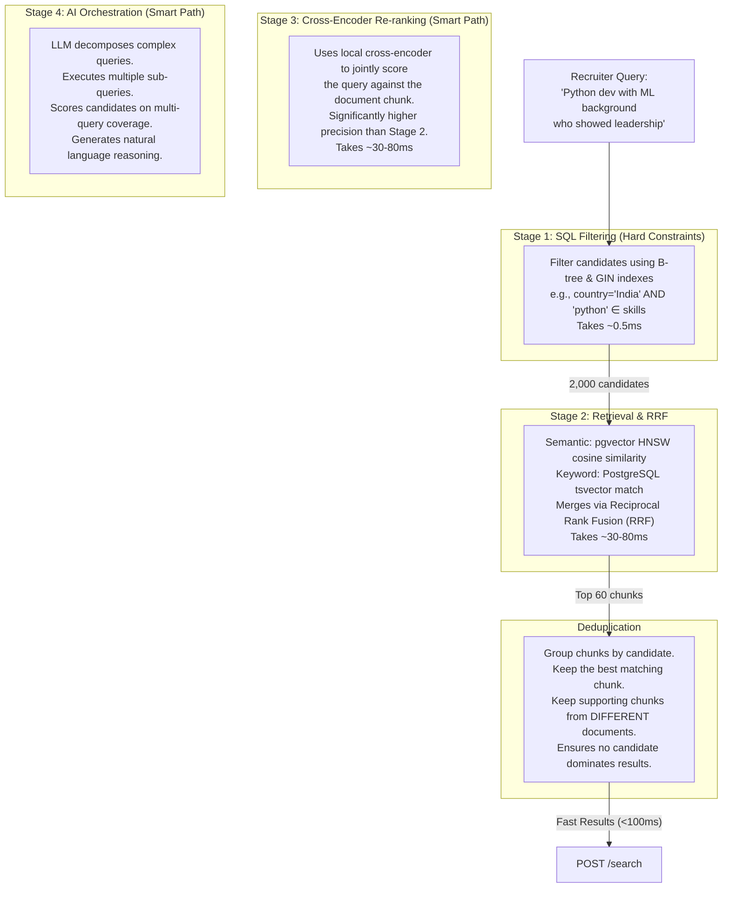

# Hybrid Search for Hiring Platforms — How to Use

This document outlines the architecture, setup instructions, and usage guide for the 4-stage hybrid search pipeline.

## 🏗 Architecture Overview

The system uses a single source of truth (**PostgreSQL 17** with the **pgvector** extension) to combine fast, structured metadata filtering with deep semantic text similarity.

### The 4-Stage Search Pipeline



---

## 🚀 Setup & Execution

### 1. Prerequisites
- Python 3.11+
- Docker and Docker Compose — **only** if you run the database locally (Option A
  below). Not needed when pointing at Supabase cloud (Option B).

> **Database: pick one.** The app connects to whatever `DATABASE_URL` is set to in
> `.env`. **Option A** = local Docker Postgres (steps 3–4). **Option B** = Supabase
> cloud, which is the **current default in `.env`** and already holds a
> 15k-candidate subset — skip straight to step 5. See
> [docs/supabase_migration_runbook.md](docs/supabase_migration_runbook.md) for how
> that subset was loaded.

### 2. Environment Setup

Clone the repository and set up the environment:

```bash
# 1. Create a virtual environment
python3 -m venv venv
source venv/bin/activate

# 2. Install dependencies
pip install -e ".[dev]"

# 3. Create your configuration file
cp .env.example .env
```

*Note: The default `.env` is configured to use local, zero-cost embedding models (`sentence-transformers`). If you want to use OpenAI, Gemini, or Cohere, add your API keys to the `.env` file and change `EMBEDDING_PROVIDER`.*

### 3. Start the Infrastructure

> **Option B (Supabase cloud) users:** skip this step and step 4 entirely — your
> database already lives in the cloud. Set `DATABASE_URL` in `.env` to the
> Supabase **session pooler** string (IPv4, port 5432 — *not* the IPv6 direct
> `db.<ref>.supabase.co` host, which Docker/IPv4-only networks can't reach):
> `postgresql://postgres.<ref>:<pw>@aws-1-<region>.pooler.supabase.com:5432/postgres`
> then go to step 5. (No code change needed — the session pooler supports
> prepared statements, so `pipeline/database.py`'s `statement_cache_size` is fine.)

**Option A (local Docker Postgres):**

```bash
# Start PostgreSQL (with pgvector) and PgBouncer connection pool
docker compose up -d
```

What this means in Docker Desktop:

- `postgres` is the actual PostgreSQL + pgvector database.
- `pgbouncer` is an optional connection pooler in front of PostgreSQL.
- Green dots mean the containers are running.
- The blue port link `5432:5432` is the database port your Python app uses by default.
- The blue port link `6432:6432` is PgBouncer. You can ignore it for local development unless you switch `DATABASE_URL` to port `6432`.

Useful commands:

```bash
# See whether containers are running
docker compose ps

# Start containers
docker compose up -d

# Stop containers but keep the database volume/data
docker compose stop

# Stop and remove containers but keep the database volume/data
docker compose down

# View database logs
docker compose logs -f postgres

# Check the database directly
docker compose exec postgres psql -U hybrid_user -d hiring_platform
```

### 4. Seed Test Data

We provide a script to generate realistic test data (candidates, transcripts, certifications). Note that the first time you run this, it will download the local embedding model (~90MB).

```bash
# Generate 100 test candidates and ingest their documents
python db/seed.py --candidates 100
```

### 5. Start the API Server

```bash
# Run the FastAPI application
uvicorn api.main:app --host 0.0.0.0 --port 8000 --reload
```

### 6. Open the Lightweight GUI

Once the API is running, open:

```text
http://localhost:8000/ui
```

The GUI lets you:

- run fast hybrid search or optional smart/orchestrated search
- browse `candidates`, `candidate_documents`, and `document_chunks`
- add candidate records
- edit candidate metadata like skills, location, years of experience, and status
- delete candidates, which also deletes their documents and chunks
- ingest unstructured text documents for the selected candidate
- inspect and delete stored documents

Recommended local workflow:

1. Start Docker:
   ```bash
   docker compose up -d
   ```

2. Seed some data if the tables are empty:
   ```bash
   python db/seed.py --candidates 25
   ```

3. Start the API:
   ```bash
   uvicorn api.main:app --host 0.0.0.0 --port 8000 --reload
   ```

4. Open the GUI:
   ```text
   http://localhost:8000/ui
   ```

5. Use the database table tabs at the bottom of the page to see all records. The chunks tab intentionally shows previews only, not the full vector embeddings, because embeddings are large numeric arrays.

---

## 💻 API Usage Guide

The API exposes two primary search endpoints depending on your latency/quality needs.

### 1. Fast Search (`POST /search`)
**Target Latency:** < 100ms
**Best for:** Autocomplete, live UI updates, high-throughput queries.

**Example Request:**
```bash
curl -X POST http://localhost:8000/search \
  -H "Content-Type: application/json" \
  -d '{
    "query": "backend engineer who works with distributed systems and kafka",
    "location": "India",
    "skills": ["python", "go"],
    "skills_match": "or",
    "min_salary": 90000,
    "top_k": 5
  }'
```

**Key Parameters:**
- `location`: Broad location text matched against candidate `location`, `city`, and `country`.
- `skills_match`: Set to `"and"` for strict filtering (candidate must have all skills) or `"or"` for loose filtering (at least one skill).
- `min_salary` / `max_salary`: Match candidates whose salary range overlaps the requested range.
- `use_rrf`: Set to `true` (default) to combine semantic vector search with exact keyword matching.

### 2. Smart Search Status
The old orchestrated smart-search endpoint has been removed. Complex searches now
flow through `POST /search` with the current planner and ranking pipeline.

### 3. Ingesting Documents (`POST /ingest`)
Use this endpoint to add new unstructured data to an existing candidate. The pipeline handles deduplication (via content hashing), text chunking, embedding generation, and database insertion automatically.

**Example Request:**
```bash
curl -X POST http://localhost:8000/ingest \
  -H "Content-Type: application/json" \
  -d '{
    "candidate_id": "uuid-of-the-candidate",
    "doc_type": "transcript",
    "title": "Technical Screen - Round 1",
    "raw_text": "Full transcript of the interview goes here...",
    "chunk_strategy": "sliding_window"
  }'
```

### 4. System Health (`GET /health`)
Checks database connectivity, returns current database latency, and shows total ingested vectors.

```bash
curl http://localhost:8000/health
```

---

## ⚙️ Tuning and Optimization

Configuration is managed in the `.env` file. Key tunable parameters:

- `HNSW_EF_SEARCH`: Controls the speed vs. accuracy tradeoff of the vector index. Default is `40` (optimized for <100ms latency). Increase to `100` for higher recall at the cost of speed.
- `EMBEDDING_PROVIDER`: Switch between `local`, `openai`, `gemini`, `cohere`, etc.
- `chunk_size` / `chunk_overlap`: Configured in `pipeline/__init__.py`. Larger chunks retain more context but dilute specific keywords. Overlap prevents context loss at chunk boundaries.
