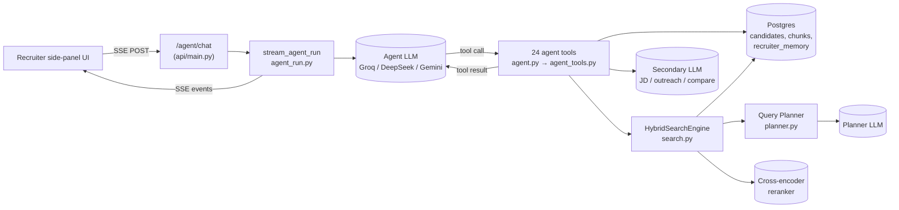
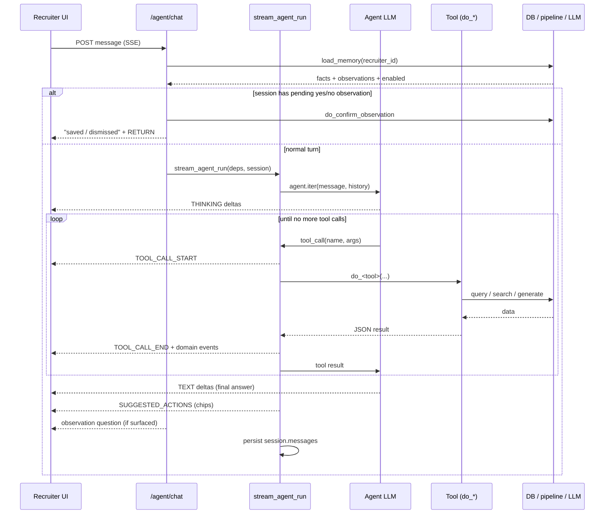
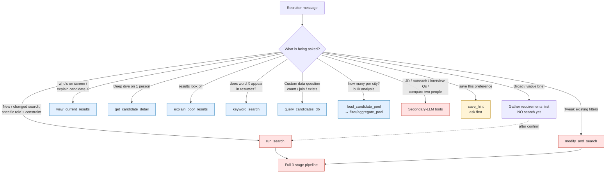
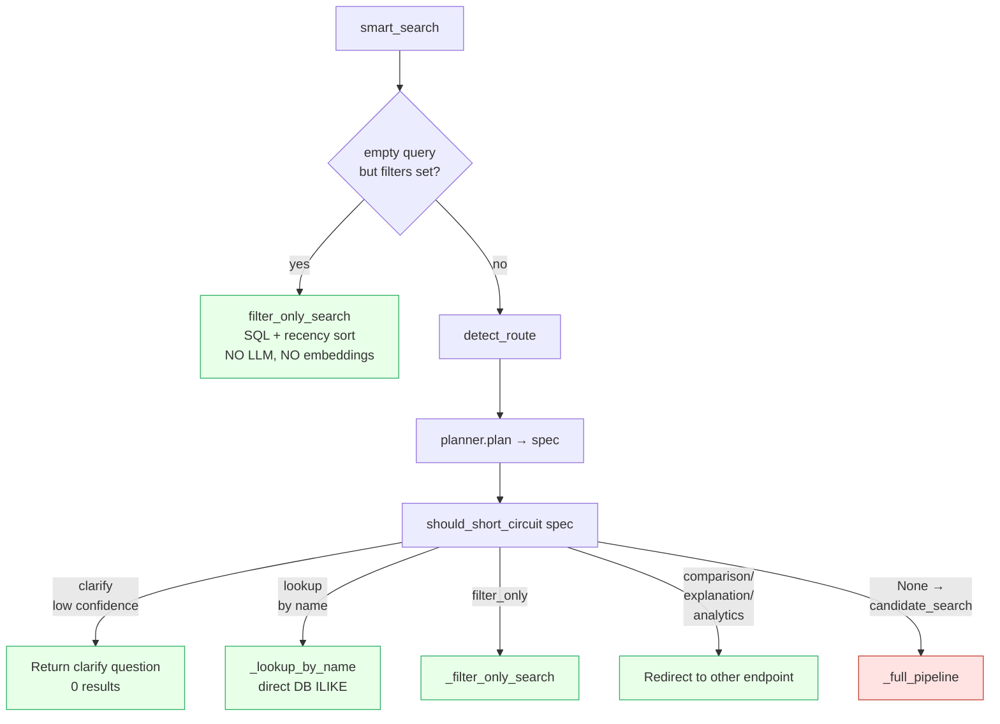
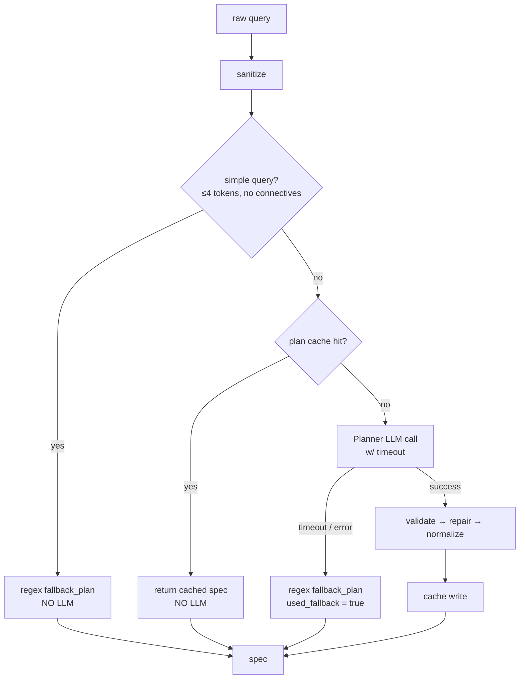
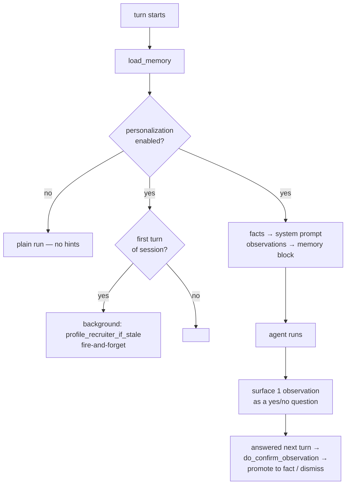

# Agent Workflow Visualisation

How a recruiter message travels through the system: from the chat endpoint, into
the agent, out to a tool, down into the database / planner-LLM / search pipeline,
and back up into the streamed answer. Every diagram below is traced from real
code — file references are clickable.

Diagrams use [Mermaid](https://mermaid.js.org/) (renders on GitHub and in VS Code
with a Mermaid preview extension). ASCII ladders are included alongside for the
ones that benefit from a "request goes down / response comes back up" view.

---

## 1. The 30,000-ft view — where everything lives



Three distinct LLMs do different jobs — don't confuse them:

| LLM | Where | Job |
|-----|-------|-----|
| **Agent LLM** | [agent.py:405](pipeline/agent.py#L405) | The "brain". Decides which tool to call, writes the recruiter-facing answer. Default `groq:llama-3.3-70b-versatile`. |
| **Planner LLM** | [planner.py:129](pipeline/planner.py#L129) | Parses a search query into a structured spec (skills, location, filters). Only runs *inside* `run_search`. Gemini/OpenAI/Groq. |
| **Secondary LLM** | [agent_tools.py:723](pipeline/agent_tools.py#L723) | One-shot generation for `analyze_jd`, `draft_outreach`, `generate_interview_questions`, `compare_candidates`. |

---

## 2. One full agent turn — the master ladder

This is the request you asked about: message goes down, tool fires, work happens,
result comes back up, answer streams out. Read top-to-bottom as time.

```
Recruiter UI        /agent/chat         stream_agent_run      Agent LLM         Tool (do_*)        Backend
    |                    |                     |                   |                  |              (DB/pipeline/LLM)
    |── POST message ───►|                     |                   |                  |
    |                    |                     |                   |                  |
    |                    |─ get_or_create session                 |                  |
    |                    |─ load_memory(recruiter_id) ────────────────────────────►  | (recruiter_memory)
    |                    |◄─ facts + observations + enabled? ─────────────────────── |
    |                    |                     |                   |                  |
    |        ┌───────────┴─ pending yes/no observation? ──────────────────────────► confirm_observation
    |        │  if yes → reply "saved/dismissed", RETURN (agent never runs)          |
    |        └───────────┬─                    |                   |                  |
    |                    |                     |                   |                  |
    |                    |─ build system prompt (memory + on-screen context)         |
    |                    |─ stream_agent_run() ►|                  |                  |
    |                    |                     |─ agent.iter() ───►|                  |
    |                    |                     |                   |─ think/plan      |
    |◄═ THINKING deltas ═╪═════════════════════╪═══════════════════|                  |
    |                    |                     |                   |                  |
    |                    |                     |◄── tool_call ─────|  (name + args)   |
    |◄═ TOOL_CALL_START ═╪═════════════════════|                   |                  |
    |                    |                     |─────────────────────────────────────►| run work
    |                    |                     |                   |                  |─ query / search / generate
    |                    |                     |◄─────────────────────────────────────| JSON result
    |◄═ TOOL_CALL_END ═══╪═ (+ domain events:  |                   |                  |
    |   SEARCH_RESULTS,  |   stack_updated,    |                   |                  |
    |   PUSH_TO_MAIN…)   |                     |─ result ─────────►|                  |
    |                    |                     |                   |─ (maybe another tool, loop ↑)
    |                    |                     |                   |─ final answer    |
    |◄═ TEXT deltas ═════╪═════════════════════╪═══════════════════|                  |
    |                    |                     |─ _derive_suggestions(session)        |
    |◄═ SUGGESTED_ACTIONS (refinement chips) ══|                   |                  |
    |                    |─ surface pending observation question (if any)            |
    |◄═ TEXT (the question) ══════════════════ |                   |                  |
    |                    |─ session.messages persisted (success only)                |
```

Same thing as a Mermaid sequence diagram:



**Key facts the code enforces:**

- Tools are *pure* — they return JSON. All the rich UI events (candidate cards,
  push-to-main, shortlist updates) are derived by the streamer *observing* the
  tool result, not by the tool itself ([agent_run.py:146](pipeline/agent_run.py#L146) `_domain_events`).
- History is persisted **only on success** ([agent_run.py:572](pipeline/agent_run.py#L572)) — a failed turn leaves no trace.
- A pending observation answer short-circuits the *entire* agent run ([api/main.py:3206](api/main.py#L3206)).

---

## 3. Which path does the agent take? — the tool decision map

The agent picks a tool from the system prompt's rules. This is the "different
cases → different pipeline" view you asked for.



### When the agent runs the *full pipeline* vs. a *cheap shortcut*

| Recruiter intent | Tool chosen | Cost | What actually runs |
|------------------|-------------|------|--------------------|
| "senior Python engineers in Berlin" | `run_search` | **Heavy** | Planner LLM → dense+bm25+skill retrieval → cross-encoder → feature ranker |
| "tighten to 7+ years" | `modify_and_search` | **Heavy** | Same pipeline, filters merged onto last search |
| "does anyone mention 'Series B'?" | `keyword_search` | Light | One FTS SQL query, no LLM, no ranking |
| "how many used Python in last 2 yrs?" | `query_candidates_db` | Light | One sanitized read-only SELECT |
| "where are most candidates located?" | `load_candidate_pool` + `aggregate_pool` | Light | One DB load, then in-memory grouping |
| "why does X rank #3?" | `view_current_results` | None | Reads last result off the session stack |
| "these look wrong" | `explain_poor_results` | None | Pure analysis of cached signals — no DB, no LLM |
| "compare search A vs B" | `compare_iterations` | None | Diffs two in-memory stack entries |
| "draft outreach to X" | `draft_outreach` | Medium | Secondary LLM, one shot |

**The rule of thumb baked into the prompt** ([agent.py:181](pipeline/agent.py#L181)):
*diagnose before fixing, smallest change first.* The agent is told to prefer
`modify_and_search` over `run_search`, prefer `explain_poor_results` over blindly
re-searching, and never inspect candidates unless the task needs it.

### Why three different "search" tools exist

```
run_search ─────────► full AI pipeline (planner + 3 retrieval paths + rerank + scoring)
                      Use for: real candidate searches needing ranking & provenance.

keyword_search ─────► raw Postgres FTS over document_chunks.content
                      Use for: "is this exact word in any resume?" — fast, no ranking.

query_candidates_db ► arbitrary read-only SELECT (SELECT-only, table allowlist, 5s timeout)
                      Use for: counts, joins, recency, existence checks the search bar can't express.
```

---

## 4. Inside `run_search` — the search pipeline ladder

When the agent calls `run_search`/`modify_and_search`, control enters
`HybridSearchEngine.smart_search` ([search.py:151](pipeline/search.py#L151)). It is
**not** always the full pipeline — there are short-circuits first.



So even a "search" can resolve cheaply:

- **No text, only chips** → straight to SQL, planner never runs ([search.py:194](pipeline/search.py#L194)).
- **Low planner confidence + a clarify question** → returns the question instead of bad results ([intent_router.py:34](pipeline/intent_router.py#L34)).
- **Pure name lookup / pure filter** → SQL shortcut, skips embeddings entirely.
- **Otherwise** → the full 3-stage pipeline below.

### The full pipeline (`_full_pipeline`, [search.py:278](pipeline/search.py#L278))

```
                 spec (from planner)
                      │
   ┌──────────────────┴──────────────────┐
   │  STAGE 1 — RETRIEVAL                 │
   │                                      │
   │  build SQL hard filter (must/must_not)
   │                │                     │
   │     ┌──────────┼──────────┐  (parallel, asyncio.gather)
   │     ▼          ▼          ▼          │
   │  dense      bm25        skill        │
   │ (vector)  (keyword)  (exact array)   │
   │     └──────────┼──────────┘          │
   │                ▼                      │
   │         RRF fusion (rank-merge)      │
   │                ▼                      │
   │      group chunks → candidates       │
   │                ▼                      │
   │      enrich w/ profile (DB)          │
   └────────────────┬─────────────────────┘
                    ▼
   ┌──────────────────────────────────────┐
   │  STAGE 2 — CROSS-ENCODER RERANK       │
   │  top-25 (query, resume) re-scored     │
   │  by cross-encoder → rerank_score      │
   └────────────────┬─────────────────────┘
                    ▼
   ┌──────────────────────────────────────┐
   │  STAGE 3 — FINAL SCORING & DIVERSITY  │
   │  feature_ranker: 8 weighted signals → │
   │     feature_score (0–100)             │
   │  MMR diversity select top_k           │
   │  build_explanation (provenance)       │
   │  log impressions (fire-and-forget)    │
   └────────────────┬─────────────────────┘
                    ▼
            SearchResponse (results + spec_summary)
                    │
   enriched into result cards by do_run_search,
   pushed onto session.search_stack, returned to agent
```

The 8 signals that make up `feature_score`: cross-encoder, retrieval (RRF),
skill match, preference match, experience fit, skill recency, profile
completeness, personalization ([agent.py:99](pipeline/agent.py#L99)).

---

## 5. Inside the planner — when does the *planner* LLM fire?

`run_search` → `smart_search` → `planner.plan` ([planner.py:62](pipeline/planner.py#L62)).
The planner LLM is itself guarded by gates, so it doesn't always run.



This is why the agent prompt tells it to watch `spec_summary`:

- `used_fallback: true` → the planner LLM failed and **regex took over**; structured filters may be wrong.
- `confidence < 0.6` → ambiguous query, possibly mis-parsed.
- `dropped_items` → fields the validator rejected and did **not** apply.

The agent is instructed to surface these to the recruiter rather than silently
trusting the results ([agent.py:188](pipeline/agent.py#L188)).

---

## 6. Where the response "comes back" — the different return paths

You asked specifically about *where it comes back in different cases*. Every tool
returns JSON to the agent LLM, but the **side effects and UI events differ**:

| Tool | Returns to LLM | Extra SSE event to UI | Touches |
|------|----------------|----------------------|---------|
| `run_search` / `modify_and_search` | result cards + `spec_summary` | `SEARCH_RESULTS` + `STACK_UPDATED` | full pipeline, pushes to `session.search_stack` |
| `keyword_search` | top-10 matches | `SEARCH_RESULTS` | one FTS query |
| `view_current_results` | cached results | `SEARCH_RESULTS` (if not already shown this turn) | session stack / on-screen IDs |
| `push_to_main_panel` | confirmation | `PUSH_TO_MAIN` | reads stack top |
| `update_shortlist` | shortlist state | `SHORTLIST_UPDATED` | `session.shortlist` |
| `update_working_spec` | spec | `SPEC_UPDATED` | `session.working_spec` |
| `compare_candidates` | comparison text | `COMPARE_CANDIDATES` | secondary LLM |
| `explain_poor_results` / `compare_iterations` | diagnostic JSON | *(none — text only)* | in-memory only |
| `save_hint` / `add_observation` | saved confirmation | *(none)* | `recruiter_memory` table |
| `query_candidates_db` | rows | *(none)* | raw SELECT |

After the agent finishes, two things are appended *outside* the agent loop:

1. **Refinement chips** (`SUGGESTED_ACTIONS`) — derived from the last search's
   real signals: failing skill checks, dense-only retrieval, tight filters, low
   confidence ([agent_run.py:200](pipeline/agent_run.py#L200) `_derive_suggestions`).
2. **A pending observation question** — if memory surfaced a behavioural guess,
   it's asked *after* the answer and parked on the session for the next turn.

---

## 7. Error handling & model fallback ladder

A turn can fail at the model level. The streamer has a retry plan
([agent_run.py:331](pipeline/agent_run.py#L331)).

```
attempt 1: primary model ──► fail (tool_use_failed)?
                              │  nothing emitted yet → retry
attempt 2: primary model ──► fail again?
                              │  cross-provider fallback configured?
attempt 3: fallback model ──► fail?
                              ▼
                        friendly error event

Special cases:
  • rate-limit (429)          → break immediately (same provider won't recover in-window)
  • already streamed output   → can't retry (would duplicate) → emit error, stop
  • DeepSeek > Gemini > Groq  → fallback preference order, skipping current provider
```

The recruiter never sees a raw provider stack trace — `_friendly_error`
([agent_run.py:288](pipeline/agent_run.py#L288)) translates rate-limits and invalid
tool calls into plain guidance ("switch the agent model in Settings").

---

## 8. Personalization & memory — the parallel track

Memory threads through the turn without blocking it:



- **Facts** = confirmed preferences → injected into the prompt *and* used by the
  search feature-ranker (personalization signal).
- **Observations** = unconfirmed guesses the profiler/agent noticed → surfaced one
  at a time for the recruiter to confirm; on "yes" they become facts
  ([agent_tools.py:455](pipeline/agent_tools.py#L455)).
- Disabled recruiters get **zero** implicit profiling — memory fail-closes
  ([search.py:516](pipeline/search.py#L516)).

---

## Quick reference — full call chain for one search

```
UI
 └─ POST /agent/chat                              api/main.py:3146
     └─ load_memory + build prompt + AgentDeps
         └─ stream_agent_run                      agent_run.py:341
             └─ agent.iter (Agent LLM)            agent.py:405
                 └─ tool: run_search              agent.py:432
                     └─ do_run_search             agent_tools.py:121
                         └─ HybridSearchEngine.smart_search   search.py:151
                             ├─ planner.plan       planner.py:62   (+ Planner LLM)
                             ├─ should_short_circuit  intent_router.py:17
                             └─ _full_pipeline     search.py:278
                                 ├─ dense + bm25 + skill retrieval (parallel)
                                 ├─ rrf_fuse → group → enrich
                                 ├─ cross-encoder rerank (top-25)
                                 ├─ feature_ranker (8 signals)
                                 └─ mmr + explanation + impressions
                         ◄─ SearchResponse → enriched cards → session.search_stack
                 ◄─ JSON result → Agent LLM writes answer
             ◄─ SSE: thinking, tool calls, cards, text, suggestion chips
 ◄─ rendered in side panel
```
